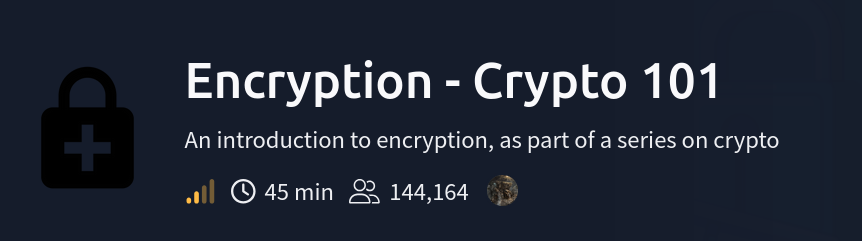
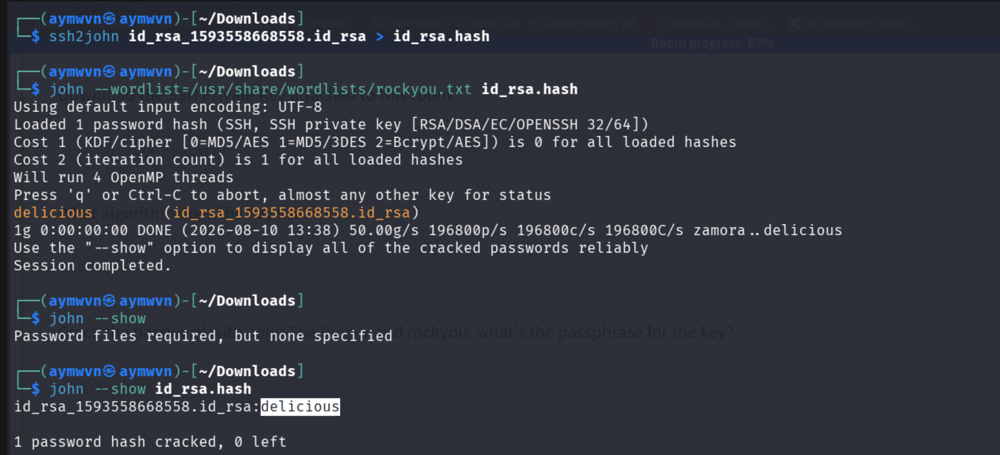
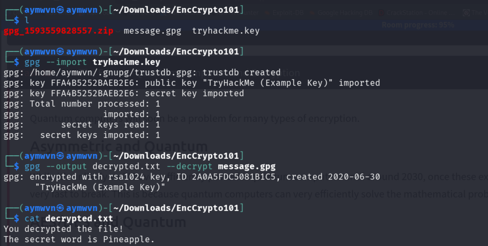

<div align="center">

# 🔐 TryHackMe — Encryption - Crypto 101

**"An introduction to encryption, as part of a series on crypto"**


</div>



---

## 📋 Room Info

| Field | Value |
|---|---|
| **Platform** | TryHackMe |
| **Room** | Encryption - Crypto 101 |
| **Format** | Guided walkthrough — RSA theory + 2 hands-on exercises |
| **Tools Used** | `ssh2john`, `john` (John the Ripper), `gpg` |
| **Date Completed** | August 2026 |

> 🎯 **Purpose of this writeup:** built as a complete personal reference on encryption fundamentals — RSA, SSH key cracking, GPG, and (as a bonus, since I took my own notes on it around the same time) how HTTPS/TLS actually works. If I forget all of this in six months, this doc should rebuild the full picture on its own.

---

## 🧠 Foundational Concepts — Read This First

### Encoding vs Hashing vs Encryption (the classic beginner mix-up)

| | Reversible? | Needs a key? | Example |
|---|---|---|---|
| **Encoding** | ✅ Yes, freely | ❌ No | Base64 |
| **Hashing** | ❌ No (one-way) | ❌ No | MD5, SHA-256 |
| **Encryption** | ✅ Yes, but only with the right key | ✅ Yes | RSA, AES |

**Encryption is the only one of the three actually meant to keep a secret** — encoding is just a format transformation (anyone can reverse it), and hashing is intentionally irreversible (used for verification, not for hiding-and-later-revealing).

### Symmetric vs Asymmetric Encryption

- **Symmetric** — one single key both encrypts and decrypts. Fast, but both parties need the same secret key somehow shared safely beforehand.
- **Asymmetric** — a **key pair**: a public key (share freely) and a private key (never share). Data encrypted with the public key can only be decrypted with the matching private key. Slower than symmetric, but solves the "how do two strangers securely agree on a secret" problem — which is exactly what makes HTTPS possible.

**RSA** is the classic asymmetric algorithm and the core focus of this room.

---

## 🔑 RSA Fundamentals

RSA security is built on one simple fact: **multiplying two large prime numbers together is fast, but factoring the result back into those two primes is (with numbers large enough) computationally infeasible** with current classical computers.

### The key variables (memorize these — every RSA CTF challenge uses this exact notation)

| Variable | Meaning |
|---|---|
| `p`, `q` | Two large prime numbers — the actual secret at the heart of the whole system |
| `n` | `p × q` — part of both the public and private key |
| `e` | The public exponent — part of the **public key**, paired with `n` |
| `d` | The private exponent — part of the **private key**, paired with `n` |
| `m` | The message (plaintext) |
| `c` | The ciphertext (encrypted message) |

**Public key** = `(n, e)` — shareable, used to encrypt.
**Private key** = `(n, d)` — secret, used to decrypt.

**Why RSA can break in CTFs specifically:** in real-world use, `p` and `q` are astronomically large (2048+ bits), making factoring `n` back into them practically impossible. CTF challenges deliberately weaken this — small `p`/`q`, reused primes across multiple keys, or other implementation mistakes — so the "impossible" factoring becomes feasible. That's the whole game in RSA CTF challenges: find the implementation weakness, not break the math itself.

### Tools for attacking weak RSA in CTFs

- [**RsaCtfTool**](https://github.com/RsaCtfTool/RsaCtfTool) — automates dozens of known RSA attack techniques (Wiener's attack, common factor attacks, small `e` attacks, etc.) against a given public key
- [**rsatool**](https://github.com/ius/rsatool) — generates RSA keys/parameters when you already know some of the variables, useful for reconstructing a private key once `p` and `q` are recovered

### Quantum computing note

Quantum computers pose a real long-term threat to RSA specifically because they can (in theory, once sufficiently powerful/stable, likely years away) solve the prime factorization problem efficiently — the exact problem RSA's security depends on being *hard*. This is why "post-quantum cryptography" is an active research area, and part of why newer SSH connections sometimes show warnings about post-quantum key exchange algorithms.

---

## 🗝️ Exercise 1 — Cracking an SSH Private Key's Passphrase

### The scenario

An SSH private key file was provided, but it's protected by a **passphrase** — the key itself can't be used to authenticate anywhere until that passphrase is known.

### Step 1 — Convert the key into a crackable hash format

```bash
ssh2john id_rsa_1593558668558.id_rsa > id_rsa.hash
```

**Why this step is necessary:** John the Ripper doesn't crack SSH keys directly — it cracks **hashes**. `ssh2john` is a format-conversion utility that extracts the encrypted portion of the private key and repackages it into a hash format John understands. This same pattern (`xxx2john`) exists for tons of file types — `zip2john`, `office2john`, `pdf2john` — always the first move when you need John to attack something that isn't already a plain hash.

### Step 2 — Crack it with John the Ripper

```bash
john --wordlist=/usr/share/wordlists/rockyou.txt id_rsa.hash
```



**Cracked in under a second:** `delicious`

```bash
john --show id_rsa.hash
# id_rsa_1593558668558.id_rsa:delicious
```

**Passphrase recovered:** `delicious`

---

## 🧨 John the Ripper — Full Explainer (since I want to actually understand this tool, not just run it)

### What John the Ripper actually is

**John the Ripper (JtR)** is a password/hash cracking tool. It works by taking a **list of guesses** and, for each one, running it through the *same* hashing/encryption process the original password went through, then comparing the result against the target hash. If they match, that guess was the real password. It never "decrypts" a hash — hashes aren't reversible by design — it just brute-forces by trying candidates until one produces a matching output.

### The core attack modes

| Mode | How it works | When to use it |
|---|---|---|
| **Wordlist (dictionary) attack** | Tries every word in a supplied wordlist (like `rockyou.txt`) | First thing to try — most real-world passwords are weak/reused, so this alone cracks a huge percentage |
| **Rules-based attack** | Takes a wordlist and applies mutations (capitalize first letter, add `123`, swap `a`→`@`, etc.) | When plain wordlist fails but the password is likely "wordlist + small tweak" |
| **Incremental (brute-force) mode** | Tries every possible character combination | Last resort — extremely slow for anything beyond short passwords, since the combination space explodes exponentially |

### Why `rockyou.txt` specifically

It's the most famous wordlist in the security community — a real leaked password database (from a 2009 breach of the company RockYou) containing **over 14 million actual human-chosen passwords**. Because people are predictable, this single list cracks a surprisingly large share of real-world weak passwords, which is exactly why it's the default first attempt in almost every cracking scenario, CTF or real.

### Reading John's output (what all those numbers mean)

```
1g 0:00:00:00 DONE (2026-08-10 13:38) 50.00g/s 196800p/s 196800c/s 196800C/s zamora..delicious
```

- `1g` = 1 guess successfully cracked
- `0:00:00:00` = time elapsed
- `50.00g/s` = guesses (full password attempts) per second
- `196800p/s` / `196800c/s` = candidate passwords/combinations tried per second
- `zamora..delicious` = the range of words being tried when the match landed (last word tried before success, shown for progress reference)

### Why `john --show` is a separate step

John doesn't print the cracked password directly to the terminal by default after cracking (to avoid cluttering output during long multi-hash runs) — it saves cracked results to its internal "pot file." Running `john --show <hashfile>` afterward explicitly displays everything it has successfully cracked so far for that hash file.

---

## ✉️ Exercise 2 — GPG Decryption

### The scenario

Given a `.gpg` encrypted message file and a `.key` file containing a key pair, decrypt the message.

### Step 1 — Import the key

```bash
gpg --import tryhackme.key
```



Output confirms **both a public key and a secret (private) key** were imported — `gpg` automatically detected both halves were present in the same file and loaded them into the local keyring.

### Step 2 — Decrypt the message

```bash
gpg --output decrypted.txt --decrypt message.gpg
cat decrypted.txt
```

```
You decrypted the file!
The secret word is Pineapple.
```

**What happened under the hood:** the message was encrypted using the **public** half of this key pair (RSA 1024-bit, per the output). Since we imported the matching **private** key, `gpg` could use it to reverse the encryption — this is asymmetric encryption working exactly as designed: anyone with the public key could encrypt a message, but only the private key holder can read it back.

### PGP vs GPG — the naming confusion, cleared up

- **PGP** = Pretty Good Privacy — the original, now-commercial encryption software/standard, created in 1991
- **GPG** = GNU Privacy Guard — a free, open-source implementation of the same OpenPGP standard

They're interoperable (a GPG-encrypted file can be decrypted with PGP-compatible software and vice versa) because both implement the same underlying open standard.

### Useful GPG commands for future reference

```bash
gpg --import key.asc              # import a public/private key
gpg --list-keys                   # list imported public keys
gpg --list-secret-keys            # list imported private keys
gpg --decrypt file.gpg            # decrypt and print to stdout
gpg --output out.txt --decrypt file.gpg   # decrypt to a specific file
```

---

## 🌐 Bonus Section — How HTTPS Actually Works

*(Notes from my own eJPT prep, included here since it directly builds on everything above — HTTPS is asymmetric + symmetric crypto working together in practice.)*

**HTTPS = HTTP + TLS.** TLS (Transport Layer Security) provides three guarantees:

- 🔐 **Confidentiality** — attackers can't read the data in transit
- 🛡️ **Integrity** — attackers can't silently modify the data
- ✅ **Authentication** — confirms you're actually talking to who you think you are

### The TLS Handshake, step by step

1. **ClientHello** — the client (browser) tells the server which TLS versions and cipher suites it supports
2. **ServerHello** — the server picks the TLS version and cipher suite to use for this session
3. **Certificate** — the server sends its TLS certificate, which contains the domain name, its public key, validity dates, and a digital signature from a Certificate Authority. The browser verifies this certificate is trusted and actually matches the domain being visited
4. **Key Exchange** — both sides use asymmetric crypto just long enough to safely agree on a **symmetric session key**, which then encrypts all the actual HTTP traffic for the rest of the session

### Why the handoff from asymmetric → symmetric matters

```
Asymmetric crypto → establish trust & exchange a shared secret
        ↓
Symmetric crypto → encrypt all the actual data (much faster)
```

Asymmetric crypto is computationally expensive — using it for the entire session's traffic would be far too slow. Instead, it's used **only** to safely establish a shared symmetric key, and that faster symmetric key handles the bulk data encryption from that point on. This is the same asymmetric/symmetric relationship RSA and GPG demonstrated above, just applied to web traffic.

### Certificate Authorities (CAs) — how trust actually gets established

```
Browser
   ↓ trusts
CA
   ↓ signs
example.com's certificate
   ↓
Server identity verified
```

Your browser ships with a built-in list of trusted root CAs. When a website presents a certificate, the browser checks whether it was signed by one of those trusted CAs (or a CA that chains back to one). This is a **digital signature** in action:

```
CA signs the certificate using the CA's PRIVATE key
              ↓
Browser verifies that signature using the CA's PUBLIC key
              ↓
If it checks out → certificate is trusted
```

### The attacker's actual limitation here

An attacker positioned to intercept HTTPS traffic (a MITM — man-in-the-middle) **cannot read or modify the traffic** without the session key, and can't forge a valid certificate for a domain they don't control — unless they can somehow get a trusted CA to issue them a fraudulent certificate, or otherwise compromise the trust chain (e.g., getting a malicious root CA installed on the victim's machine). This is exactly why interception proxies like Burp Suite require you to manually install their own certificate as trusted on your own machine — that's you deliberately breaking your own trust chain for legitimate testing purposes, not something an outside attacker can do to someone else remotely.

---

## 🧠 Full Lessons Learned

- **Encoding, hashing, and encryption solve three genuinely different problems** — mixing them up (a common beginner mistake) leads to wrong assumptions about what's actually recoverable.
- **RSA's security is entirely about the difficulty of factoring `n` back into `p` and `q`** — everything else (the `e`/`d` math) is built on top of that one hard problem holding.
- **John the Ripper never "cracks" a hash by reversing it** — it's always guess-and-compare, which means a weak/reused password is the actual vulnerability, not any flaw in the hashing algorithm itself.
- **The `xxx2john` family of tools is the real unlock** — knowing that SSH keys, ZIPs, Office docs, and PDFs all have their own `2john` converter means John's usefulness extends far past "cracking a raw hash someone hands you."
- **HTTPS is asymmetric and symmetric crypto working together, not one or the other** — asymmetric crypto's real job is just safely agreeing on a symmetric key, not encrypting the whole session.
- **Trust in HTTPS is delegated, not absolute** — your browser doesn't verify a site directly, it verifies that a CA it already trusts vouched for that site. The entire system depends on CAs being genuinely careful about who they issue certificates to.

---

## 🛠️ Skills Demonstrated

`RSA Fundamentals` · `Asymmetric vs Symmetric Cryptography` · `SSH Private Key Analysis` · `John the Ripper (Wordlist Attacks)` · `Hash Format Conversion (ssh2john)` · `GPG / PGP Key Management` · `File Decryption` · `TLS/HTTPS Handshake` · `Certificate Authority Trust Model`

---

## 📚 References

- [RsaCtfTool](https://github.com/RsaCtfTool/RsaCtfTool)
- [rsatool](https://github.com/ius/rsatool)
- [RSA Encryption Explained — Muirland Oracle](https://muirlandoracle.co.uk/2020/01/29/rsa-encryption/)
- [John the Ripper Documentation](https://www.openwall.com/john/doc/)
- [GNU Privacy Guard (GPG) Manual](https://www.gnupg.org/documentation/)
