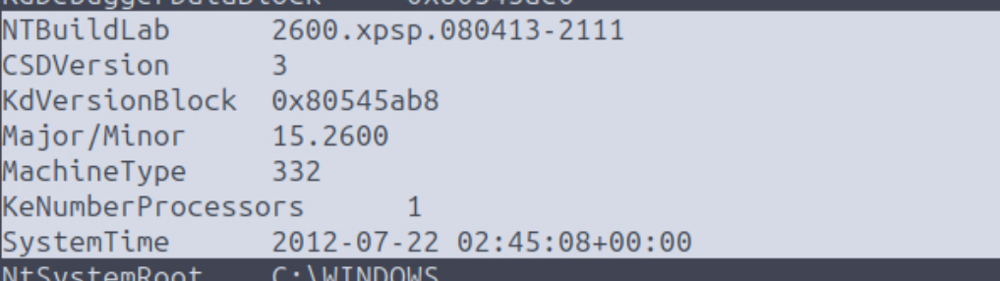
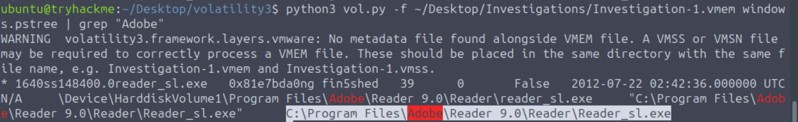
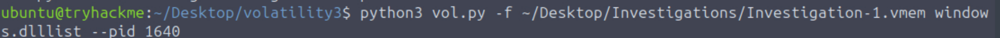
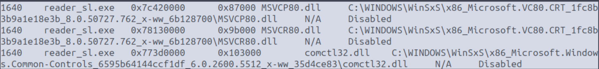
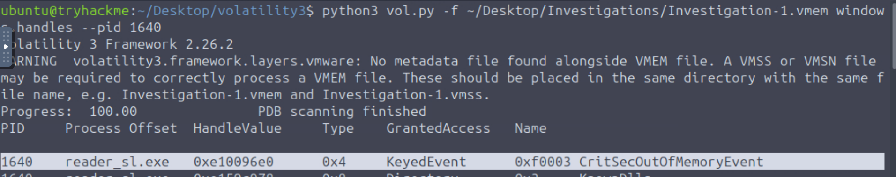
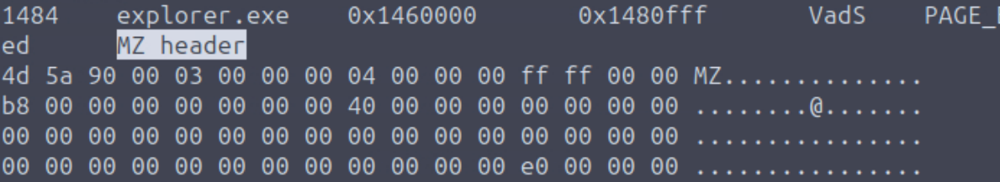
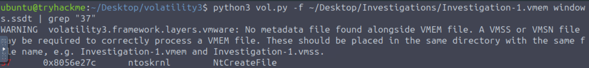
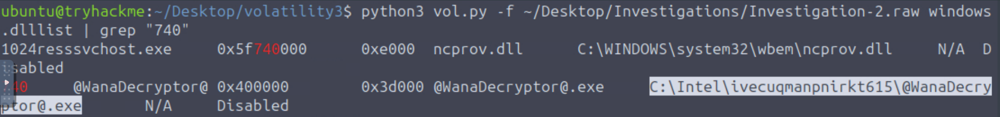
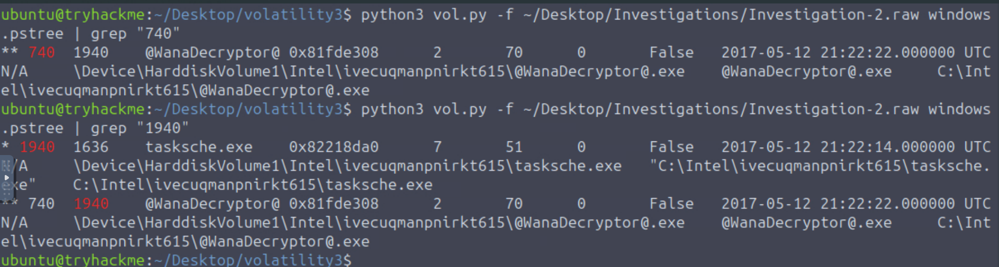
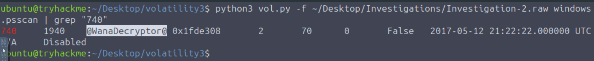

<div align="center">

# 🧠 TryHackMe — Volatility Essentials

**"Learn how to perform memory forensics with Volatility!"**


</div>


---

## 📋 Room Info

| Field | Value |
|---|---|
| **Platform** | TryHackMe |
| **Room** | Volatility Essentials |
| **Format** | Guided walkthrough (not a blind challenge) |
| **Tool** | Volatility 3 |
| **Date Completed** | August 2026 |
---

## 🧩 What This Room Actually Teaches (in plain terms)

When a computer is running, everything currently happening — open programs, active network connections, typed passwords, malware mid-execution — lives in **RAM**, not on disk. The moment the machine shuts down, all of it is gone.

In real incident response, before anyone touches a compromised machine, someone captures a **memory dump** — a frozen snapshot of RAM at that exact moment. **Volatility** is the open-source framework used to dig through that snapshot after the fact and pull out evidence: what processes were running, what network connections were open, what files were touched, and sometimes even malware hiding in memory that never touched the disk at all.

This room works through **two separate investigation cases**, each with its own memory dump, each simulating a different kind of incident.

---

## 🗂️ Case 001 — Investigating a Windows XP Memory Dump

**File analyzed:** `Investigation-1.vmem`

### Step 1 — Identifying the system itself

Before analyzing any process, you need to know what OS/build the memory dump came from — Volatility needs this to correctly interpret the memory structure. Ran an image-info-style scan to pull this out:



This revealed the exact **build lab version** and the **system time** the memory was captured at — both of which anchor the entire investigation in time and confirm we're dealing with a Windows XP-era machine (`2600.xpsp...` is XP's internal build numbering).

**Room questions answered at this stage:**
- What is the build version of the host machine in Case 001? → `▓▓▓▓▓▓▓▓▓▓▓▓▓▓▓▓▓▓▓▓`
- At what time was the memory file acquired in Case 001? → `▓▓▓▓▓▓▓▓▓▓▓▓▓▓▓▓▓▓▓▓`

---

### Step 2 — Finding the target process

Used `windows.pstree` (lists all running processes in their parent→child hierarchy) filtered down to anything Adobe-related:

```bash
python3 vol.py -f ~/Desktop/Investigations/Investigation-1.vmem windows.pstree | grep "Adobe"
```



**Why `pstree` and not just `pslist`:** `pstree` shows the parent-child relationship, which matters a lot in forensics — malware often gets spawned by an unexpected parent (e.g., a Word document spawning `cmd.exe` is a huge red flag). Seeing a legitimate parent here helps confirm whether this process is behaving normally or not.

**Room questions answered at this stage:**
- What is the absolute path to the active Adobe process? → `▓▓▓▓▓▓▓▓▓▓▓▓▓▓▓▓▓▓▓▓`
- What is the parent process of this process? → `▓▓▓▓▓▓▓▓▓▓▓▓▓▓▓▓▓▓▓▓`
- What is the PID of the parent process? → `▓▓▓▓`

---

### Step 3 — Enumerating loaded DLLs

Once you have a PID, `windows.dlllist` shows every DLL (shared library) that process has loaded into memory — useful for spotting a legitimate process that's been hijacked into loading a malicious DLL (a technique called DLL injection/sideloading).

```bash
python3 vol.py -f ~/Desktop/Investigations/Investigation-1.vmem windows.dlllist --pid 1640
```





**Why this matters:** legitimate DLLs almost always load from `system32` or the application's own install folder. DLLs loading from unusual paths (temp folders, user directories) are a classic red flag for injected malicious code.

**Room question answered at this stage:**
- How many DLL files are used by the Adobe process outside the `system32` directory? → `▓`

---

### Step 4 — Checking open handles

`windows.handles` lists every object (files, registry keys, mutexes, events, etc.) a process currently has a handle open to — this can reveal what a process is actively interacting with, including synchronization objects that malware sometimes uses to check "am I already running" (a common technique to avoid running twice).

```bash
python3 vol.py -f ~/Desktop/Investigations/Investigation-1.vmem windows.handles --pid 1640
```



**Room question answered at this stage:**
- What is the name of the one KeyedEvent associated with the process's handles? → `▓▓▓▓▓▓▓▓▓▓▓▓▓▓▓▓▓▓▓▓▓▓▓▓▓`

---

### Step 5 — Spotting real executables via memory signatures

Every real Windows executable, when loaded into memory, starts with a recognizable byte signature — the **`MZ` header** (named after Mark Zbikowski, a Microsoft engineer — it's literally his initials, still used today as the DOS executable magic number). Scanning raw memory for this header pattern is a way to find executables even if a process is trying to hide itself from normal process listings.



You can see `4d 5a` at the very start of the hex dump — `4d` = `M`, `5a` = `Z`. That's the signature confirming this memory region really does contain a loaded Windows executable.

**Room question answered at this stage:**
- What processes in Case 001 contain a header pointing to a Windows executable? → `▓▓▓▓▓▓▓▓▓▓▓,▓▓▓▓▓▓▓▓▓▓▓`

---

### Step 6 — Checking the SSDT for hooking

`windows.ssdt` dumps the **System Service Descriptor Table** — essentially the internal address table Windows uses to route system calls (like "create a file," "open a process") to their actual kernel code. Rootkits historically loved hooking this table — redirecting a legitimate system call to malicious code instead, so that even the OS itself gets fooled.

```bash
python3 vol.py -f ~/Desktop/Investigations/Investigation-1.vmem windows.ssdt | grep "37"
```



Checking the address of a sensitive syscall like `NtCreateFile` (used every time a file gets created or opened) against its expected legitimate address is one way to detect if it's been hooked/redirected.

**Room question answered at this stage:**
- What is the address for the `NtCreateFile` system call? → `▓▓▓▓▓▓▓▓▓▓`

---

## 🗂️ Case 002 — Investigating a Ransomware Incident (WannaCry)

**File analyzed:** `Investigation-2.raw`

This case is a completely different scenario — a **live ransomware infection** memory dump, dated May 2017 (the same month the real-world WannaCry outbreak hit globally). The investigative approach shifts from "profile one known process" to "find the suspicious process I don't recognize yet."

### Step 1 — Hunting for suspicious DLL activity

Started broad — scanning `windows.dlllist` output for anything referencing a suspicious PID:

```bash
python3 vol.py -f ~/Desktop/Investigations/Investigation-2.raw windows.dlllist | grep "740"
```



The process name `@WanaDecryptor@.exe` immediately jumps out — real Windows/Adobe/system processes never name themselves with `@` symbols like that. This is exactly the kind of naming pattern that should trigger suspicion during any real triage.

---

### Step 2 — Mapping the infection chain

Used `windows.pstree` again, this time tracing the process's **entire parent chain** to understand how it got there — critical for understanding the actual infection/execution flow, not just spotting the malware in isolation.

```bash
python3 vol.py -f ~/Desktop/Investigations/Investigation-2.raw windows.pstree | grep "740"
python3 vol.py -f ~/Desktop/Investigations/Investigation-2.raw windows.pstree | grep "1940"
```



**Why trace the parent, not just the malware itself:** the parent process (`tasksche.exe`) is what *launched* `@WanaDecryptor@`, and understanding that launch chain is exactly what a real incident report needs — "how did this get executed" matters as much as "what got executed" for containment and prevention.

**Room questions answered at this stage:**
- What suspicious process is running at PID 740? → `▓▓▓▓▓▓▓▓▓▓▓▓▓▓▓`
- What is the full path of the suspicious binary in PID 740? → `▓▓▓▓▓▓▓▓▓▓▓▓▓▓▓▓▓▓▓▓▓▓▓▓▓▓▓▓▓▓▓▓▓▓▓▓▓▓▓▓▓▓▓▓▓▓▓`
- What is the parent process of PID 740? → `▓▓▓▓▓▓▓▓▓▓▓▓▓`

---

### Step 3 — Confirming with a scan-based technique

`windows.psscan` differs from `pstree`/`pslist` in an important way: it scans raw memory pool signatures directly, rather than walking the OS's own process list structures. **This means it can find processes even if malware has actively tried to hide itself from normal listing tools** — a technique real rootkits and malware use (unlinking themselves from the OS's process list while still running).

```bash
python3 vol.py -f ~/Desktop/Investigations/Investigation-2.raw windows.psscan | grep "740"
```



Getting a matching result here (same PID, same binary) confirms the process wasn't hidden — but running this check is standard practice regardless, since it's exactly how you'd catch it if it *had* been hidden.

**Room question answered at this stage:**
- From this information, what malware is present on the system? → `▓▓▓▓▓▓▓▓`
- What plugin could identify all files loaded from the malware's working directory? → `▓▓▓▓▓▓▓▓▓▓▓▓▓▓▓▓▓▓`

---

## 🧠 Key Takeaways — What I Actually Learned

- **Memory forensics reveals what disk forensics can't.** Running processes, active malware, in-memory-only artifacts — none of this survives a reboot, which is exactly why memory acquisition is a priority step in real incident response.
- **Volatility isn't one tool, it's a framework of specialized plugins** — each answering a different investigative question (`pstree` for hierarchy, `dlllist` for loaded libraries, `handles` for open objects, `ssdt` for kernel-level tampering, `psscan` for hidden processes).
- **Naming conventions and unusual parent-child chains are huge red flags** — `@WanaDecryptor@.exe` spawned by `tasksche.exe` is not subtle once you know what normal looks like, but you have to actually build the process tree to see it.
- **`psscan` vs `pstree`/`pslist` is a meaningful distinction** — scan-based tools catch what list-based tools can miss when malware actively hides itself.
- **The `MZ` header check is a nice fundamental** — a low-level, tool-agnostic way to confirm "this memory region really is an executable," useful even outside Volatility specifically.
- This complements my existing Autopsy (disk forensics) experience — I now have a starting point on **both sides of DFIR**: what's on disk, and what was live in memory.

---

## 🛠️ Skills Demonstrated

`Memory Forensics` · `Volatility 3 Framework` · `Windows Process Tree Analysis` · `DLL / Loaded Module Analysis` · `Handle Enumeration` · `SSDT / Rootkit Hook Awareness` · `Malware Identification (WannaCry)` · `Executable Signature Verification`

---

## 📚 References

- [Volatility 3 Documentation](https://volatility3.readthedocs.io/)
- [TryHackMe — Volatility Essentials](https://tryhackme.com/room/volatilityessentials)
