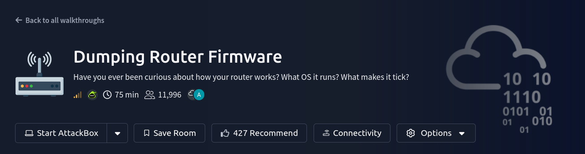

# TryHackMe: Dumping Router Firmware

    

## Room Info

| Field | Value |
|---|---|
| **Platform** | TryHackMe |
| **Room** | [Dumping Router Firmware](https://tryhackme.com/room/rfirmware) |
| **Difficulty** | Medium |
| **Estimated Time** | 75 min |
| **Category** | Firmware / embedded systems analysis |
| **Tools Used** | `strings`, `binwalk`, `jefferson` (JFFS2 extraction), `mknod`, `mount` |
| **Target** | Linksys WRT1900ACS v2 firmware image (`FW_WRT1900ACSV2_2.0.3.201002_prod.img`) |

---

## The Part Worth Remembering

This room isn't a "solve for a flag" box — it's a methodology room for pulling apart a piece of consumer router firmware without ever touching the physical device. The whole thing boils down to **one repeatable pipeline**:

1. **`strings` first, always.** Before any heavy tooling, running `strings` on a raw firmware blob is free and often immediately reveals: the device name, the OS, embedded file paths (`/bin/busybox`, `.lua` files), and other plaintext leftovers — because vendors frequently ship firmware with large sections completely unencrypted.
2. **`binwalk` to find and extract embedded filesystems.** Binwalk scans for known file *signatures* (magic bytes) inside a blob, regardless of surrounding structure — the same technique used in steganography extraction. The extraction flag is `-e`. This is how a single `.img` file gets split apart into its real components: a `uImage` header, a compressed kernel, and a JFFS2 filesystem image.
3. **JFFS2 needs a fake block device to mount, not a loop mount.** This is the one genuinely non-obvious step: JFFS2 is a *flash*-specific filesystem, so you can't just `mount -o loop` it like an ISO. You have to fake a memory-technology device (`mknod /dev/mtdblock0 b 31 0`), load the `jffs2`/`mtdram`/`mtdblock` kernel modules, `dd` the extracted image onto that fake device, and *then* mount it normally. That sequence is the part actually worth memorizing — everything else is standard recon.
4. **Once mounted, it's just a normal (but tiny) Linux filesystem to explore.** Most of what makes router firmware "special" is just that it's built around **BusyBox** (a single multi-call binary that most of `/bin/` symlinks to, to save space) and a minimal init/config layout under `/etc/`.

**Why this matters beyond the room:** this exact pipeline — `strings` → `binwalk -e` → identify filesystem type → fake block device (if needed) → mount → explore — is the standard starting point for *any* embedded/IoT firmware analysis, not just this specific router. It's also directly relevant to forensics work: extracting an embedded filesystem from a disk image or firmware dump uses the same signature-scanning logic as `binwalk`.

---

## Concept Glossary

- **`binwalk`** — scans a binary blob for known file-type signatures at arbitrary offsets (not just at the start of the file), and can recursively extract anything it finds. Same underlying idea used to pull hidden files out of images in steganography challenges.
- **JFFS2 (Journalling Flash File System v2)** — a filesystem purpose-built for raw NAND/NOR flash memory (no wear-leveling controller in between, unlike an SSD). Because it's flash-specific, the kernel needs an MTD (Memory Technology Device) block device to present the image to, rather than a regular loopback mount.
- **`uImage`** — a U-Boot–wrapped kernel image format used by many embedded bootloaders; it has its own header binwalk recognizes and extracts separately from the raw kernel payload.
- **BusyBox** — a single statically-linked binary that implements stripped-down versions of dozens of standard Unix utilities (`ls`, `cat`, `mount`, etc.). Embedded Linux devices symlink most of `/bin/` to it instead of shipping full GNU coreutils, to save flash space.
- **Dropbear** — a lightweight SSH server/client implementation built for resource-constrained embedded devices, used here instead of full OpenSSH.
- **JNAP/HNAP** — Linksys's "Home Network Administration Protocol" (later renamed JNAP), a device-management API that has a history of being a real-world attack surface on consumer routers.

---

## Quick Reference — Questions & Answers

### Task 1 — Preparation
No graded question. Confirmed the target firmware and its integrity before analysis:

| Field | Value |
|---|---|
| Firmware | Linksys WRT1900ACS v2 |
| Image | `FW_WRT1900ACSV2_2.0.3.201002_prod.img` |
| SHA-256 | `dbbc9e8673149e79b7fd39482ea95db78bdb585c3fa3613e4f84ca0abcea68a4` |

### Task 2 — Investigating Firmware (`strings` + `binwalk`)

| # | Question | Answer |
|---|---|---|
| 1 | First clear-text line (`strings`) | `Linksys WRT1900ACS Router` |
| 2 | Operating system | `Linux` |
| 3 | Binwalk extraction flag | `-e` |
| 4 | First item extracted | `uImage header` |
| 5 | Creation date | `2020-04-22 11:07:26` |
| 6 | CRC of the image | `0xABEBC439` |
| 7 | Image size | `4229755 bytes` |
| 8 | Architecture | `ARM` |
| 9 | Is that architecture claim accurate? | `Yes` |
| 10 | Embedded Linux kernel version | `3.10.39` |

### Task 3 — Mounting and Analysis (JFFS2 filesystem)

| # | Question | Answer |
|---|---|---|
| 1 | `linuxrc` symlink target | `/bin/busybox` |
| 2 | Parent folder for `mnt`, `opt`, `var` | `/tmp/` |
| 3 | Folder storing the HTTP server | `/www/` |
| 4 | Where most `/bin/` files link to | `busybox` |
| 5 | Database that would run on the router | `sqlite3` |
| 6 | Build date | `2020-04-22 11:44` |
| 7 | SSH server | `dropbear` |
| 8 | Media server developer | `Cisco` |
| 9 | `/etc/` file listing services and ports | `services` |
| 10 | File with default system settings | `system_defaults` |
| 11 | Specific firmware version | `2.0.3.201002` |
| 12 | Networks with folders under `/JNAP/modules` | `guest_lan`, `lan`, `wan` |

---

## Full Lessons Learned

1. **The pipeline generalizes far beyond this one router.** `strings` → `binwalk -e` → identify the filesystem type → mount (faking a block device if it's flash-specific like JFFS2) is the reusable skeleton for approaching *any* unknown firmware blob, IoT device dump, or embedded system image.
2. **"Encrypted firmware" is often a partial truth.** Vendors frequently leave large plaintext sections (strings, config templates, even full filesystems) sitting right next to genuinely protected components — worth always checking with `strings` before assuming a deeper reversing effort is required.
3. **BusyBox and Dropbear are the embedded-world defaults**, not obscure choices — recognizing them immediately signals "this is a resource-constrained embedded Linux device" versus a full desktop/server distro, which reframes what kind of vulnerabilities are realistic to look for (BusyBox applet quirks, Dropbear-specific CVEs, etc. rather than full GNU/OpenSSH ones).
4. **A management API surviving in a filesystem dump (JNAP here) is a good reminder** that "legacy" protocols/APIs often aren't actually removed from shipped firmware — they're just not exposed by default, which is exactly the kind of thing firmware analysis is good at surfacing before it becomes a live attack surface.

---

## Skills Demonstrated

`Firmware string analysis` · `Binwalk signature scanning & extraction` · `Embedded filesystem identification (JFFS2)` · `MTD block device emulation for flash filesystem mounting` · `BusyBox/Dropbear embedded Linux triage` · `Firmware version/build metadata analysis`

---

## References

- [TryHackMe — Dumping Router Firmware](https://tryhackme.com/room/rfirmware)
- [Firmware source — Sq00ky/Dumping-Router-Firmware-Image](https://github.com/Sq00ky/Dumping-Router-Firmware-Image)
- [binwalk](https://github.com/ReFirmLabs/binwalk)
- [jefferson (JFFS2 extraction)](https://github.com/sviehb/jefferson)
