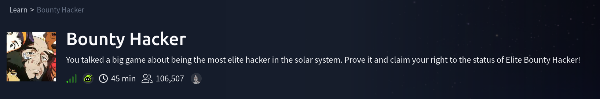
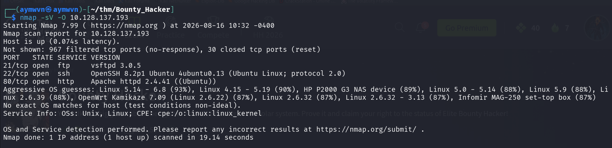
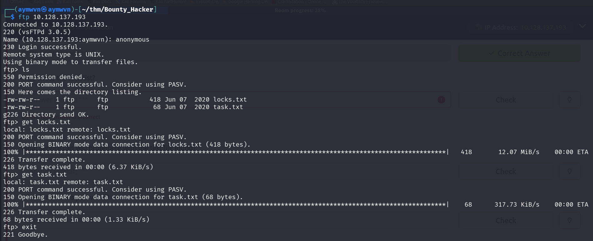
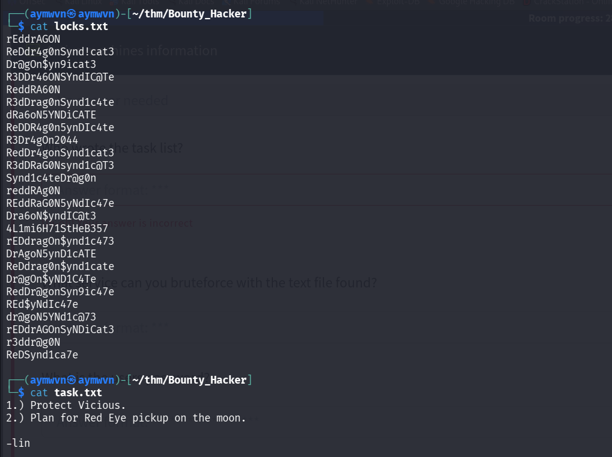
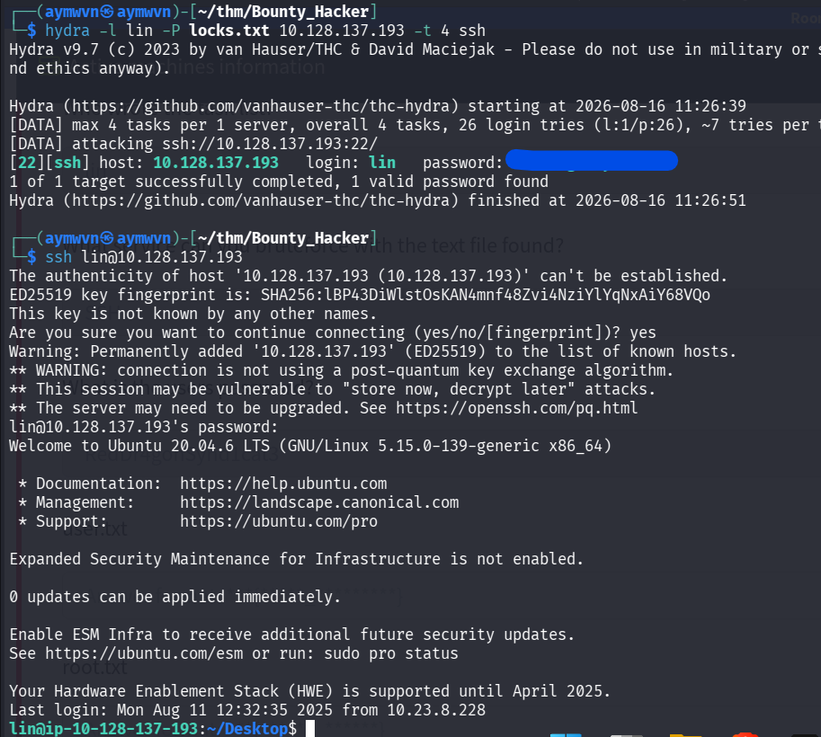
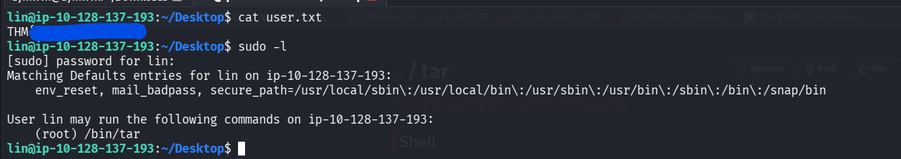
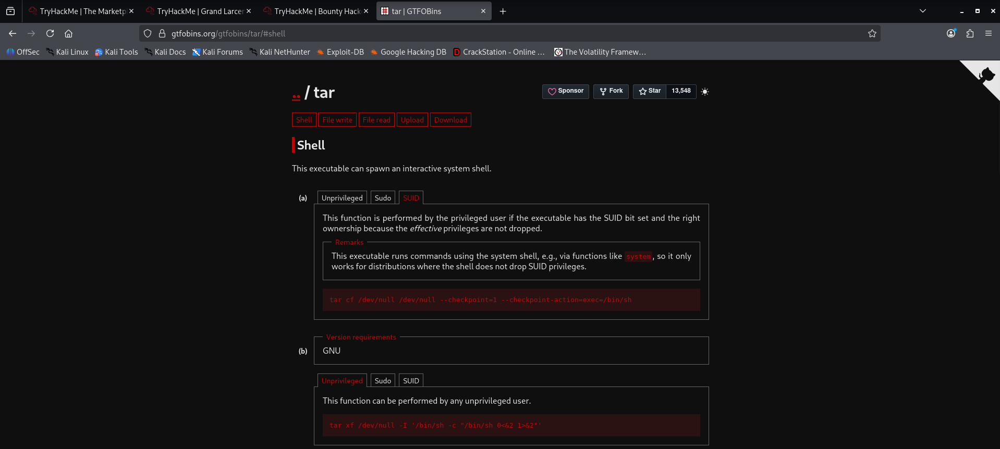
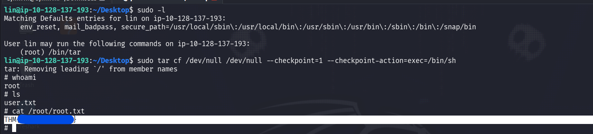

# TryHackMe: Bounty Hacker

    



## Room Info

| Field | Value |
|---|---|
| **Room** | Bounty Hacker |
| **Platform** | TryHackMe |
| **Difficulty** | Easy |
| **Category** | Boot2root / Misc |
| **OS** | Linux (Ubuntu 20.04.6 LTS) |
| **Tools Used** | nmap, ftp, hydra, ssh, sudo, tar (GTFOBins) |
| **Skills Tested** | Service enumeration, anonymous FTP, credential harvesting, SSH brute force, sudo misconfiguration privilege escalation |

The premise is a Cowboy Bebop-themed box: you're told to "prove your status as an elite bounty hacker" by chaining a leaked wordlist into a brute-force login and then abusing a sudo misconfiguration to get root.

---

## Concept Glossary

Before the walkthrough, here's the theory behind everything used in this box — read this section first if any step below doesn't make sense on its own.

**Anonymous FTP** — FTP servers can be configured to accept the username `anonymous` (any password, often an email address by convention) without requiring a real account. This is a legacy convenience feature from the days when FTP was used for public file distribution. It's a classic misconfiguration today because admins often forget it's still enabled, or leave sensitive files reachable through it.

**Credential/wordlist harvesting** — Not every wordlist has to come from SecLists or rockyou.txt. Sometimes the target itself leaks a custom wordlist (like `locks.txt` here) that's far more likely to contain the actual password than a generic list, because it was tailored to this specific machine/character.

**Brute forcing with Hydra** — Hydra is a parallelized login-cracker that supports dozens of protocols (ssh, ftp, http-post-form, smb, etc.). Given a username (or user list) and a password list, it tries each combination against the service until it gets a valid response. The `-t` flag controls thread count (concurrent attempts) — too high can trigger rate-limiting or lockouts on some services, so it's a balance between speed and stealth/reliability.

**SSH key fingerprint warning** — The first time you SSH into a new host, your client doesn't have that host's public key stored, so it warns you and asks you to confirm the fingerprint before proceeding. This exists to prevent MITM attacks in the real world, but on a TryHackMe attack box (a disposable, isolated VM), it's just an expected first-connection prompt — you always type `yes`.

**`sudo -l`** — Lists what commands the current user is allowed to run via `sudo`, and under what user context. This is the single most important command to run right after landing an initial shell during privilege escalation, because it directly tells you if there's a sudo misconfiguration to abuse — no guessing required.

**GTFOBins** — A curated database (gtfobins.org) documenting Unix binaries that can be abused to bypass local security restrictions when they have elevated permissions (SUID bit, sudo rights, etc.). Many "normal" binaries like `tar`, `vim`, `find`, `less`, and `awk` have built-in functionality (running external commands, spawning shells, reading/writing files) that becomes a privilege escalation primitive the moment they're runnable as root.

**Why `tar` can escalate privileges** — GNU `tar` supports a `--checkpoint-action` flag, originally meant to run a script at intervals during large archive operations (useful for logging progress on huge backups). If `tar` is executable as root via sudo, you can abuse this legitimate feature to make it execute `/bin/sh` instead of a checkpoint script — and because `tar` itself is running as root, the shell it spawns inherits root privileges too. This is privilege escalation through *intended functionality misuse*, not a bug or exploit — which is exactly why sudo permissions need to be scoped as tightly as possible in real environments.

---

## 1. Recon

### 1.1 Nmap scan

**Command:**
```bash
nmap -sV -O 10.128.137.193
```

**Output:**
```
PORT   STATE SERVICE VERSION
21/tcp open  ftp     vsftpd 3.0.5
22/tcp open  ssh     OpenSSH 8.2p1 Ubuntu 4ubuntu0.13 (Ubuntu Linux; protocol 2.0)
80/tcp open  http    Apache httpd 2.4.41 ((Ubuntu))
```



**Why this step:** Nmap is always the first move on a boot2root box — it maps the attack surface before you commit to any single approach. `-sV` grabs service/version banners (critical for spotting outdated software with known CVEs), and `-O` attempts OS fingerprinting. Three open ports here: FTP, SSH, and HTTP. FTP is usually the weakest link on easy boxes because it's stateless and often misconfigured for anonymous access, so that's the natural first thing to check — rather than starting with web enumeration on port 80, which had no other obvious leads yet.

---

## 2. Analysis

With FTP open, the first thing worth trying — before any brute forcing or web enumeration — is whether anonymous login is allowed. It costs nothing to test and is one of the most common misconfigurations on intentionally vulnerable boxes. SSH being open but with no valid credentials yet meant the plan was: **use FTP to find something that gets us SSH credentials**, rather than attacking SSH blind.

No web enumeration (gobuster/ffuf on port 80) was needed once FTP handed over exactly what was required — a wordlist and a hint about who to target. This is a good example of not over-enumerating once a clear lead presents itself.

---

## 3. Exploitation

### 3.1 Anonymous FTP login and file retrieval

**Command:**
```bash
ftp 10.128.137.193
# Name: anonymous
ls
get locks.txt
get task.txt
```

**Output:**
```
230 Login successful.
-rw-rw-r-- 1 ftp ftp 418 Jun 07 2020 locks.txt
-rw-rw-r-- 1 ftp ftp  68 Jun 07 2020 task.txt
```



**Why this worked:** The FTP server accepted the `anonymous` username with no real password check — a classic misconfiguration. Both files were world-readable to the anonymous account, which shouldn't be the case on a properly hardened FTP server (anonymous access, if enabled at all, should be scoped to a specific public directory, not to files intended for legitimate users).

### 3.2 Reading the downloaded files

**Command:**
```bash
cat locks.txt
cat task.txt
```

**Output (`task.txt`):**
```
1.) Protect Vicious.
2.) Plan for Red Eye pickup on the moon.

-lin
```



**Why this matters:**
- `locks.txt` is a custom wordlist — likely a candidate password list rather than a generic one, which is far more efficient to brute force with than rockyou.txt.
- `task.txt` is signed **`-lin`**, which directly answers "who wrote the task list?" and — more importantly — gives us a **username** to pair with the wordlist for a targeted brute force instead of guessing usernames too.

**Q: Who wrote the task list?**
**A: `lin`**

---

### 3.3 Brute forcing SSH with Hydra

**Command:**
```bash
hydra -l lin -P locks.txt 10.128.137.193 -t 4 ssh
```

**Output:**
```
[22][ssh] host: 10.128.137.193   login: lin   password: [FOUND]
1 of 1 target successfully completed, 1 valid password found
```



**Why SSH and not FTP/HTTP:** `task.txt` gave a username (`lin`) and `locks.txt` gave a tailored password candidate list — the natural service to pair them against is SSH, since it's the only remaining open service that takes username/password auth directly (FTP was already accessed anonymously, and HTTP hadn't shown a login form). `-t 4` throttles Hydra to 4 concurrent threads, a reasonable default for CTF boxes that keeps the attack reliable without overwhelming the target's SSH daemon.

**Q: What service can you bruteforce with the text file found?**
**A: SSH**

**Q: What is the user's password?**
**A: Not captured** — the value is redacted in my own screenshot (blue box) and wasn't otherwise recorded during the session, so I'm not guessing it here.

**Logging in:**
```bash
ssh lin@10.128.137.193
```
Accepted the ED25519 fingerprint prompt (`yes`) — expected on a first connection to a disposable attack-box target, not a real-world trust concern here — and authenticated successfully, landing on Ubuntu 20.04.6 LTS as `lin`.

---

### 3.4 Reading user.txt and checking sudo rights

**Command:**
```bash
cat user.txt
sudo -l
```

**Output:**
```
User lin may run the following commands on ip-10-128-137-193:
    (root) /bin/tar
```



**Q: user.txt**
**A: Not captured** — redacted in my screenshot, not recorded elsewhere in the session.

**Why `sudo -l` immediately:** This is standard practice the moment you land any shell on a Linux box — it's a zero-cost check that tells you outright whether there's a sudo misconfiguration to exploit, before spending time hunting for SUID binaries, cron jobs, or kernel exploits. Here it immediately surfaces that `lin` can run `/bin/tar` as root with no password required — a direct path to privilege escalation via GTFOBins.

---

### 3.5 Confirming the tar privesc technique on GTFOBins



**Why check GTFOBins instead of guessing a payload:** Rather than trying to recall or improvise a `tar` exploitation flag from memory, checking GTFOBins directly confirms the exact, tested syntax for the *SUID/sudo* context (as opposed to the Unprivileged or plain-Sudo contexts, which use different flags/effects). This matters because a wrong flag combination on `tar` could just fail silently or behave unexpectedly — using the documented payload removes that uncertainty.

The relevant payload:
```bash
tar cf /dev/null /dev/null --checkpoint=1 --checkpoint-action=exec=/bin/sh
```

### 3.6 Root shell via tar checkpoint-action abuse

**Command:**
```bash
sudo tar cf /dev/null /dev/null --checkpoint=1 --checkpoint-action=exec=/bin/sh
whoami
ls
cat /root/root.txt
```

**Output:**
```
tar: Removing leading `/' from member names
# whoami
root
# ls
user.txt
# cat /root/root.txt
[FOUND]
```



**Why this works, step by step:**
1. `sudo tar ...` runs `tar` as root (allowed per the `sudo -l` output, no password needed).
2. `--checkpoint=1` tells `tar` to trigger a checkpoint after every 1 file record processed — effectively "immediately."
3. `--checkpoint-action=exec=/bin/sh` overrides the default checkpoint behavior (usually just printing progress) to instead execute `/bin/sh`.
4. Since `tar` itself is running with root privileges (via sudo), the `/bin/sh` it spawns inherits that same root context.
5. Result: an interactive root shell, confirmed by `whoami` returning `root`.

**Q: root.txt**
**A: Not captured** — redacted in my screenshot, not recorded elsewhere in the session.

---

## Full Lessons Learned

This box is a clean, linear demonstration of a **three-stage credential/misconfiguration chain** that shows up constantly in real-world pentests, not just CTFs:

1. **Anonymous/misconfigured services leak more than people expect.** Anonymous FTP wasn't just "a login" — it leaked an operational wordlist and a username, which is exactly the kind of low-effort information disclosure that turns into full compromise. In a real engagement, this is precisely the finding you'd flag as high-severity even though "anonymous FTP" sounds minor on its own — it's the *downstream* impact that matters.

2. **Custom/leaked wordlists beat generic ones.** `locks.txt` succeeded where rockyou.txt might have taken far longer (or failed, if the password wasn't common). This reinforces that recon should always be checked for *target-specific* wordlist material before reaching for generic lists — OSINT and enumeration output is often a better password source than brute-dictionary attacks.

3. **`sudo -l` should be reflexive, not an afterthought.** It's the fastest, lowest-risk privesc check available on any Linux box and should run automatically right after landing a shell — before LinPEAS, before SUID hunting, before anything else.

4. **GTFOBins turns "this binary is sudo-able" into "this is exploitable" instantly.** The real lesson for the *defensive* side: `sudo` rules should never grant broad access to multi-purpose binaries like `tar`, `vim`, `find`, `less`, `awk`, `python`, etc. without extremely narrow scoping (specific arguments only, via `sudo` command restrictions), because nearly all of them have a documented privilege-escalation primitive.

5. **The chain matters more than any single step.** No individual step here was a "hard" vulnerability — anonymous FTP, a leaked wordlist, and a common sudo misconfiguration are all individually well-known issues. The lesson is that attackers (and pentesters) think in chains: each weak link feeds the next, and a system's real risk is the sum of small misconfigurations, not just its most obvious one.

---

## Skills Demonstrated

`Service Enumeration` · `Anonymous FTP Exploitation` · `Wordlist/Credential Harvesting` · `Hydra Brute Forcing` · `SSH` · `Linux Privilege Escalation` · `Sudo Misconfiguration Analysis` · `GTFOBins Research`

---

## References

- [GTFOBins — tar](https://gtfobins.org/gtfobins/tar/)
- [Hydra — GitHub (van Hauser / THC)](https://github.com/vanhauser-thc/thc-hydra)
- [TryHackMe — Bounty Hacker](https://tryhackme.com/room/boundaryhacker)
