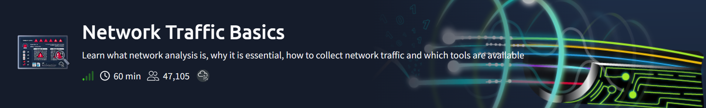

<div align="center">

# 🌐 TryHackMe — Network Traffic Basics

**"Learn what network analysis is, why it is essential, how to collect network traffic and which tools are available"**


</div>



> ⚡ **This writeup is built for speed-reading, not deep prose.** Every section is a quick-scan reference — the goal is re-reading this in 5 minutes and having the whole room back in my head.

---

## 🎯 Why Network Traffic Analysis (NTA) exists — in one line

**Logs tell you *that* something happened. Packet captures tell you *what actually happened inside* it.**

| Source | Shows | Doesn't show |
|---|---|---|
| Firewall / DNS logs | Query, source IP, destination IP, timestamp | The **content** of the query/response |
| Full packet capture | Everything — headers *and* payload | Needs storage + the right placement |

### The classic scenario (why this matters)

A host makes tons of DNS queries to random subdomains of the same weird domain:
```
aj39skdm.malicious-tld.com   QTYPE=A
cmd01.evilc2.com             QTYPE=TXT
```
Logs alone can't tell you *why*. Inspecting the actual DNS **response content** reveals a `TXT` record holding a Base64-encoded string — this is **DNS Tunneling**: hiding real data (often C2 commands) inside normal-looking DNS traffic, because DNS is almost never blocked outbound.

**✅ Q: Technique used to smuggle C2 commands via DNS?**
→ **DNS Tunneling**

---

## 🧠 NTA — What it's actually used for

- Monitor network **performance**
- Spot **abnormalities** (sudden spikes, slowdowns)
- Inspect **suspicious content** (exfil via DNS, malicious file downloads, lateral movement)

**SOC-specific value:** detect malicious activity → reconstruct attacks during IR → validate/verify alerts.

---

## 📚 The TCP/IP Stack — what each layer leaks

Quick mental model: **every layer adds a header, and headers = evidence.**

| Layer | What's logged normally | What you're missing without full capture |
|---|---|---|
| **Application** | HTTP headers (method, path, status) | The actual **payload** (e.g. the ZIP file bytes themselves) |
| **Transport (TCP/UDP)** | Src/dst ports, flags | Sequence numbers → needed to catch **session hijacking** (a random jump in seq number = injected packet) |
| **Internet (IP)** | Src/dst IP, TTL | Fragment offset/length → needed to catch **fragmentation attacks** (overlapping fragments used to evade IDS) |
| **Link** | Src/dst MAC | Full context → needed to catch **ARP poisoning** (same MAC replying for multiple IPs = spoofing) |

**✅ Q: ZIP attachment size in the HTTP example?** → `10485760` bytes
**✅ Q: Attack technique attackers use to evade an IDS?** → **Fragmentation**
**✅ Q: TCP header field used to detect session hijacking?** → **Sequence number**

---

## 🏢 Sources & Flows — corporate network cheat sheet

### Sources (where traffic comes from)

| Type | Examples | Traffic volume |
|---|---|---|
| **Intermediary** | Firewalls, switches, routers, IDS/IPS, proxies | Low (mostly just passes through) |
| **Endpoint** | Servers, hosts, IoT, phones, cloud resources | **High — the majority of traffic** |

**✅ Q: Which category generates the most traffic?** → **Endpoint**

### Flows (where traffic goes)

| Flow | Direction | Examples | Monitoring |
|---|---|---|---|
| **North-South** | LAN ↔ WAN (crosses the firewall) | HTTPS, DNS, SSH, VPN, SMTP, RDP | Closely monitored |
| **East-West** | Stays inside the LAN | AD/Kerberos, SMB, file shares, backups | Often under-monitored → **this is how attackers move laterally** |

### Two flow examples worth remembering

- **HTTPS with TLS-inspecting proxy** → really **2 separate sessions**: client↔proxy and proxy↔server. Client thinks it's talking directly to the server.
- **SMB access** → **Kerberos authenticates first** (get a Ticket Granting Ticket from the KDC, use it to request a service ticket), *then* the SMB session opens.

**✅ Q: Service contacted first before an SMB session?** → **Kerberos**
**✅ Q: What does TLS stand for?** → **Transport Layer Security**

---

## 📡 How We Actually Capture Traffic

### Three sources of info (from least to most detail)

1. **Logs** — easiest, but vendor-specific format, no payload
2. **Full Packet Capture** — everything, but expensive to store
3. **Network Statistics (NetFlow / IPFIX)** — metadata only (who talked to who, how much), great for spotting **C2 traffic, exfiltration, lateral movement** without full capture cost

### Two ways to actually grab full packets

| Method | How | Trade-off |
|---|---|---|
| **Network TAP** | Physical device, copies signal at the link layer | Near-zero performance hit, needs hardware |
| **Port Mirroring (SPAN)** | Software — switch duplicates traffic to a monitor port | Can degrade performance under heavy load, no extra hardware needed |

**Storage reality check:** 1 Gbps line, captured 24/7 → **~10.8 TB/day**. Scale that up for 10G/40G lines — this is *why* full capture isn't just "always on everywhere."

### Tools for analyzing captures

`Wireshark` · `TCPdump` · `Snort` / `Suricata` / `Zeek` (IDS/IPS)

---

## 🚩 Practical Exercise — Placing the TAP + Finding Flags

Two scenarios, each requiring correct TAP placement to actually see the relevant traffic:

**✅ Scenario 1 (HTTP traffic) flag:** `THM{FoundTheMalware}`
**✅ Scenario 2 (DNS traffic) flag:** `THM{C2CommandFound}`

**Why placement matters:** a TAP/mirror only sees what physically passes through the point it's attached to — put it in the wrong spot and you miss the traffic entirely, no matter how good your analysis tools are afterward. This is the most common practical mistake beginners make with NTA setups.

---

## 🧠 The Whole Room in 6 Bullets

- Logs = summary. Packet captures = the full story. Use logs to triage, use packets to actually investigate.
- Every TCP/IP layer has a header worth checking — session hijacking (seq numbers), fragmentation attacks (offsets), ARP poisoning (duplicate MACs) all hide at different layers.
- **Endpoints generate the most traffic**; **East-West traffic gets watched the least — exactly why attackers use it to move laterally.**
- TAP = hardware, near-zero impact. Mirroring = software, can slow things down under load.
- NetFlow/IPFIX = cheap metadata-only alternative to full capture, still great for catching C2/exfil patterns.
- DNS tunneling hides data in plain-looking DNS traffic — because DNS is rarely blocked outbound, making it a favorite low-noise exfil/C2 channel.

---

## 🛠️ Skills Demonstrated

`TCP/IP Model Analysis` · `Log vs Packet Capture Tradeoffs` · `DNS Tunneling Detection` · `Session Hijacking Indicators` · `Fragmentation Attack Recognition` · `ARP Poisoning Recognition` · `Network TAP / Port Mirroring` · `NetFlow / IPFIX Concepts`

---

## 📚 References

- [Wireshark](https://www.wireshark.org/)
- [AbuseIPDB](https://www.abuseipdb.com/)
- [VirusTotal](https://virustotal.com/)
