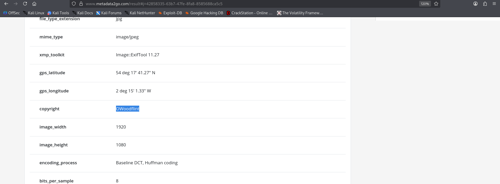
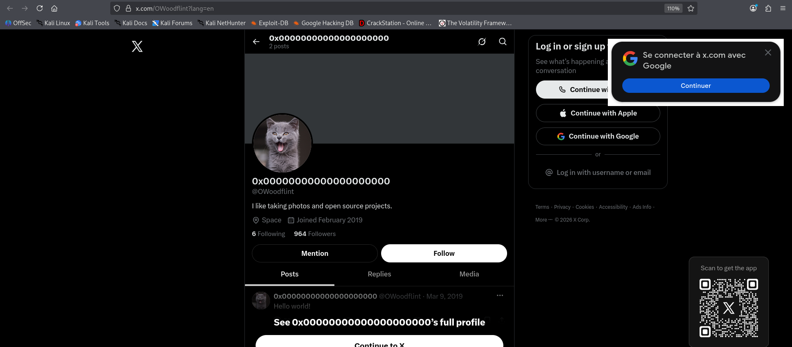
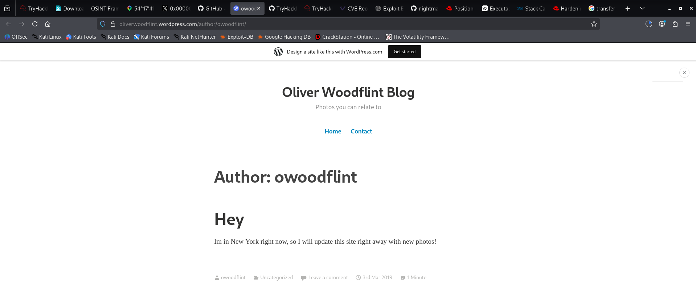
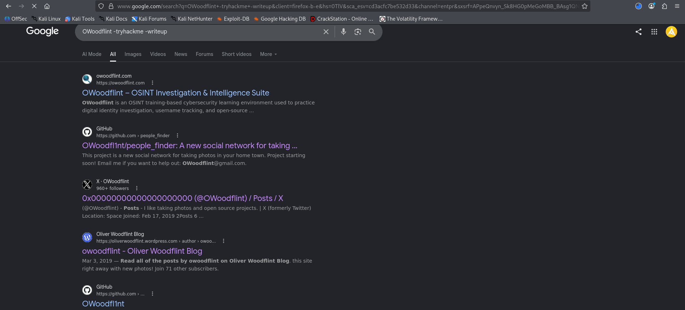
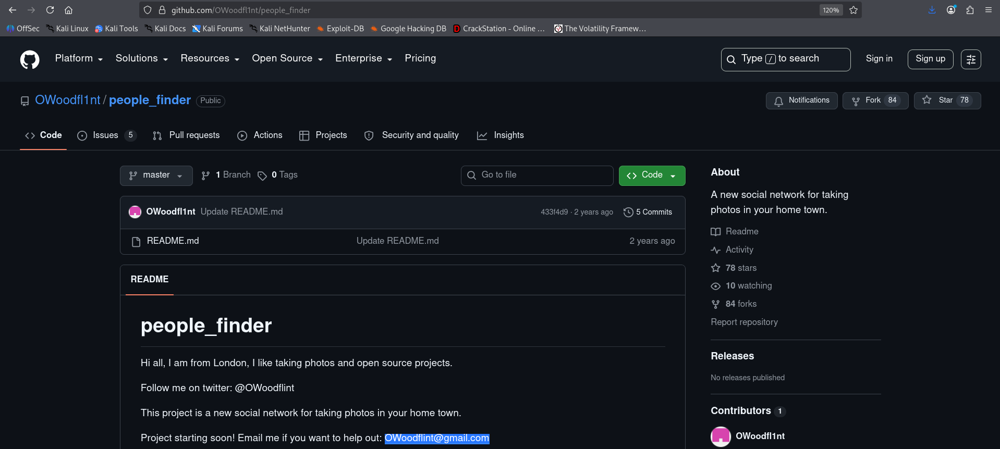
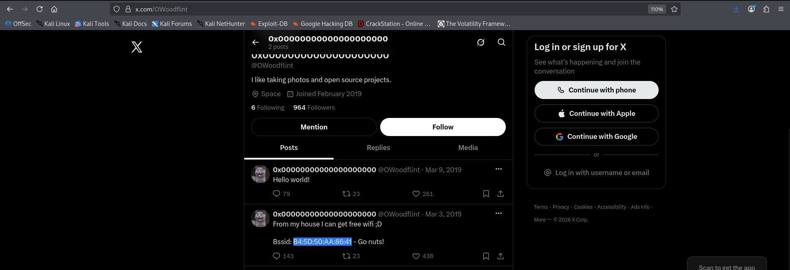
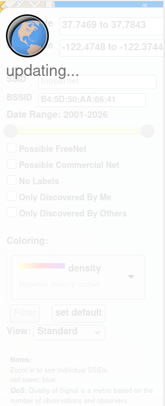
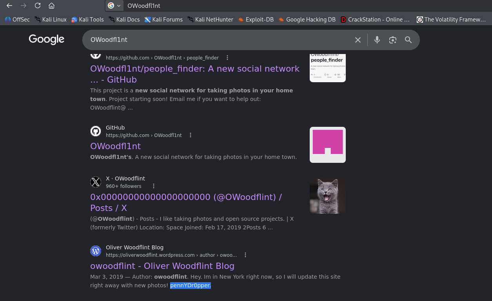
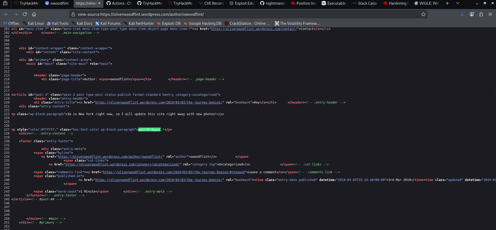
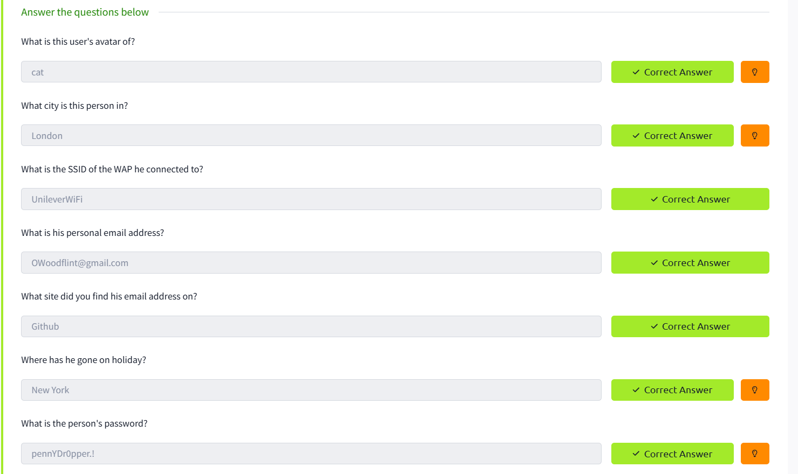

# OhSINT — TryHackMe

    


## Room Info

| Field | Value |
|---|---|
| Platform | TryHackMe |
| Room | [OhSINT](https://tryhackme.com/room/ohsint) |
| Category | OSINT |
| Difficulty | Easy |
| Time | ~60 min |
| Format | Single artifact → chain of pivots |
| Tools used | Reverse image search, Google dorking, WiGLE.net, browser dev tools (view-source) |

## Objective

You're handed a single starting artifact — a profile picture (`WindowsXP.jpg`) — and nothing else. The entire room is a **pivot chain**: every answer you find becomes the input for the next question. No exploitation, no terminal — just methodically working outward from one image to a full digital footprint (username, real name, city, email, home network, holiday location, and a hidden password).

## Concept Glossary

Before the walkthrough, here's the theory behind each technique used, so this writeup stays useful as a reference later.

**OSINT (Open Source Intelligence)**
The practice of collecting information exclusively from publicly available sources — social media, search engines, forums, metadata, DNS records, etc. — with no hacking or unauthorized access involved. It's a legitimate discipline used in red teaming (recon phase), journalism, law enforcement, and background checks. The skill isn't finding one clever trick, it's *chaining* small, individually harmless pieces of public data until they add up to something the target didn't intend to expose.

**Reverse Image Search**
Instead of searching with text, you search *with an image* (Google Images "search by image", Yandex, or TinEye). The engine matches visual features of your image against its index and returns pages where that same image appears. This is how an anonymous profile picture gets tied back to a real social media account — if the person reused the same photo anywhere else, reverse image search finds it.

**Google Dorking**
Using Google's advanced search operators to narrow results with surgical precision instead of a normal keyword search. Key operators:
- `site:domain.com` → restrict results to one site
- `-keyword` → exclude a term from results (used in this room as `-tryhackme -writeup` to filter out other people's solved writeups so you find the *real* target accounts instead of spoilers)
- `intitle:`, `filetype:`, `inurl:` → match text in the title, a specific file extension, or the URL

Dorking turns a flooded search engine into a filtered recon tool — critical once a username starts showing up in unrelated writeup pages.

**WiGLE.net**
A crowdsourced global database of wireless access points, built from years of "wardriving" (people driving around with a WiFi scanner logging every network they pass, along with GPS coordinates). You can search WiGLE by **SSID** (network name) or **BSSID** (the access point's MAC address, which is globally unique per device). If a BSSID you found (e.g., from a leaked screenshot or social media post) has ever been logged by a wardriver, WiGLE tells you roughly where that physical router lives — turning a MAC address into a real-world location.

**View-Source / Hidden HTML Content**
Browsers render a page based on CSS, and CSS can hide text without removing it from the underlying HTML — e.g., `color:#ffffff` on a white background makes text invisible to the eye but still fully present and selectable/searchable in the raw HTML. `Ctrl+U` (or `view-source:`) shows the actual document the browser received, bypassing whatever styling is hiding content. This is a classic OSINT/CTF trick: hide a flag or password in plain sight using white-on-white text.

**Metadata / EXIF**
Image files (especially JPEGs) carry embedded metadata beyond the visible pixels: camera model, timestamp, software used to edit it, sometimes GPS coordinates, and any custom fields the creator set — like a `copyright` tag. This is *always* the first move on an OSINT image challenge, before any reverse image search. Tools like `exiftool` (CLI) or web front-ends like [metadata2go.com](https://www.metadata2go.com/) parse the file's EXIF/XMP headers and dump every field in human-readable form. People rarely think to strip this before uploading an image, which makes it one of the highest-value, lowest-effort OSINT pivots available — in this room it's what cracked the case open before reverse image search was even needed.

## Walkthrough

### 1. Starting Point — The Profile Picture

The room gives you one file: a JPEG image. The stated goal is to see how far a single image can take you through nothing but public information. Before touching a search engine, the first move on any image-based OSINT task is checking what's embedded *inside* the file itself.

### 2. EXIF Metadata → GPS Coordinates and Username

Running the image through an EXIF parser (`exiftool`, or the web-based [metadata2go.com](https://www.metadata2go.com/) used here) dumps every metadata field baked into the file:



Two fields matter immediately:
- **`gps_latitude` / `gps_longitude`:** `54°17'41.27"N`, `2°15'1.33"W` — a precise real-world coordinate pair, embedded automatically by whatever device captured the original photo.
- **`copyright`:** `OWoodflint` — the photographer tagged their own username directly in the file's metadata.

That single field is the pivot for the entire rest of the room: `OWoodflint` becomes the identity to search everywhere else.

**Why this works:** most people never check (or strip) EXIF/XMP metadata before uploading a photo. Cameras and phones write GPS, timestamps, and device info by default, and some tools — or careless self-tagging, like a copyright field — leak identity directly. Checking metadata costs nothing and should always come before spending time on reverse image search or manual digging.

### 3. Username → X (Twitter) Profile

Searching the `OWoodflint` handle directly (rather than reverse-image-searching the photo) leads straight to the matching X profile, using the same cat photo as its avatar — confirming this is the same person.



- **Avatar subject:** a cat (answers *"What is this user's avatar of?"*)
- **Bio:** "I like taking photos and open source projects." — a small detail, but it foreshadows both the WordPress blog and the GitHub repo found later.

**Why this works:** once EXIF handed over a clean, likely-unique username, cross-platform correlation is just a matter of searching that handle everywhere — no visual matching required.

### 4. Following the Username — WordPress Blog

Pivoting on the bio/username surfaces a personal WordPress blog belonging to the same person.



The single post reads:

> Im in New York right now, so I will update this site right away with new photos!

This directly answers *"Where has he gone on holiday?" → **New York***. Note this is presented as a real-time status update, not a permanent home — an important distinction the room is testing you on (don't confuse "currently in" with "lives in").

### 5. Google Dorking to Clean Up the Search

At this point the target's username was common enough that a plain search buried real leads under other people's TryHackMe writeups. Running:

```
OWoodflint -tryhackme -writeup
```

filters those out and surfaces the actual source pages: a personal site (`owoodflint.com`), the GitHub `people_finder` repo, the X profile, and the WordPress blog — all in one clean result set.



**Why this matters as a habit:** once your target has any public footprint tied to a CTF room (or a real investigation with noisy search results), a two-second `-exclude` saves you from wading through irrelevant pages.

### 6. GitHub Repository → City and Email

The `people_finder` repo is where the identity really opens up.



From the README:
- "Hi all, **I am from London**..." → answers *"What city is this person in?" → **London***
- "Project starting soon! Email me if you want to help out: **OWoodflint@gmail.com**" → answers *"What is his personal email address?"* and *"What site did you find his email address on?" → **GitHub***

### 7. Back to X — The WiFi Tweet

Scrolling the full X profile (past the "Hello world!" first post) surfaces a second tweet that's the whole reason WiGLE gets involved:



> From my house I can get free wifi ;D
> Bssid: **B4:5D:50:AA:86:41** — Go nuts!

Posting your home router's BSSID publicly is the single biggest OPSEC mistake in this whole chain — it's a unique physical-hardware identifier, and unlike an SSID (which anyone can rename), it can't be casually changed.

### 8. WiGLE.net — BSSID to Physical Location

Plugging that BSSID into WiGLE's map search pulls up the record for that exact access point from wardriving data.



This confirms:
- **SSID of the WAP he connected to → `UnileverWiFi`**
- A bounding-box location for the physical router, consistent with the target's stated home area.

**Why this works:** WiGLE doesn't care about privacy settings or account permissions — it's a public record built entirely from third-party wardriving scans. If your router's BSSID was ever within range of someone running a WiFi scanner (which, in dense cities, is almost guaranteed), it's in the database.

### 9. Google Search Again — The Password Hint

A follow-up search for just `OWoodflint` surfaces the WordPress blog snippet again, but this time Google's preview text reveals a second string sitting in the post that wasn't visible on the rendered page earlier:



Google indexes the raw HTML of a page — including text hidden from human eyes via CSS. So even though the string doesn't show up when you *view* the blog post normally, it shows up in the search snippet because Google crawled the underlying source.

### 10. View-Source — Confirming the Hidden Password

To confirm it directly at the source rather than trust a search snippet, pulling up `view-source:` on the blog post shows the actual HTML:



```html
<p style="color:#ffffff;" class="has-text-color wp-block-paragraph">pennYDr0pper.!</p>
```

White text (`color:#ffffff`) on a white page background — invisible to a normal reader, but sitting in plain text in the DOM. This answers *"What is the person's password?" → **pennYDr0pper.!***

### 11. Final Confirmation

All seven answers checked out:



| Question | Answer |
|---|---|
| GPS coordinates (EXIF, not a graded question but the key that opened the room) | 54°17'41.27"N, 2°15'1.33"W |
| Avatar subject | cat |
| City | London |
| WAP SSID | UnileverWiFi |
| Personal email | OWoodflint@gmail.com |
| Email found on | GitHub |
| Holiday location | New York |
| Password | pennYDr0pper.! |

## Full Lessons Learned

This room is less about any single "trick" and more about **discipline in pivoting**: every finding is only useful if you immediately ask "what does this let me search next?" A JPEG's EXIF metadata leaked both a GPS location and a self-tagged username, that username led to a blog and a repo, the repo leaked a city and an email, and a careless tweet leaked a hardware identifier that WiGLE turned into a physical location — none of which required breaking into anything.

Three techniques worth internalizing for future OSINT work or recon phases of a pentest:

1. **Always check metadata first.** Before reverse image search, before manual digging — pull the EXIF/XMP headers with `exiftool` or a web parser. It's the cheapest possible move and, as this room proves, it can hand you the entire pivot chain's starting point in one step (here, a `copyright` field that was literally the target's username).
2. **BSSIDs are geolocation leaks.** Unlike an SSID, a BSSID (MAC address) is tied to physical hardware and gets logged passively by wardriving databases like WiGLE regardless of the owner's privacy settings. Never publish one attached to your identity.
3. **"Hidden" isn't hidden from crawlers.** CSS-based hiding (`color` matching background, `display:none`, etc.) only hides content from a human glancing at the rendered page. Search engine crawlers and `view-source` both see the raw HTML. If something shouldn't be public, it needs to not be in the document at all — not just styled invisible.

More generally: this is the same methodology used in real recon/OSINT-gathering phases of a pentest engagement (building a target profile before ever touching the in-scope systems) — just compressed into a CTF-sized puzzle.

## Skills Demonstrated

`OSINT Methodology` `EXIF/Metadata Analysis` `Google Dorking` `WiGLE.net / Wardriving Data` `HTML Source Inspection` `Cross-Platform Identity Correlation` `Digital Footprint Analysis`

## References

- [TryHackMe — OhSINT](https://tryhackme.com/room/ohsint)
- [ExifTool by Phil Harvey](https://exiftool.org/) — the standard CLI tool for reading/writing image metadata
- [metadata2go.com](https://www.metadata2go.com/) — web-based EXIF/metadata viewer, no install required
- [WiGLE.net](https://wigle.net/) — wardriving/wireless network database
- [Google Advanced Search Operators — Google Support](https://support.google.com/websearch/answer/2466433)
