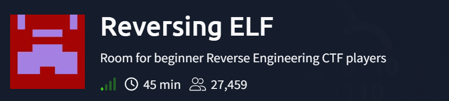
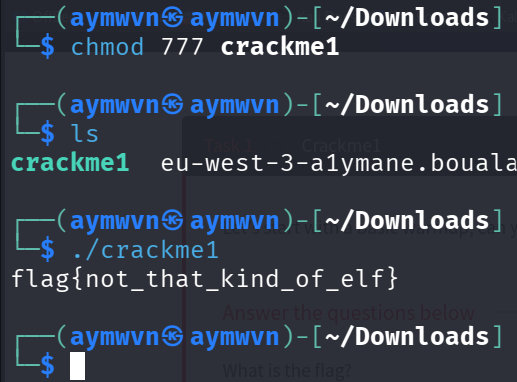
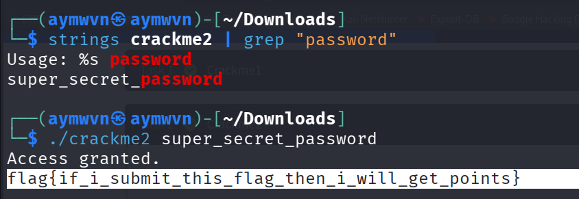
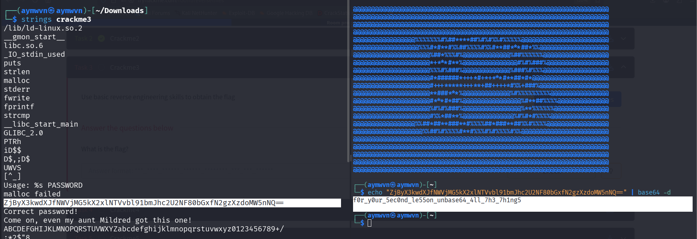
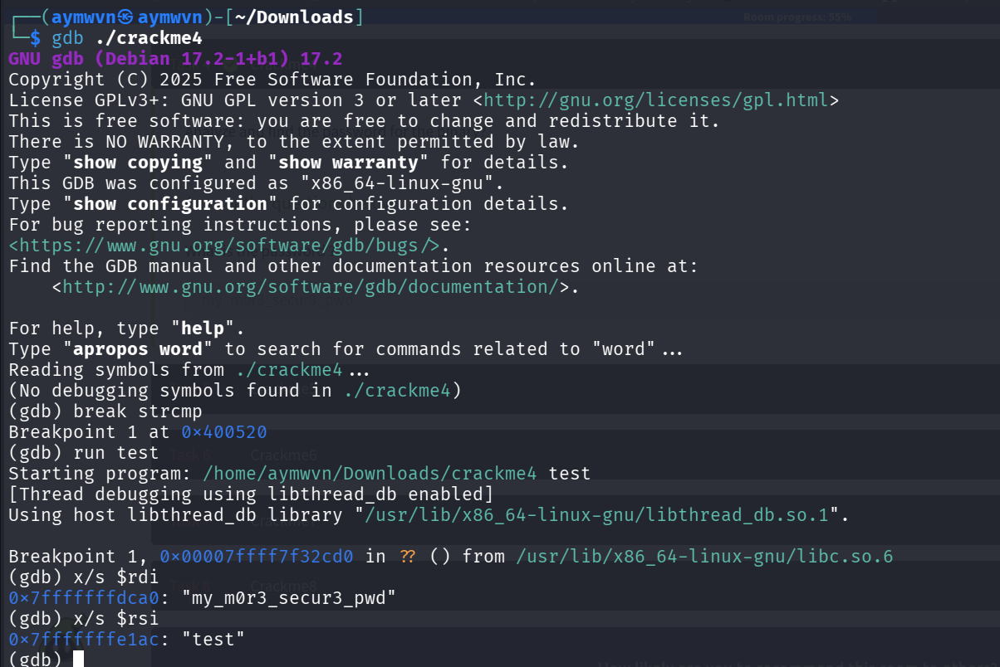
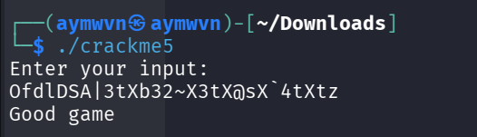
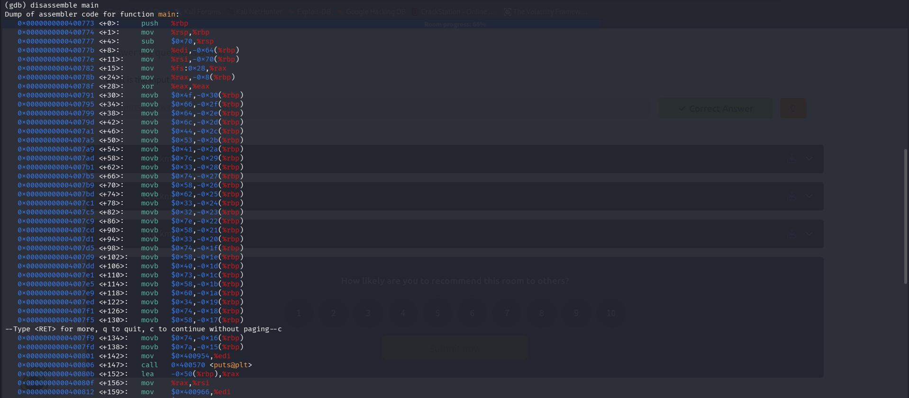
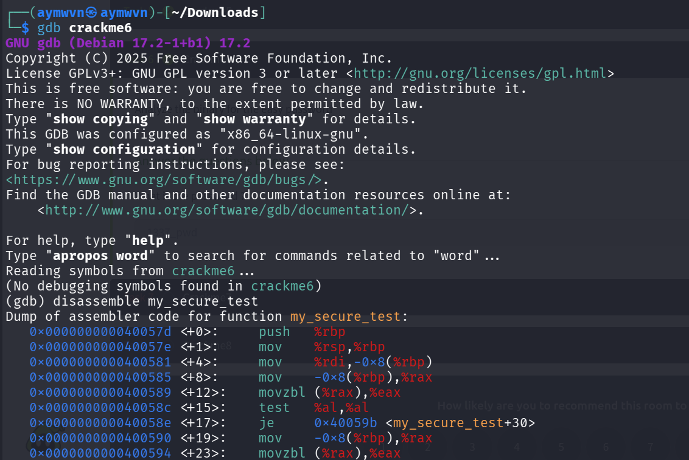
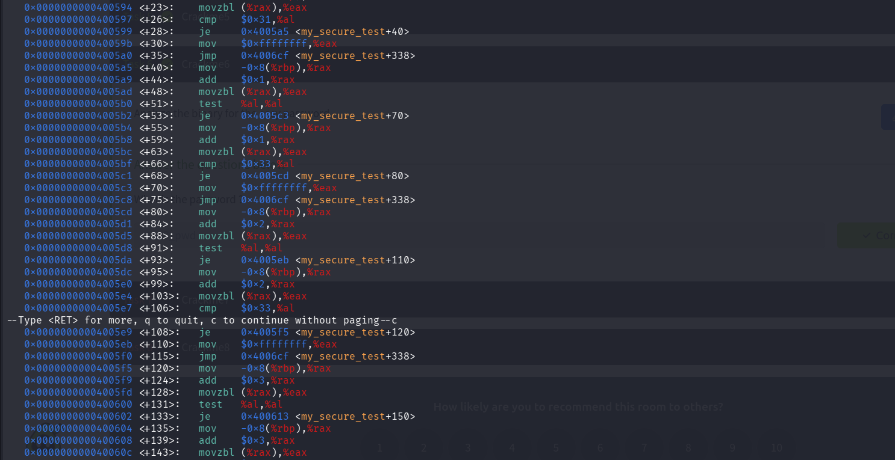
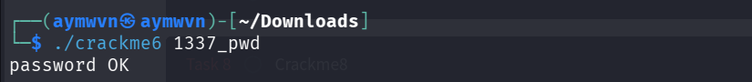

<div align="center">

# 🐧 TryHackMe — Reversing ELF

**"Room for beginner Reverse Engineering CTF players"**


</div>



---

## 📋 Room Info

| Field | Value |
|---|---|
| **Platform** | TryHackMe |
| **Room** | Reversing ELF |
| **Format** | 8 progressive "crackme" binaries, increasing difficulty |
| **Tools Used** | `chmod`, `strings`, `base64`, `gdb`, `radare2` |
| **Date Completed** | August 2026 |

> 🎯 **Purpose of this writeup:** this isn't just a solve log — it's written so I (or anyone else who reads it) can come back in six months, re-read it, and actually **re-understand the reasoning**, not just remember "the answer was X." Every crackme below explains *why* a specific tool was reached for, not just *what* command was typed.

---

## 🧠 The Core Mental Model (read this first)

Reverse engineering beginner crackmes almost always follow one decision path. Internalizing this flowchart is more valuable long-term than memorizing any single crackme's solution:

```
Binary
  |
  v
file program          → confirms file type (ELF? stripped? architecture?)
  |
  v
strings program        → is the password/flag just sitting there in plaintext?
  |
  +--> found it? → done
  |
  no
  |
  v
Look for clues in the strings output:
  strcmp? check_password? encode? atoi?
  |
  +--> comparison function (strcmp/strncmp/memcmp)
  |        |
  |        v
  |       GDB breakpoint on that function → inspect registers at the moment of comparison
  |
  +--> complicated/branching logic
           |
           v
          Ghidra or radare2 → read the disassembly, understand the structure
```

| Tool | Purpose | Question it answers |
|---|---|---|
| `strings` | Extract readable text from a binary | "Is the password/flag sitting there in plain text?" |
| `gdb` | Control and inspect a **running** program | "What is actually happening at runtime?" |
| `radare2` / Ghidra | Statically read the program's logic | "How does this program work, structurally?" |

---

## 🔓 Crackme 1 — Permissions, Not Cracking

```bash
ls -l crackme1
# -rw-r--r-- 1 aymwvn aymwvn 16384 Aug 6 crackme1
```

No `x` anywhere in the permission bits — Linux refuses to execute it:
```bash
./crackme1
# Permission denied
```

```bash
chmod 777 crackme1
./crackme1
```



**Why this "worked":** nothing was cracked here — `chmod 777` sets `-rwxrwxrwx` (read/write/execute for owner, group, and everyone), which simply gives the **kernel permission to execute the file at all**. The flag was already hardcoded inside the binary, waiting to print the moment it was allowed to run. This crackme's real lesson: **check file permissions before assuming a binary is broken or protected.**

**Flag:** `flag{not_that_kind_of_elf}`

---

## 🔓 Crackme 2 — `strings` Solves It Directly

```bash
strings crackme2 | grep "password"
```



`strings` pulled the password straight out as plaintext: `super_secret_password`. Passed it as an argument:

```bash
./crackme2 super_secret_password
```

**Why this worked:** the developer stored the password as a plain string literal in the source code, which gets compiled directly into the binary's data section — completely unprotected. This is the **most common beginner-level vulnerability in crackmes** (and, honestly, in real hardcoded-credential findings during actual pentests too).

**Flag:** `flag{if_i_submit_this_flag_then_i_will_get_points}`

---

## 🔓 Crackme 3 — Encoded, Not Encrypted

```bash
strings crackme3
```



This time `strings` didn't show a clean password — it showed a block of text that *looked* random:
```
ZjByX3kwdXJfNWVjMG5kX2xlNTVvbl9bmJhc2U2NF80bGxfN2gzX3h1bmc=
```

**Why this isn't "encrypted":** the character set (`A-Z`, `a-z`, `0-9`, `+`, `/`, and `=` padding at the end) is the exact signature of **Base64 encoding** — an encoding scheme, not encryption. Encoding is reversible with zero secret key needed; it's meant for safely transmitting binary-safe text, not for hiding anything from someone who recognizes the pattern.

```bash
echo "ZjByX3kwdXJfNWVjMG5kX2xlNTVvbl9bmJhc2U2NF80bGxfN2gzX3h1bmc=" | base64 -d
```

Decoded straight to the real password:
```
f0r_y0ur_5ec0nd_le5son_unbase64_4ll_7h3_7h1ngs
```

**Flag:** `flag{if_i_submit_this_flag_then_i_will_get_points}` *(reused message: "Come on, even my aunt Mildred got this one!" — the room's way of saying Base64 isn't real security)*

---

## 🔓 Crackme 4 — GDB Breakpoints on `strcmp`

```bash
strings crackme4
```
Output showed: `strcmp`, `password OK`, `password "%s" not OK` — **but no visible password this time.**

**Why `strings` failed here:** the password exists at runtime, but it's not stored as a static string the way Crackme2's was — meaning we need to catch it *while the program is running*, not by reading the file at rest.

**The clue:** the presence of `strcmp` in the strings output. `strcmp(string1, string2)` compares two strings — somewhere in this binary, it's comparing our input against the real password. If we can freeze the program at the exact moment that comparison happens, both strings will be sitting in memory for us to read.

```bash
gdb ./crackme4
(gdb) break strcmp
(gdb) run test
```



**Why `$rdi` and `$rsi` specifically:** this is the **x86-64 Linux calling convention** — when a function is called, its arguments get loaded into specific CPU registers in a fixed order:

| Argument position | Register |
|---|---|
| 1st | `RDI` |
| 2nd | `RSI` |
| 3rd | `RDX` |
| 4th | `RCX` |

Since `strcmp(arg1, arg2)` takes two arguments, the first lands in `RDI` and the second in `RSI`. So:

```gdb
(gdb) x/s $rdi    →  "my_m0r3_secur3_pwd"   (the real password)
(gdb) x/s $rsi    →  "test"                 (my throwaway input)
```

The real password was sitting in the register the entire time — GDB just let me pause execution at the exact instant to read it.

**Password recovered:** `my_m0r3_secur3_pwd`

---

## 🔓 Crackme 5 — Reading Character-Building Logic

```bash
./crackme5
```



Running it produced a strange scrambled-looking output string rather than a clean prompt/response — not immediately something to "read off" like earlier crackmes.

```gdb
(gdb) disassemble main
```



**What this disassembly is actually showing:** a long sequence of `movb $0x4f, -0x30(%rbp)` style instructions — each one writes a **single hardcoded byte** into a specific stack memory location, one character at a time (`0x4f` = `'O'`, `0x66` = `'f'`, `0x64` = `'d'`, `0x6c` = `'l'`...). This is the binary **constructing a string byte-by-byte directly in assembly**, rather than embedding it as a readable string constant — which is exactly why `strings` couldn't find it earlier: it never exists as a contiguous string in the file, only as individually-written bytes at runtime.

**The lesson here:** this is a step up in obfuscation difficulty from Crackme4 — instead of hiding a *comparison*, the binary hides the *existence of the string itself* by building it dynamically. Reading raw hex byte-by-byte and converting to ASCII (`0x4f→O, 0x66→f, 0x64→d...`) is a slower, more manual technique, but it works when nothing simpler does.

> 📌 *This one's still in progress — I traced how the string gets built but haven't fully mapped the comparison logic against user input yet. Documenting the "unfinished but understood" state honestly, since that's still a real skill checkpoint.*

---

## 🔓 Crackme 6 — Manually Tracing Character Comparisons

```gdb
(gdb) disassemble my_secure_test
```




**What this logic is doing, step by step:** the function walks through the input string **one character at a time**, and for each position:
1. Loads a byte from the input (`movzbl (%rax),%eax`)
2. Compares it against a hardcoded expected byte (`cmp $0x31,%al`, `cmp $0x33,%al`, etc. — these hex values are literal ASCII character codes, e.g. `0x31` = `'1'`, `0x33` = `'3'`)
3. If it matches, jumps forward to check the *next* character; if not, jumps straight to a failure path

This is a classic **char-by-char password validator** — no fancy encryption, just repeated single-byte comparisons chained together. Reconstructing the full password meant reading each `cmp` instruction in sequence and converting each hex byte back to its ASCII character.

```bash
./crackme6 1337_pwd
```



**Password recovered:** `1337_pwd` — confirmed with `password OK`.

**Why this matters as a technique:** this is the manual, no-shortcuts version of what GDB breakpoints automated for us in Crackme4. Knowing how to do it by hand (reading raw disassembly, converting hex to ASCII yourself) matters because not every real-world binary gives you a convenient single `strcmp` call to breakpoint on — sometimes the comparison logic is spread out exactly like this, and you have to read it directly.

---

## 🔓 Crackme 7 — radare2, Numeric Values, and Hex-to-Decimal Conversion

```bash
r2 -d ./crackme7
[0x...]> aaa    # analyze all — radare2 auto-discovers functions, strings, references
[0x...]> afl    # list all functions found
[0x...]> pdf @main   # print disassembly of the main function
```

Reading through the disassembled `main` function revealed a string: `"Wow such h4x0r!"` tied to a comparison against a value sitting at `eax = 0x7a69`.

**Why convert hex to decimal:** the program's input-checking logic compares against this value, but the binary expects it as a normal typed-in number, not as hex notation — so:

```
0x7a69 (hex) = 31337 (decimal)
```

*(31337 being the classic "leet" number — a nice recognizable clue in retrospect.)*

```bash
./crackme7
# enter: 31337
```

**Flag:** `flag{much_reversing_very_ida_wow}`

**Why `radare2` here instead of `strings`/GDB:** the target value wasn't a string at all — it was a numeric comparison baked into the program's logic. `strings` can't find numbers the way it finds text, and GDB breakpointing only helps when there's an identifiable comparison *function* to break on (like `strcmp`). Here, reading the actual disassembly with `radare2` was the only way to see the raw hex value being compared.

---

## 🔓 Crackme 8 — `atoi`, Negative Numbers, and Two's Complement

```bash
chmod 777 Crackme8
r2 -d ./Crackme8
[0x...]> aaa
[0x...]> afl
```

Reading through the function list and logic revealed the program uses **`atoi`** — a C standard library function that converts a string of digit characters into an actual integer (e.g., turns the text `"31337"` into the real number `31337`).

**The twist in this one:** the value being compared against was `0xcafef00d` — a hex value clearly styled as a joke ("cafe food"), but converting it naively to decimal gives a huge positive number that doesn't fit cleanly into how `atoi` and signed integers work on this system.

**Why two's complement matters here:** computers store negative numbers using a system called **two's complement** — instead of a separate "negative" flag, the sign is baked into how the bits are interpreted. A hex value with its high bit set (like `0xcafef00d`, which starts with `c` = `1100` in binary — high bit is `1`) represents a **negative number** when interpreted as a signed 32-bit integer, not the huge positive number you'd get from a naive hex-to-decimal conversion.

```
0xcafef00d (hex) → interpreted as signed 32-bit int (two's complement) → -889262067
```

```bash
./Crackme8 -889262067
```

**Flag:** `flag{at_least_this_cafe_wont_leak_your_credit_card_numbers}`

**Why this is a meaningful step up from Crackme7:** Crackme7 was a straightforward hex-to-decimal conversion. This one required recognizing that the expected input had to be **negative**, and understanding *why* — the number's binary representation, not just its hex label, determines whether it reads as positive or negative to the program. This is a foundational concept that comes up constantly in real reverse engineering and exploit development (pwn), not just in crackmes.

---

## 🧠 Full Lessons Learned — The Actual Skill Progression

Looking back across all 8, there's a clear escalation in technique, which is worth keeping in mind as a mental checklist for any future binary:

| # | Core Technique | What It Taught |
|---|---|---|
| 1 | File permissions | Not every "locked" binary is a puzzle — check the basics first |
| 2 | `strings` | Hardcoded secrets are often just... sitting there |
| 3 | Base64 recognition | Encoding ≠ encryption — recognize the character-set signature |
| 4 | GDB breakpoint on `strcmp` | Runtime inspection beats static reading when the string is dynamic |
| 5 | Manual byte-by-byte string reconstruction | Some strings never exist as text — they're built one byte at a time |
| 6 | Manual disassembly tracing | Char-by-char comparisons can be read directly without a debugger |
| 7 | radare2 + hex/decimal conversion | Numeric checks require reading logic, not just strings |
| 8 | `atoi` + two's complement | Negative numbers and signed integer representation matter |

**The single biggest takeaway:** always follow the decision flowchart at the top — `file` → `strings` → look for clues → escalate to GDB or radare2 only when needed. Reaching for the heaviest tool first wastes time; matching the tool to what the binary is actually hiding is the real skill.

---

## 🛠️ Skills Demonstrated

`Linux File Permissions` · `Static String Analysis` · `Base64 Decoding` · `GDB Runtime Debugging` · `x86-64 Calling Convention` · `Manual Disassembly Reading` · `radare2 Static Analysis` · `Two's Complement / Signed Integer Representation`

---

## 📚 References

- [GDB Documentation](https://www.gnu.org/software/gdb/documentation/)
- [radare2 Book](https://book.rada.re/)
- [x86-64 Calling Conventions Reference](https://wiki.osdev.org/System_V_ABI)
- [Two's Complement Explained](https://en.wikipedia.org/wiki/Two%27s_complement)
