# TryHackMe: Cicada-3301 Vol:1

    

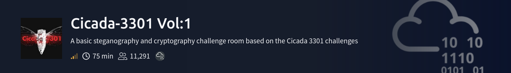

## Room Info

| Field | Value |
|---|---|
| **Room** | Cicada-3301 Vol:1 |
| **Platform** | TryHackMe |
| **Difficulty** | Medium |
| **Category** | Steganography / Cryptography (puzzle chain, no target IP) |
| **Tools Used** | Sonic Visualiser, a QR reader, CyberChef, dCode (Vigenère), `steghide`, `outguess`, a SHA512 identifier + reverse-hash lookup tool |
| **Skills Tested** | Audio steganography (spectrogram images), Base64 decoding, Vigenère cipher cryptanalysis, image steganography with two different tools (`steghide` and `outguess`), PGP-signed message reading, hash identification, reverse hash lookup, book ciphers, OSINT-style link-chasing |

**Premise:** this room is a recreation of the real **Cicada 3301** puzzles — a series of famously elaborate, real-world internet puzzle hunts that ran from 2012 onward, allegedly used as a recruitment filter for a mysterious organization. There's no machine to hack here — the entire room is a **layered puzzle chain**: each solved step doesn't give you a flag, it gives you the *next* clue, often on an entirely different website or platform. That structure is the whole point of the room, and it's reflected in how this writeup is organized — one section per task, each one only solvable because of what came before it.

---

## Concept Glossary

Read this first — every technique used below is explained here before it appears in the walkthrough.

**Audio steganography via spectrogram** — Sound can hide images. A spectrogram is a visual representation of a sound's frequency content over time — normally used to *analyze* audio (spotting pitches, noise, etc.), but it can also be *authored backwards*: someone can synthesize an audio file whose frequency content, when plotted as a spectrogram, forms a picture instead of random noise. This is exactly how the real Cicada 3301 puzzles hid their first clues, and it's why "Web Browsers are useless here" is the room's own hint for this task — you need a spectrogram tool, not a media player.

**QR codes** — A 2D barcode format that encodes text (usually a URL) as a black-and-white pixel grid with built-in error correction. Once you can see the QR pattern (even hidden inside a spectrogram), any QR reader can decode it back into the original text/URL.

**Base64 encoding** — A way of representing binary or text data using only 64 printable ASCII characters (A–Z, a–z, 0–9, `+`, `/`). It's not encryption — it has no key and provides zero confidentiality — it's just an *encoding*, meant to make data safely transportable through text-only channels. Puzzle designers use it as an "obfuscation" layer specifically because it looks intimidating to beginners but is trivially reversible with any Base64 decoder. Sometimes data is Base64-encoded **more than once** — you have to decode repeatedly until the output actually looks like readable text instead of more Base64.

**The Vigenère cipher** — A classical polyalphabetic substitution cipher from 16th-century France (hence the room's "French Diplomat" hint pointing at Blaise de Vigenère). Unlike a simple Caesar cipher (one fixed shift for the whole message), Vigenère repeats a **keyword** across the message and shifts each letter by a different amount depending on the corresponding keyword letter — so the same plaintext letter can encrypt to different ciphertext letters depending on position. This is exactly why it resisted cracking for centuries ("le chiffre indéchiffrable"): frequency analysis (which breaks simple substitution ciphers) doesn't work cleanly against it. It requires the **key** to decrypt directly — which is precisely why this puzzle handed over the encrypted passphrase and the key as two *separate* Base64-encoded values that had to be decoded independently first.

**`steghide`** — A steganography tool that embeds (and extracts) hidden data inside image or audio files, optionally protected with a passphrase. It works by making tiny, visually-imperceptible modifications to the file's data at the bit level. Without the correct passphrase, `steghide extract` will simply fail — which is why the entire earlier puzzle chain (spectrogram → QR → Base64 → Vigenère) existed solely to *produce* that passphrase.

**`outguess`** — A different steganography tool from `steghide`, targeting JPEG images specifically, and using a different embedding technique (manipulating DCT coefficients used in JPEG compression, rather than raw pixel/bit modification). This matters practically: **`steghide` and `outguess` are not interchangeable** — a file hidden with one usually can't be extracted with the other. Recognizing "this didn't look like a `steghide` job" and switching tools is a real, transferable stego-analysis skill, not just following room instructions blindly.

**PGP-signed messages** — A `-----BEGIN PGP SIGNED MESSAGE-----` block means the message content is cryptographically signed (proving who wrote it and that it hasn't been altered), but critically, **the message body itself is still in plaintext** underneath the signature wrapper — signing isn't the same as encrypting. That's why the actual instructions (the book code) were immediately readable inside the block without needing any private key.

**Book ciphers** — A cipher where the "key" is an entire external text (a specific book/document), and the ciphertext is a list of **coordinates** pointing into that text (e.g., "line 1, character 6") rather than substituted letters. It's unbreakable *unless you know exactly which book/edition* is being referenced — which is why this puzzle first made you go find the correct book (via the hash → reverse lookup → pastebin chain) before the coordinate list in `I:line:char` format meant anything at all.

**Hash identification vs. hash cracking** — Not all "crack the hash" puzzles mean brute-forcing a password. A hash can also be used as a **content fingerprint** — the SHA512 hash of an entire document, used here essentially as an addressing/verification mechanism ("find the exact text whose hash matches this value") rather than something meant to be brute-forced letter by letter. Identifying the hash *type* (SHA512, based on its 128-character hex length) was the necessary first step before knowing which reverse-lookup service or method would even apply.

**Reverse hash lookup** — Some online services maintain huge precomputed databases mapping common hash outputs back to their original inputs (rainbow-table-style lookups), letting you paste in a hash and instantly get back the original text/URL **if** that exact value has been indexed before — no actual cracking computation happens client-side.

**Following short links (`bit.ly`) safely** — Shortened URLs hide their real destination until visited, which is normally a legitimate OSINT/security caution (checking a preview before clicking blind). Bitly specifically shows a **preview page** before redirecting, which is exactly what let the destination (a SoundCloud track) be confirmed before actually navigating there.

---

## Task 1 — Download!

**Room text:**
> *"Hello, we are looking for highly intelligent individuals. To find them, we have devised a test. There is a message hidden in this image. Download and unzip the folder given to begin. Good Luck. -3301"*

**Question:** *Download and unzip the given folder* — No answer needed.

**Commands:**
```bash
ls
unzip Cicada_3301_1586991734089.zip
```

**Output:**
```
3301.wav  Cicada_3301_1586991734089.zip  welcome.jpg
```
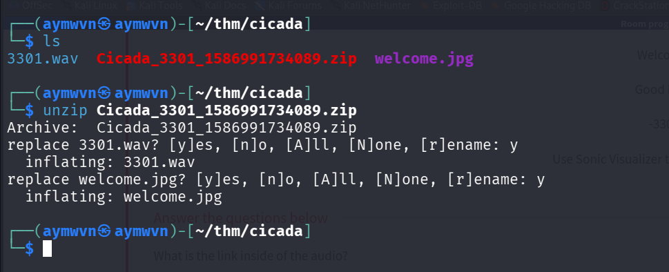

**Why this step:** Nothing to solve yet — just setting up the workspace. The unzip reveals the two files that drive the entire rest of the room: `3301.wav` (an audio file — Task 2) and `welcome.jpg` (an image — Tasks 3, 4, and 5 all eventually come back to this same file).

---

## Task 2 — Analyze the Audio

**Room text:**
> *"Web Browsers are useless here. Welcome. Good Luck. -3301. Use Sonic Visualiser to analyze the audio."*

**Question:** *What is the link inside of the audio?*
**Answer:** `https://pastebin.com/wphPq0Aa`

**Step 1 — Add a spectrogram layer in Sonic Visualiser:**

`Layer → Add Spectrogram`
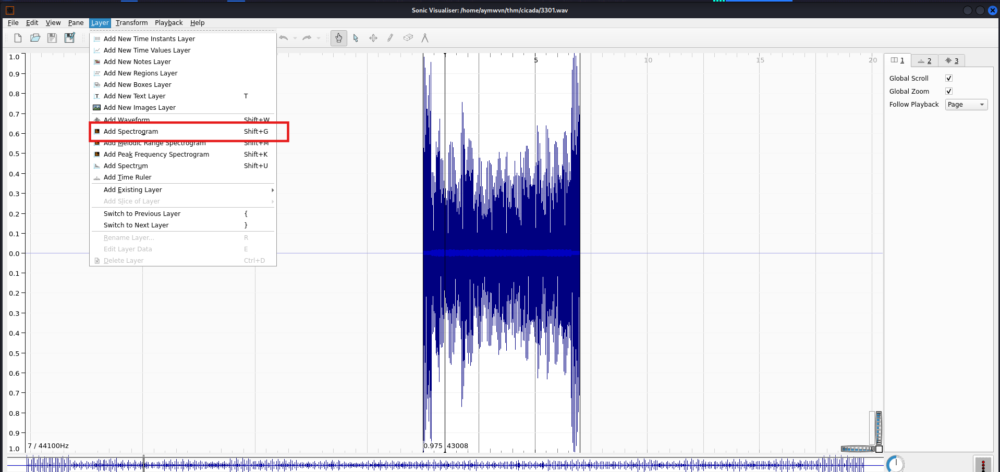

**Step 2 — The spectrogram reveals a QR code:**

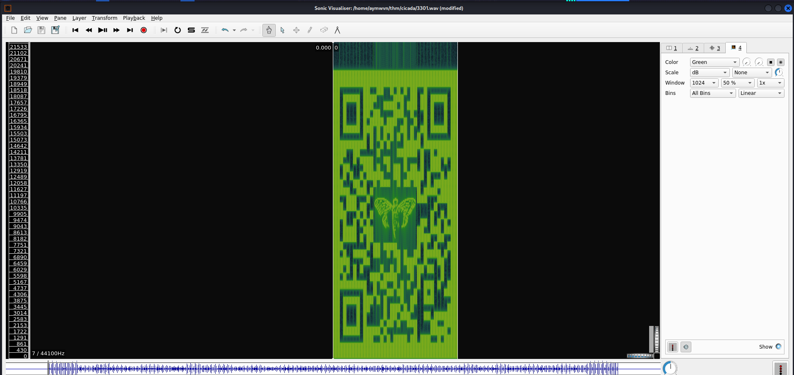

**Why this worked:** As covered in the Concept Glossary, this audio file wasn't meant to be *listened to* — its frequency content over time was deliberately shaped to render as an image once visualized. This is exactly why the room's own hint says browsers (i.e. just playing the audio normally) are useless here.

**Step 3 — Scanning the QR code:**

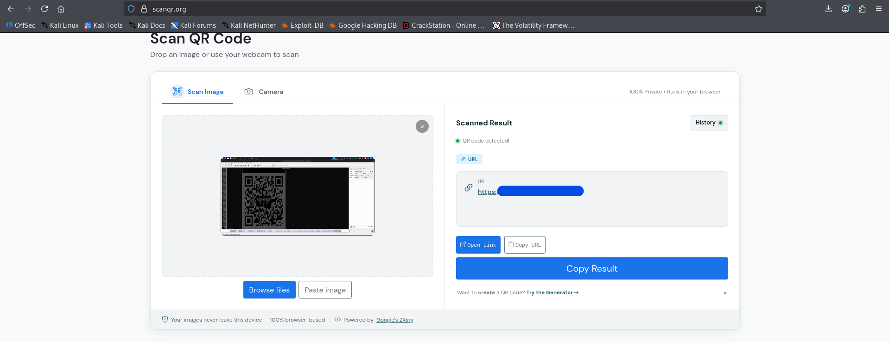

The QR code decodes to a Pastebin URL, which is the answer to this task.

---

## Task 3 — Decode the Passphrase

**Room text:**
> *"Welcome. Good Luck. -3301. Use various encryption methods and ciphers to decode the passphrase and access the metadata of Welcome.jpg."*

**Questions:**
- *Find and decrypt the passphrase and key* — No answer needed
- *What is the decrypted passphrase?* → `Hm5R_4_P455mhp453!`
- *What is the decrypted key?* → `Cicada`
- *Still looks funny? Find and use a cipher along with the key to decipher the passphrase* — No answer needed
- *What is the final passphrase?* → `Ju5T_4_P455phr453!`

**Step 1 — The Pastebin link (from Task 2) contains a Base64-encoded passphrase and key:**

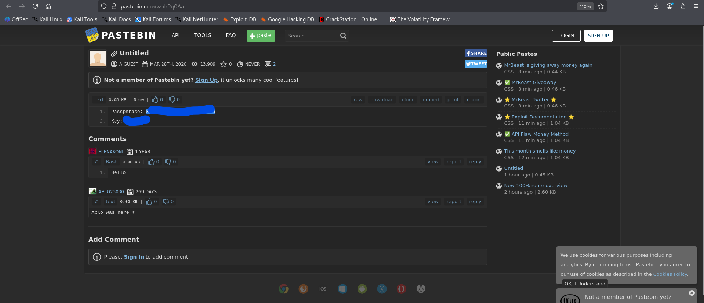

**Step 2 — Decoding the passphrase (single Base64 pass):**

Using CyberChef's `From Base64` recipe on the passphrase value directly produces `Hm5R_4_P455mhp453!`.

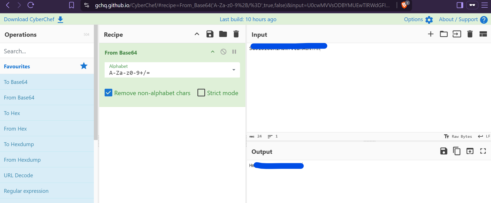

**Step 3 — Decoding the key (it needed a second Base64 pass):**

The key value didn't resolve to plain text after one decode — the first pass produced *another* Base64-looking string (`UTJsallXUmg`), which itself needed to be decoded again to finally reveal the real key: `Cicada`.

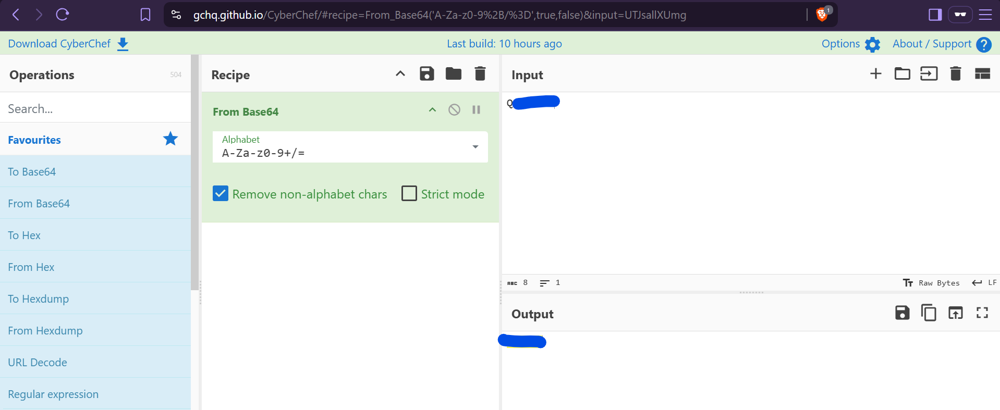

**Why this two-layer decode wasn't obvious at first:** Base64 output can itself happen to look like more Base64 (since it's just letters, numbers, `+`, `/`) — the only way to know you're actually done is that the final output reads as real, sensible text. `Cicada` reading cleanly is what confirmed the decode chain was finished for the key, whereas the passphrase's single-decode output (`Hm5R_4_P455mhp453!`) was clearly leetspeak-flavored text already — "still looks funny," per the room's own next prompt, meaning: recognizable as *text*, but not yet the final correct passphrase.

**Step 4 — Getting the hint and identifying the cipher:**

The lightbulb hint on the "still looks funny" question reveals: **French Diplomat Cipher**.

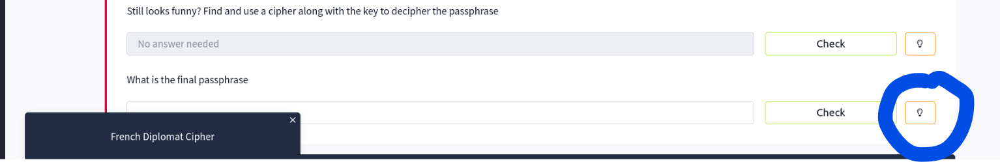

Googling that phrase directly leads to the **Vigenère cipher**, invented and popularized by the French diplomat Blaise de Vigenère.

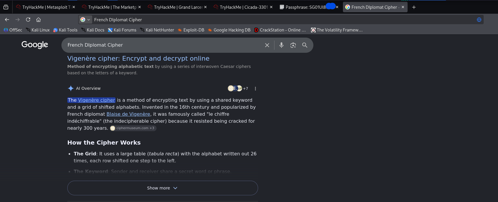

**Step 5 — Decrypting with dCode's Vigenère tool, using the recovered key (`Cicada`):**

Feeding `Hm5R_4_P455mhp453!` in as ciphertext with `Cicada` as the key produces the final passphrase: `Ju5T_4_P455phr453!` — which reads, once you squint past the leetspeak, as **"Just a Passphrase!"**

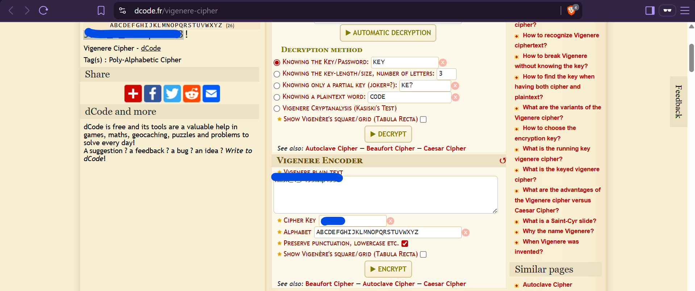

**Why the whole chain makes sense in hindsight:** the passphrase and key were deliberately split apart and separately obfuscated (one single-Base64, one double-Base64) so that recovering *both* independently was required before the Vigenère step could even be attempted — Vigenère decryption is useless without the correct key, and the "still looks funny" leetspeak output was the room's way of confirming "you're close, but this isn't the real passphrase yet."

---

## Task 4 — Gather Metadata

**Room text:**
> *"Good Luck. -3301. Use Steganography tools to gather metadata from Welcome.jpg as well as find the hidden message inside of the image file."*

**Questions:**
- *Using the found passphrase along with Stego tools, find the secret message* — No answer needed
- *What link is given?* → `https://imgur.com/a/c0ZSZga`

**Command:**
```bash
steghide extract -sf welcome.jpg
# Enter passphrase: Ju5T_4_P455phr453!
cat invitation.txt
```

**Output:**
```
Enter passphrase:
wrote extracted data to "invitation.txt".

https://imgur.com/a/c0ZSZga
```
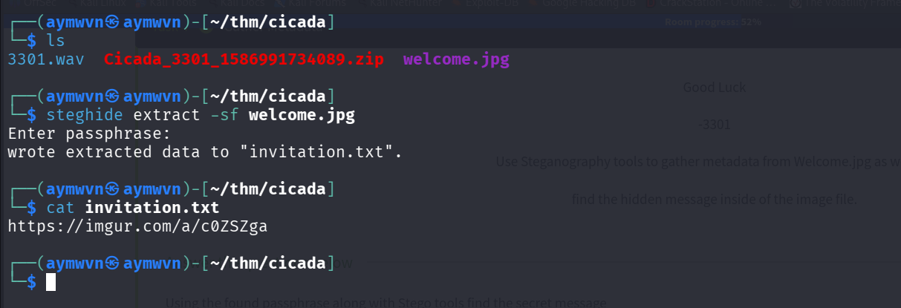

**Why this step:** This is the payoff for the entire Task 3 puzzle chain — `steghide` needed the *exact* correct passphrase to extract anything at all, and everything up to this point (spectrogram, QR, double-Base64, Vigenère) existed purely to arrive at `Ju5T_4_P455phr453!`. The extracted `invitation.txt` contains a fresh Imgur link, continuing the chain onto a new image.

---

## Task 5 — Find Hidden Files

**Room text:**
> *"I am surprised you have made it this far... I doubt you will make it any further. -3301. Use Stego tools to find the hidden files inside of the image."*

**Questions:**
- *Using stego tools, find the hidden file inside of the image* — No answer needed
- *What tool did you use to find the hidden file?* → `outguess`

**Hint provided by the room:**
> *"Use the same tool used to extract data in the original Cicada challenges"*

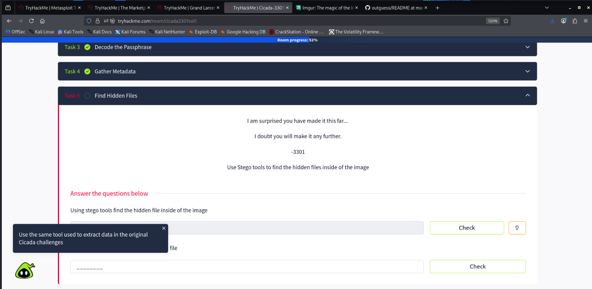

**Command:**
```bash
./outguess -r /root/Desktop/cicada/writeup/8S80aQw.jpg /root/Desktop/cicada/writeup/output.txt
```
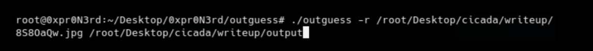

**Why `outguess` and not `steghide` again:** After grabbing the new image linked from Task 4's Imgur post, a `steghide extract` attempt on it doesn't work — as covered in the Concept Glossary, `steghide` and `outguess` use fundamentally different embedding techniques and aren't cross-compatible. The room's own hint (and the real-world history of the actual Cicada 3301 puzzles, which famously used `outguess` on their hidden JPEGs) points toward switching tools rather than assuming the passphrase was wrong.

---

## Task 6 — Book Cipher

**Room text:**
> *"We have one last challenge to find our individuals. Find the last clue, crack the hash, decipher the message. Good Luck. -3301. Use Hash cracking tools to reveal the text to the text. Use methods like Cicada to decipher the message."*

**Questions:**
- *Crack the Hash* — No answer needed
- *What is the Hash type?* → `SHA512`
- *What is the Link from the hash?* → `https://pastebin.com/6FNiVLh5`
- *Decipher the message* — No answer needed
- *What is the link?* → `https://bit.ly/39pw2NH`

### 6.1 Reading the extracted PGP-signed message

**Command:**
```bash
cat output.txt
```

**Output:**
```
-----BEGIN PGP SIGNED MESSAGE-----
Hash: SHA1

Welcome again.

Here is a book code.  To find the book, break this hash:

b6a233fb9b2d8772b636ab581169b58c98bd4b8df25e4529...82d5b6002a16bc20c1560828348

Use positive integers to go forward in the text use negative integers to go backwards in the text.

I:1:6
I:2:15
I:3:26
I:5:4
I:6:15
I:10:26
/
/
I:13:5
I:13:1
I:14:7
I:3:29
I:19:8
I:22:25
/
I:23:-1
I:19:-1
I:2:21
I:5:9
I:24:-2
I:22:1
I:38:1

Good luck.

3301

-----BEGIN PGP SIGNATURE-----
```
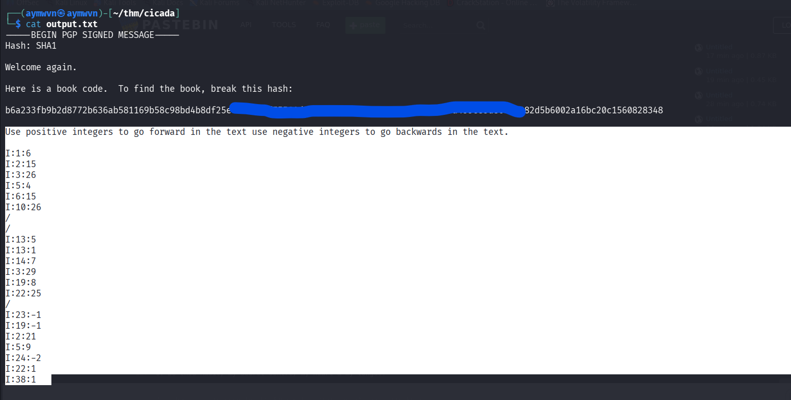

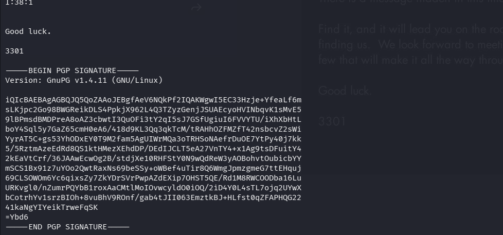

**Why this matters (tying back to the Concept Glossary):** the PGP wrapper is a **signature**, not encryption — the instructions were readable immediately. The actual puzzle here is two-fold: (1) figure out *which document* this hash refers to, and (2) once found, apply the `I:line:char` coordinate list against it.

### 6.2 Identifying and reverse-looking-up the hash

**Step 1 — Identifying the hash type:**

At 128 hex characters, the hash is identified as **SHA512**.

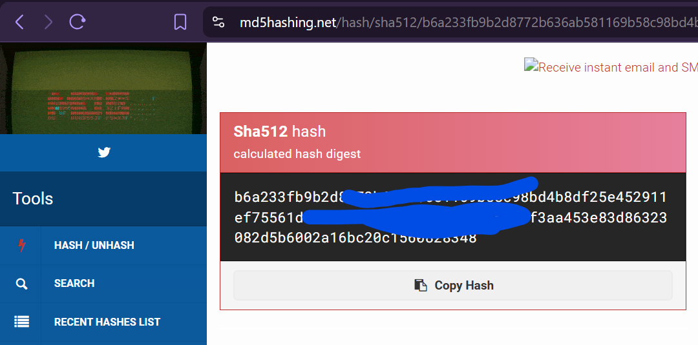

**Step 2 — Reverse hash lookup:**

Rather than trying to brute-force a 512-bit hash (computationally absurd for anything non-trivial), a reverse-hash-lookup service was used — checking whether this *exact* hash value had already been indexed somewhere. It had, and it resolved directly to a Pastebin link.

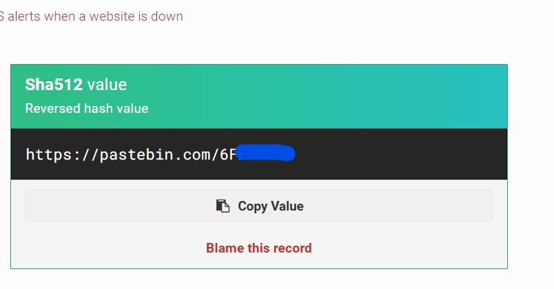

**Result:** `https://pastebin.com/6FNiVLh5` — the answer to "What is the link from the hash?"

**Step 3 — The book itself:**

That Pastebin link contains the full text of **"The Book of Law"** (Aleister Crowley's *Liber AL vel Legis*, 1904) — a real, public-domain occult text that the actual Cicada 3301 puzzles are known to have referenced historically.

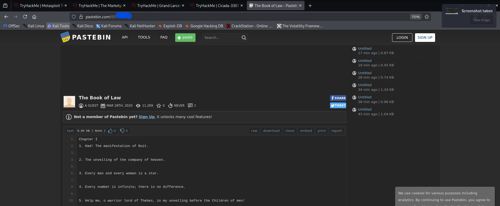

### 6.3 Applying the book cipher

**How the `I:line:char` coordinates work (worked out from the room's own instructions plus a bit of outside research into how this specific book cipher format is typically read):**

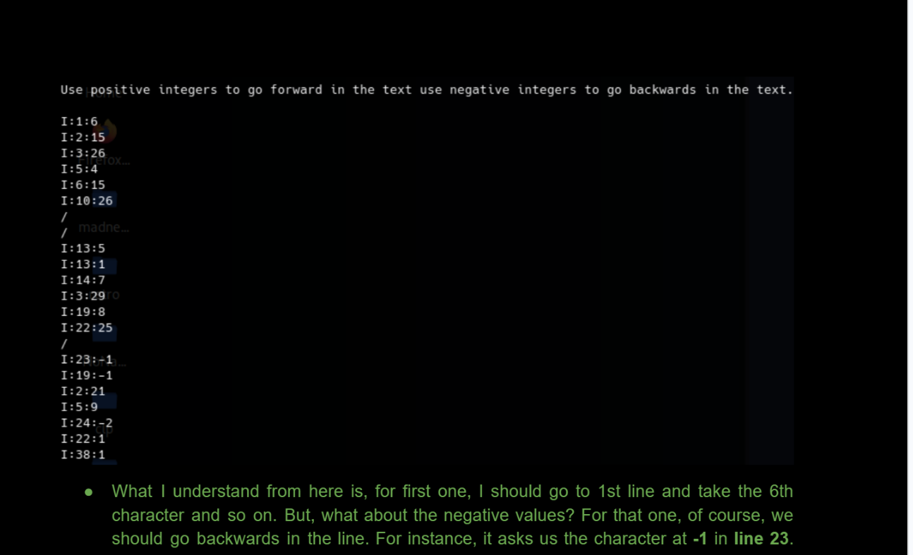

Each entry follows the pattern `I:<line>:<character position>`:
- The number after the first colon is the **line number** in the book's text.
- The number after the second colon is the **character position on that line** — a **positive** number counts forward from the start of the line, while a **negative** number counts backward from the end of the line (per the room's own instruction: *"use positive integers to go forward in the text, use negative integers to go backwards in the text"*).
- A lone `/` on its own line acts as a **separator** — likely marking word or clause boundaries in the deciphered output, similar to how the real Cicada puzzles formatted their book-cipher outputs.

Walking each coordinate against "The Book of Law" and pulling out the corresponding character at each position reconstructs a hidden short message — which, once assembled, points to the final link: **`https://bit.ly/39pw2NH`**

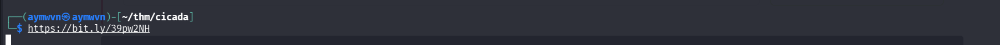

**Why book ciphers are genuinely clever, not just "annoying":** this is a real, historically significant cipher class precisely *because* it can't be brute-forced or frequency-analyzed the way substitution ciphers can — there's no pattern to exploit in the ciphertext itself, since the "key" is an entire external document that has to be correctly identified first. The hash-based book identification here is a modern (and quite elegant) way of solving the classic "how do both parties agree on the exact same book/edition" problem that book ciphers have always had.

---

## Task 7 — The Final Song

**Room text:**
> *"We have found the individuals we sought. -3301."*

**Question:** *What is the song linked?*
**Answer:** `The Instar Emergence`

**Step 1 — Checking the bit.ly preview before visiting:**

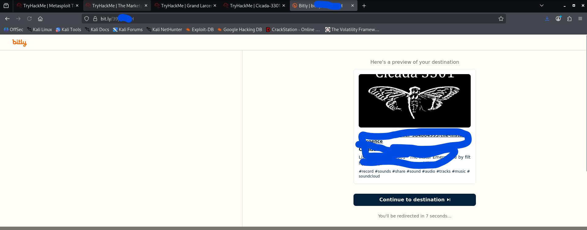

The preview confirms the destination is a SoundCloud track before actually navigating to it — good practice for any shortened link, puzzle room or not.

**Step 2 — The final destination:**

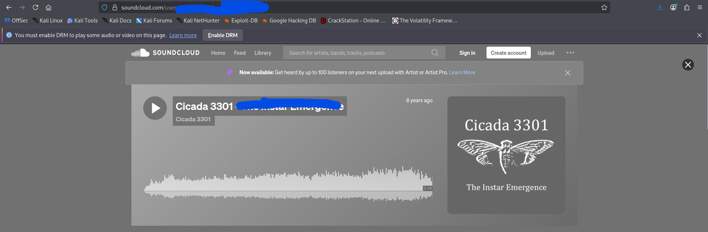

The trail ends on SoundCloud, at a track titled **"The Instar Emergence"** — closing out the puzzle chain exactly the way the real Cicada 3301 hunts are known to have ended several of their own stages: with an audio track posted publicly online, waiting for the next wave of solvers to find it.

---

## Full Lessons Learned

1. **Steganography is a toolbox problem, not a one-tool problem.** This single room required three genuinely different hiding techniques — spectrogram-encoded audio, `steghide`'s bit-level embedding, and `outguess`'s JPEG-DCT-based embedding — and none of them are interchangeable. Real stego-analysis work means being willing to try multiple tools and recognize when one *isn't* the right fit, rather than assuming a wrong passphrase when actually the tool itself is wrong.

2. **Encoding is not encryption, and recognizing the difference matters.** Base64 layers here were pure obfuscation with zero real security — reversible by anyone with any decoder, no key required. The Vigenère cipher, by contrast, genuinely required the correct key to reverse. Conflating the two (assuming everything needs "cracking") wastes time; learning to visually recognize Base64 vs. an actual cipher is a real, transferable skill.

3. **PGP signing ≠ encryption — a very common point of confusion.** The book code instructions were sitting in plaintext directly inside a "signed message" block. Verifying a signature proves *authenticity*; it says nothing about *confidentiality*. Conflating the two would have wasted real time trying to "decrypt" text that was never encrypted in the first place.

4. **Hashes aren't always meant to be cracked — sometimes they're addresses.** The SHA512 hash here wasn't protecting a password; it was functioning as a unique fingerprint pointing at one specific document, solvable via a lookup rather than brute-force computation. Recognizing "this hash is acting as an identifier, not a secret" changes the entire approach.

5. **Book ciphers are a genuinely underrated classical cipher.** Unlike most substitution ciphers, there's no statistical weakness to exploit in the ciphertext itself — the entire security rests on both parties agreeing on the exact same reference text. The puzzle's hash-based book identification is a clean, modern solution to that old coordination problem.

6. **This room is fundamentally an OSINT/lateral-thinking exercise, not a technical exploitation one.** Every "tool" used here (Sonic Visualiser, CyberChef, dCode, hash lookups) is publicly available and not hacking in the traditional sense — the actual skill being tested throughout is pattern recognition, patience, and knowing *which* tool applies to *which* kind of hidden data. That's a genuinely different — and valuable — skillset from web/network exploitation, and worth having represented in a portfolio for exactly that reason.

---

## Skills Demonstrated

`Audio Steganography (Spectrogram Analysis)` · `QR Code Decoding` · `Base64 Decoding (Multi-Layer)` · `Vigenère Cipher Cryptanalysis` · `Image Steganography (steghide)` · `Image Steganography (outguess)` · `PGP-Signed Message Analysis` · `Hash Identification` · `Reverse Hash Lookup` · `Book Cipher Decryption` · `OSINT Link-Chasing`

---

## References

- [Sonic Visualiser](https://www.sonicvisualiser.org/)
- [CyberChef](https://gchq.github.io/CyberChef/)
- [dCode — Vigenère Cipher](https://www.dcode.fr/vigenere-cipher)
- [steghide](http://steghide.sourceforge.net/)
- [outguess](https://github.com/resurrecting-open-source-projects/outguess)
- [TryHackMe — Cicada-3301 Vol:1](https://tryhackme.com/room/cicada3301vol1)
- Background on the real Cicada 3301 puzzles (for context on why these specific techniques were chosen by the room author): Wikipedia — *Cicada 3301*
