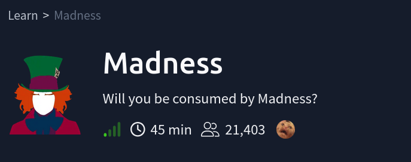
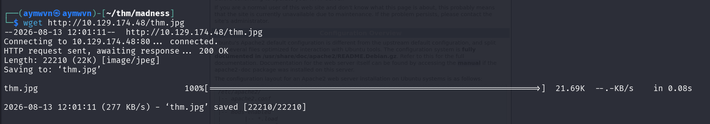
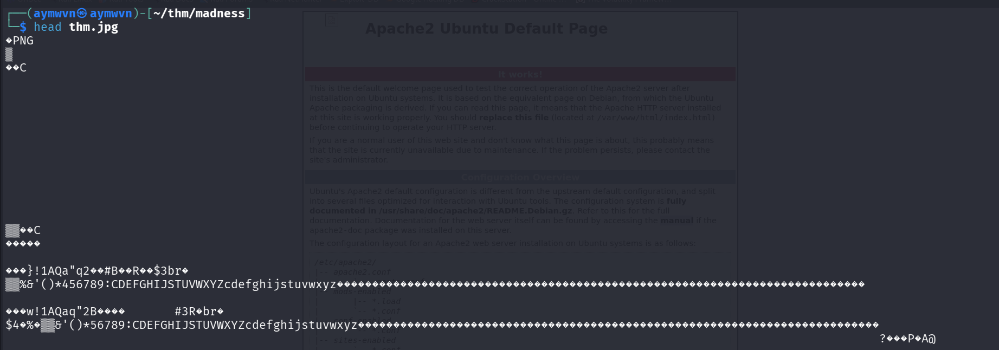
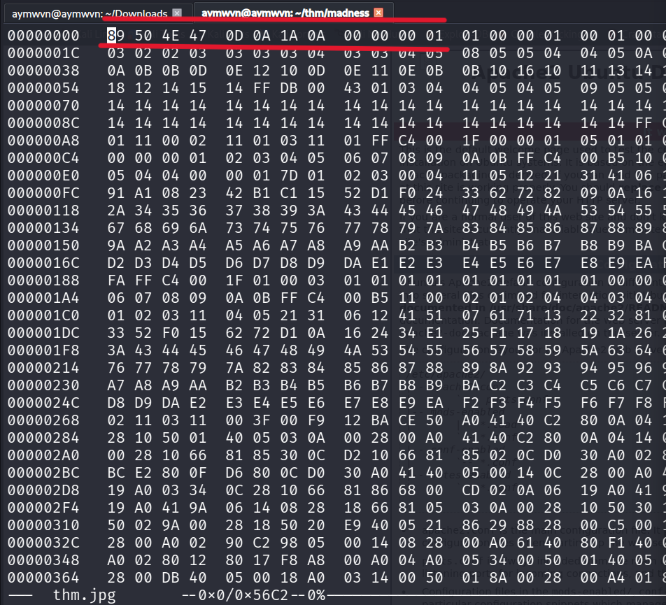
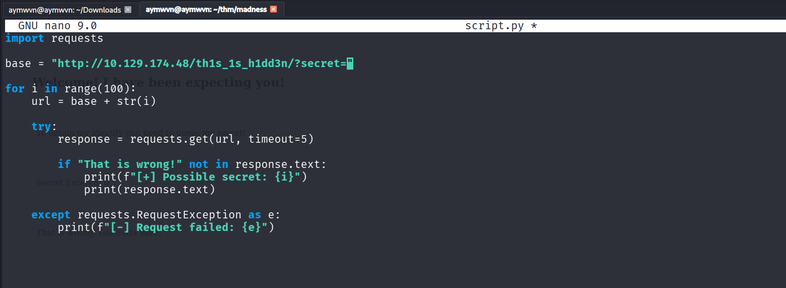
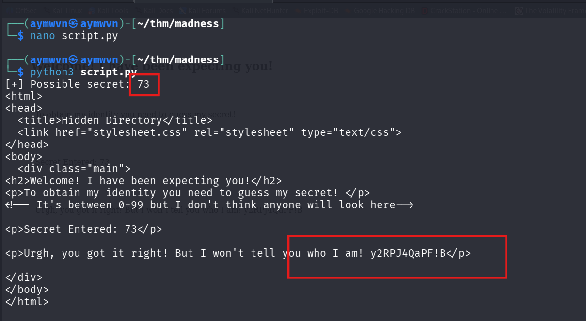
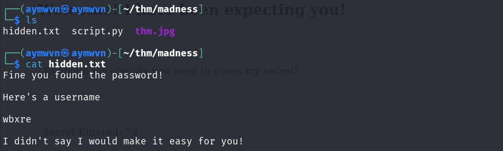
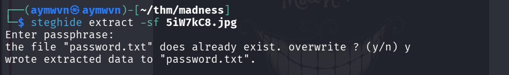
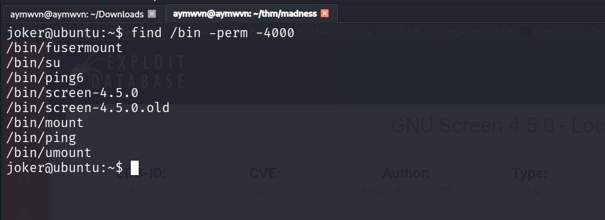
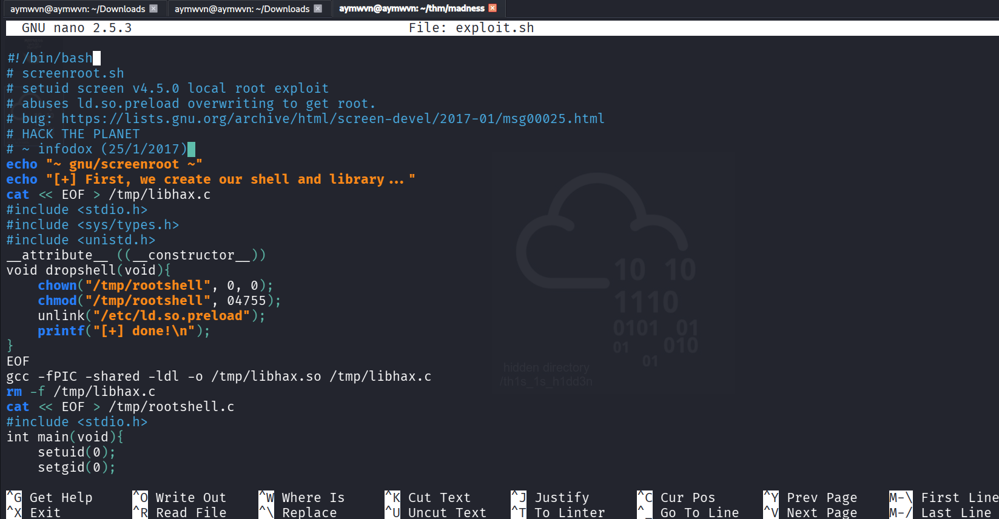

# TryHackMe — Madness


> "We're All Mad Here." A single JPG isn't what it claims to be — and neither is the second one. Chained steganography, a hidden endpoint, a brute-forced secret, and a public CVE get you from an image file to a root shell.



**Room:** [tryhackme.com/room/madness](https://tryhackme.com/room/madness)
**Format:** Unguided boot-to-root box
**Note given in-room:** *This challenge does not require brute forcing.* (There's a smarter path — see the Reflection section at the end for what that likely was, since I solved it with a script instead.)

---

## Table of Contents

- [Recon](#recon)
- [Step 1 — The file that lied about what it was](#step-1--the-file-that-lied-about-what-it-was)
- [Step 2 — Reading the hint out of the pixels](#step-2--reading-the-hint-out-of-the-pixels)
- [Step 3 — A hidden page that wants a secret](#step-3--a-hidden-page-that-wants-a-secret)
- [Step 4 — Automating the guess](#step-4--automating-the-guess)
- [Step 5 — First steghide extraction](#step-5--first-steghide-extraction)
- [Step 6 — Decoding the username](#step-6--decoding-the-username)
- [Step 7 — A second hidden image](#step-7--a-second-hidden-image)
- [Step 8 — SSH and the user flag](#step-8--ssh-and-the-user-flag)
- [Step 9 — Hunting for a privilege escalation path](#step-9--hunting-for-a-privilege-escalation-path)
- [Step 10 — GNU Screen 4.5.0 exploit → root](#step-10--gnu-screen-450-exploit--root)
- [Attack Chain Summary](#attack-chain-summary)
- [Answers](#answers)
- [Lessons Learned](#lessons-learned)
- [References](#references)

---

## Recon

Standard first move on any box: pull down the target file provided by the room, a JPG hosted on the target's web server.

```bash
wget http://10.129.174.48/thm.jpg
```



Nothing unusual about the download itself — 22KB, 200 OK. The interesting part starts the moment you actually look at what's inside it.

---

## Step 1 — The file that lied about what it was

Before throwing any steg tool at an image, it's worth checking that the file actually *is* what its extension claims. A quick way to do that without even opening a hex editor:

```bash
head thm.jpg
```



The very first bytes printed out `PNG` — not what you'd expect from a `.jpg`. Every file format starts with a fixed sequence of bytes called a **magic number**, which is how programs (and forensic tools) identify the *real* file type regardless of what extension someone slapped on it. A JPEG should start with `FF D8 FF`. This one didn't.

Confirmed properly in a hex editor:



`89 50 4E 47 0D 0A 1A 0A` at offset `0x00` is the **exact PNG magic number**. This file is a PNG that's been renamed to `.jpg`. For comparison, here's what a real JPEG's header looks like — `FF D8 FF E0` — pulled from a second image found later in the room:


**Why this matters:** most steg tools are format-specific. `steghide` only works on JPEGs. Running it against `thm.jpg` as-is would silently fail or error out, because the tool would be trying to parse JPEG structure inside a file that's actually PNG-structured underneath. Step one in any steganography challenge should always be: verify the real file type before picking your tool.

---

## Step 2 — Reading the hint out of the pixels

Since it's genuinely a PNG, opening it as one reveals the actual image content — which had been invisible/ignored while treating it as a broken JPEG:


The image itself is the clue: binary digits next to a cloud icon, with text reading **"hidden directory /th1s_1s_h1dd3n"**. No tool needed here — just actually opening the file correctly.

---

## Step 3 — A hidden page that wants a secret

Navigating to that path on the target's web server:

```
http://10.129.174.48/th1s_1s_h1dd3n/
```

Viewing the page source first, before interacting with anything:


The source revealed:
- A `<p>` tag reading *"To obtain my identity you need to guess my secret!"*
- An HTML comment left in the page (visible only in source, not the rendered page): the secret is **between 0–99**
- A results line: `Secret Entered:` — implying the page takes a `?secret=` parameter and reflects back whether the guess was right

Confirmed by requesting it directly with an arbitrary guess:


`http://10.129.174.48/th1s_1s_h1dd3n/?secret=0` → *"That is wrong! Get outta here!"* — confirming the parameter is live and validated server-side.

---

## Step 4 — Automating the guess

With a confirmed range of 0–99 and a clear success/failure string to check against, this is a perfect case for a short script instead of manually typing 100 URLs:

```python
import requests

base = "http://10.129.174.48/th1s_1s_h1dd3n/?secret="

for i in range(100):
    url = base + str(i)
    try:
        response = requests.get(url, timeout=5)
        if "That is wrong!" not in response.text:
            print(f"[+] Possible secret: {i}")
            print(response.text)
    except requests.RequestException as e:
        print(f"[-] Request failed: {e}")
```



The logic: loop through every value 0–99, request the page with that value, and only print output when the page's failure message *isn't* present — meaning something different happened.

```bash
python3 script.py
```



Result: **secret = 73**. The page responded with a different message this time — *"Urgh, you got it right! But I won't tell you who I am!"* — followed by an obfuscated string: `y2RPJ4QaPF!B`

At this stage the string looked like nonsense — worth noting for later, since it wasn't actually the piece needed next. The real next step came from combining this "identity" theme with the original image file itself.

---

## Step 5 — First steghide extraction

Circling back to `thm.jpg` (now correctly understood as an image containing hidden data, not just a mislabeled file) — the natural next tool to try is `steghide`, since the room is explicitly steganography-themed:

```bash
steghide extract -sf thm.jpg
```


Entered an empty passphrase — `steghide` accepted it and extracted a file: `hidden.txt`.

```bash
ls
cat hidden.txt
```



Contents:
```
Fine you found the password!

Here's a username

wbxre

I didn't say I would make it easy for you!
```

`wbxre` isn't a real username as-is — it's obfuscated. Given the playful "I didn't say I'd make it easy" framing, this pointed toward a simple substitution cipher rather than anything cryptographically serious.

---

## Step 6 — Decoding the username

Ran `wbxre` through CyberChef with a **ROT13** recipe (rotate every letter 13 places through the alphabet — its own inverse, so encoding and decoding use the identical operation):



`wbxre` → **`joker`**

A clean, thematically fitting username for a room called "Madness" with a Cheshire Cat/Alice in Wonderland motif running through it.

---

## Step 7 — A second hidden image

Continuing to explore the room's assets, a second image was located, referenced directly from the room page itself:

```
https://assets.tryhackme.com/additional/imgur/5iW7kC8.jpg
```


This one really was a valid JPEG (confirmed by its header in the earlier hex dump comparison). Ran the same extraction technique against it:

```bash
steghide extract -sf 5iW7kC8.jpg
```


Entered an empty passphrase again — this time `steghide` prompted about an existing `password.txt` (from a prior extraction attempt) and extracted a new file over it.

```bash
ls
cat password.txt
```


Contents:
```
I didn't think you'd find me! Congratulations!

Here take my password

*axA&GF8dP
```

A real, usable password — `*axA&GF8dP` — paired with the username already decoded from Step 6.

---

## Step 8 — SSH and the user flag

With `joker` as the username and `*axA&GF8dP` as the password, both hidden inside two separate images via two separate steganography extractions:

```bash
ssh joker@10.129.174.48
```

Login succeeded — dropped into an Ubuntu 16.04.6 LTS shell as `joker`.

```bash
ls
cat user.txt
```


**user.txt flag value:** `████████████████████████████████` *(redacted — capture your own from the room)*

---

## Step 9 — Hunting for a privilege escalation path

Standard privesc enumeration once a low-privilege shell is established — checking for SUID binaries first, since a misconfigured one is one of the most common and reliable escalation vectors on older boxes:

```bash
find /bin -perm -4000
```



Output included the usual expected entries (`su`, `mount`, `ping`, `umount`) — but also two that stood out:

```
/bin/screen-4.5.0
/bin/screen-4.5.0.old
```

**GNU Screen** with the SUID bit set, and specifically **version 4.5.0** named explicitly in the binary path — that specificity is a strong signal to go check for a known CVE against that exact version, rather than a generic misconfiguration.

---

## Step 10 — GNU Screen 4.5.0 exploit → root

A quick search confirmed a well-known, publicly documented local privilege escalation exploit for this exact version:


**EDB-ID 41154** — GNU Screen 4.5.0 Local Privilege Escalation, by Xiphos Research Ltd, published 2017-01-25.

Pulled the exploit source to understand it before running it — always worth reading a public exploit rather than blindly executing it:



**How it works, in plain terms:** the exploit abuses a bug in how GNU Screen 4.5.0 handles a system file called `/etc/ld.so.preload` — a file that tells Linux to load a specified shared library into *every* program that runs afterward, system-wide. Because Screen is SUID (runs with root's privileges regardless of who launches it) and had a flaw allowing this file to be overwritten, the exploit:

1. Compiles a small malicious shared library (`libhax.c`) whose only job is to `chown` and `chmod` a target file to be owned by root with the SUID bit set, then delete the `ld.so.preload` file so it stops affecting future programs (cleanup/stealth)
2. Compiles a minimal root shell program (`rootshell.c`) that just calls `setuid(0)` and drops into `/bin/sh`
3. Uses the SUID `screen-4.5.0` binary itself to get the malicious library loaded via `ld.so.preload`, triggering the `dropshell()` function to run as root
4. The result: a root-owned, SUID-flagged `/tmp/rootshell` binary sitting on disk, ready to execute

Ran it:

```bash
chmod +x exploit.sh
./exploit.sh
```

The script compiled both files (some harmless compiler warnings about implicit function declarations — expected on older toolchains, doesn't stop execution), triggered the preload chain, and finished with `[+] done!`.

```bash
/tmp/rootshell
whoami
```


```
# whoami
root
#
```

**Root confirmed.**

**root.txt flag value:** `████████████████████████████████` *(redacted — capture your own from the room)*

---

## Attack Chain Summary

```
1. wget thm.jpg from the web server
2. head/hex-dump reveals it's actually a PNG (magic bytes 89 50 4E 47), not a real JPG
3. Opened correctly → image itself hints at a hidden directory: /th1s_1s_h1dd3n
4. Page source at that path: needs a "secret" between 0-99, via ?secret= parameter
5. Python script brute-forces 0-99 → secret = 73
6. Page reveals an obfuscated username: wbxre
7. steghide extract on thm.jpg (empty passphrase) → hidden.txt → same username, wbxre
8. ROT13 decode: wbxre → joker
9. Second image found (5iW7kC8.jpg), genuinely a real JPEG this time
10. steghide extract on 5iW7kC8.jpg (empty passphrase) → password.txt → real SSH password
11. ssh joker@target using decoded username + extracted password → user.txt
12. find /bin -perm -4000 → screen-4.5.0 flagged as SUID
13. Exploit-DB 41154: GNU Screen 4.5.0 local privesc via /etc/ld.so.preload abuse
14. Ran exploit.sh → compiled malicious shared lib + rootshell binary → root.txt
```

---

## Answers

| Question | Answer |
|---|---|
| user.txt | `████████████████████████████████` |
| root.txt | `████████████████████████████████` |

*(Flags intentionally redacted in this public writeup — full technique and reasoning above.)*

---

## Lessons Learned

- **Never trust a file extension.** The single biggest turning point in this box was checking `thm.jpg`'s actual magic bytes instead of assuming it was a JPEG because of its name. A file extension is just a label a human (or a room author) chose — the only thing that reliably tells you what a file *is* is its header.
- **`steghide` is JPEG-specific.** It will not meaningfully work against a PNG's structure, which is exactly why identifying the real format first mattered — running it blind against the mislabeled file first would have wasted time on a tool mismatch, not a wrong password.
- **HTML comments are free reconnaissance.** The `secret` range hint (0–99) was sitting in the page source the entire time, not the rendered page. Always view-source before brute-forcing blind.
- **Small, well-scoped brute-force scripts beat manual guessing.** 100 possibilities is trivial to automate and near-instant to run — no reason to type URLs by hand once a pattern and a range are confirmed.
- **ROT13 is a common "it's not really encryption" trick.** When a string looks like readable-language gibberish (not random-looking like a hash or base64), it's often just a Caesar-style rotation. Worth trying before anything heavier.
- **SUID + a named version number = go check Exploit-DB first.** `/bin/screen-4.5.0` naming its exact version was a direct invitation to look up a version-specific CVE rather than trying generic SUID abuse techniques blind.
- **Read a public exploit before running it.** Understanding *what* `exploit.sh` was actually doing (preload hijack → malicious shared library → SUID rootshell binary) turns "I ran a script I found online" into a demonstrable, explainable skill — which is the entire point of a portfolio writeup.

---

## References

- Room: [TryHackMe — Madness](https://tryhackme.com/room/madness)
- Exploit-DB 41154: [GNU Screen 4.5.0 — Local Privilege Escalation](https://www.exploit-db.com/exploits/41154)
- Original bug report: [gnu.org screen-devel mailing list, Jan 2017](https://lists.gnu.org/archive/html/screen-devel/2017-01/msg00025.html)
- `steghide` documentation: [steghide.sourceforge.net](http://steghide.sourceforge.net/)
- CyberChef (used for ROT13 decoding): [gchq.github.io/CyberChef](https://gchq.github.io/CyberChef/)
